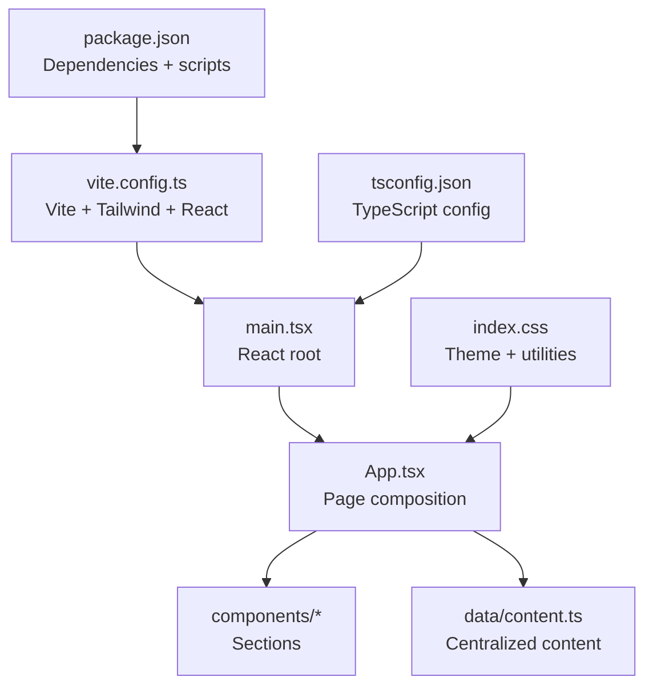
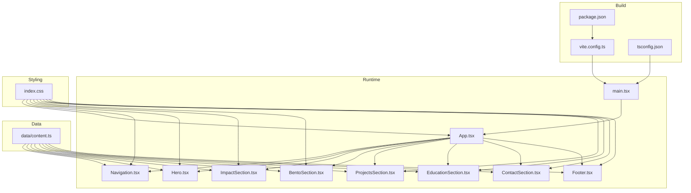
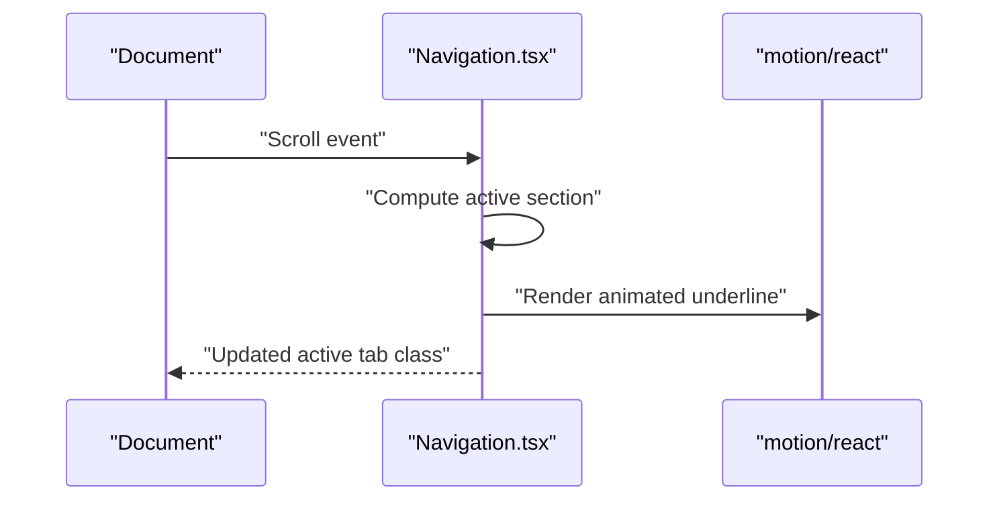
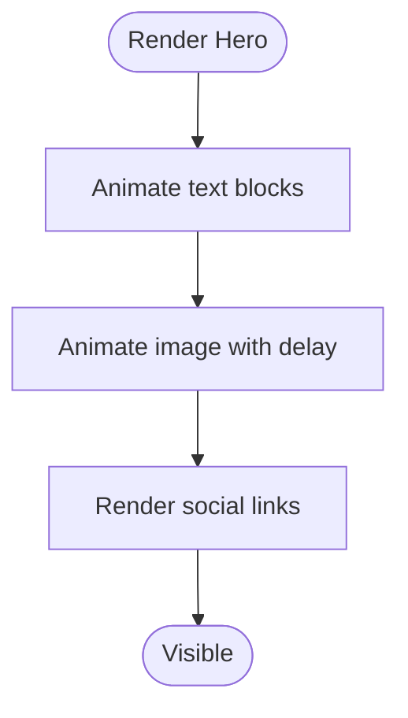
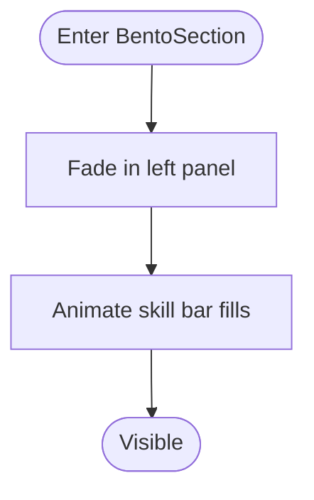
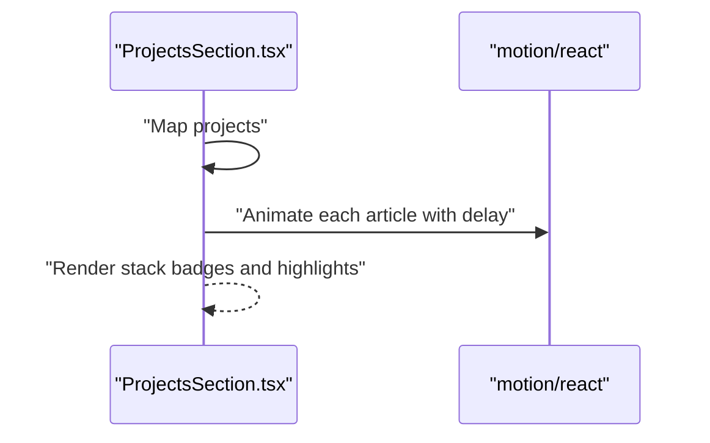
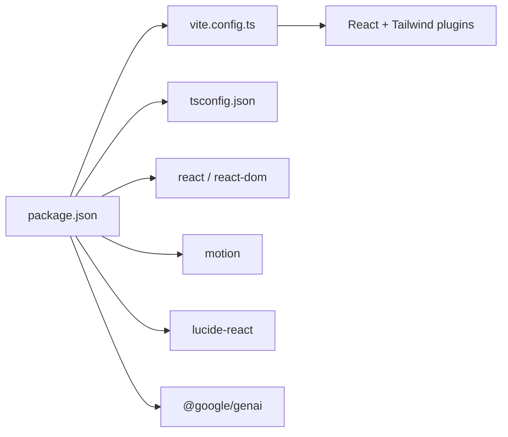

# Architecture & Design

<cite>
**Referenced Files in This Document**
- [src/App.tsx](file://src/App.tsx)
- [src/main.tsx](file://src/main.tsx)
- [src/index.css](file://src/index.css)
- [src/data/content.ts](file://src/data/content.ts)
- [src/components/Hero.tsx](file://src/components/Hero.tsx)
- [src/components/Navigation.tsx](file://src/components/Navigation.tsx)
- [src/components/BentoSection.tsx](file://src/components/BentoSection.tsx)
- [src/components/ProjectsSection.tsx](file://src/components/ProjectsSection.tsx)
- [src/components/EducationSection.tsx](file://src/components/EducationSection.tsx)
- [src/components/ImpactSection.tsx](file://src/components/ImpactSection.tsx)
- [src/components/ContactSection.tsx](file://src/components/ContactSection.tsx)
- [src/components/Footer.tsx](file://src/components/Footer.tsx)
- [package.json](file://package.json)
- [vite.config.ts](file://vite.config.ts)
- [tsconfig.json](file://tsconfig.json)
- [README.md](file://README.md)
</cite>

## Table of Contents
1. [Introduction](#introduction)
2. [Project Structure](#project-structure)
3. [Core Components](#core-components)
4. [Architecture Overview](#architecture-overview)
5. [Detailed Component Analysis](#detailed-component-analysis)
6. [Dependency Analysis](#dependency-analysis)
7. [Performance Considerations](#performance-considerations)
8. [Troubleshooting Guide](#troubleshooting-guide)
9. [Conclusion](#conclusion)
10. [Appendices](#appendices)

## Introduction
This document describes the architectural design of a component-based portfolio application built with React functional components and hooks, driven by centralized content management, and enriched with motion-based animations for an engaging user experience. The project emphasizes a clean separation between components, data, and styles, and leverages Vite with React and Tailwind CSS for a modern build pipeline and utility-first styling. Accessibility and responsiveness are integrated through semantic markup, ARIA attributes, and a mobile-first design approach.

## Project Structure
The project follows a feature-centric organization:
- src/main.tsx initializes the React root and mounts App.
- src/App.tsx composes page sections as React components.
- src/components contains reusable UI sections (Hero, Navigation, BentoSection, ProjectsSection, EducationSection, ImpactSection, ContactSection, Footer).
- src/data holds centralized content definitions (navigation links, skills, education, projects, and media URLs).
- src/index.css defines theme tokens, base styles, and utility classes for Tailwind v4.
- vite.config.ts configures Vite with React and Tailwind plugins, environment variable exposure, and path aliases.
- package.json lists dependencies and scripts for development, build, and preview.
- tsconfig.json configures TypeScript for bundler module resolution and JSX transform.

**Diagram sources**
- [src/main.tsx:1-11](file://src/main.tsx#L1-L11)
- [src/App.tsx:15-32](file://src/App.tsx#L15-L32)
- [src/index.css:1-71](file://src/index.css#L1-L71)
- [vite.config.ts:6-24](file://vite.config.ts#L6-L24)
- [package.json:6-12](file://package.json#L6-L12)
- [tsconfig.json:18-25](file://tsconfig.json#L18-L25)

**Section sources**
- [src/main.tsx:1-11](file://src/main.tsx#L1-L11)
- [src/App.tsx:15-32](file://src/App.tsx#L15-L32)
- [src/index.css:1-71](file://src/index.css#L1-L71)
- [vite.config.ts:6-24](file://vite.config.ts#L6-L24)
- [package.json:6-12](file://package.json#L6-L12)
- [tsconfig.json:18-25](file://tsconfig.json#L18-L25)

## Core Components
The application is composed of cohesive sections that render content from centralized data:
- Navigation: Tracks scroll position to highlight active sections and animates an underline indicator using layoutId transitions.
- Hero: Displays personal introduction, location, social links, and profile image with staggered entrance animations.
- ImpactSection: Renders quantifiable metrics with animated cards and SVG charts.
- BentoSection: Presents executive summary and technical toolkit with animated skill bars.
- ProjectsSection: Lists portfolio projects with animated entries and dynamic icons per technology.
- EducationSection: Shows academic history with animated cards.
- ContactSection: Provides primary CTAs against a branded background.
- Footer: Reusable footer with social links.

These components rely on:
- Centralized content from src/data/content.ts for navigation, skills, education, projects, and media URLs.
- Tailwind utility classes for responsive layouts and theme tokens.
- Motion for animations and micro-interactions.

**Section sources**
- [src/components/Navigation.tsx:10-97](file://src/components/Navigation.tsx#L10-L97)
- [src/components/Hero.tsx:11-98](file://src/components/Hero.tsx#L11-L98)
- [src/components/ImpactSection.tsx:56-104](file://src/components/ImpactSection.tsx#L56-L104)
- [src/components/BentoSection.tsx:4-86](file://src/components/BentoSection.tsx#L4-L86)
- [src/components/ProjectsSection.tsx:21-99](file://src/components/ProjectsSection.tsx#L21-L99)
- [src/components/EducationSection.tsx:4-57](file://src/components/EducationSection.tsx#L4-L57)
- [src/components/ContactSection.tsx:3-38](file://src/components/ContactSection.tsx#L3-L38)
- [src/components/Footer.tsx:3-35](file://src/components/Footer.tsx#L3-L35)
- [src/data/content.ts:10-103](file://src/data/content.ts#L10-L103)

## Architecture Overview
The system follows a unidirectional data flow:
- Content is declared in a single source of truth (content.ts).
- Components consume content and render UI.
- Motion orchestrates animations triggered by visibility and user interactions.
- Tailwind provides responsive design and theme tokens.
- Vite builds the app with React Fast Refresh and Tailwind utilities.

**Diagram sources**
- [src/main.tsx:1-11](file://src/main.tsx#L1-L11)
- [src/App.tsx:6-13](file://src/App.tsx#L6-L13)
- [src/data/content.ts:10-103](file://src/data/content.ts#L10-L103)
- [src/index.css:1-71](file://src/index.css#L1-L71)
- [vite.config.ts:6-24](file://vite.config.ts#L6-L24)
- [package.json:6-12](file://package.json#L6-L12)
- [tsconfig.json:18-25](file://tsconfig.json#L18-L25)

## Detailed Component Analysis

### Navigation Component
- Purpose: Sticky header with animated active underline and a download action.
- State management: Uses local state to track the active section based on scroll position.
- Animation: Uses layoutId to animate the underline across tabs.
- Accessibility: Includes aria-labels and keyboard-friendly anchors.

**Diagram sources**
- [src/components/Navigation.tsx:13-40](file://src/components/Navigation.tsx#L13-L40)
- [src/components/Navigation.tsx:66-80](file://src/components/Navigation.tsx#L66-L80)

**Section sources**
- [src/components/Navigation.tsx:10-97](file://src/components/Navigation.tsx#L10-L97)

### Hero Component
- Purpose: Introduces the candidate with animated text and image.
- Animation: Staggered entrance for text and image using initial/animate/transition.
- Responsiveness: Two-column layout adapts from single column on small screens to two columns on larger screens.
- Accessibility: Proper alt text for images and semantic headings.

**Diagram sources**
- [src/components/Hero.tsx:15-19](file://src/components/Hero.tsx#L15-L19)
- [src/components/Hero.tsx:71-75](file://src/components/Hero.tsx#L71-L75)

**Section sources**
- [src/components/Hero.tsx:11-98](file://src/components/Hero.tsx#L11-L98)

### BentoSection Component
- Purpose: Executive summary and technical toolkit presentation.
- Animation: Fade-in on view for content areas; animated skill bars with duration and easing.
- Data binding: Renders skills array with dynamic icons and levels.

**Diagram sources**
- [src/components/BentoSection.tsx:8-12](file://src/components/BentoSection.tsx#L8-L12)
- [src/components/BentoSection.tsx:71-78](file://src/components/BentoSection.tsx#L71-L78)

**Section sources**
- [src/components/BentoSection.tsx:4-86](file://src/components/BentoSection.tsx#L4-L86)

### ProjectsSection Component
- Purpose: Displays portfolio projects with stack badges and highlights.
- Animation: Staggered article entries on view.
- Composition: Inline StackIcon component selects appropriate icon based on stack label.

**Diagram sources**
- [src/components/ProjectsSection.tsx:46-52](file://src/components/ProjectsSection.tsx#L46-L52)
- [src/components/ProjectsSection.tsx:14-19](file://src/components/ProjectsSection.tsx#L14-L19)

**Section sources**
- [src/components/ProjectsSection.tsx:21-99](file://src/components/ProjectsSection.tsx#L21-L99)

### EducationSection Component
- Purpose: Academic timeline presentation.
- Animation: Sequential fade-in for each education item.

**Section sources**
- [src/components/EducationSection.tsx:4-57](file://src/components/EducationSection.tsx#L4-L57)

### ImpactSection Component
- Purpose: Quantified impact cards with animated SVG charts.
- Animation: Staggered card entrance with whileInView.

**Section sources**
- [src/components/ImpactSection.tsx:56-104](file://src/components/ImpactSection.tsx#L56-L104)

### ContactSection Component
- Purpose: Prominent call-to-action area with gradient overlay.
- Styling: Uses theme tokens and utility classes for contrast and spacing.

**Section sources**
- [src/components/ContactSection.tsx:3-38](file://src/components/ContactSection.tsx#L3-L38)

### Footer Component
- Purpose: Consistent footer across pages with social links.

**Section sources**
- [src/components/Footer.tsx:3-35](file://src/components/Footer.tsx#L3-L35)

## Dependency Analysis
- Build and toolchain:
  - Vite with React plugin and Tailwind CSS plugin.
  - Environment variable exposure for API keys.
  - Path alias @ resolves to project root.
- Runtime dependencies:
  - React 19 and React DOM for UI.
  - motion for animations.
  - lucide-react for icons.
  - @google/genai for AI integrations.
- Dev dependencies:
  - Tailwind 4, TypeScript, autoprefixer, and related tooling.

**Diagram sources**
- [package.json:13-24](file://package.json#L13-L24)
- [vite.config.ts:9-9](file://vite.config.ts#L9-L9)
- [tsconfig.json:18-22](file://tsconfig.json#L18-L22)

**Section sources**
- [package.json:6-34](file://package.json#L6-L34)
- [vite.config.ts:6-24](file://vite.config.ts#L6-L24)
- [tsconfig.json:18-25](file://tsconfig.json#L18-L25)

## Performance Considerations
- Lazy loading and code splitting:
  - Use React.lazy and Suspense for optional sections or heavy assets if added later.
  - Split large components into smaller chunks to defer rendering until in-view.
- Bundle size management:
  - Keep icons scoped; avoid importing entire icon libraries.
  - Prefer SVGs inline where small and reused (as seen in ImpactSection).
  - Minimize third-party dependencies; consolidate where feasible.
- Rendering optimizations:
  - Use memoization for expensive computations derived from content.ts.
  - Avoid unnecessary re-renders by passing only required props.
- Animations:
  - Prefer transform and opacity for GPU-accelerated animations.
  - Limit animation duration and easing complexity for lower-end devices.
- Images:
  - Use modern formats and lazy loading; ensure aspect ratios are set for CLS reduction.
- Build-time:
  - Enable tree-shaking via bundler module resolution (configured).
  - Use production builds for previews and audits.

[No sources needed since this section provides general guidance]

## Troubleshooting Guide
- Scroll highlighting not updating:
  - Verify section IDs match anchor hrefs and that offsets align with fixed header height.
  - Ensure scroll listeners are attached and cleaned up on unmount.
- Motion animations not firing:
  - Confirm viewport options and once flag are configured for in-view triggers.
  - Check that motion components are within visible viewport or adjust thresholds.
- Tailwind utilities not applied:
  - Ensure theme tokens and layer directives are present in index.css.
  - Verify Tailwind plugin is enabled in Vite config.
- Links opening in new tabs:
  - External links should include target and rel attributes; internal anchors should not.
- Accessibility:
  - Provide aria-labels for decorative icons and CTAs.
  - Ensure sufficient color contrast and readable font sizes across breakpoints.

**Section sources**
- [src/components/Navigation.tsx:13-40](file://src/components/Navigation.tsx#L13-L40)
- [src/components/ImpactSection.tsx:71-77](file://src/components/ImpactSection.tsx#L71-L77)
- [src/index.css:42-71](file://src/index.css#L42-L71)
- [src/components/Hero.tsx:44-68](file://src/components/Hero.tsx#L44-L68)

## Conclusion
This portfolio architecture demonstrates a clean separation of concerns with centralized content, composable React components, and motion-enhanced interactions. The Vite + Tailwind setup enables rapid iteration and consistent styling, while the mobile-first approach ensures broad accessibility. By adhering to the patterns outlined here—data-driven rendering, minimal prop drilling, and thoughtful animations—the application remains maintainable, performant, and scalable.

[No sources needed since this section summarizes without analyzing specific files]

## Appendices

### Responsive Design System and Accessibility
- Breakpoints and grids are applied via Tailwind utilities on component containers.
- Mobile-first classes ensure legible typography and touch-friendly spacing.
- Semantic headings and landmarks improve screen reader navigation.
- ARIA attributes and roles are used where interactive elements require explicit labeling.

[No sources needed since this section provides general guidance]

### Build Process and Global Styling
- Vite compiles TypeScript/JSX with React Fast Refresh and serves assets.
- Tailwind generates utilities from index.css theme tokens and layer directives.
- Environment variables are exposed to client code via Vite define configuration.
- Path aliases simplify imports across the project.

**Section sources**
- [vite.config.ts:6-24](file://vite.config.ts#L6-L24)
- [src/index.css:3-40](file://src/index.css#L3-L40)
- [package.json:6-12](file://package.json#L6-L12)
- [tsconfig.json:18-22](file://tsconfig.json#L18-L22)