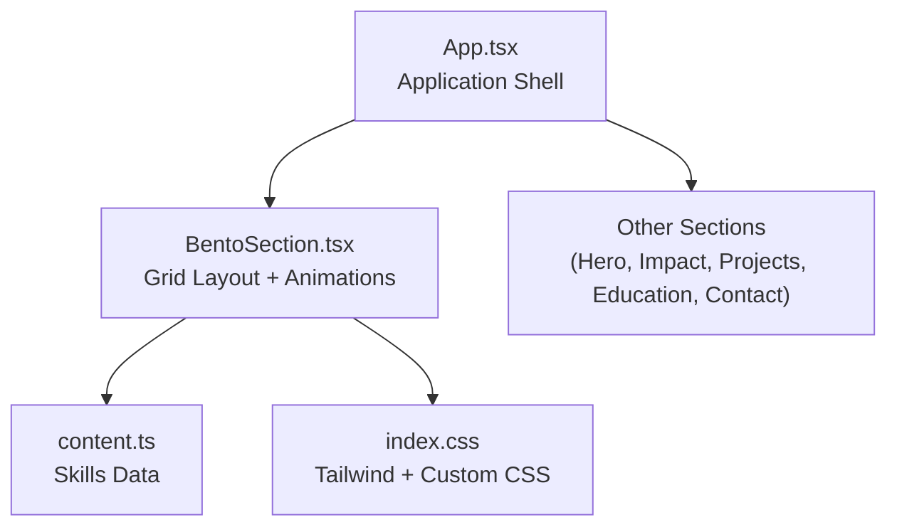
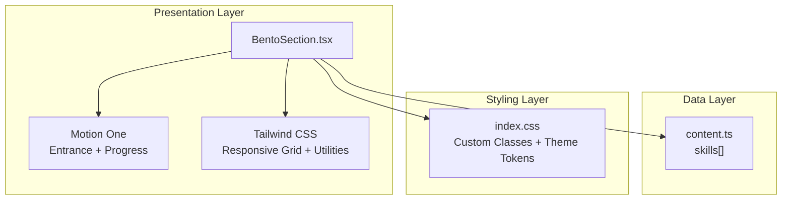
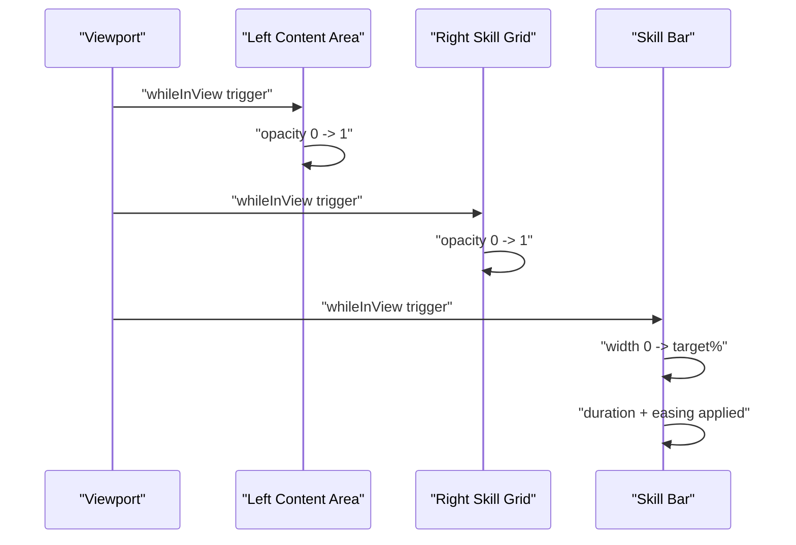
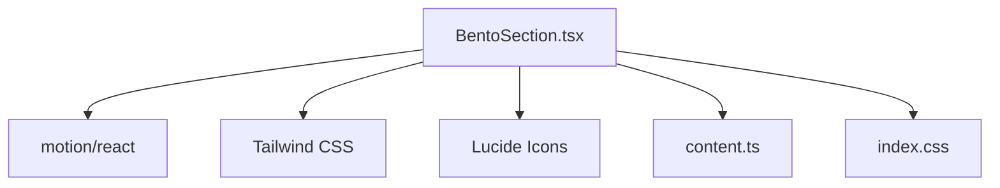

# BentoSection Component

<cite>
**Referenced Files in This Document**
- [BentoSection.tsx](file://src/components/BentoSection.tsx)
- [content.ts](file://src/data/content.ts)
- [index.css](file://src/index.css)
- [App.tsx](file://src/App.tsx)
- [package.json](file://package.json)
</cite>

## Table of Contents
1. [Introduction](#introduction)
2. [Project Structure](#project-structure)
3. [Core Components](#core-components)
4. [Architecture Overview](#architecture-overview)
5. [Detailed Component Analysis](#detailed-component-analysis)
6. [Dependency Analysis](#dependency-analysis)
7. [Performance Considerations](#performance-considerations)
8. [Troubleshooting Guide](#troubleshooting-guide)
9. [Conclusion](#conclusion)
10. [Appendices](#appendices)

## Introduction
The BentoSection component presents a grid-based, content-rich layout that combines textual executive summary content with a technical toolkit grid of skill cards. It leverages responsive Tailwind CSS grid classes for adaptive column layouts and Motion One animations for entrance and progress indicators. The component demonstrates a clean separation of concerns: the layout and animation logic live in the component, while content is managed in a dedicated data module. This document explains the grid system, card layout algorithms, responsive behavior, animation patterns, content structure requirements, customization approaches, and performance considerations.

## Project Structure
The BentoSection component resides under the components directory and is integrated into the main application shell. Content for the skills grid is centralized in the data module, enabling easy maintenance and extension.

**Diagram sources**
- [App.tsx:15-32](file://src/App.tsx#L15-L32)
- [BentoSection.tsx:1-87](file://src/components/BentoSection.tsx#L1-L87)
- [content.ts:20-36](file://src/data/content.ts#L20-L36)
- [index.css:1-71](file://src/index.css#L1-L71)

**Section sources**
- [App.tsx:15-32](file://src/App.tsx#L15-L32)
- [BentoSection.tsx:1-87](file://src/components/BentoSection.tsx#L1-L87)
- [content.ts:20-36](file://src/data/content.ts#L20-L36)
- [index.css:1-71](file://src/index.css#L1-L71)

## Core Components
- BentoSection: Renders a two-column grid on large screens and stacked columns on smaller screens. The left column displays an executive summary with branding accents; the right column renders a responsive skill grid with animated progress bars.
- Skills data: Centralized array of skill entries with metadata for name, icon, proficiency level, and optional full-width behavior.

Key responsibilities:
- Grid layout: Uses Tailwind’s responsive grid classes to adapt from single column on small screens to a 12-column layout on large screens.
- Animation orchestration: Uses Motion One to animate entrance and progress indicators.
- Content composition: Pulls content from the data module and composes it into structured cards.

**Section sources**
- [BentoSection.tsx:4-86](file://src/components/BentoSection.tsx#L4-L86)
- [content.ts:20-36](file://src/data/content.ts#L20-L36)

## Architecture Overview
The BentoSection component follows a declarative React architecture with Motion One for animations and Tailwind CSS for responsive styling. The data-driven approach keeps content separate from presentation logic.

**Diagram sources**
- [BentoSection.tsx:1-87](file://src/components/BentoSection.tsx#L1-L87)
- [content.ts:20-36](file://src/data/content.ts#L20-L36)
- [index.css:1-71](file://src/index.css#L1-L71)

## Detailed Component Analysis

### Grid-Based Content Presentation System
The component uses a responsive grid system:
- Outer container: Centered max-width container with horizontal padding that adapts across breakpoints.
- Inner grid: Single column on small screens; switches to a 12-column grid on large screens.
- Column spans: Left column occupies 7 of 12 columns; right column occupies 5 of 12 columns on large screens.
- Spacing: Consistent gap between grid items ensures visual rhythm.

Responsive behavior:
- Small screens: Columns stack vertically; content remains readable and accessible.
- Large screens: Two-column layout optimizes space for dense content and skill grid.

**Section sources**
- [BentoSection.tsx:6-7](file://src/components/BentoSection.tsx#L6-L7)

### Card Layout Algorithms
The right-hand skill grid employs a simple algorithm:
- Fixed two-column layout on the skill grid.
- Each skill card is rendered as a row in the grid.
- Full-width cards: When a skill entry specifies a full-width flag, the card spans both columns in the grid.
- Dynamic column span: Cards without the full-width flag remain single-column.

Implementation pattern:
- Map over the skills array and render a card per entry.
- Apply conditional column span class based on the full-width property.
- Each card contains an icon, label, and a progress bar container.

**Section sources**
- [BentoSection.tsx:58-81](file://src/components/BentoSection.tsx#L58-L81)
- [content.ts:20-36](file://src/data/content.ts#L20-L36)

### Responsive Grid Behavior
Breakpoint-driven behavior:
- Small screens: 1-column grid for the skill area; outer grid stacks columns.
- Medium and larger screens: 2-column grid for the skill area; outer grid becomes 12-column with left/right spans.

Consistency:
- Horizontal padding increases at larger breakpoints to maintain comfortable margins.
- Max-width constraint ensures content does not stretch excessively on wide screens.

**Section sources**
- [BentoSection.tsx:6-7](file://src/components/BentoSection.tsx#L6-L7)
- [BentoSection.tsx:58](file://src/components/BentoSection.tsx#L58)

### Animation Patterns for Card Interactions and Hover Effects
Entrance animations:
- Both main content areas animate in when scrolled into view.
- Entrance uses opacity transitions with viewport-based triggers to avoid repeated animations.

Progress animations:
- Skill bars animate to their target widths when scrolled into view.
- Transition timing and easing are configured for smooth, natural-feeling progress.

Hover effects:
- While the BentoSection itself does not define hover styles, the global stylesheet includes hover effects for cards elsewhere in the app. These demonstrate a consistent pattern of subtle elevation and translation on hover.

**Diagram sources**
- [BentoSection.tsx:8-12](file://src/components/BentoSection.tsx#L8-L12)
- [BentoSection.tsx:44-48](file://src/components/BentoSection.tsx#L44-L48)
- [BentoSection.tsx:70-78](file://src/components/BentoSection.tsx#L70-L78)

**Section sources**
- [BentoSection.tsx:8-12](file://src/components/BentoSection.tsx#L8-L12)
- [BentoSection.tsx:44-48](file://src/components/BentoSection.tsx#L44-L48)
- [BentoSection.tsx:70-78](file://src/components/BentoSection.tsx#L70-L78)
- [index.css:64-70](file://src/index.css#L64-L70)

### Content Structure Requirements
To add or modify skills:
- Add or update entries in the skills array with the following fields:
  - name: Display label for the skill.
  - icon: Lucide icon component to render alongside the label.
  - level: Numeric proficiency percentage for the progress bar.
  - fullWidth: Optional boolean to make the card span both columns.

Data source:
- The skills array is imported into the component and mapped to cards.

**Section sources**
- [content.ts:20-36](file://src/data/content.ts#L20-L36)
- [BentoSection.tsx:59-62](file://src/components/BentoSection.tsx#L59-L62)

### Adding New Bento Cards
To introduce additional cards in the skill grid:
- Extend the skills array with a new entry containing name, icon, level, and optional fullWidth flag.
- Optionally set fullWidth to true to create a full-width card spanning both columns.
- The grid algorithm will automatically handle column spans based on the presence of the flag.

Best practices:
- Keep icon sizes consistent for visual balance.
- Ensure level percentages are valid and meaningful.
- Use fullWidth judiciously to highlight key skills.

**Section sources**
- [content.ts:20-36](file://src/data/content.ts#L20-L36)
- [BentoSection.tsx:58-81](file://src/components/BentoSection.tsx#L58-L81)

### Customizing Card Designs
While the BentoSection focuses on a compact skill card layout, customization can be achieved through:
- Styling: Adjust background colors, typography, and spacing via Tailwind utilities applied to individual cards.
- Icons: Replace or augment icons by updating the skills array entries.
- Animations: Modify animation durations and easing for entrance and progress bars to match brand tone.

Global hover behavior:
- The project includes a reusable hover effect pattern for cards elsewhere in the app, demonstrating consistent elevation and translation on hover.

**Section sources**
- [BentoSection.tsx:58-81](file://src/components/BentoSection.tsx#L58-L81)
- [index.css:60-62](file://src/index.css#L60-L62)

### Implementing Different Content Types
The component’s structure can accommodate different content types by:
- Extending the skills array to include richer metadata (e.g., descriptions, links).
- Rendering additional elements within each card (e.g., badges, tags).
- Adapting the grid to support mixed-width cards by adjusting the fullWidth flag and column spans.

**Section sources**
- [content.ts:20-36](file://src/data/content.ts#L20-L36)
- [BentoSection.tsx:58-81](file://src/components/BentoSection.tsx#L58-L81)

### Optimizing Grid Layouts for Various Screen Sizes
Optimization strategies:
- Prefer fixed column counts for predictable layouts on larger screens.
- Use responsive padding and max-width constraints to prevent content from becoming unwieldy.
- Minimize heavy DOM nodes inside animated regions to reduce layout thrashing during scroll-triggered animations.

**Section sources**
- [BentoSection.tsx:6-7](file://src/components/BentoSection.tsx#L6-L7)

## Dependency Analysis
External libraries and their roles:
- Motion One: Provides scroll-triggered animations for entrance and progress indicators.
- Tailwind CSS: Supplies responsive grid utilities and design tokens.
- Lucide React: Provides vector icons used in skill cards.

**Diagram sources**
- [BentoSection.tsx:1-2](file://src/components/BentoSection.tsx#L1-L2)
- [package.json:13-24](file://package.json#L13-L24)

**Section sources**
- [BentoSection.tsx:1-2](file://src/components/BentoSection.tsx#L1-L2)
- [package.json:13-24](file://package.json#L13-L24)

## Performance Considerations
- Scroll-triggered animations: Using viewport-based triggers prevents unnecessary re-renders and avoids repeated animations on revisit.
- Minimal DOM in animated regions: Keep the number of animated children reasonable to minimize layout and paint costs.
- CSS transitions: Prefer hardware-accelerated properties (opacity, transform) for smoother animations.
- Icon rendering: Lucide icons are lightweight; ensure only necessary icons are rendered.
- Grid stability: Fixed column counts and consistent item heights help browsers optimize layout calculations.

[No sources needed since this section provides general guidance]

## Troubleshooting Guide
Common issues and resolutions:
- Animations not triggering: Verify viewport configuration and ensure the component is within the viewport bounds during initial load.
- Skill bars not animating: Confirm whileInView and viewport props are present and that the progress container is visible.
- Grid misalignment: Check Tailwind grid classes and ensure consistent padding and max-width constraints across breakpoints.
- Hover effects not applying: Confirm global hover styles are included and not overridden by local styles.

**Section sources**
- [BentoSection.tsx:8-12](file://src/components/BentoSection.tsx#L8-L12)
- [BentoSection.tsx:70-78](file://src/components/BentoSection.tsx#L70-L78)
- [index.css:60-62](file://src/index.css#L60-L62)

## Conclusion
The BentoSection component exemplifies a clean, responsive, and animated layout that balances textual content with a dynamic skill grid. Its modular design—separating content from presentation—enables straightforward customization and extension. By leveraging Motion One and Tailwind CSS, it achieves smooth animations and robust responsiveness across screen sizes.

[No sources needed since this section summarizes without analyzing specific files]

## Appendices

### How to Integrate BentoSection into Your Application
- Import the component into your application shell.
- Place it among other sections in the main content area.
- Ensure the data module exports the skills array used by the component.

**Section sources**
- [App.tsx:6-23](file://src/App.tsx#L6-L23)
- [BentoSection.tsx:1-87](file://src/components/BentoSection.tsx#L1-L87)
- [content.ts:20-36](file://src/data/content.ts#L20-L36)