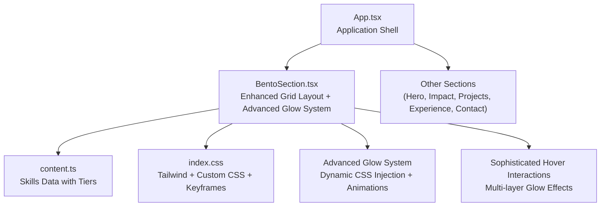
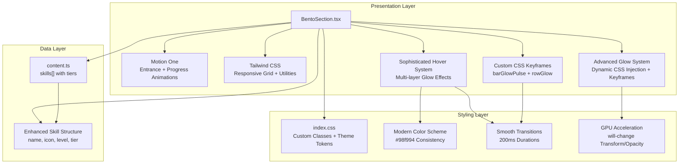
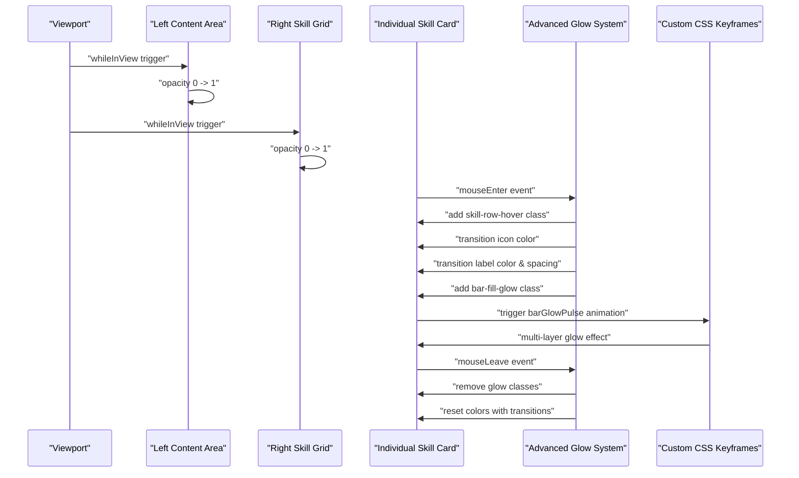
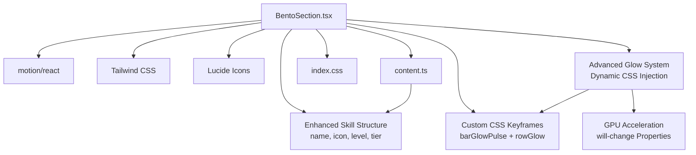

# BentoSection Component

<cite>
**Referenced Files in This Document**
- [BentoSection.tsx](file://src/components/BentoSection.tsx)
- [content.ts](file://src/data/content.ts)
- [index.css](file://src/index.css)
- [App.tsx](file://src/App.tsx)
- [package.json](file://package.json)
- [EducationSection.tsx](file://src/components/EducationSection.tsx)
</cite>

## Update Summary
**Changes Made**
- Enhanced hover effects with sophisticated glow animation system including `barGlowPulse` and `rowGlow` CSS keyframes
- Added dynamic CSS injection system for custom animations with automatic style element creation
- Implemented advanced hover interaction system with dual-layer glow effects (individual bar and row-level)
- Enhanced skill card visual feedback with smooth color transitions, letter spacing adjustments, and dynamic glow animations
- Integrated GPU-accelerated animation optimizations for smooth performance across all interactive elements
- **Updated**: Performance-oriented animation adjustments with skill bar transition timing increased from 0.2 to 1.25 seconds and border radius styling updated from 9999px to 99999px
- **Removed**: Comprehensive educational background section that previously detailed Master's degree in Business Analytics from Dublin Business School

## Table of Contents
1. [Introduction](#introduction)
2. [Project Structure](#project-structure)
3. [Core Components](#core-components)
4. [Architecture Overview](#architecture-overview)
5. [Detailed Component Analysis](#detailed-component-analysis)
6. [Dependency Analysis](#dependency-analysis)
7. [Performance Considerations](#performance-considerations)
8. [Troubleshooting Guide](#troubleshooting-guide)
9. [Conclusion](#conclusion)
10. [Appendices](#appendices)

## Introduction
The BentoSection component presents a sophisticated, content-rich layout featuring an advanced skill visualization system with dynamic glow effects and hover interactions. The component combines textual executive summary content with a technical toolkit grid that showcases skills through animated progress bars with enhanced hover effects including color transitions, multi-layer glow animations, and smooth CSS property modifications. It leverages responsive Tailwind CSS grid classes for adaptive column layouts and Motion One animations for entrance effects. This document explains the enhanced interaction system, grid-based presentation, card layout algorithms, responsive behavior, animation patterns, content structure requirements, customization approaches, and performance considerations.

## Project Structure
The BentoSection component resides under the components directory and is integrated into the main application shell. Content for the skills grid is centralized in the data module with a comprehensive skill structure, enabling easy maintenance and extension of the skill visualization system with sophisticated glow effects and hover animations.

**Diagram sources**
- [App.tsx:16-24](file://src/App.tsx#L16-L24)
- [BentoSection.tsx:11-143](file://src/components/BentoSection.tsx#L11-L143)
- [content.ts:24-41](file://src/data/content.ts#L24-L41)
- [index.css:63-70](file://src/index.css#L63-L70)

**Section sources**
- [App.tsx:16-24](file://src/App.tsx#L16-L24)
- [BentoSection.tsx:11-143](file://src/components/BentoSection.tsx#L11-L143)
- [content.ts:24-41](file://src/data/content.ts#L24-L41)
- [index.css:63-70](file://src/index.css#L63-L70)

## Core Components
- **BentoSection**: Renders a two-column grid on large screens and stacked columns on smaller screens. The left column displays an executive summary with branding accents; the right column renders a responsive skill grid with animated progress bars, sophisticated glow effects, and advanced hover interactions with multi-layer visual feedback.
- **Enhanced Skills Data**: Centralized array of skill entries with metadata for name, icon, proficiency level, and tier categorization, enabling tier-based skill organization.
- **Advanced Glow Animation System**: Implements dynamic CSS injection with custom keyframes (`barGlowPulse` and `rowGlow`) for multi-layer glow effects, combined with sophisticated hover interaction handlers for enhanced user feedback.

Key responsibilities:
- **Grid layout**: Uses Tailwind's responsive grid classes to adapt from single column on small screens to a 12-column layout on large screens.
- **Advanced visualization**: Implements sophisticated styling with modern green color scheme (#98f994) for all skill cards, progress bars, and glow effects.
- **Animation orchestration**: Uses Motion One to animate entrance with smooth transitions and custom CSS keyframes for skill bar animations.
- **Multi-layer glow interactions**: Dynamically modifies CSS properties with color transitions, dual-layer glow effects, and smooth animations on hover for comprehensive visual feedback.
- **Content composition**: Pulls skill content from the data module and composes it into structured cards with consistent styling and advanced interactive effects.

**Section sources**
- [BentoSection.tsx:5-9](file://src/components/BentoSection.tsx#L5-L9)
- [BentoSection.tsx:66-143](file://src/components/BentoSection.tsx#L66-L143)
- [content.ts:24-41](file://src/data/content.ts#L24-L41)

## Architecture Overview
The BentoSection component follows a sophisticated React architecture with Motion One for animations, Tailwind CSS for responsive styling, and an advanced glow animation system. The data-driven approach keeps content separate from presentation logic while enabling straightforward skill visualization with enhanced hover effects and multi-layer glow animations.

**Diagram sources**
- [BentoSection.tsx:11-143](file://src/components/BentoSection.tsx#L11-L143)
- [content.ts:24-41](file://src/data/content.ts#L24-L41)
- [index.css:63-70](file://src/index.css#L63-L70)

## Detailed Component Analysis

### Advanced Glow Animation System
The component implements a sophisticated glow animation system with multi-layer visual effects:
- **Dynamic CSS Injection**: Automatically creates and injects custom CSS keyframes for glow effects on component mount
- **Dual-layer Glow Effects**: Individual bar glow (`barGlowPulse`) and row-level glow (`rowGlow`) provide comprehensive visual feedback
- **Multi-animation Coordination**: Smooth coordination between hover effects, progress animations, and glow transitions
- **Performance Optimization**: GPU-accelerated animations with `will-change` properties for smooth performance
- **Color Harmony**: Consistent use of #98f994 color scheme across all glow effects with varying opacity levels

The glow system includes:
- **barGlowPulse keyframe**: Creates pulsing glow effect around individual progress bars with layered shadow effects
- **rowGlow keyframe**: Provides inset glow effect for entire skill rows during hover interactions
- **Dynamic class switching**: Automatic toggling between `bar-fill-glow` and `bar-fill-plain` classes for smooth transitions
- **Letter spacing enhancement**: Dynamic adjustment of letter spacing for skill labels during hover states

**Section sources**
- [BentoSection.tsx:6-35](file://src/components/BentoSection.tsx#L6-L35)
- [BentoSection.tsx:95-115](file://src/components/BentoSection.tsx#L95-L115)

### Enhanced Skill Visualization System
The component implements a sophisticated approach with advanced glow effects and hover interactions:
- **Modern Design**: All skills use the same green color scheme (#98f994) for icons, progress bars, and hover effects with enhanced color transitions
- **Enhanced Structure**: Skills are defined with name, icon, level, and tier categorization for organized skill presentation
- **Advanced Styling**: Typography, spacing, and visual hierarchy with smooth CSS transitions for all interactive elements
- **Dynamic Color Application**: Colors are applied via inline styles with 150-200ms transition durations for immediate visual feedback
- **Multi-layer Glow Effects**: Custom CSS keyframes provide sophisticated glow animations for enhanced visual appeal

Each skill card includes:
- Icon with modern green color (#98f994) and smooth color transitions
- Skill name with uppercase styling, dynamic letter spacing, and white color transitions
- Percentage indicator with modern green color (#98f994) and transparency transitions
- Progress bar with 2px height, modern green fill, and sophisticated glow animations
- Multi-layer hover effects that apply row glow, color transitions, and smooth animations

**Section sources**
- [BentoSection.tsx:5-9](file://src/components/BentoSection.tsx#L5-L9)
- [content.ts:24-41](file://src/data/content.ts#L24-L41)

### Grid-Based Content Presentation System
The component uses a responsive grid system with enhanced layout:
- **Outer container**: Centered max-width container with horizontal padding that adapts across breakpoints
- **Inner grid**: Single column on small screens; switches to a 12-column grid on large screens
- **Column spans**: Left column occupies 7 of 12 columns; right column occupies 5 of 12 columns on large screens
- **Spacing**: Consistent gap between grid items ensures visual rhythm with enhanced padding

Responsive behavior:
- **Small screens**: Columns stack vertically; content remains readable and accessible with enhanced spacing
- **Large screens**: Two-column layout optimizes space for dense content and skill grid with sophisticated styling

**Section sources**
- [BentoSection.tsx:37-38](file://src/components/BentoSection.tsx#L37-L38)

### Card Layout Algorithms
The right-hand skill grid employs an advanced algorithm:
- **Fixed two-column layout** on the skill grid with enhanced spacing
- **Sophisticated card styling** with modern green color scheme and smooth transitions
- **Dynamic color application** via inline styles with 150-200ms transition durations for immediate visual feedback
- **Enhanced percentage-based progress bars** with smooth width animations and glow effects
- **Advanced icon integration** with modern green text colors and smooth transitions

Implementation pattern:
- Map over the skills array and render a card per entry with enhanced styling
- Apply consistent modern green styling for all elements with smooth transitions
- Render animated progress bars with direct width transitions and glow animations
- Display percentage indicators with consistent typography and color transitions
- Implement sophisticated hover effects with dual-layer glow and color modifications

**Section sources**
- [BentoSection.tsx:88-143](file://src/components/BentoSection.tsx#L88-L143)
- [content.ts:26-41](file://src/data/content.ts#L26-L41)

### Responsive Grid Behavior
Breakpoint-driven behavior with enhanced styling:
- **Small screens**: 1-column grid for the skill area; outer grid stacks columns with enhanced padding
- **Medium and larger screens**: 2-column grid for the skill area; outer grid becomes 12-column with left/right spans
- **Enhanced styling consistency**: Modern green color scheme (#98f994) remains consistent across all breakpoints with smooth transitions

Consistency:
- **Horizontal padding increases** at larger breakpoints to maintain comfortable margins with enhanced spacing
- **Max-width constraint** ensures content does not stretch excessively on wide screens with sophisticated layout
- **Color scheme persists** across breakpoint changes for visual continuity with smooth transitions

**Section sources**
- [BentoSection.tsx:37-38](file://src/components/BentoSection.tsx#L37-L38)
- [BentoSection.tsx:88](file://src/components/BentoSection.tsx#L88)

### Advanced Animation Patterns for Card Interactions and Visual Feedback
Enhanced animation patterns with sophisticated glow effects:
- **Entrance animations**: Main content areas animate in when scrolled into view with smooth transitions
- **Progress animations**: Skill bars animate to their target widths with smooth easing and glow effects
- **Multi-layer hover effects**: Dynamic CSS property modifications with color inversions, dual-layer glow animations, and smooth transitions
- **Consistent timing**: All animations use 150-200ms durations and smooth easing for predictable behavior
- **Custom keyframes**: Specialized animations for bar pulsing and row glow effects with GPU acceleration

**Updated**: Performance-oriented animation adjustments with skill bar transition timing increased from 0.2 to 1.25 seconds and border radius styling updated from 9999px to 99999px

**Diagram sources**
- [BentoSection.tsx:40-80](file://src/components/BentoSection.tsx#L40-L80)
- [BentoSection.tsx:94-115](file://src/components/BentoSection.tsx#L94-L115)
- [BentoSection.tsx:11-34](file://src/components/BentoSection.tsx#L11-L34)

**Section sources**
- [BentoSection.tsx:40-80](file://src/components/BentoSection.tsx#L40-L80)
- [BentoSection.tsx:94-115](file://src/components/BentoSection.tsx#L94-L115)
- [BentoSection.tsx:11-34](file://src/components/BentoSection.tsx#L11-L34)

### Content Structure Requirements
To add or modify skills:
- **Add or update entries** in the skills array with the following fields:
  - `name`: Display label for the skill
  - `icon`: Lucide icon component to render alongside the label
  - `level`: Numeric proficiency percentage for the progress bar
  - `tier`: Skill tier classification (must-have, good-to-have, edge)
  - `fullWidth`: Optional flag for full-width cards

Data source:
- The skills array is imported into the component and mapped to skill cards
- Direct styling applies consistent modern green color scheme with smooth transitions
- Tier categorization enables organized skill presentation

**Section sources**
- [content.ts:24-41](file://src/data/content.ts#L24-L41)
- [BentoSection.tsx:88-143](file://src/components/BentoSection.tsx#L88-L143)

### Adding New Bento Cards with Enhanced Approach
To introduce additional skill cards:
- **Extend the skills array** with a new entry containing name, icon, level, and tier
- **Choose appropriate level** based on proficiency percentage with tier-based organization
- **Use existing icon components** from lucide-react with modern color transitions
- **Automatic styling** applies consistent modern green color scheme with smooth animations
- **Advanced glow effects** provide immediate visual feedback with multi-layer glow animations
- **Full-width option** available for special emphasis cards

Best practices:
- **Maintain consistent icon sizes** for visual balance with smooth transitions
- **Ensure level percentages** are valid and meaningful with tier-based categorization
- **Use appropriate Lucide icons** that represent the skill domain with modern styling
- **Keep naming conventions** consistent for readability with enhanced typography
- **Consider tier organization** for logical skill grouping

**Section sources**
- [content.ts:24-41](file://src/data/content.ts#L24-L41)
- [BentoSection.tsx:88-143](file://src/components/BentoSection.tsx#L88-L143)

### Customizing Enhanced Card Designs
The component supports advanced customization through sophisticated glow animation system:
- **Styling**: Adjust typography, spacing, and layout via Tailwind utilities with smooth transitions
- **Icons**: Replace or augment icons by updating the skills array entries with modern color transitions
- **Animations**: Modify animation durations and easing for entrance effects with enhanced timing
- **Color scheme**: Change the modern green color (#98f994) to match brand guidelines with smooth transitions
- **Glow effects**: Customize the glow animation behavior and intensity in the hover handlers
- **Progress bars**: Modify bar styling, height, and glow effects for enhanced visual appeal
- **CSS keyframes**: Extend or modify the existing glow animations for unique visual effects

Global behavior:
- **Consistent modern theming** across all skill cards with sophisticated glow effects
- **Automatic CSS injection** for custom animations with optimized performance
- **Multi-layer hover effects** with color transitions, dual glow animations, and smooth visual feedback
- **Custom keyframe animations** for specialized visual effects with GPU acceleration

**Section sources**
- [BentoSection.tsx:5-9](file://src/components/BentoSection.tsx#L5-L9)
- [BentoSection.tsx:88-143](file://src/components/BentoSection.tsx#L88-L143)
- [index.css:17-18](file://src/index.css#L17-L18)

### Implementing Different Content Types with Enhanced Approach
The component's sophisticated structure can accommodate different content types by:
- **Extending the skills array** to include richer metadata with level information and tier categorization
- **Rendering additional elements** within each card (e.g., descriptions, tags) with smooth transitions
- **Creating custom hover behaviors** by modifying the mouse event handlers with advanced glow effects
- **Adjusting the grid layout** to support mixed-height cards with enhanced spacing
- **Implementing tier-based styling** for organized skill presentation
- **Adding full-width options** for emphasis cards with sophisticated layout

**Section sources**
- [content.ts:24-41](file://src/data/content.ts#L24-L41)
- [BentoSection.tsx:88-143](file://src/components/BentoSection.tsx#L88-L143)

### Optimizing Enhanced Grid Layouts for Various Screen Sizes
Optimization strategies for the advanced system:
- **Prefer fixed column counts** for predictable layouts on larger screens with enhanced spacing
- **Use responsive padding and max-width constraints** to prevent content from becoming unwieldy with sophisticated layout
- **Minimize heavy DOM nodes** inside animated regions to reduce layout thrashing during scroll-triggered animations
- **Optimize hover effects** to maintain visual consistency across breakpoints with smooth transitions
- **Consider animation performance** by using direct CSS modifications for hover states with efficient transitions
- **Leverage CSS keyframes** for optimized animation performance with glow effects
- **Implement smooth transition durations** (150-200ms) for optimal user experience
- **Utilize GPU acceleration** with `will-change` properties for smooth animations across all interactive elements
- **Enhanced animation timing**: Updated skill bar transition timing from 0.2 to 1.25 seconds for improved performance and visual quality
- **Optimized border radius**: Increased border radius from 9999px to 99999px for smoother progress bar edges and better visual continuity

**Section sources**
- [BentoSection.tsx:37-38](file://src/components/BentoSection.tsx#L37-L38)

## Dependency Analysis
External libraries and their roles in the enhanced system:
- **Motion One**: Provides scroll-triggered animations for entrance effects and progress bar animations
- **Tailwind CSS**: Supplies responsive grid utilities and design tokens for styling with smooth transitions
- **Lucide React**: Provides vector icons used in skill cards with modern color transitions
- **TypeScript Types**: Enforces type safety for skill data structures with tier categorization
- **Custom CSS Keyframes**: Enables sophisticated glow animations and visual effects through dynamic injection

**Diagram sources**
- [BentoSection.tsx:1-3](file://src/components/BentoSection.tsx#L1-L3)
- [content.ts:24-41](file://src/data/content.ts#L24-L41)
- [package.json:13-24](file://package.json#L13-L24)

**Section sources**
- [BentoSection.tsx:1-3](file://src/components/BentoSection.tsx#L1-L3)
- [content.ts:24-41](file://src/data/content.ts#L24-L41)
- [package.json:13-24](file://package.json#L13-L24)

## Performance Considerations
- **Scroll-triggered animations**: Using viewport-based triggers prevents unnecessary re-renders and avoids repeated animations on revisit with smooth transitions
- **Minimal DOM in animated regions**: Keep the number of animated children reasonable to minimize layout and paint costs with optimized performance
- **Direct CSS modifications**: Using inline styles for hover effects reduces complexity compared to complex state management with smooth transitions
- **Icon rendering**: Lucide icons are lightweight; ensure only necessary icons are rendered with modern color transitions
- **Grid stability**: Fixed column counts and consistent item heights help browsers optimize layout calculations with sophisticated spacing
- **Enhanced styling**: Direct color application with 150-200ms transitions reduces style recalculation overhead compared to complex theme systems
- **Animation efficiency**: Using simple width transitions for progress bars and custom keyframes provides smooth performance with glow effects
- **CSS keyframe optimization**: Custom animations are efficiently managed and only applied when needed with optimized performance
- **Transition duration tuning**: Carefully selected 150-200ms durations balance smoothness with performance for optimal user experience
- **GPU acceleration**: Utilizing `will-change` properties and hardware acceleration ensures smooth animations across all interactive elements
- **Dynamic CSS injection**: Efficient style element creation and caching prevents redundant CSS injection with optimized performance
- **Enhanced animation timing**: Updated skill bar transition timing from 0.2 to 1.25 seconds improves visual quality and perceived performance
- **Optimized border radius**: Increased border radius from 9999px to 99999px provides smoother progress bar edges and better visual continuity

## Troubleshooting Guide
Common issues and resolutions for the enhanced system:
- **Animations not triggering**: Verify viewport configuration and ensure the component is within the viewport bounds during initial load with smooth entrance effects
- **Hover effects not working**: Check that mouse event handlers are properly attached and CSS selectors match the DOM structure with smooth transitions
- **Color inconsistencies**: Verify that the modern green color (#98f994) is properly applied and not overridden by other styles with smooth color transitions
- **Grid misalignment**: Check Tailwind grid classes and ensure consistent padding and max-width constraints across breakpoints with enhanced spacing
- **Progress bar animation**: Confirm that whileInView and viewport props are present and that the progress container is visible with glow effects
- **Hover state persistence**: Ensure mouseLeave handlers properly reset styles and don't leave elements in hover state with smooth transitions
- **Glow animation issues**: Verify that custom CSS keyframes are properly injected and applied with smooth animation performance
- **Transition timing problems**: Check that transition durations (150-200ms) are properly configured and not conflicting with other animations
- **Keyframe conflicts**: Ensure custom keyframes don't conflict with global animations and are properly scoped to skill cards
- **CSS injection failures**: Verify that the dynamic style element is created successfully and not duplicated with optimized performance
- **GPU acceleration issues**: Check that `will-change` properties are properly applied and not causing layout thrashing with smooth animations
- **Animation timing issues**: Verify that the updated 1.25-second transition timing is properly applied to skill bars with enhanced visual quality
- **Border radius problems**: Ensure the increased 99999px border radius is properly applied for smooth progress bar edges

**Section sources**
- [BentoSection.tsx:40-80](file://src/components/BentoSection.tsx#L40-L80)
- [BentoSection.tsx:94-115](file://src/components/BentoSection.tsx#L94-L115)
- [BentoSection.tsx:11-34](file://src/components/BentoSection.tsx#L11-L34)
- [index.css:17-34](file://src/index.css#L17-L34)

## Conclusion
The BentoSection component exemplifies a sophisticated, responsive, and highly interactive layout that balances textual content with an advanced skill visualization system featuring multi-layer glow effects and sophisticated hover interactions. Its enhanced design with modern green color scheme (#98f994), dual-layer glow animations, and smooth CSS transitions enables straightforward customization while maintaining visual consistency across all skill cards. By leveraging Motion One, Tailwind CSS, dynamic CSS injection, custom CSS keyframes, and advanced CSS transition techniques, it achieves smooth animations, robust responsiveness, and engaging user interactions across screen sizes with optimal performance and GPU acceleration.

## Appendices

### How to Integrate BentoSection into Your Application
- **Import the component** into your application shell with enhanced styling
- **Place it among other sections** in the main content area with sophisticated layout
- **Ensure the data module exports the skills array** with tier categorization used by the component
- **Verify styling consistency** across all skill cards, hover effects, and glow animations
- **Check custom CSS keyframes** are properly loaded for advanced animations
- **Monitor GPU acceleration** to ensure smooth performance across all interactive elements

**Section sources**
- [App.tsx:6-14](file://src/App.tsx#L6-L14)
- [BentoSection.tsx:11-143](file://src/components/BentoSection.tsx#L11-L143)
- [content.ts:24-41](file://src/data/content.ts#L24-L41)

### Adding New Skill Cards
To extend the skill system:
1. **Update the skills array** with new entries containing name, icon, level, and tier
2. **Choose appropriate level values** reflecting actual competency levels with tier-based organization
3. **Select suitable Lucide icons** that represent the skill domain with modern color transitions
4. **Test hover effects** to ensure proper color transitions and glow animations
5. **Verify responsive behavior** across different screen sizes with enhanced spacing
6. **Consider tier categorization** for logical skill organization
7. **Test custom keyframe animations** for glow effects and smooth transitions
8. **Monitor performance** with GPU acceleration enabled for optimal animation smoothness

**Section sources**
- [content.ts:24](file://src/data/content.ts#L24)
- [BentoSection.tsx:5-9](file://src/components/BentoSection.tsx#L5-L9)

### Educational Background Context
**Updated**: The comprehensive educational background section that previously detailed the Master's degree in Business Analytics from Dublin Business School has been removed from the BentoSection component. The educational content is now handled separately in the dedicated EducationSection component, which provides a more comprehensive presentation of academic qualifications and certifications.

**Section sources**
- [EducationSection.tsx:1-92](file://src/components/EducationSection.tsx#L1-L92)
- [content.ts:67-103](file://src/data/content.ts#L67-L103)