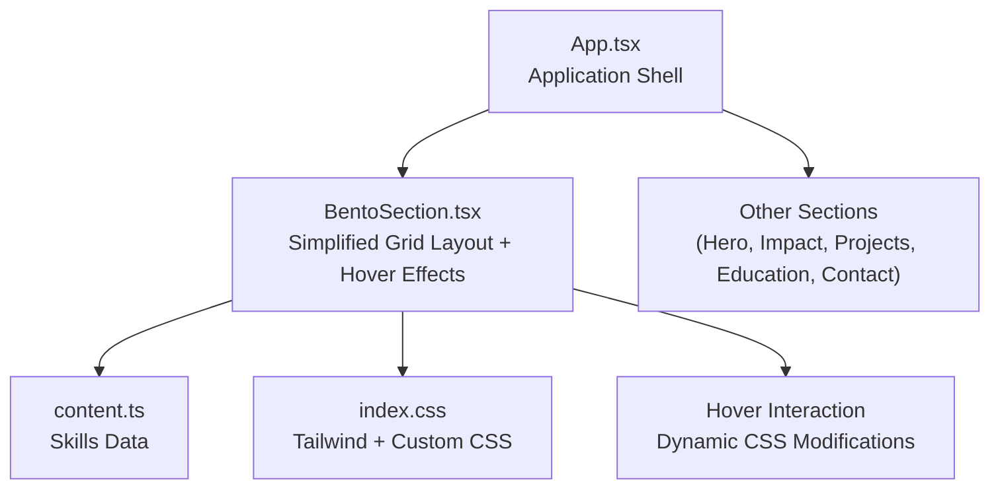
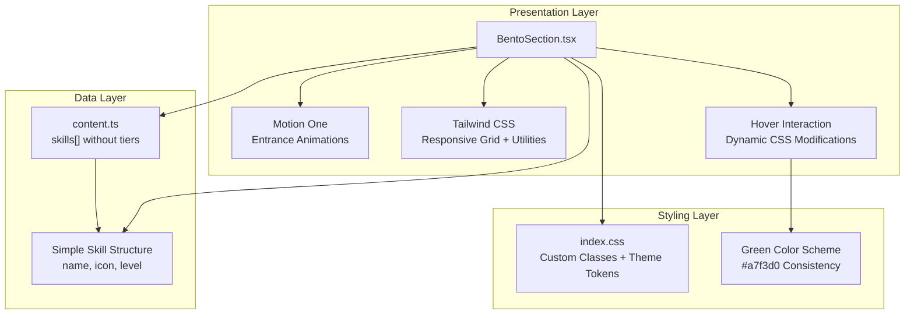
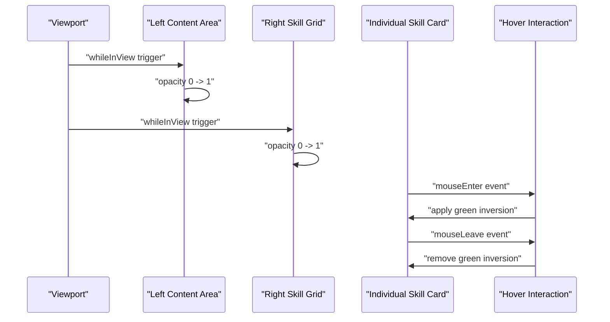
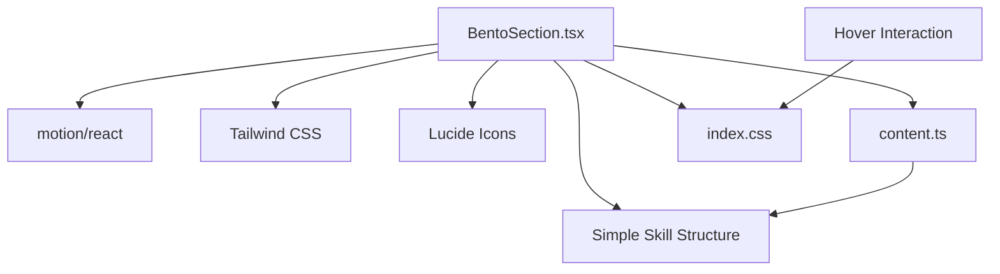

# BentoSection Component

<cite>
**Referenced Files in This Document**
- [BentoSection.tsx](file://src/components/BentoSection.tsx)
- [content.ts](file://src/data/content.ts)
- [index.css](file://src/index.css)
- [App.tsx](file://src/App.tsx)
- [package.json](file://package.json)
</cite>

## Update Summary
**Changes Made**
- Complete redesign of BentoSection component with simplified inline styling approach
- Replaced complex tier-based configuration with consistent green color scheme (#a7f3d0)
- Enhanced mouse interaction capabilities with dynamic CSS property modifications on hover events
- Simplified skill visualization system without tier categories
- Removed Motion One animations for skill bars in favor of direct CSS styling
- Streamlined component structure with improved hover effect implementation

## Table of Contents
1. [Introduction](#introduction)
2. [Project Structure](#project-structure)
3. [Core Components](#core-components)
4. [Architecture Overview](#architecture-overview)
5. [Detailed Component Analysis](#detailed-component-analysis)
6. [Dependency Analysis](#dependency-analysis)
7. [Performance Considerations](#performance-considerations)
8. [Troubleshooting Guide](#troubleshooting-guide)
9. [Conclusion](#conclusion)
10. [Appendices](#appendices)

## Introduction
The BentoSection component presents a streamlined, content-rich layout featuring a simplified skill visualization system with a consistent green color scheme. The component combines textual executive summary content with a technical toolkit grid that showcases skills through animated progress bars with hover interactions. It leverages responsive Tailwind CSS grid classes for adaptive column layouts and Motion One animations for entrance effects. This document explains the simplified skill system, grid-based presentation, card layout algorithms, responsive behavior, animation patterns, content structure requirements, customization approaches, and performance considerations.

## Project Structure
The BentoSection component resides under the components directory and is integrated into the main application shell. Content for the skills grid is centralized in the data module with a simplified skill structure, enabling easy maintenance and extension of the skill visualization system.

**Diagram sources**
- [App.tsx:16-24](file://src/App.tsx#L16-L24)
- [BentoSection.tsx:11-100](file://src/components/BentoSection.tsx#L11-L100)
- [content.ts:24-41](file://src/data/content.ts#L24-L41)
- [index.css:63-70](file://src/index.css#L63-L70)

**Section sources**
- [App.tsx:16-24](file://src/App.tsx#L16-L24)
- [BentoSection.tsx:11-100](file://src/components/BentoSection.tsx#L11-L100)
- [content.ts:24-41](file://src/data/content.ts#L24-L41)
- [index.css:63-70](file://src/index.css#L63-L70)

## Core Components
- **BentoSection**: Renders a two-column grid on large screens and stacked columns on smaller screens. The left column displays an executive summary with branding accents; the right column renders a responsive skill grid with animated progress bars and hover interactions.
- **Simplified Skills Data**: Centralized array of skill entries with metadata for name, icon, and proficiency level, without tier categorization.
- **Hover Interaction System**: Implements dynamic CSS property modifications on mouse enter/leave events for enhanced user feedback.

Key responsibilities:
- **Grid layout**: Uses Tailwind's responsive grid classes to adapt from single column on small screens to a 12-column layout on large screens.
- **Simplified visualization**: Implements consistent styling with green color scheme (#a7f3d0) for all skill cards and progress bars.
- **Animation orchestration**: Uses Motion One to animate entrance with smooth transitions.
- **Interactive hover effects**: Dynamically modifies CSS properties on hover for visual feedback.
- **Content composition**: Pulls skill content from the data module and composes it into structured cards with consistent styling.

**Section sources**
- [BentoSection.tsx:5-9](file://src/components/BentoSection.tsx#L5-L9)
- [BentoSection.tsx:66-94](file://src/components/BentoSection.tsx#L66-L94)
- [content.ts:24-41](file://src/data/content.ts#L24-L41)

## Architecture Overview
The BentoSection component follows a declarative React architecture with Motion One for animations, Tailwind CSS for responsive styling, and a simplified interaction system. The data-driven approach keeps content separate from presentation logic while enabling straightforward skill visualization.

**Diagram sources**
- [BentoSection.tsx:11-100](file://src/components/BentoSection.tsx#L11-L100)
- [content.ts:24-41](file://src/data/content.ts#L24-L41)
- [index.css:63-70](file://src/index.css#L63-L70)

## Detailed Component Analysis

### Simplified Skill Visualization System
The component implements a streamlined approach with consistent green color scheme:
- **Unified Design**: All skills use the same green color scheme (#a7f3d0) for icons, progress bars, and hover effects
- **Simplified Structure**: Skills are defined with name, icon, and level without tier categorization
- **Consistent Styling**: Typography, spacing, and visual hierarchy remain uniform across all skill cards
- **Direct Color Application**: Colors are applied directly via inline styles for immediate visual feedback

Each skill card includes:
- Icon with consistent green color (#a7f3d0)
- Skill name with uppercase styling and tracking
- Percentage indicator with subtle transparency
- Progress bar with solid green fill and rounded corners
- Hover effects that invert colors for visual emphasis

**Section sources**
- [BentoSection.tsx:5-9](file://src/components/BentoSection.tsx#L5-L9)
- [content.ts:24-41](file://src/data/content.ts#L24-L41)

### Grid-Based Content Presentation System
The component uses a responsive grid system with simplified layout:
- **Outer container**: Centered max-width container with horizontal padding that adapts across breakpoints
- **Inner grid**: Single column on small screens; switches to a 12-column grid on large screens
- **Column spans**: Left column occupies 7 of 12 columns; right column occupies 5 of 12 columns on large screens
- **Spacing**: Consistent gap between grid items ensures visual rhythm

Responsive behavior:
- **Small screens**: Columns stack vertically; content remains readable and accessible
- **Large screens**: Two-column layout optimizes space for dense content and skill grid

**Section sources**
- [BentoSection.tsx:13-14](file://src/components/BentoSection.tsx#L13-L14)

### Card Layout Algorithms
The right-hand skill grid employs a simplified algorithm:
- **Fixed two-column layout** on the skill grid
- **Consistent card styling** with unified green color scheme
- **Direct color application** via inline styles for immediate visual feedback
- **Percentage-based progress bars** with smooth width animations
- **Icon integration** with consistent green text colors

Implementation pattern:
- Map over the skills array and render a card per entry
- Apply consistent green styling for all elements
- Render animated progress bars with direct width transitions
- Display percentage indicators with consistent typography

**Section sources**
- [BentoSection.tsx:66-94](file://src/components/BentoSection.tsx#L66-L94)
- [content.ts:26-41](file://src/data/content.ts#L26-L41)

### Responsive Grid Behavior
Breakpoint-driven behavior with consistent styling:
- **Small screens**: 1-column grid for the skill area; outer grid stacks columns
- **Medium and larger screens**: 2-column grid for the skill area; outer grid becomes 12-column with left/right spans
- **Styling consistency**: Unified green color scheme remains consistent across all breakpoints

Consistency:
- **Horizontal padding increases** at larger breakpoints to maintain comfortable margins
- **Max-width constraint** ensures content does not stretch excessively on wide screens
- **Color scheme persists** across breakpoint changes for visual continuity

**Section sources**
- [BentoSection.tsx:13-14](file://src/components/BentoSection.tsx#L13-L14)
- [BentoSection.tsx:66](file://src/components/BentoSection.tsx#L66)

### Animation Patterns for Card Interactions and Visual Feedback
Enhanced animation patterns with simplified hover effects:
- **Entrance animations**: Main content areas animate in when scrolled into view
- **Progress animations**: Skill bars animate to their target widths with smooth easing
- **Hover effects**: Dynamic CSS property modifications with color inversions
- **Consistent timing**: All animations use the same duration and easing for predictable behavior

**Diagram sources**
- [BentoSection.tsx:16-19](file://src/components/BentoSection.tsx#L16-L19)
- [BentoSection.tsx:79-84](file://src/components/BentoSection.tsx#L79-L84)
- [BentoSection.tsx:66-67](file://src/components/BentoSection.tsx#L66-L67)

**Section sources**
- [BentoSection.tsx:16-19](file://src/components/BentoSection.tsx#L16-L19)
- [BentoSection.tsx:79-84](file://src/components/BentoSection.tsx#L79-L84)
- [BentoSection.tsx:87-91](file://src/components/BentoSection.tsx#L87-L91)

### Content Structure Requirements
To add or modify skills:
- **Add or update entries** in the skills array with the following fields:
  - `name`: Display label for the skill
  - `icon`: Lucide icon component to render alongside the label
  - `level`: Numeric proficiency percentage for the progress bar

Data source:
- The skills array is imported into the component and mapped to skill cards
- Direct styling applies consistent green color scheme to all elements

**Section sources**
- [content.ts:24-41](file://src/data/content.ts#L24-L41)
- [BentoSection.tsx:66-67](file://src/components/BentoSection.tsx#L66-L67)

### Adding New Bento Cards with Simplified Approach
To introduce additional skill cards:
- **Extend the skills array** with a new entry containing name, icon, and level
- **Choose appropriate level** based on proficiency percentage
- **Use existing icon components** from lucide-react
- **Automatic styling** applies consistent green color scheme
- **Direct hover effects** provide immediate visual feedback

Best practices:
- **Maintain consistent icon sizes** for visual balance
- **Ensure level percentages** are valid and meaningful
- **Use appropriate Lucide icons** that represent the skill domain
- **Keep naming conventions** consistent for readability

**Section sources**
- [content.ts:24-41](file://src/data/content.ts#L24-L41)
- [BentoSection.tsx:66-94](file://src/components/BentoSection.tsx#L66-L94)

### Customizing Simplified Card Designs
The component supports customization through direct styling approach:
- **Styling**: Adjust typography, spacing, and layout via Tailwind utilities
- **Icons**: Replace or augment icons by updating the skills array entries
- **Animations**: Modify animation durations and easing for entrance effects
- **Color scheme**: Change the green color (#a7f3d0) to match brand guidelines
- **Hover effects**: Customize the color inversion behavior in the hover handlers

Global behavior:
- **Consistent theming** across all skill cards with unified styling
- **Automatic color application** via inline styles for immediate visual feedback
- **Direct hover effects** with color inversions for enhanced user experience

**Section sources**
- [BentoSection.tsx:5-9](file://src/components/BentoSection.tsx#L5-L9)
- [BentoSection.tsx:66-94](file://src/components/BentoSection.tsx#L66-L94)
- [index.css:64-70](file://src/index.css#L64-L70)

### Implementing Different Content Types with Simplified Approach
The component's streamlined structure can accommodate different content types by:
- **Extending the skills array** to include richer metadata with level information
- **Rendering additional elements** within each card (e.g., descriptions, tags)
- **Creating custom hover behaviors** by modifying the mouse event handlers
- **Adjusting the grid layout** to support mixed-height cards

**Section sources**
- [content.ts:24-41](file://src/data/content.ts#L24-L41)
- [BentoSection.tsx:66-94](file://src/components/BentoSection.tsx#L66-L94)

### Optimizing Simplified Grid Layouts for Various Screen Sizes
Optimization strategies for the simplified system:
- **Prefer fixed column counts** for predictable layouts on larger screens
- **Use responsive padding and max-width constraints** to prevent content from becoming unwieldy
- **Minimize heavy DOM nodes** inside animated regions to reduce layout thrashing during scroll-triggered animations
- **Optimize hover effects** to maintain visual consistency across breakpoints
- **Consider animation performance** by using direct CSS modifications for hover states

**Section sources**
- [BentoSection.tsx:13-14](file://src/components/BentoSection.tsx#L13-L14)

## Dependency Analysis
External libraries and their roles in the simplified system:
- **Motion One**: Provides scroll-triggered animations for entrance effects
- **Tailwind CSS**: Supplies responsive grid utilities and design tokens for styling
- **Lucide React**: Provides vector icons used in skill cards with consistent coloring
- **TypeScript Types**: Enforces type safety for skill data structures

**Diagram sources**
- [BentoSection.tsx:1-3](file://src/components/BentoSection.tsx#L1-L3)
- [content.ts:24-41](file://src/data/content.ts#L24-L41)
- [package.json:13-24](file://package.json#L13-L24)

**Section sources**
- [BentoSection.tsx:1-3](file://src/components/BentoSection.tsx#L1-L3)
- [content.ts:24-41](file://src/data/content.ts#L24-L41)
- [package.json:13-24](file://package.json#L13-L24)

## Performance Considerations
- **Scroll-triggered animations**: Using viewport-based triggers prevents unnecessary re-renders and avoids repeated animations on revisit
- **Minimal DOM in animated regions**: Keep the number of animated children reasonable to minimize layout and paint costs
- **Direct CSS modifications**: Using inline styles for hover effects reduces complexity compared to complex state management
- **Icon rendering**: Lucide icons are lightweight; ensure only necessary icons are rendered
- **Grid stability**: Fixed column counts and consistent item heights help browsers optimize layout calculations
- **Simplified styling**: Direct color application reduces style recalculation overhead compared to complex theme systems
- **Animation efficiency**: Using simple width transitions for progress bars provides smooth performance

## Troubleshooting Guide
Common issues and resolutions for the simplified system:
- **Animations not triggering**: Verify viewport configuration and ensure the component is within the viewport bounds during initial load
- **Hover effects not working**: Check that mouse event handlers are properly attached and CSS selectors match the DOM structure
- **Color inconsistencies**: Verify that the green color (#a7f3d0) is properly applied and not overridden by other styles
- **Grid misalignment**: Check Tailwind grid classes and ensure consistent padding and max-width constraints across breakpoints
- **Progress bar animation**: Confirm that whileInView and viewport props are present and that the progress container is visible
- **Hover state persistence**: Ensure mouseLeave handlers properly reset styles and don't leave elements in hover state

**Section sources**
- [BentoSection.tsx:16-19](file://src/components/BentoSection.tsx#L16-L19)
- [BentoSection.tsx:79-84](file://src/components/BentoSection.tsx#L79-L84)
- [BentoSection.tsx:87-91](file://src/components/BentoSection.tsx#L87-L91)
- [index.css:64-70](file://src/index.css#L64-L70)

## Conclusion
The BentoSection component exemplifies a streamlined, responsive, and interactive layout that balances textual content with a clean skill visualization system. Its simplified design with consistent green color scheme and enhanced hover interactions enables straightforward customization while maintaining visual consistency across all skill cards. By leveraging Motion One, Tailwind CSS, and direct CSS modification techniques, it achieves smooth animations, robust responsiveness, and engaging user interactions across screen sizes.

## Appendices

### How to Integrate BentoSection into Your Application
- **Import the component** into your application shell
- **Place it among other sections** in the main content area
- **Ensure the data module exports the skills array** used by the component
- **Verify styling consistency** across all skill cards and hover effects

**Section sources**
- [App.tsx:6-14](file://src/App.tsx#L6-L14)
- [BentoSection.tsx:11-100](file://src/components/BentoSection.tsx#L11-L100)
- [content.ts:24-41](file://src/data/content.ts#L24-L41)

### Adding New Skill Cards
To extend the skill system:
1. **Update the skills array** with new entries containing name, icon, and level
2. **Choose appropriate level values** reflecting actual competency levels
3. **Select suitable Lucide icons** that represent the skill domain
4. **Test hover effects** to ensure proper color inversion behavior
5. **Verify responsive behavior** across different screen sizes

**Section sources**
- [content.ts:24](file://src/data/content.ts#L24)
- [BentoSection.tsx:5-9](file://src/components/BentoSection.tsx#L5-L9)