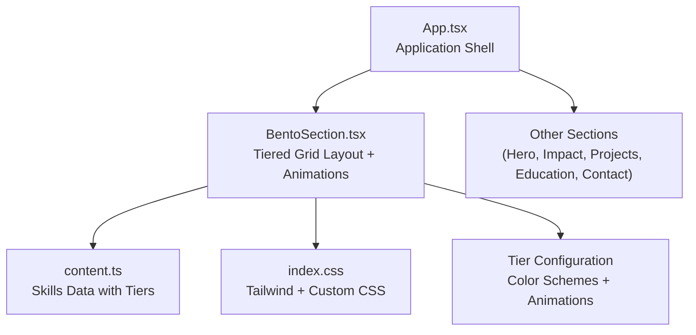
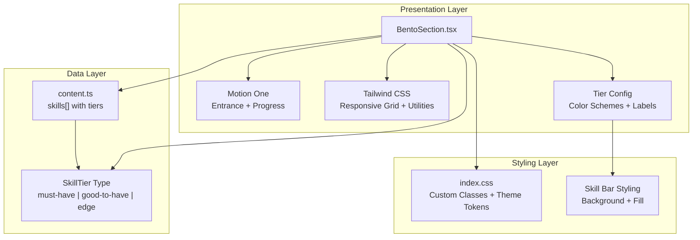
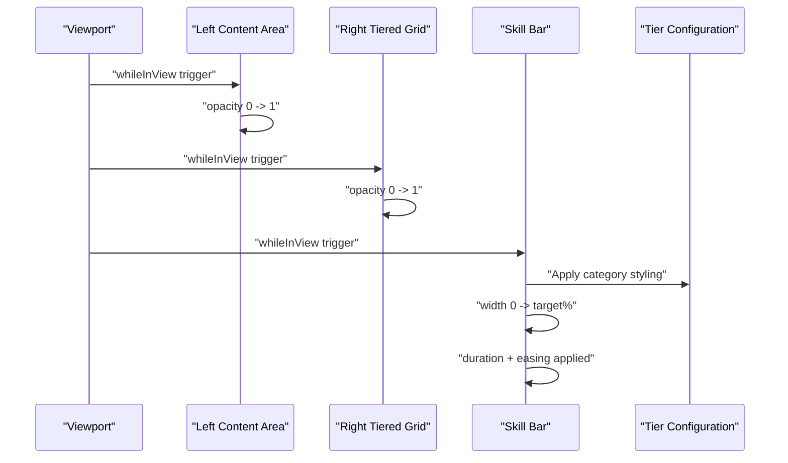
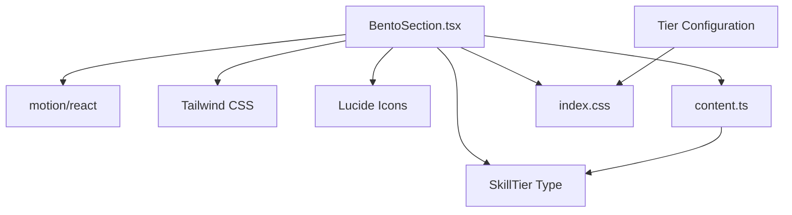

# BentoSection Component

<cite>
**Referenced Files in This Document**
- [BentoSection.tsx](file://src/components/BentoSection.tsx)
- [content.ts](file://src/data/content.ts)
- [index.css](file://src/index.css)
- [App.tsx](file://src/App.tsx)
- [package.json](file://package.json)
</cite>

## Update Summary
**Changes Made**
- Redesigned BentoSection component with sophisticated tiered skill visualization system
- Added three distinct skill categories: 'must-have', 'good-to-have', and 'edge'
- Implemented animated progress bars with category-specific styling
- Enhanced skill card design with tier-based color schemes and percentage indicators
- Updated skill data structure to include tier information

## Table of Contents
1. [Introduction](#introduction)
2. [Project Structure](#project-structure)
3. [Core Components](#core-components)
4. [Architecture Overview](#architecture-overview)
5. [Detailed Component Analysis](#detailed-component-analysis)
6. [Dependency Analysis](#dependency-analysis)
7. [Performance Considerations](#performance-considerations)
8. [Troubleshooting Guide](#troubleshooting-guide)
9. [Conclusion](#conclusion)
10. [Appendices](#appendices)

## Introduction
The BentoSection component presents a sophisticated grid-based, content-rich layout featuring a tiered skill visualization system with three distinct categories: 'must-have', 'good-to-have', and 'edge'. The component combines textual executive summary content with a technical toolkit grid that showcases skills through animated progress bars, category-specific styling, and percentage indicators. It leverages responsive Tailwind CSS grid classes for adaptive column layouts and Motion One animations for entrance and progress indicators. This document explains the tiered skill system, grid-based presentation, card layout algorithms, responsive behavior, animation patterns, content structure requirements, customization approaches, and performance considerations.

## Project Structure
The BentoSection component resides under the components directory and is integrated into the main application shell. Content for the skills grid is centralized in the data module with enhanced tier-based categorization, enabling easy maintenance and extension of the skill visualization system.

**Diagram sources**
- [App.tsx:16-24](file://src/App.tsx#L16-L24)
- [BentoSection.tsx:11-100](file://src/components/BentoSection.tsx#L11-L100)
- [content.ts:24-41](file://src/data/content.ts#L24-L41)
- [index.css:63-70](file://src/index.css#L63-L70)

**Section sources**
- [App.tsx:16-24](file://src/App.tsx#L16-L24)
- [BentoSection.tsx:11-100](file://src/components/BentoSection.tsx#L11-L100)
- [content.ts:24-41](file://src/data/content.ts#L24-L41)
- [index.css:63-70](file://src/index.css#L63-L70)

## Core Components
- **BentoSection**: Renders a two-column grid on large screens and stacked columns on smaller screens. The left column displays an executive summary with branding accents; the right column renders a responsive tiered skill grid with animated progress bars categorized by skill importance.
- **Tiered Skills Data**: Centralized array of skill entries with metadata for name, icon, proficiency level, and tier classification ('must-have', 'good-to-have', 'edge').
- **Tier Configuration**: Defines color schemes, labels, and styling for each skill category with consistent theming across the component.

Key responsibilities:
- **Grid layout**: Uses Tailwind's responsive grid classes to adapt from single column on small screens to a 12-column layout on large screens.
- **Tiered visualization**: Implements category-specific styling with color-coded progress bars and labels.
- **Animation orchestration**: Uses Motion One to animate entrance and progress indicators with smooth transitions.
- **Content composition**: Pulls tiered content from the data module and composes it into structured cards with category differentiation.

**Section sources**
- [BentoSection.tsx:5-9](file://src/components/BentoSection.tsx#L5-L9)
- [BentoSection.tsx:66-94](file://src/components/BentoSection.tsx#L66-L94)
- [content.ts:24-41](file://src/data/content.ts#L24-L41)

## Architecture Overview
The BentoSection component follows a declarative React architecture with Motion One for animations, Tailwind CSS for responsive styling, and a tier-based configuration system. The data-driven approach keeps content separate from presentation logic while enabling sophisticated categorization.

**Diagram sources**
- [BentoSection.tsx:11-100](file://src/components/BentoSection.tsx#L11-L100)
- [content.ts:24-41](file://src/data/content.ts#L24-L41)
- [index.css:63-70](file://src/index.css#L63-L70)

## Detailed Component Analysis

### Tiered Skill Visualization System
The component implements a sophisticated three-tier categorization system:
- **Must-Have Skills**: Core competencies with tertiary container styling (green-based palette)
- **Good-to-Have Skills**: Strong but secondary skills with primary container styling (blue-based palette)  
- **Edge Skills**: Advanced or emerging technologies with secondary container styling (neutral gray palette)

Each tier has:
- Distinct color scheme for cards, progress bars, and accents
- Category-specific labels ("Must-Have", "Good-to-Have", "Edge Skill")
- Consistent dot indicators and border styling
- Animated progress bars with category-appropriate colors

**Section sources**
- [BentoSection.tsx:5-9](file://src/components/BentoSection.tsx#L5-L9)
- [content.ts:24-41](file://src/data/content.ts#L24-L41)

### Grid-Based Content Presentation System
The component uses a responsive grid system with enhanced tiered layout:
- **Outer container**: Centered max-width container with horizontal padding that adapts across breakpoints
- **Inner grid**: Single column on small screens; switches to a 12-column grid on large screens
- **Column spans**: Left column occupies 7 of 12 columns; right column occupies 5 of 12 columns on large screens
- **Spacing**: Consistent gap between grid items ensures visual rhythm

Responsive behavior:
- **Small screens**: Columns stack vertically; content remains readable and accessible
- **Large screens**: Two-column layout optimizes space for dense content and tiered skill grid

**Section sources**
- [BentoSection.tsx:13-14](file://src/components/BentoSection.tsx#L13-L14)

### Card Layout Algorithms
The right-hand tiered skill grid employs an enhanced algorithm:
- **Fixed two-column layout** on the skill grid
- **Category-based card styling** with tier configuration mapping
- **Dynamic color application** based on skill tier
- **Percentage-based progress bars** with smooth animations
- **Icon integration** with category-specific text colors

Implementation pattern:
- Map over the skills array and render a card per entry
- Apply tier configuration for category-specific styling
- Render animated progress bars with duration and easing
- Display percentage indicators with category-appropriate colors

**Section sources**
- [BentoSection.tsx:66-94](file://src/components/BentoSection.tsx#L66-L94)
- [content.ts:26-41](file://src/data/content.ts#L26-L41)

### Responsive Grid Behavior
Breakpoint-driven behavior with enhanced tiered styling:
- **Small screens**: 1-column grid for the skill area; outer grid stacks columns
- **Medium and larger screens**: 2-column grid for the skill area; outer grid becomes 12-column with left/right spans
- **Category consistency**: Tier styling remains consistent across all breakpoints

Consistency:
- **Horizontal padding increases** at larger breakpoints to maintain comfortable margins
- **Max-width constraint** ensures content does not stretch excessively on wide screens
- **Tier styling persists** across breakpoint changes for visual continuity

**Section sources**
- [BentoSection.tsx:13-14](file://src/components/BentoSection.tsx#L13-L14)
- [BentoSection.tsx:66](file://src/components/BentoSection.tsx#L66)

### Animation Patterns for Card Interactions and Tiered Visualizations
Enhanced animation patterns with category-specific timing:
- **Entrance animations**: Both main content areas animate in when scrolled into view
- **Progress animations**: Skill bars animate to their target widths with smooth easing
- **Category timing**: Different tiers may have different animation durations for emphasis
- **Hover effects**: Category-specific hover states with color transitions

**Diagram sources**
- [BentoSection.tsx:16-19](file://src/components/BentoSection.tsx#L16-L19)
- [BentoSection.tsx:79-84](file://src/components/BentoSection.tsx#L79-L84)
- [BentoSection.tsx:66-67](file://src/components/BentoSection.tsx#L66-L67)

**Section sources**
- [BentoSection.tsx:16-19](file://src/components/BentoSection.tsx#L16-L19)
- [BentoSection.tsx:79-84](file://src/components/BentoSection.tsx#L79-L84)
- [BentoSection.tsx:87-91](file://src/components/BentoSection.tsx#L87-L91)

### Content Structure Requirements
To add or modify tiered skills:
- **Add or update entries** in the skills array with the following fields:
  - `name`: Display label for the skill
  - `icon`: Lucide icon component to render alongside the label
  - `level`: Numeric proficiency percentage for the progress bar
  - `tier`: One of the three categories: "must-have", "good-to-have", or "edge"
  - `fullWidth`: Optional boolean to make the card span both columns

Data source:
- The skills array is imported into the component and mapped to tiered cards
- Tier configuration provides automatic styling based on category

**Section sources**
- [content.ts:24-41](file://src/data/content.ts#L24-L41)
- [BentoSection.tsx:66-67](file://src/components/BentoSection.tsx#L66-L67)

### Adding New Bento Cards with Tier Categories
To introduce additional tiered cards in the skill grid:
- **Extend the skills array** with a new entry containing name, icon, level, and tier
- **Choose appropriate category** based on skill importance and proficiency
- **Set level percentages** reflecting actual competency levels
- **Optionally set fullWidth** to true for prominent skills
- **Automatic styling** applies based on tier configuration

Best practices:
- **Maintain category balance** across must-have, good-to-have, and edge tiers
- **Keep icon sizes consistent** for visual balance
- **Ensure level percentages** are valid and meaningful
- **Use fullWidth judiciously** to highlight key skills

**Section sources**
- [content.ts:24-41](file://src/data/content.ts#L24-L41)
- [BentoSection.tsx:66-94](file://src/components/BentoSection.tsx#L66-L94)

### Customizing Tiered Card Designs
The component supports extensive customization through the tier configuration system:
- **Styling**: Adjust background colors, typography, and spacing via Tailwind utilities
- **Icons**: Replace or augment icons by updating the skills array entries
- **Animations**: Modify animation durations and easing for entrance and progress bars
- **Category theming**: Customize colors, labels, and styling in the tier configuration
- **Progress bars**: Adjust height, colors, and transition timing in CSS

Global tier behavior:
- **Consistent theming** across all instances of each category
- **Automatic color application** based on skill tier
- **Category-specific hover effects** with color transitions

**Section sources**
- [BentoSection.tsx:5-9](file://src/components/BentoSection.tsx#L5-L9)
- [BentoSection.tsx:66-94](file://src/components/BentoSection.tsx#L66-L94)
- [index.css:64-70](file://src/index.css#L64-L70)

### Implementing Different Content Types with Tier Categories
The component's tiered structure can accommodate different content types by:
- **Extending the skills array** to include richer metadata with tier information
- **Rendering additional elements** within each card (e.g., descriptions, tags)
- **Adapting the grid** to support mixed-width cards by adjusting the fullWidth flag
- **Creating custom tiers** by extending the SkillTier type and tier configuration

**Section sources**
- [content.ts:24-41](file://src/data/content.ts#L24-L41)
- [BentoSection.tsx:66-94](file://src/components/BentoSection.tsx#L66-L94)

### Optimizing Tiered Grid Layouts for Various Screen Sizes
Optimization strategies for the tiered system:
- **Prefer fixed column counts** for predictable layouts on larger screens
- **Use responsive padding and max-width constraints** to prevent content from becoming unwieldy
- **Minimize heavy DOM nodes** inside animated regions to reduce layout thrashing during scroll-triggered animations
- **Optimize tier styling** to maintain visual consistency across breakpoints
- **Consider animation performance** by batching tier animations where appropriate

**Section sources**
- [BentoSection.tsx:13-14](file://src/components/BentoSection.tsx#L13-L14)

## Dependency Analysis
External libraries and their roles in the tiered system:
- **Motion One**: Provides scroll-triggered animations for entrance and progress indicators
- **Tailwind CSS**: Supplies responsive grid utilities and design tokens for tier styling
- **Lucide React**: Provides vector icons used in skill cards with category-specific coloring
- **TypeScript Types**: Enforces type safety for tier categories and skill data structures

**Diagram sources**
- [BentoSection.tsx:1-3](file://src/components/BentoSection.tsx#L1-L3)
- [content.ts:24-41](file://src/data/content.ts#L24-L41)
- [package.json:13-24](file://package.json#L13-L24)

**Section sources**
- [BentoSection.tsx:1-3](file://src/components/BentoSection.tsx#L1-L3)
- [content.ts:24-41](file://src/data/content.ts#L24-L41)
- [package.json:13-24](file://package.json#L13-L24)

## Performance Considerations
- **Scroll-triggered animations**: Using viewport-based triggers prevents unnecessary re-renders and avoids repeated animations on revisit
- **Minimal DOM in animated regions**: Keep the number of animated children reasonable to minimize layout and paint costs
- **CSS transitions**: Prefer hardware-accelerated properties (opacity, transform) for smoother animations
- **Icon rendering**: Lucide icons are lightweight; ensure only necessary icons are rendered
- **Grid stability**: Fixed column counts and consistent item heights help browsers optimize layout calculations
- **Tier styling optimization**: CSS variables and consistent color schemes reduce style recalculation overhead
- **Animation batching**: Similar tier categories can share animation configurations for optimal performance

## Troubleshooting Guide
Common issues and resolutions for the tiered system:
- **Animations not triggering**: Verify viewport configuration and ensure the component is within the viewport bounds during initial load
- **Skill bars not animating**: Confirm whileInView and viewport props are present and that the progress container is visible
- **Tier styling not applying**: Check that skill tier values match the tier configuration keys
- **Grid misalignment**: Check Tailwind grid classes and ensure consistent padding and max-width constraints across breakpoints
- **Color inconsistencies**: Verify CSS variables are properly defined in the theme configuration
- **Hover effects not applying**: Confirm global hover styles are included and not overridden by local styles

**Section sources**
- [BentoSection.tsx:16-19](file://src/components/BentoSection.tsx#L16-L19)
- [BentoSection.tsx:79-84](file://src/components/BentoSection.tsx#L79-L84)
- [BentoSection.tsx:87-91](file://src/components/BentoSection.tsx#L87-L91)
- [index.css:64-70](file://src/index.css#L64-L70)

## Conclusion
The BentoSection component exemplifies a sophisticated, responsive, and animated layout that balances textual content with a dynamic tiered skill visualization system. Its modular design with category-based theming enables straightforward customization and extension while maintaining visual consistency across skill categories. By leveraging Motion One, Tailwind CSS, and a tier configuration system, it achieves smooth animations, robust responsiveness, and clear skill categorization across screen sizes.

## Appendices

### How to Integrate BentoSection into Your Application
- **Import the component** into your application shell
- **Place it among other sections** in the main content area
- **Ensure the data module exports the skills array** used by the component
- **Verify tier configuration** is properly typed and styled

**Section sources**
- [App.tsx:6-14](file://src/App.tsx#L6-L14)
- [BentoSection.tsx:11-100](file://src/components/BentoSection.tsx#L11-L100)
- [content.ts:24-41](file://src/data/content.ts#L24-L41)

### Adding New Tier Categories
To extend the tier system:
1. **Update the SkillTier type** to include new categories
2. **Add new tier configuration** entries with colors and styling
3. **Update skill data** to use new tier values
4. **Test styling consistency** across all breakpoints

**Section sources**
- [content.ts:24](file://src/data/content.ts#L24)
- [BentoSection.tsx:5-9](file://src/components/BentoSection.tsx#L5-L9)