# Component Library & UI Elements

<cite>
**Referenced Files in This Document**
- [App.tsx](file://src/App.tsx)
- [index.css](file://src/index.css)
- [content.ts](file://src/data/content.ts)
- [Navigation.tsx](file://src/components/Navigation.tsx)
- [Hero.tsx](file://src/components/Hero.tsx)
- [BentoSection.tsx](file://src/components/BentoSection.tsx)
- [ImpactSection.tsx](file://src/components/ImpactSection.tsx)
- [ProjectsSection.tsx](file://src/components/ProjectsSection.tsx)
- [EducationSection.tsx](file://src/components/EducationSection.tsx)
- [ContactSection.tsx](file://src/components/ContactSection.tsx)
- [Footer.tsx](file://src/components/Footer.tsx)
- [package.json](file://package.json)
</cite>

## Table of Contents
1. [Introduction](#introduction)
2. [Project Structure](#project-structure)
3. [Core Components](#core-components)
4. [Architecture Overview](#architecture-overview)
5. [Detailed Component Analysis](#detailed-component-analysis)
6. [Dependency Analysis](#dependency-analysis)
7. [Performance Considerations](#performance-considerations)
8. [Troubleshooting Guide](#troubleshooting-guide)
9. [Conclusion](#conclusion)
10. [Appendices](#appendices)

## Introduction
This document describes the portfolio’s React component library and UI elements. It covers the Navigation, Hero, BentoSection, ImpactSection, ProjectsSection, EducationSection, ContactSection, and Footer components. For each component, we explain props interfaces, state management, animations, responsive behavior, accessibility features, usage examples, customization options, and integration patterns. We also document the design system (colors, typography, spacing, and animation timing) and highlight composition patterns, prop drilling solutions, and performance optimizations.

## Project Structure
The portfolio is a React application built with Vite and Tailwind CSS v4. Components are organized under src/components, shared data under src/data, and global styles under src/index.css. The App component composes all sections in order.

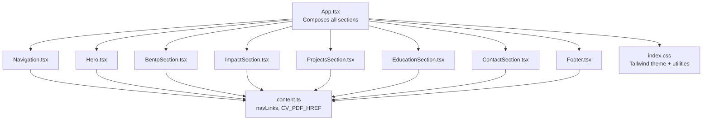

**Diagram sources**
- [App.tsx:15-32](file://src/App.tsx#L15-L32)
- [content.ts:10-82](file://src/data/content.ts#L10-L82)
- [index.css:3-40](file://src/index.css#L3-L40)

**Section sources**
- [App.tsx:15-32](file://src/App.tsx#L15-L32)
- [content.ts:10-82](file://src/data/content.ts#L10-L82)
- [index.css:3-40](file://src/index.css#L3-L40)

## Core Components
This section summarizes each component’s role, props, state, animations, responsiveness, and accessibility.

- Navigation
  - Purpose: Fixed navigation with scroll-based active section highlighting and a CV download action.
  - Props: None.
  - State: activeId (string) tracks the currently active section.
  - Animations: Underline motion with layoutId and spring-based transitions.
  - Responsive: Desktop flex layout; mobile-friendly spacing and typography.
  - Accessibility: aria-label on CV button; keyboard navigable links.

- Hero
  - Purpose: Personal introduction with animated headline, tagline, location, social links, and profile image.
  - Props: None.
  - State: None.
  - Animations: staggered entrance for text and image with motion variants.
  - Responsive: Two-column layout on medium screens; stacked on small screens.
  - Accessibility: Proper alt text on image; external links open in new tabs with rel attributes.

- BentoSection
  - Purpose: Executive summary and technical toolkit presentation with animated skill bars.
  - Props: None.
  - State: None.
  - Animations: Viewport-triggered entries; animated skill bar widths.
  - Responsive: Three-column layout on large screens; stacked on smaller screens.
  - Accessibility: Semantic headings and contrast-compliant text.

- ImpactSection
  - Purpose: Quantifiable metrics display with KPI cards and SVG charts.
  - Props: None.
  - State: None.
  - Animations: Staggered card entries with viewport triggers.
  - Responsive: Two-column layout on medium screens; single column on small screens.
  - Accessibility: Color-coded text and bars; readable typography.

- ProjectsSection
  - Purpose: Portfolio showcase with project cards, tech stacks, and highlights.
  - Props: None.
  - State: None.
  - Animations: Staggered card entries with viewport triggers.
  - Responsive: Two-column layout on large screens; single column on small screens.
  - Accessibility: Hover/focus affordances; readable lists.

- EducationSection
  - Purpose: Academic background presentation with timeline-style entries.
  - Props: None.
  - State: None.
  - Animations: Staggered entries with viewport triggers.
  - Responsive: Two-column layout on large screens; stacked on small screens.
  - Accessibility: Clear headings and periods; readable text.

- ContactSection
  - Purpose: Professional engagement options with prominent CTA buttons.
  - Props: None.
  - State: None.
  - Animations: None.
  - Responsive: Centered layout with horizontal buttons on small screens.
  - Accessibility: Large touch targets; clear labels.

- Footer
  - Purpose: Social media integration and copyright notice.
  - Props: None.
  - State: None.
  - Animations: None.
  - Responsive: Column layout on small screens; row layout on larger screens.
  - Accessibility: Links with hover/focus states; underline emphasis.

**Section sources**
- [Navigation.tsx:10-98](file://src/components/Navigation.tsx#L10-L98)
- [Hero.tsx:11-99](file://src/components/Hero.tsx#L11-L99)
- [BentoSection.tsx:4-87](file://src/components/BentoSection.tsx#L4-L87)
- [ImpactSection.tsx:56-106](file://src/components/ImpactSection.tsx#L56-L106)
- [ProjectsSection.tsx:21-100](file://src/components/ProjectsSection.tsx#L21-L100)
- [EducationSection.tsx:4-58](file://src/components/EducationSection.tsx#L4-L58)
- [ContactSection.tsx:3-39](file://src/components/ContactSection.tsx#L3-L39)
- [Footer.tsx:3-36](file://src/components/Footer.tsx#L3-L36)

## Architecture Overview
The App component orchestrates the page layout. Each section is a self-contained React component that reads shared data from content.ts and applies Tailwind utility classes. Motion is used for animations, and Lucide icons are used for visual cues.

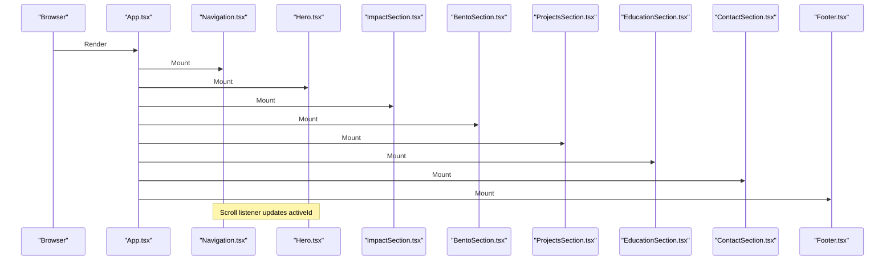

**Diagram sources**
- [App.tsx:15-32](file://src/App.tsx#L15-L32)
- [Navigation.tsx:13-40](file://src/components/Navigation.tsx#L13-L40)

**Section sources**
- [App.tsx:15-32](file://src/App.tsx#L15-L32)
- [Navigation.tsx:13-40](file://src/components/Navigation.tsx#L13-L40)

## Detailed Component Analysis

### Navigation
- Role: Fixed navigation bar with scroll-based active section highlighting and a CV download link.
- Props: None.
- State: activeId (string) initialized to "home".
- Scroll logic:
  - Computes section IDs from navLinks.
  - Uses a fixed offset to detect which section is currently active.
  - Updates activeId when scroll or resize occurs.
- Animation:
  - Underline motion uses layoutId for smooth transitions.
  - Spring-based layout animation with custom stiffness/damping.
  - Opacity transition for underline appearance.
- Accessibility:
  - CV link includes aria-label.
  - Keyboard navigable anchor tags.
- Responsive:
  - Desktop: centered navigation with underline indicator.
  - Mobile: reduced padding and compact typography.
- Integration:
  - Consumes navLinks and CV_PDF_HREF from content.ts.
  - Uses motion for underline animation.

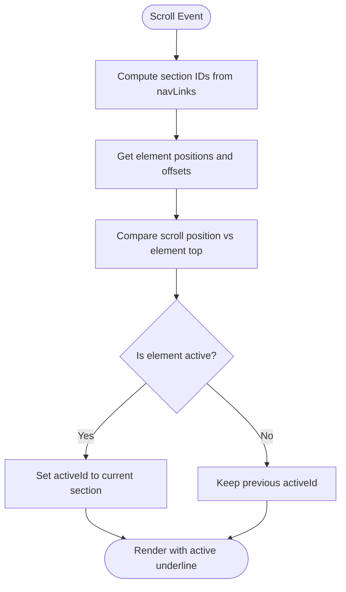

**Diagram sources**
- [Navigation.tsx:13-40](file://src/components/Navigation.tsx#L13-L40)

**Section sources**
- [Navigation.tsx:10-98](file://src/components/Navigation.tsx#L10-L98)
- [content.ts:10-18](file://src/data/content.ts#L10-L18)

### Hero
- Role: Personal introduction with animated headline, tagline, location, social links, and profile image.
- Props: None.
- State: None.
- Animations:
  - Text container slides in from left with fade-in.
  - Image container fades in and scales slightly with delay.
- Accessibility:
  - Image has alt text.
  - External links open in new tabs with rel="noopener noreferrer".
- Responsive:
  - Two-column layout on medium+ screens.
  - Single column on small screens.
- Integration:
  - Uses socialIcons mapping and socialLinks from content.ts.
  - Uses HERO_IMAGE_SRC for the profile image.

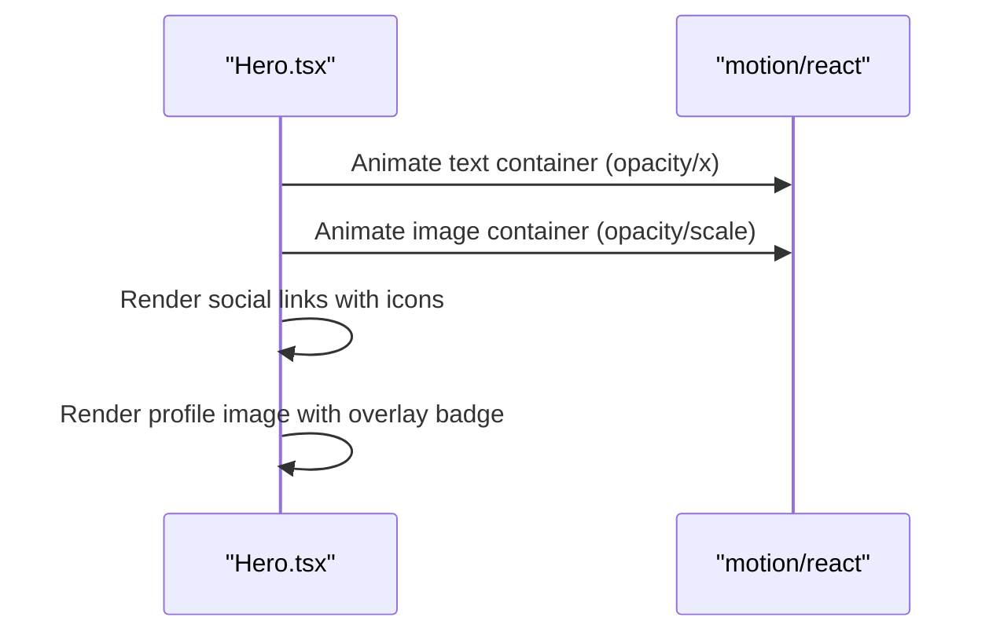

**Diagram sources**
- [Hero.tsx:11-99](file://src/components/Hero.tsx#L11-L99)
- [content.ts:68-79](file://src/data/content.ts#L68-L79)

**Section sources**
- [Hero.tsx:11-99](file://src/components/Hero.tsx#L11-L99)
- [content.ts:68-79](file://src/data/content.ts#L68-L79)

### BentoSection
- Role: Executive summary and technical toolkit with animated skill bars.
- Props: None.
- State: None.
- Animations:
  - Two containers animate in when scrolled into view.
  - Skill bars animate to their percentage width on first viewport entry.
- Accessibility:
  - Semantic headings and contrast-compliant text.
  - Icons are decorative (aria-hidden) where appropriate.
- Responsive:
  - Three-column layout on large screens; stacked on smaller screens.
- Integration:
  - Reads skills from content.ts; each skill item defines name, icon, level, and optional fullWidth.

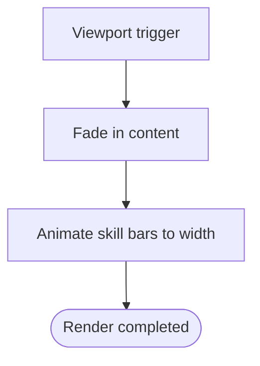

**Diagram sources**
- [BentoSection.tsx:8-87](file://src/components/BentoSection.tsx#L8-L87)
- [content.ts:20-36](file://src/data/content.ts#L20-L36)

**Section sources**
- [BentoSection.tsx:4-87](file://src/components/BentoSection.tsx#L4-L87)
- [content.ts:20-36](file://src/data/content.ts#L20-L36)

### ImpactSection
- Role: Quantifiable metrics display with KPI cards and SVG charts.
- Props: None.
- State: None.
- Animations:
  - Cards enter with staggered delays when scrolled into view.
- Accessibility:
  - Color-coded text and bars for readability.
  - Descriptive labels and headings.
- Responsive:
  - Two-column layout on medium screens; single column on small screens.
- Integration:
  - Static metrics array defines KPIs, values, labels, descriptions, colors, and SVG charts.

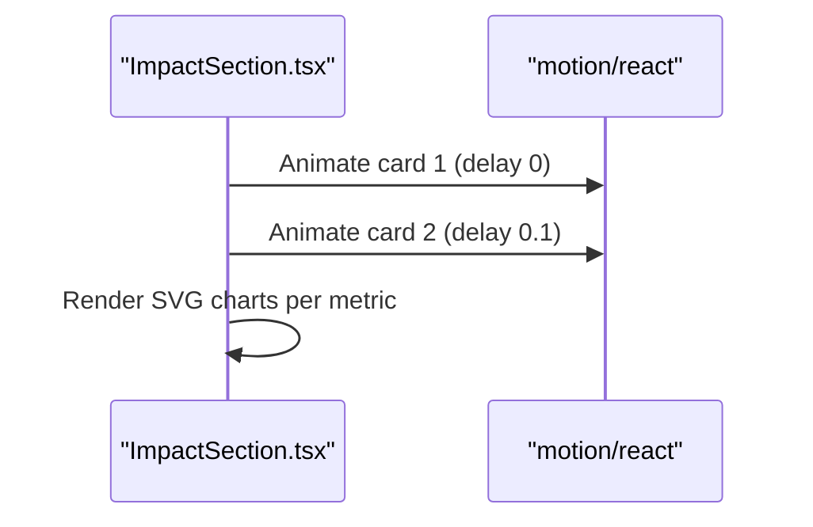

**Diagram sources**
- [ImpactSection.tsx:56-106](file://src/components/ImpactSection.tsx#L56-L106)

**Section sources**
- [ImpactSection.tsx:56-106](file://src/components/ImpactSection.tsx#L56-L106)

### ProjectsSection
- Role: Portfolio showcase with project cards, tech stacks, and highlights.
- Props: None.
- State: None.
- Animations:
  - Cards enter with staggered delays when scrolled into view.
  - Hover effects include subtle lift and shadow.
- Accessibility:
  - Hover/focus states for interactive elements.
  - Readable typography and spacing.
- Responsive:
  - Two-column layout on large screens; single column on small screens.
- Integration:
  - Uses projects from content.ts; StackIcon maps technology names to icons.

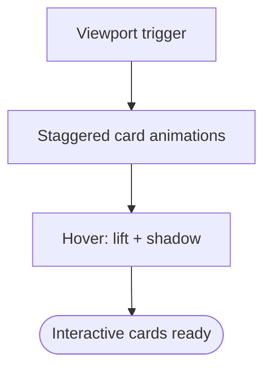

**Diagram sources**
- [ProjectsSection.tsx:21-100](file://src/components/ProjectsSection.tsx#L21-L100)
- [content.ts:83-102](file://src/data/content.ts#L83-L102)

**Section sources**
- [ProjectsSection.tsx:21-100](file://src/components/ProjectsSection.tsx#L21-L100)
- [content.ts:83-102](file://src/data/content.ts#L83-L102)

### EducationSection
- Role: Academic background presentation with timeline-style entries.
- Props: None.
- State: None.
- Animations:
  - Entries animate in with staggered delays when scrolled into view.
- Accessibility:
  - Clear headings and periods; readable text.
- Responsive:
  - Two-column layout on large screens; stacked on small screens.
- Integration:
  - Uses education array from content.ts.

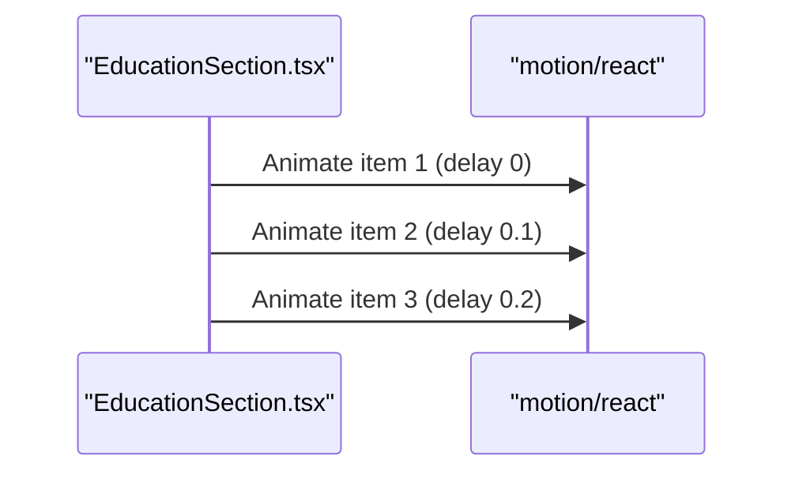

**Diagram sources**
- [EducationSection.tsx:4-58](file://src/components/EducationSection.tsx#L4-L58)
- [content.ts:38-60](file://src/data/content.ts#L38-L60)

**Section sources**
- [EducationSection.tsx:4-58](file://src/components/EducationSection.tsx#L4-L58)
- [content.ts:38-60](file://src/data/content.ts#L38-L60)

### ContactSection
- Role: Professional engagement options with prominent CTA buttons.
- Props: None.
- State: None.
- Animations: None.
- Accessibility:
  - Large touch targets for buttons.
  - Clear labels and contrasting colors.
- Responsive:
  - Centered layout with horizontal buttons on small screens.
- Integration:
  - Uses CONTACT_EMAIL_HREF and LINKEDIN_PROFILE_URL from content.ts.

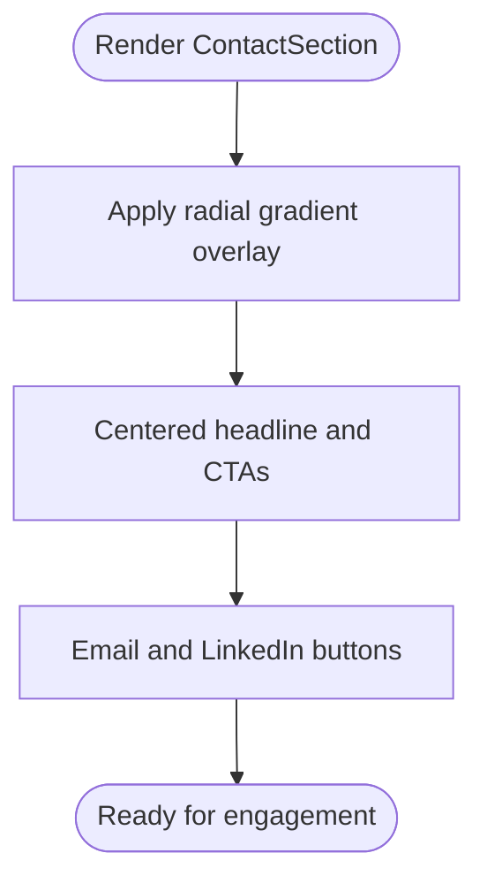

**Diagram sources**
- [ContactSection.tsx:3-39](file://src/components/ContactSection.tsx#L3-L39)
- [content.ts:62-65](file://src/data/content.ts#L62-L65)

**Section sources**
- [ContactSection.tsx:3-39](file://src/components/ContactSection.tsx#L3-L39)
- [content.ts:62-65](file://src/data/content.ts#L62-L65)

### Footer
- Role: Social media integration and copyright notice.
- Props: None.
- State: None.
- Animations: None.
- Accessibility:
  - Links with hover/focus states; underline emphasis.
- Responsive:
  - Column layout on small screens; row layout on larger screens.
- Integration:
  - Uses socialLinks from content.ts.

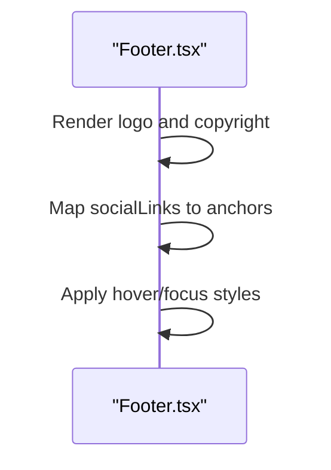

**Diagram sources**
- [Footer.tsx:3-36](file://src/components/Footer.tsx#L3-L36)
- [content.ts:68-75](file://src/data/content.ts#L68-L75)

**Section sources**
- [Footer.tsx:3-36](file://src/components/Footer.tsx#L3-L36)
- [content.ts:68-75](file://src/data/content.ts#L68-L75)

## Dependency Analysis
- External libraries:
  - motion: Provides motion variants and layout animations.
  - lucide-react: Provides icons for social links and skill bars.
  - react and react-dom: Core framework.
  - tailwindcss v4: Utility-first styling with a custom theme.
- Internal dependencies:
  - content.ts supplies navigation links, hero image, CV PDF, social links, skills, education, projects, and contact URLs.
  - index.css defines the design tokens and utility classes used across components.

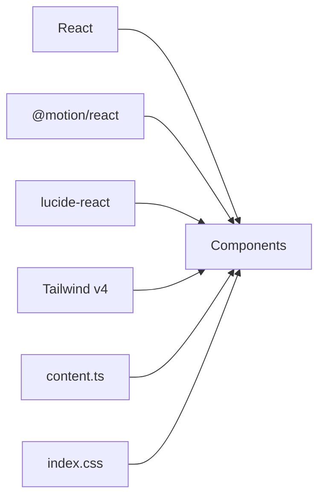

**Diagram sources**
- [package.json:13-23](file://package.json#L13-L23)
- [content.ts:10-102](file://src/data/content.ts#L10-L102)
- [index.css:1-71](file://src/index.css#L1-L71)

**Section sources**
- [package.json:13-23](file://package.json#L13-L23)
- [content.ts:10-102](file://src/data/content.ts#L10-L102)
- [index.css:1-71](file://src/index.css#L1-L71)

## Performance Considerations
- Scroll listeners:
  - Navigation uses passive scroll and resize listeners to avoid layout thrashing.
  - Debouncing is not implemented; consider throttling for heavy pages.
- Viewport animations:
  - Components use viewport-based triggers with once=true to prevent re-animation on scroll back.
- Lazy loading:
  - Hero image uses async decoding and standard aspect ratio attributes.
- CSS:
  - Minimal radius values and backdrop blur are used; ensure GPU acceleration is acceptable on target devices.
- Bundle size:
  - motion and lucide-react are included; consider tree-shaking and icon bundling if adding more icons.

[No sources needed since this section provides general guidance]

## Troubleshooting Guide
- Navigation underline not updating:
  - Verify navLinks match section IDs and that the fixed offset aligns with header heights.
  - Ensure DOM elements exist before scroll events.
- Skill bars not animating:
  - Confirm viewport is configured and once is set appropriately.
  - Check that skill.level is numeric and within expected bounds.
- Social links opening in new tab:
  - Confirm href starts with http/https; otherwise, external link logic is skipped.
- Accessibility issues:
  - Ensure all images have alt text.
  - Provide aria-labels for icon-only links.
  - Test keyboard navigation and focus outlines.

**Section sources**
- [Navigation.tsx:13-40](file://src/components/Navigation.tsx#L13-L40)
- [BentoSection.tsx:71-78](file://src/components/BentoSection.tsx#L71-L78)
- [Hero.tsx:44-68](file://src/components/Hero.tsx#L44-L68)

## Conclusion
The portfolio’s component library is modular, accessible, and visually cohesive. Each section is self-contained, consumes shared data, and leverages motion for smooth interactions. The design system is centralized in index.css with Tailwind v4, enabling consistent typography, colors, and spacing. Composition is straightforward in App.tsx, and performance is optimized through viewport-triggered animations and passive event listeners.

[No sources needed since this section summarizes without analyzing specific files]

## Appendices

### Design System
- Typography
  - Headlines: Manrope
  - Body: Manrope
  - Labels: Inter
- Colors
  - Primary palette: Dark blue tones for primary and on-primary.
  - Secondary palette: Neutral gray for secondary and on-secondary.
  - Tertiary palette: Green accents for tertiary and tertiary-container; bright tertiary-fixed for highlights.
  - Background and surfaces: Light backgrounds with layered surface variations.
- Spacing
  - Consistent padding and margins across sections; responsive gutters.
- Animation Timing
  - Navigation underline: spring layout with custom stiffness and damping.
  - Skill bars: 1.5s ease-out.
  - Impact cards: 0.1s stagger.
  - Project cards: 0.08s stagger.
  - Hero: 0.8s duration for entrance; 0.2s delay for image.
- Utilities
  - Glass-nav effect with backdrop blur.
  - Impact card hover lift and shadow.
  - Skill bar background and fill utilities.

**Section sources**
- [index.css:3-40](file://src/index.css#L3-L40)
- [Navigation.tsx:66-79](file://src/components/Navigation.tsx#L66-L79)
- [BentoSection.tsx:71-78](file://src/components/BentoSection.tsx#L71-L78)
- [ImpactSection.tsx:74-76](file://src/components/ImpactSection.tsx#L74-L76)
- [ProjectsSection.tsx:49-51](file://src/components/ProjectsSection.tsx#L49-L51)
- [Hero.tsx:17-18](file://src/components/Hero.tsx#L17-L18)

### Component Composition Patterns
- App.tsx composes all sections in a single render pass.
- Shared data is centralized in content.ts; components import only what they need.
- No prop drilling is evident; data is passed directly to components.

**Section sources**
- [App.tsx:15-32](file://src/App.tsx#L15-L32)
- [content.ts:10-102](file://src/data/content.ts#L10-L102)

### Integration Patterns
- Navigation links are defined in content.ts and consumed by Navigation and App.
- Social links are reused in Hero and Footer for consistency.
- CV and contact URLs are centralized for easy updates.

**Section sources**
- [content.ts:10-18](file://src/data/content.ts#L10-L18)
- [content.ts:62-75](file://src/data/content.ts#L62-L75)