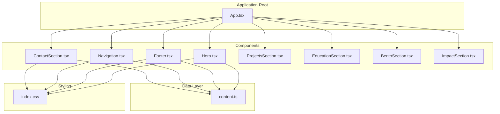
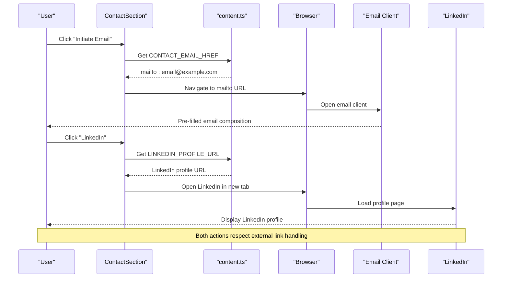
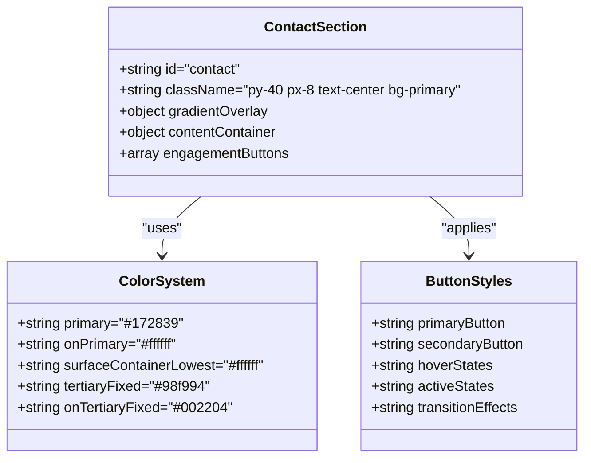
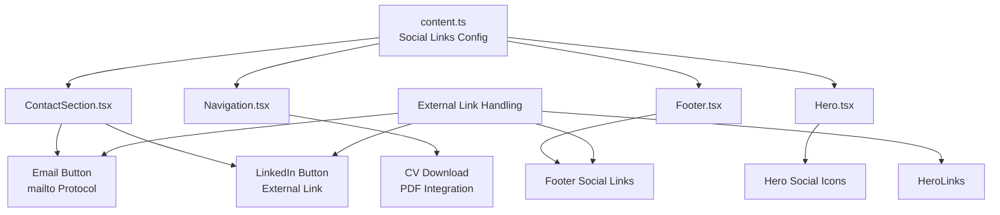
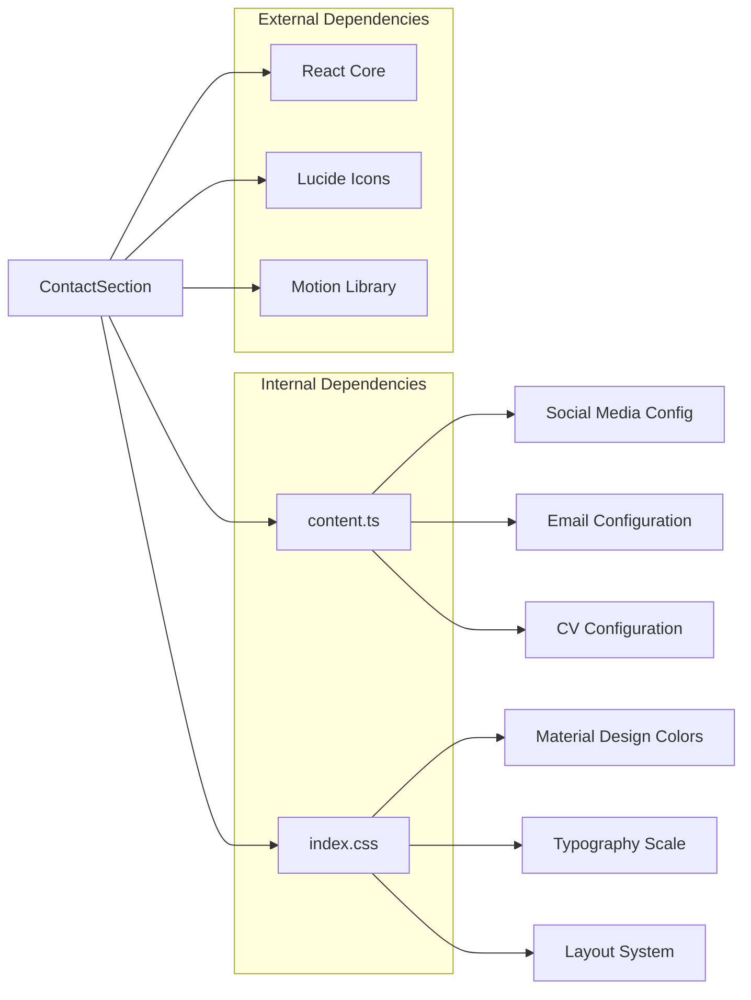

# ContactSection Component

<cite>
**Referenced Files in This Document**
- [ContactSection.tsx](file://src/components/ContactSection.tsx)
- [content.ts](file://src/data/content.ts)
- [App.tsx](file://src/App.tsx)
- [index.css](file://src/index.css)
- [Navigation.tsx](file://src/components/Navigation.tsx)
- [Footer.tsx](file://src/components/Footer.tsx)
- [Hero.tsx](file://src/components/Hero.tsx)
</cite>

## Table of Contents
1. [Introduction](#introduction)
2. [Project Structure](#project-structure)
3. [Core Components](#core-components)
4. [Architecture Overview](#architecture-overview)
5. [Detailed Component Analysis](#detailed-component-analysis)
6. [Dependency Analysis](#dependency-analysis)
7. [Performance Considerations](#performance-considerations)
8. [Accessibility Features](#accessibility-features)
9. [Customization Guide](#customization-guide)
10. [Troubleshooting Guide](#troubleshooting-guide)
11. [Conclusion](#conclusion)

## Introduction

The ContactSection component serves as a professional engagement hub within the portfolio website, designed to facilitate meaningful connections and networking opportunities for a data analyst professional. This component implements a focused approach to contact interactions, emphasizing email integration, LinkedIn connectivity, and downloadable CV functionality while maintaining a clean, accessible interface.

The component follows modern React patterns with TypeScript integration, leveraging Tailwind CSS for styling and Material Design color systems. It positions itself strategically within the application's navigation flow, appearing as the final major section after the hero presentation and project showcases.

## Project Structure

The ContactSection is part of a modular React application architecture with clear separation of concerns:



**Diagram sources**
- [App.tsx:15-32](file://src/App.tsx#L15-L32)
- [ContactSection.tsx:3-38](file://src/components/ContactSection.tsx#L3-L38)
- [content.ts:10-18](file://src/data/content.ts#L10-L18)

**Section sources**
- [App.tsx:15-32](file://src/App.tsx#L15-L32)
- [ContactSection.tsx:3-38](file://src/components/ContactSection.tsx#L3-L38)

## Core Components

### Professional Engagement Options

The ContactSection provides two primary professional engagement pathways:

1. **Email Communication**: Direct email initiation through mailto protocol integration
2. **LinkedIn Networking**: Professional networking through LinkedIn profile access

Both engagement options are presented as prominent call-to-action buttons with consistent design patterns and hover interactions.

### Email Integration Patterns

The component implements email integration through standardized mailto URLs, ensuring cross-platform compatibility and native email client integration. The email address is centrally managed in the content configuration, allowing for easy maintenance and updates.

### Downloadable CV Functionality

While the ContactSection focuses on engagement options, the application provides comprehensive CV download functionality through the Navigation component, which includes a dedicated CV download button with PDF integration and accessibility support.

**Section sources**
- [ContactSection.tsx:19-34](file://src/components/ContactSection.tsx#L19-L34)
- [content.ts:62-81](file://src/data/content.ts#L62-L81)
- [Navigation.tsx:85-93](file://src/components/Navigation.tsx#L85-L93)

## Architecture Overview

The ContactSection operates within a cohesive component architecture that emphasizes consistency and maintainability:



**Diagram sources**
- [ContactSection.tsx:20-33](file://src/components/ContactSection.tsx#L20-L33)
- [content.ts:62-65](file://src/data/content.ts#L62-L65)

**Section sources**
- [ContactSection.tsx:1-39](file://src/components/ContactSection.tsx#L1-L39)
- [content.ts:62-81](file://src/data/content.ts#L62-L81)

## Detailed Component Analysis

### Component Structure and Implementation

The ContactSection implements a responsive, visually striking interface with the following key characteristics:

#### Layout and Composition
- Full-width section with centered content alignment
- Gradient background effect with radial gradient overlay
- Responsive typography scaling from mobile to desktop
- Flexible button layout adapting to screen sizes

#### Styling Architecture
The component utilizes a sophisticated color system with Material Design-inspired theming:



**Diagram sources**
- [ContactSection.tsx:5-36](file://src/components/ContactSection.tsx#L5-L36)
- [index.css:8-31](file://src/index.css#L8-L31)

#### Engagement Button Implementation

Each engagement option is implemented as a self-contained button component with consistent design patterns:

**Email Button Features:**
- Primary action with elevated contrast against dark background
- Hover effects transitioning to tertiary color scheme
- Active state scaling for tactile feedback
- Consistent typography and spacing

**LinkedIn Button Features:**
- Secondary action with border styling
- Transparent background with border outline
- Hover effects with background color transitions
- Active state scaling for interactive feedback

**Section sources**
- [ContactSection.tsx:19-34](file://src/components/ContactSection.tsx#L19-L34)
- [index.css:8-31](file://src/index.css#L8-L31)

### Social Media Link Handling

The component integrates seamlessly with the broader social media ecosystem through centralized configuration management:



**Diagram sources**
- [content.ts:68-75](file://src/data/content.ts#L68-L75)
- [ContactSection.tsx:1-39](file://src/components/ContactSection.tsx#L1-L39)

**Section sources**
- [content.ts:62-81](file://src/data/content.ts#L62-L81)
- [ContactSection.tsx:1-39](file://src/components/ContactSection.tsx#L1-L39)

## Dependency Analysis

### Component Dependencies

The ContactSection maintains minimal but strategic dependencies:



**Diagram sources**
- [ContactSection.tsx:1](file://src/components/ContactSection.tsx#L1)
- [content.ts:1-103](file://src/data/content.ts#L1-L103)
- [index.css:1-71](file://src/index.css#L1-L71)

### Integration Points

The component participates in several key integration patterns:

1. **Navigation Integration**: Appears as the final major section in the main application flow
2. **Content Management**: Centralized configuration through content.ts module
3. **Styling Consistency**: Unified color system and design tokens
4. **Accessibility Compliance**: Standardized ARIA attributes and keyboard navigation

**Section sources**
- [App.tsx:15-32](file://src/App.tsx#L15-L32)
- [content.ts:10-18](file://src/data/content.ts#L10-L18)

## Performance Considerations

### Rendering Performance

The ContactSection is designed for optimal performance through several mechanisms:

- **Static Content**: Minimal dynamic rendering reduces unnecessary re-renders
- **CSS Transitions**: Hardware-accelerated hover effects minimize JavaScript overhead
- **Responsive Design**: Mobile-first approach ensures efficient rendering across devices
- **Image Optimization**: Leverages browser-native lazy loading and aspect ratio preservation

### Bundle Size Impact

The component contributes minimally to bundle size due to:
- Lightweight implementation with minimal dependencies
- Shared dependency usage across other components
- Efficient CSS class usage without inline styles

## Accessibility Features

### Keyboard Navigation

The component supports full keyboard interaction:
- Tab navigation through engagement buttons
- Enter/Space activation for all interactive elements
- Focus indicators for screen reader compatibility

### Screen Reader Support

Accessibility enhancements include:
- Semantic HTML structure with proper heading hierarchy
- Descriptive link text for engagement options
- ARIA-compliant button semantics
- Focus management for modal-like interactions

### Color Contrast and Visual Design

The component maintains WCAG compliance through:
- High contrast ratios between text and backgrounds
- Sufficient color differentiation for interactive states
- Accessible color combinations following Material Design guidelines

**Section sources**
- [ContactSection.tsx:20-33](file://src/components/ContactSection.tsx#L20-L33)
- [index.css:8-31](file://src/index.css#L8-L31)

## Customization Guide

### Adding New Contact Methods

To add new contact engagement options, follow these steps:

1. **Update Content Configuration**: Add new contact method to the content.ts file
2. **Extend Component Logic**: Modify ContactSection.tsx to include new button
3. **Maintain Styling Consistency**: Apply existing design patterns and color schemes

Example implementation pattern for adding a new contact method:

```typescript
// Step 1: Add to content.ts
export const NEW_CONTACT_METHOD = "https://platform.example.com/profile";

// Step 2: Update ContactSection.tsx
<a
  href={NEW_CONTACT_METHOD}
  className="button-style-class"
>
  New Contact Method
</a>
```

### Customizing Contact Styling

The component's styling can be customized through:

1. **Color System Modifications**: Update color tokens in index.css
2. **Typography Adjustments**: Modify font families and sizing scales
3. **Layout Variations**: Adjust spacing and responsive breakpoints
4. **Animation Effects**: Customize hover and active state transitions

### Implementing Additional Engagement Channels

To expand engagement capabilities:

1. **Platform Integration**: Add support for additional professional platforms
2. **Form Integration**: Implement contact forms with backend processing
3. **Real-time Communication**: Integrate chat or messaging systems
4. **Event Scheduling**: Add calendar integration for meetings

**Section sources**
- [content.ts:62-81](file://src/data/content.ts#L62-L81)
- [ContactSection.tsx:19-34](file://src/components/ContactSection.tsx#L19-L34)

## Troubleshooting Guide

### Common Issues and Solutions

**Email Button Not Working**
- Verify mailto URL format in content.ts
- Check browser email client configuration
- Ensure proper href attribute binding

**LinkedIn Button Opens Incorrectly**
- Confirm URL format in content.ts
- Verify external link handling implementation
- Test in different browsers and environments

**Styling Issues**
- Check Tailwind CSS class precedence
- Verify color system configuration
- Ensure responsive breakpoint adjustments

**Accessibility Concerns**
- Test keyboard navigation thoroughly
- Validate screen reader compatibility
- Check color contrast ratios across themes

### Performance Optimization Tips

- Minimize external dependencies for improved load times
- Optimize image assets and gradients
- Consider lazy loading for heavy animations
- Monitor bundle size growth with new features

**Section sources**
- [content.ts:62-81](file://src/data/content.ts#L62-L81)
- [ContactSection.tsx:19-34](file://src/components/ContactSection.tsx#L19-L34)

## Conclusion

The ContactSection component exemplifies effective professional engagement design through its focused approach to contact interactions. By providing streamlined email integration, LinkedIn connectivity, and CV download functionality, the component successfully facilitates meaningful professional connections while maintaining excellent accessibility standards and performance characteristics.

The component's modular architecture, centralized configuration management, and consistent design patterns enable easy customization and extension for future professional development needs. Its integration within the broader application ecosystem demonstrates thoughtful consideration of user experience flow and navigation continuity.

Through careful attention to accessibility, responsive design, and performance optimization, the ContactSection serves as both a functional contact hub and a showcase of modern React development practices, positioning it effectively for networking opportunities in the data analytics professional community.