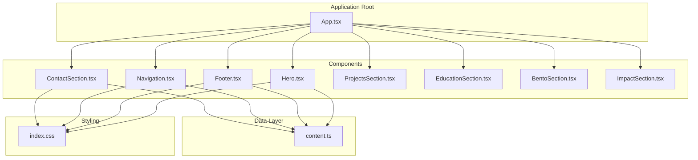
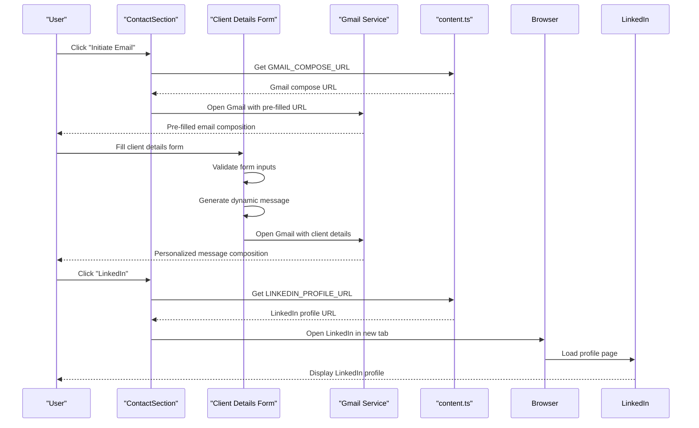
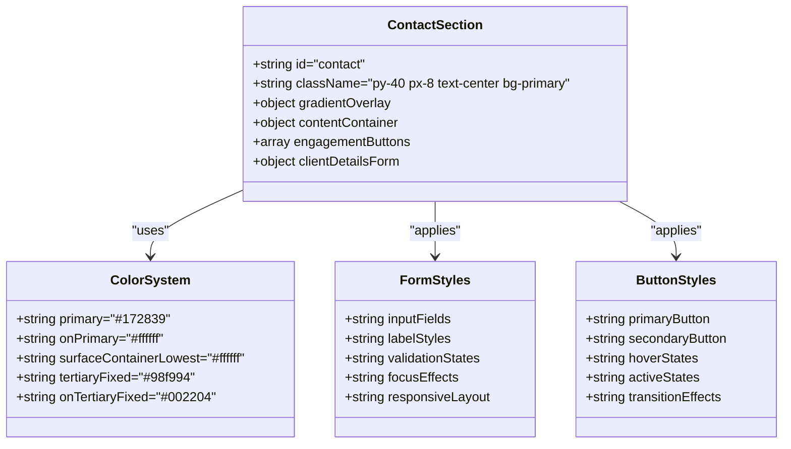
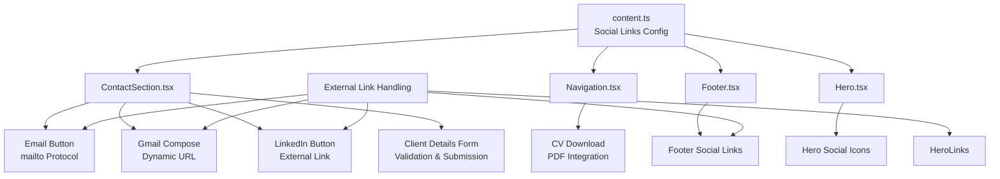
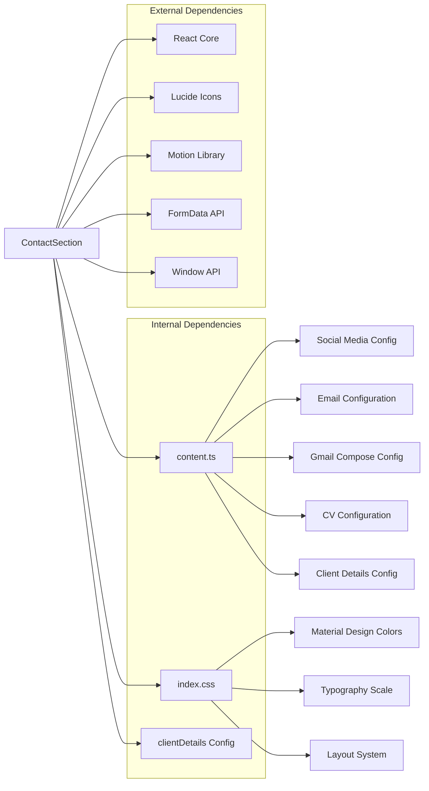

# ContactSection Component

<cite>
**Referenced Files in This Document**
- [ContactSection.tsx](file://src/components/ContactSection.tsx)
- [content.ts](file://src/data/content.ts)
- [App.tsx](file://src/App.tsx)
- [index.css](file://src/index.css)
- [Navigation.tsx](file://src/components/Navigation.tsx)
- [Footer.tsx](file://src/components/Footer.tsx)
- [Hero.tsx](file://src/components/Hero.tsx)
</cite>

## Update Summary
**Changes Made**
- Added comprehensive client details collection system with form validation
- Implemented Gmail integration with dynamic message composition
- Enhanced contact form with responsive design and accessibility features
- Integrated client details configuration for centralized management
- Added dynamic message generation with client information

## Table of Contents
1. [Introduction](#introduction)
2. [Project Structure](#project-structure)
3. [Core Components](#core-components)
4. [Architecture Overview](#architecture-overview)
5. [Detailed Component Analysis](#detailed-component-analysis)
6. [Dependency Analysis](#dependency-analysis)
7. [Performance Considerations](#performance-considerations)
8. [Accessibility Features](#accessibility-features)
9. [Customization Guide](#customization-guide)
10. [Troubleshooting Guide](#troubleshooting-guide)
11. [Conclusion](#conclusion)

## Introduction

The ContactSection component serves as a comprehensive professional engagement hub within the portfolio website, designed to facilitate meaningful connections and networking opportunities for a data analyst professional. This enhanced component now features a sophisticated client details collection system with form validation, Gmail integration, and dynamic message composition capabilities, while maintaining its focus on email integration, LinkedIn connectivity, and downloadable CV functionality.

The component follows modern React patterns with TypeScript integration, leveraging Tailwind CSS for styling and Material Design color systems. It positions itself strategically within the application's navigation flow, appearing as the final major section after the hero presentation and project showcases, now with an expanded engagement framework that captures potential client information for direct follow-up.

## Project Structure

The ContactSection is part of a modular React application architecture with clear separation of concerns:



**Diagram sources**
- [App.tsx:15-32](file://src/App.tsx#L15-L32)
- [ContactSection.tsx:3-38](file://src/components/ContactSection.tsx#L3-L38)
- [content.ts:10-18](file://src/data/content.ts#L10-L18)

**Section sources**
- [App.tsx:15-32](file://src/App.tsx#L15-L32)
- [ContactSection.tsx:3-38](file://src/components/ContactSection.tsx#L3-L38)

## Core Components

### Professional Engagement Options

The ContactSection provides three primary professional engagement pathways:

1. **Direct Email Communication**: Gmail integration with pre-filled message composition
2. **LinkedIn Networking**: Professional networking through LinkedIn profile access
3. **Client Details Collection**: Comprehensive form system for capturing potential client information

The client details collection system represents a significant enhancement, allowing visitors to share their contact information directly through the form, which then generates a personalized message for the data analyst.

### Enhanced Email Integration Patterns

The component now features sophisticated Gmail integration through dynamically generated compose URLs. The system captures client details and constructs personalized messages with proper URL encoding for seamless Gmail integration.

### Downloadable CV Functionality

While the ContactSection focuses on engagement options, the application provides comprehensive CV download functionality through the Navigation component, which includes a dedicated CV download button with PDF integration and accessibility support.

**Section sources**
- [ContactSection.tsx:19-36](file://src/components/ContactSection.tsx#L19-L36)
- [content.ts:87-89](file://src/data/content.ts#L87-L89)
- [content.ts:111-112](file://src/data/content.ts#L111-L112)
- [Navigation.tsx:85-93](file://src/components/Navigation.tsx#L85-L93)

## Architecture Overview

The ContactSection operates within a cohesive component architecture that emphasizes consistency, form validation, and dynamic content generation:



**Diagram sources**
- [ContactSection.tsx:20-33](file://src/components/ContactSection.tsx#L20-L33)
- [ContactSection.tsx:43-59](file://src/components/ContactSection.tsx#L43-L59)
- [content.ts:87-89](file://src/data/content.ts#L87-L89)
- [content.ts:82-83](file://src/data/content.ts#L82-L83)

**Section sources**
- [ContactSection.tsx:1-124](file://src/components/ContactSection.tsx#L1-L124)
- [content.ts:82-112](file://src/data/content.ts#L82-L112)

## Detailed Component Analysis

### Component Structure and Implementation

The ContactSection implements a responsive, visually striking interface with enhanced form functionality and comprehensive client engagement capabilities:

#### Layout and Composition
- Full-width section with centered content alignment
- Gradient background effect with radial gradient overlay
- Responsive typography scaling from mobile to desktop
- Flexible button layout adapting to screen sizes
- Integrated client details collection form with validation

#### Enhanced Styling Architecture
The component utilizes a sophisticated color system with Material Design-inspired theming and includes specialized styling for form elements:



**Diagram sources**
- [ContactSection.tsx:5-36](file://src/components/ContactSection.tsx#L5-L36)
- [index.css:8-31](file://src/index.css#L8-L31)

#### Enhanced Engagement Button Implementation

Each engagement option is implemented as a self-contained button component with consistent design patterns:

**Email Button Features:**
- Primary action with elevated contrast against dark background
- Hover effects transitioning to tertiary color scheme
- Active state scaling for tactile feedback
- Consistent typography and spacing
- Integrated with Gmail compose functionality

**LinkedIn Button Features:**
- Secondary action with border styling
- Transparent background with border outline
- Hover effects with background color transitions
- Active state scaling for interactive feedback

**Client Details Form Features:**
- Comprehensive three-field input system (name, email, phone)
- Real-time form validation with required fields
- Responsive layout adapting to mobile and desktop
- Dynamic message generation with client information
- Seamless Gmail integration for personalized messaging

#### Client Details Collection System

The form system implements robust validation and dynamic content generation:

**Form Validation Features:**
- Required field validation for name and email
- Email format validation for proper email addresses
- Real-time validation feedback
- Accessible error handling

**Dynamic Message Generation:**
- Personalized greeting with recipient name
- Structured client information display
- Professional closing with sender details
- Proper URL encoding for Gmail integration

**Section sources**
- [ContactSection.tsx:19-123](file://src/components/ContactSection.tsx#L19-L123)
- [index.css:8-31](file://src/index.css#L8-L31)

### Social Media Link Handling

The component integrates seamlessly with the broader social media ecosystem through centralized configuration management:



**Diagram sources**
- [content.ts:82-106](file://src/data/content.ts#L82-L106)
- [ContactSection.tsx:1-124](file://src/components/ContactSection.tsx#L1-L124)

**Section sources**
- [content.ts:82-112](file://src/data/content.ts#L82-L112)
- [ContactSection.tsx:1-124](file://src/components/ContactSection.tsx#L1-L124)

## Dependency Analysis

### Component Dependencies

The ContactSection maintains minimal but strategic dependencies with enhanced form processing capabilities:



**Diagram sources**
- [ContactSection.tsx:1](file://src/components/ContactSection.tsx#L1)
- [content.ts:1-134](file://src/data/content.ts#L1-L134)
- [index.css:1-71](file://src/index.css#L1-L71)

### Integration Points

The component participates in several key integration patterns:

1. **Navigation Integration**: Appears as the final major section in the main application flow
2. **Content Management**: Centralized configuration through content.ts module with enhanced client details
3. **Styling Consistency**: Unified color system and design tokens
4. **Accessibility Compliance**: Standardized ARIA attributes and keyboard navigation
5. **Form Processing**: Native browser FormData API for client details collection
6. **External Service Integration**: Gmail compose URL generation for seamless email creation

**Section sources**
- [App.tsx:15-32](file://src/App.tsx#L15-L32)
- [content.ts:10-18](file://src/data/content.ts#L10-L18)

## Performance Considerations

### Rendering Performance

The ContactSection is designed for optimal performance through several mechanisms:

- **Static Content**: Minimal dynamic rendering reduces unnecessary re-renders
- **CSS Transitions**: Hardware-accelerated hover effects minimize JavaScript overhead
- **Responsive Design**: Mobile-first approach ensures efficient rendering across devices
- **Form Validation**: Client-side validation prevents unnecessary server requests
- **Lazy Loading**: Form elements load efficiently without blocking initial render
- **Image Optimization**: Leverages browser-native lazy loading and aspect ratio preservation

### Bundle Size Impact

The component contributes minimally to bundle size due to:
- Lightweight implementation with minimal dependencies
- Shared dependency usage across other components
- Efficient CSS class usage without inline styles
- Native browser APIs for form processing (FormData, window.open)

### Form Processing Performance

The client details collection system optimizes performance through:
- Immediate client-side validation preventing invalid submissions
- Efficient URL construction for Gmail integration
- Minimal DOM manipulation during form interactions
- Optimized event handling for form submission

**Section sources**
- [ContactSection.tsx:43-59](file://src/components/ContactSection.tsx#L43-L59)

## Accessibility Features

### Enhanced Keyboard Navigation

The component supports full keyboard interaction across all engagement options:
- Tab navigation through engagement buttons and form fields
- Enter/Space activation for all interactive elements
- Focus indicators for screen reader compatibility
- Logical tab order through form fields and buttons

### Comprehensive Screen Reader Support

Accessibility enhancements include:
- Semantic HTML structure with proper heading hierarchy
- Descriptive link text for engagement options
- ARIA-compliant button semantics
- Form field labeling with associated labels
- Error message announcements for validation failures
- Focus management for form interactions

### Color Contrast and Visual Design

The component maintains WCAG compliance through:
- High contrast ratios between text and backgrounds
- Sufficient color differentiation for interactive states
- Accessible color combinations following Material Design guidelines
- Clear visual feedback for form validation states
- Focus indicators for keyboard navigation

### Form Accessibility Features

The client details form includes specialized accessibility features:
- Required field indicators for screen readers
- Error message association with form fields
- Proper input type specifications (text, email, tel)
- Placeholder text as hints rather than labels
- Focus management for form completion

**Section sources**
- [ContactSection.tsx:63-117](file://src/components/ContactSection.tsx#L63-L117)
- [index.css:8-31](file://src/index.css#L8-L31)

## Customization Guide

### Adding New Contact Methods

To add new contact engagement options, follow these steps:

1. **Update Content Configuration**: Add new contact method to the content.ts file
2. **Extend Component Logic**: Modify ContactSection.tsx to include new button
3. **Maintain Styling Consistency**: Apply existing design patterns and color schemes

Example implementation pattern for adding a new contact method:

```typescript
// Step 1: Add to content.ts
export const NEW_CONTACT_METHOD = "https://platform.example.com/profile";

// Step 2: Update ContactSection.tsx
<a
  href={NEW_CONTACT_METHOD}
  className="button-style-class"
>
  New Contact Method
</a>
```

### Customizing Contact Styling

The component's styling can be customized through:

1. **Color System Modifications**: Update color tokens in index.css
2. **Typography Adjustments**: Modify font families and sizing scales
3. **Layout Variations**: Adjust spacing and responsive breakpoints
4. **Animation Effects**: Customize hover and active state transitions
5. **Form Field Styling**: Modify input field appearance and validation states

### Implementing Additional Engagement Channels

To expand engagement capabilities:

1. **Platform Integration**: Add support for additional professional platforms
2. **Advanced Form Processing**: Implement contact forms with backend processing
3. **Real-time Communication**: Integrate chat or messaging systems
4. **Event Scheduling**: Add calendar integration for meetings
5. **Multi-step Forms**: Implement progressive disclosure for complex inquiries

### Enhancing Client Details Collection

To improve the client details collection system:

1. **Additional Fields**: Add more detailed client information capture
2. **Advanced Validation**: Implement custom validation rules
3. **Dynamic Content**: Add conditional fields based on user input
4. **Integration Options**: Connect with CRM or email marketing platforms
5. **Analytics Tracking**: Add form submission analytics and conversion tracking

**Section sources**
- [content.ts:82-112](file://src/data/content.ts#L82-L112)
- [ContactSection.tsx:19-123](file://src/components/ContactSection.tsx#L19-L123)

## Troubleshooting Guide

### Common Issues and Solutions

**Email Button Not Working**
- Verify mailto URL format in content.ts
- Check browser email client configuration
- Ensure proper href attribute binding
- Test Gmail compose URL construction

**LinkedIn Button Opens Incorrectly**
- Confirm URL format in content.ts
- Verify external link handling implementation
- Test in different browsers and environments

**Client Details Form Issues**
- Verify form field names match FormData keys
- Check browser FormData API support
- Ensure proper URL encoding for Gmail integration
- Test form validation logic

**Gmail Integration Problems**
- Verify Gmail compose URL format
- Check browser popup blocker settings
- Ensure proper URL encoding for special characters
- Test with different Gmail configurations

**Styling Issues**
- Check Tailwind CSS class precedence
- Verify color system configuration
- Ensure responsive breakpoint adjustments
- Test form field styling across different browsers

**Accessibility Concerns**
- Test keyboard navigation thoroughly
- Validate screen reader compatibility
- Check color contrast ratios across themes
- Verify form field labeling and error handling

### Performance Optimization Tips

- Minimize external dependencies for improved load times
- Optimize image assets and gradients
- Consider lazy loading for heavy animations
- Monitor bundle size growth with new features
- Implement form debouncing for large datasets
- Optimize Gmail URL construction for better performance

**Section sources**
- [content.ts:82-112](file://src/data/content.ts#L82-L112)
- [ContactSection.tsx:19-123](file://src/components/ContactSection.tsx#L19-L123)

## Conclusion

The ContactSection component exemplifies effective professional engagement design through its comprehensive approach to contact interactions. The enhanced component now features a sophisticated client details collection system with form validation, Gmail integration, and dynamic message composition, while successfully maintaining its focus on email integration, LinkedIn connectivity, and CV download functionality.

The component's modular architecture, centralized configuration management, and consistent design patterns enable easy customization and extension for future professional development needs. The addition of the client details collection system significantly enhances the component's ability to facilitate meaningful professional connections by capturing potential client information and generating personalized messages for direct follow-up.

Its integration within the broader application ecosystem demonstrates thoughtful consideration of user experience flow and navigation continuity. Through careful attention to accessibility, responsive design, performance optimization, and comprehensive form processing, the ContactSection serves as both a functional contact hub and a showcase of modern React development practices, positioning it effectively for networking opportunities in the data analytics professional community.

The component's evolution from a simple contact hub to a comprehensive engagement platform reflects the growing complexity of professional networking in the digital age, while maintaining the clean, accessible interface that makes it effective for its intended purpose.