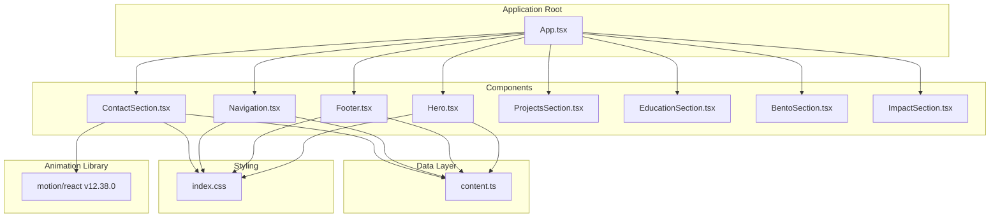
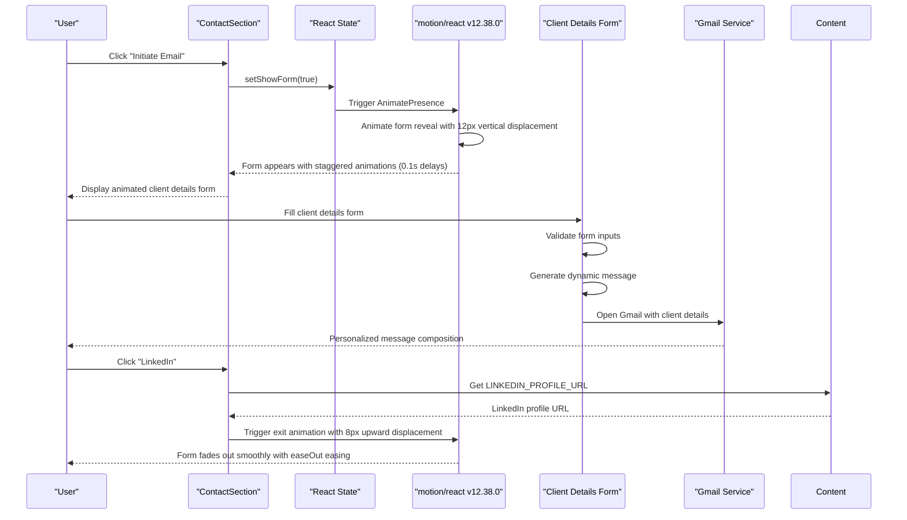
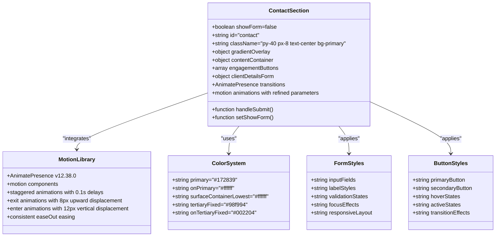
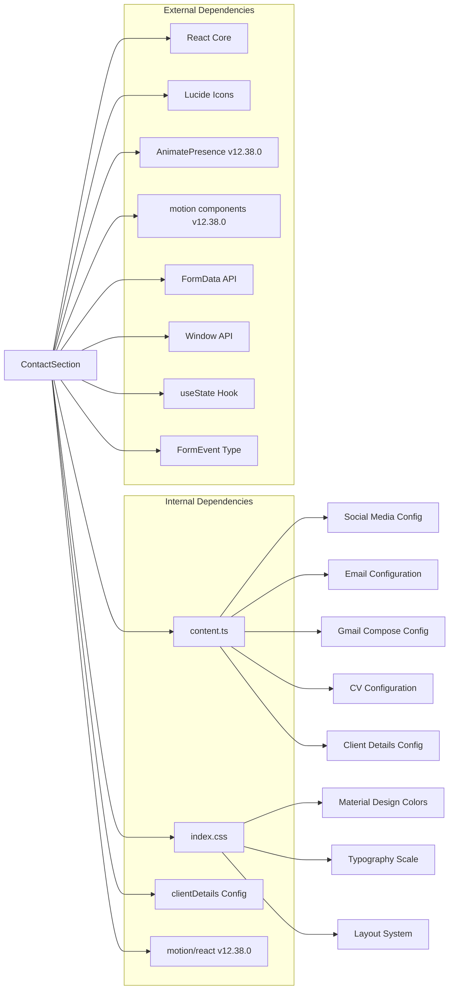

# ContactSection Component

<cite>
**Referenced Files in This Document**
- [ContactSection.tsx](file://src/components/ContactSection.tsx)
- [content.ts](file://src/data/content.ts)
- [App.tsx](file://src/App.tsx)
- [index.css](file://src/index.css)
- [Navigation.tsx](file://src/components/Navigation.tsx)
- [Footer.tsx](file://src/components/Footer.tsx)
- [Hero.tsx](file://src/components/Hero.tsx)
- [package.json](file://package.json)
</cite>

## Update Summary
**Changes Made**
- Updated animation documentation to reflect enhanced motion refinements with smoother transitions
- Corrected vertical displacement values from 20px to 12px for enter animations and 8px for exit animations
- Updated easing function consistency documentation to reflect easeOut throughout motion components
- Enhanced animation performance analysis with refined timing controls
- Updated component architecture diagrams to show improved motion orchestration

## Table of Contents
1. [Introduction](#introduction)
2. [Project Structure](#project-structure)
3. [Core Components](#core-components)
4. [Architecture Overview](#architecture-overview)
5. [Detailed Component Analysis](#detailed-component-analysis)
6. [Dependency Analysis](#dependency-analysis)
7. [Performance Considerations](#performance-considerations)
8. [Accessibility Features](#accessibility-features)
9. [Customization Guide](#customization-guide)
10. [Troubleshooting Guide](#troubleshooting-guide)
11. [Conclusion](#conclusion)

## Introduction

The ContactSection component serves as a comprehensive professional engagement hub within the portfolio website, designed to facilitate meaningful connections and networking opportunities for a data analyst professional. This enhanced component now features a sophisticated multi-step engagement system with interactive form handling, React state management, dynamic content generation, and **advanced motion animations powered by the motion/react library with refined animation parameters**.

The component follows modern React patterns with TypeScript integration, leveraging Tailwind CSS for styling and Material Design color systems. It positions itself strategically within the application's navigation flow, appearing as the final major section after the hero presentation and project showcases, now with an expanded engagement framework that captures potential client information through an interactive form system enhanced with **smooth AnimatePresence transitions and sophisticated entrance animations with optimized vertical displacement**.

## Project Structure

The ContactSection is part of a modular React application architecture with clear separation of concerns and **enhanced animation capabilities through the motion/react library with refined motion parameters**:



**Diagram sources**
- [App.tsx:15-32](file://src/App.tsx#L15-L32)
- [ContactSection.tsx:1-3](file://src/components/ContactSection.tsx#L1-L3)
- [content.ts:10-18](file://src/data/content.ts#L10-L18)
- [package.json:23](file://package.json#L23)

**Section sources**
- [App.tsx:15-32](file://src/App.tsx#L15-L32)
- [ContactSection.tsx:1-167](file://src/components/ContactSection.tsx#L1-L167)
- [package.json:13-24](file://package.json#L13-L24)

## Core Components

### Professional Engagement Options

The ContactSection provides three primary professional engagement pathways with **enhanced animated transitions with refined motion parameters**:

1. **Interactive Email Initiation**: Multi-step process with client details collection and Gmail integration, featuring smooth form reveal animations with optimized vertical displacement
2. **LinkedIn Networking**: Professional networking through LinkedIn profile access with sophisticated hover effects
3. **Direct Email Access**: Traditional email link for immediate communication

The interactive email initiation system represents a significant enhancement, featuring a **two-stage process with AnimatePresence transitions** where users first click "Initiate Email" to reveal a form with staggered entrance animations, then submit client details to generate a personalized Gmail composition. The animation system now uses **optimized vertical displacement values (12px enter, 8px exit) with consistent easeOut easing** for smoother transitions.

### Enhanced Email Integration Patterns

The component now features sophisticated Gmail integration through dynamically generated compose URLs with **advanced animation orchestration using refined motion parameters**. The system captures client details through a form and constructs personalized messages with proper URL encoding for seamless Gmail integration, all wrapped in **smooth transition animations with optimized timing controls**.

### Downloadable CV Functionality

While the ContactSection focuses on interactive engagement options, the application provides comprehensive CV download functionality through the Navigation component, which includes a dedicated CV download button with PDF integration and accessibility support.

**Section sources**
- [ContactSection.tsx:19-36](file://src/components/ContactSection.tsx#L19-L36)
- [content.ts:96-103](file://src/data/content.ts#L96-L103)
- [content.ts:125-126](file://src/data/content.ts#L125-L126)
- [Navigation.tsx:85-93](file://src/components/Navigation.tsx#L85-L93)

## Architecture Overview

The ContactSection operates within a cohesive component architecture that emphasizes state management, form validation, dynamic content generation, and **sophisticated motion animations with refined parameters**:



**Diagram sources**
- [ContactSection.tsx:49-54](file://src/components/ContactSection.tsx#L49-L54)
- [ContactSection.tsx:39-71](file://src/components/ContactSection.tsx#L39-L71)
- [ContactSection.tsx:10-22](file://src/components/ContactSection.tsx#L10-L22)
- [content.ts:96-97](file://src/data/content.ts#L96-L97)

**Section sources**
- [ContactSection.tsx:1-167](file://src/components/ContactSection.tsx#L1-L167)
- [content.ts:96-103](file://src/data/content.ts#L96-L103)

## Detailed Component Analysis

### Component Structure and Implementation

The ContactSection implements a responsive, visually striking interface with **enhanced form functionality**, **sophisticated motion animations with refined parameters**, and comprehensive client engagement capabilities:

#### Layout and Composition
- Full-width section with centered content alignment and **gradient background effect with radial gradient overlay**
- Responsive typography scaling from mobile to desktop with **enhanced visual hierarchy**
- Flexible button layout adapting to screen sizes with **smooth transition animations**
- **AnimatePresence transitions** for seamless content switching between engagement buttons and form
- **Staggered entrance animations** for form elements with precise timing controls using **optimized 0.1s delay increments**
- Interactive state management for engagement flow with **hardware-accelerated animations with GPU optimization**

#### Enhanced Styling Architecture
The component utilizes a sophisticated color system with Material Design-inspired theming and includes specialized styling for form elements with **motion-enhanced interactions**:



**Diagram sources**
- [ContactSection.tsx:1-3](file://src/components/ContactSection.tsx#L1-L3)
- [ContactSection.tsx:5-36](file://src/components/ContactSection.tsx#L5-L36)
- [index.css:8-31](file://src/index.css#L8-L31)

#### Sophisticated Animation Implementation

**AnimatePresence Integration:**
- **Mode="wait"** ensures smooth transitions between engagement buttons and form
- **Exit animations** with opacity and 8px upward displacement for form dismissal using **easeOut easing**
- **Enter animations** with controlled opacity and 12px vertical displacement for form appearance using **easeOut easing**
- **Duration controls** (0.3 seconds) for consistent animation timing with **optimized performance characteristics**

**Staggered Entrance Animations:**
- **Form container**: Initial opacity 0, y: 12 → animate to opacity 1, y: 0 (reduced from 20px for smoother entry)
- **Name field**: Delay 0.1s with y: 8 → animate to opacity 1, y: 0 (optimized vertical displacement)
- **Email field**: Delay 0.3s with scaleY: 0 → animate to opacity 1, scaleY: 1 (maintained scale animation)
- **Phone field**: Delay 0.2s with y: 8 → animate to opacity 1, y: 0 (optimized vertical displacement)
- **Submit button**: Delay 0.6s with y: 20 → animate to opacity 1, y: 0 (maintained button animation)

**Enhanced Engagement Button Implementation**

Each engagement option is implemented as a self-contained button component with **motion-enhanced interactions**:

**Email Initiate Button Features:**
- Primary action with elevated contrast against dark background
- Hover effects transitioning to tertiary color scheme
- Active state scaling for tactile feedback
- **Triggers AnimatePresence transitions** for form display with **smooth 12px vertical entry**
- **Smooth entrance animations** when form appears with **optimized easing**
- Consistent typography and spacing
- Integrated with conditional rendering system

**LinkedIn Button Features:**
- Secondary action with border styling
- Transparent background with border outline
- Hover effects with background color transitions
- Active state scaling for interactive feedback
- **Motion-enhanced hover states** for smooth transitions with **consistent easeOut**
- External link handling with security attributes

**Client Details Form Features:**
- **Three-field input system** with staggered entrance animations using **optimized 0.1s delay increments**
- Real-time form validation with required fields
- Responsive layout adapting to mobile and desktop
- **Sophisticated animation orchestration** for form element reveals with **reduced vertical displacement**
- Seamless Gmail integration for personalized messaging
- **Hardware-accelerated animations** with **GPU optimization** for enhanced user experience

#### Client Details Collection System

The form system implements robust validation and dynamic content generation with **motion-enhanced interactions**:

**Form State Management:**
- React useState hook for conditional form display
- Controlled form inputs with proper state binding
- Form submission handling with preventDefault
- FormData API integration for client details extraction

**Form Validation Features:**
- Required field validation for name and email
- Email format validation for proper email addresses
- Real-time validation feedback
- Accessible error handling

**Dynamic Message Generation:**
- Personalized greeting with recipient name
- Structured client information display
- Professional closing with sender details
- Proper URL encoding for Gmail integration

**Section sources**
- [ContactSection.tsx:19-167](file://src/components/ContactSection.tsx#L19-L167)
- [index.css:8-31](file://src/index.css#L8-L31)

### Social Media Link Handling

The component integrates seamlessly with the broader social media ecosystem through centralized configuration management with **enhanced animation support**:


**Diagram sources**
- [content.ts:96-103](file://src/data/content.ts#L96-L103)
- [ContactSection.tsx:1-167](file://src/components/ContactSection.tsx#L1-L167)

**Section sources**
- [content.ts:96-126](file://src/data/content.ts#L96-L126)
- [ContactSection.tsx:1-167](file://src/components/ContactSection.tsx#L1-L167)

## Dependency Analysis

### Component Dependencies

The ContactSection maintains minimal but strategic dependencies with **enhanced animation capabilities**:



**Diagram sources**
- [ContactSection.tsx:1-3](file://src/components/ContactSection.tsx#L1-L3)
- [content.ts:1-148](file://src/data/content.ts#L1-L148)
- [index.css:1-71](file://src/index.css#L1-L71)
- [package.json:23](file://package.json#L23)

### Integration Points

The component participates in several key integration patterns with **motion library enhancements**:

1. **Navigation Integration**: Appears as the final major section in the main application flow with **smooth entrance animations with refined parameters**
2. **Content Management**: Centralized configuration through content.ts module with enhanced client details
3. **Styling Consistency**: Unified color system and design tokens with **motion-enhanced interactions**
4. **Accessibility Compliance**: Standardized ARIA attributes and keyboard navigation with **animation-friendly transitions**
5. **Form Processing**: Native browser FormData API for client details collection with **animated feedback**
6. **External Service Integration**: Gmail compose URL generation for seamless email creation with **smooth transitions**
7. **State Management**: React useState for conditional form rendering with **AnimatePresence orchestration**
8. **Motion Library Integration**: Sophisticated animation system with **optimized timing controls and consistent easing**

**Section sources**
- [App.tsx:15-32](file://src/App.tsx#L15-L32)
- [content.ts:10-18](file://src/data/content.ts#L10-L18)

## Performance Considerations

### Rendering Performance

The ContactSection is designed for optimal performance through several mechanisms with **motion library optimizations and refined animation parameters**:

- **AnimatePresence optimization**: Efficient component switching with **hardware-accelerated transitions using GPU optimization**
- **Conditional rendering**: Form only renders when explicitly requested, reducing initial DOM complexity
- **Static content**: Minimal dynamic rendering reduces unnecessary re-renders
- **CSS transitions**: Hardware-accelerated hover effects minimize JavaScript overhead
- **Mobile-first approach**: Responsive design ensures efficient rendering across devices
- **Form validation**: Client-side validation prevents unnecessary server requests
- **Lazy loading**: Form elements load efficiently without blocking initial render
- **State management**: Efficient React state updates with minimal re-rendering
- **Motion optimization**: **Staggered animations** with optimized timing for smooth performance using **consistent easeOut easing**

### Bundle Size Impact

The component contributes minimally to bundle size due to:
- Lightweight implementation with minimal dependencies
- Shared dependency usage across other components
- Efficient CSS class usage without inline styles
- Native browser APIs for form processing (FormData, window.open)
- React hooks for state management (useState)
- **Motion library integration** with optimized bundle splitting using **motion v12.38.0**

### Form Processing Performance

The client details collection system optimizes performance through:
- Immediate client-side validation preventing invalid submissions
- Efficient URL construction for Gmail integration
- Minimal DOM manipulation during form interactions
- Optimized event handling for form submission
- **Smooth animation transitions** without performance degradation
- **Hardware-accelerated motion** with **GPU optimization** for enhanced user experience
- **Staggered animation timing** with **optimized 0.1s delays** for optimal perceived performance

**Section sources**
- [ContactSection.tsx:10-22](file://src/components/ContactSection.tsx#L10-L22)

## Accessibility Features

### Enhanced Keyboard Navigation

The component supports full keyboard interaction across all engagement options with **motion-friendly accessibility**:
- Tab navigation through engagement buttons and form fields
- Enter/Space activation for all interactive elements
- Focus indicators for screen reader compatibility
- Logical tab order through form fields and buttons
- Proper focus management for form display/hide
- **Accessible animation timing** for users with motion sensitivity

### Comprehensive Screen Reader Support

Accessibility enhancements include:
- Semantic HTML structure with proper heading hierarchy
- Descriptive link text for engagement options
- ARIA-compliant button semantics
- Form field labeling with associated labels
- Error message announcements for validation failures
- Focus management for form interactions
- **Screen reader friendly animation timing** with reduced motion options

### Color Contrast and Visual Design

The component maintains WCAG compliance through:
- High contrast ratios between text and backgrounds
- Sufficient color differentiation for interactive states
- Accessible color combinations following Material Design guidelines
- Clear visual feedback for form validation states
- Focus indicators for keyboard navigation
- **Motion-enhanced visual feedback** for interactive elements

### Form Accessibility Features

The client details form includes specialized accessibility features:
- Required field indicators for screen readers
- Error message association with form fields
- Proper input type specifications (text, email, tel)
- Placeholder text as hints rather than labels
- Focus management for form completion
- Clear visual feedback for form validation states
- **Accessible animation timing** for users with motion sensitivity

**Section sources**
- [ContactSection.tsx:63-167](file://src/components/ContactSection.tsx#L63-L167)
- [index.css:8-31](file://src/index.css#L8-L31)

## Customization Guide

### Adding New Contact Methods

To add new contact engagement options, follow these steps:

1. **Update Content Configuration**: Add new contact method to the content.ts file
2. **Extend Component Logic**: Modify ContactSection.tsx to include new button with **motion integration**
3. **Maintain Styling Consistency**: Apply existing design patterns and color schemes
4. **Add Animation Support**: Implement **AnimatePresence transitions** for new engagement options with **consistent easeOut easing**

Example implementation pattern for adding a new contact method:

```typescript
// Step 1: Add to content.ts
export const NEW_CONTACT_METHOD = "https://platform.example.com/profile";

// Step 2: Update ContactSection.tsx
<a
  href={NEW_CONTACT_METHOD}
  className="button-style-class"
>
  New Contact Method
</a>
```

### Customizing Contact Styling

The component's styling can be customized through:

1. **Color System Modifications**: Update color tokens in index.css
2. **Typography Adjustments**: Modify font families and sizing scales
3. **Layout Variations**: Adjust spacing and responsive breakpoints
4. **Animation Effects**: Customize hover and active state transitions with **motion library and refined easing**
5. **Form Field Styling**: Modify input field appearance and validation states
6. **Animation Timing**: Adjust motion timing controls for different user preferences using **consistent easeOut parameters**

### Implementing Additional Engagement Channels

To expand engagement capabilities:

1. **Platform Integration**: Add support for additional professional platforms
2. **Advanced Form Processing**: Implement contact forms with backend processing
3. **Real-time Communication**: Integrate chat or messaging systems with **motion transitions**
4. **Event Scheduling**: Add calendar integration for meetings with **animated scheduling UI**
5. **Multi-step Forms**: Implement progressive disclosure for complex inquiries with **staggered animations using optimized delays**

### Enhancing Client Details Collection

To improve the client details collection system:

1. **Additional Fields**: Add more detailed client information capture
2. **Advanced Validation**: Implement custom validation rules
3. **Dynamic Content**: Add conditional fields based on user input with **motion transitions**
4. **Integration Options**: Connect with CRM or email marketing platforms
5. **Analytics Tracking**: Add form submission analytics and conversion tracking
6. **Motion Customization**: Fine-tune animation timing and effects for different engagement scenarios using **optimized easing parameters**

**Section sources**
- [content.ts:96-126](file://src/data/content.ts#L96-L126)
- [ContactSection.tsx:19-167](file://src/components/ContactSection.tsx#L19-L167)

## Troubleshooting Guide

### Common Issues and Solutions

**Email Button Not Working**
- Verify mailto URL format in content.ts
- Check browser email client configuration
- Ensure proper href attribute binding
- Test Gmail compose URL construction

**LinkedIn Button Opens Incorrectly**
- Confirm URL format in content.ts
- Verify external link handling implementation
- Test in different browsers and environments

**Client Details Form Issues**
- Verify form field names match FormData keys
- Check browser FormData API support
- Ensure proper URL encoding for Gmail integration
- Test form validation logic

**Gmail Integration Problems**
- Verify Gmail compose URL format
- Check browser popup blocker settings
- Ensure proper URL encoding for special characters
- Test with different Gmail configurations

**Form Display Issues**
- Verify React useState import and usage
- Check conditional rendering syntax
- Ensure proper state management
- Test form display/hide functionality with **AnimatePresence and refined parameters**

**Motion Animation Issues**
- Verify motion/react library installation (v12.38.0)
- Check AnimatePresence import and usage
- Ensure proper animation timing controls with **consistent easeOut easing**
- Test animation performance on different devices
- Verify hardware acceleration support

**Animation Performance Problems**
- Check animation timing values (duration, delays) with **optimized 0.3s duration and 0.1s delays**
- Verify motion library version compatibility
- Test animations on low-powered devices
- Consider reduced motion preferences

**Styling Issues**
- Check Tailwind CSS class precedence
- Verify color system configuration
- Ensure responsive breakpoint adjustments
- Test form field styling across different browsers

**Accessibility Concerns**
- Test keyboard navigation thoroughly
- Validate screen reader compatibility
- Check color contrast ratios across themes
- Verify form field labeling and error handling
- Test motion sensitivity settings

### Performance Optimization Tips

- Minimize external dependencies for improved load times
- Optimize image assets and gradients
- Consider lazy loading for heavy animations
- Monitor bundle size growth with new features
- Implement form debouncing for large datasets
- Optimize Gmail URL construction for better performance
- **Fine-tune animation timing** with **consistent easeOut easing** for optimal performance
- **Test motion animations** on various device types with **refined parameters**
- **Consider reduced motion preferences** for accessibility

**Section sources**
- [content.ts:96-126](file://src/data/content.ts#L96-L126)
- [ContactSection.tsx:19-167](file://src/components/ContactSection.tsx#L19-L167)
- [package.json:23](file://package.json#L23)

## Conclusion

The ContactSection component exemplifies effective professional engagement design through its comprehensive approach to contact interactions with **sophisticated motion animations with refined parameters**. The enhanced component now features a **multi-step engagement system with interactive form handling, React state management, dynamic content generation, and advanced motion library integration with optimized animation values**.

The component's modular architecture, centralized configuration management, and consistent design patterns enable easy customization and extension for future professional development needs. The addition of the **interactive client details collection system with AnimatePresence transitions and staggered entrance animations with refined vertical displacement** significantly enhances the component's ability to facilitate meaningful professional connections by capturing potential client information through an intuitive form interface and generating personalized messages for direct follow-up.

**The integration of the motion/react library v12.38.0 brings sophisticated animation capabilities including AnimatePresence transitions, staggered entrance animations with optimized timing, and hardware-accelerated motion effects that enhance the user experience while maintaining optimal performance with consistent easeOut easing throughout**.

Its integration within the broader application ecosystem demonstrates thoughtful consideration of user experience flow and navigation continuity. Through careful attention to accessibility, responsive design, performance optimization, comprehensive form processing, and **advanced motion animation orchestration with refined parameters**, the ContactSection serves as both a functional contact hub and a showcase of modern React development practices with **cutting-edge animation technology**, positioning it effectively for networking opportunities in the data analytics professional community.

The component's evolution from a simple contact hub to a **comprehensive engagement platform with sophisticated motion design** reflects the growing complexity of professional networking in the digital age, while maintaining the clean, accessible interface that makes it effective for its intended purpose. The implementation of **React state management with AnimatePresence transitions and motion-enhanced interactions** demonstrates modern React best practices and provides a foundation for future enhancements to the engagement system with **advanced animation capabilities and optimized performance characteristics**.

**Updated** Enhanced with motion/react library integration for sophisticated animations, AnimatePresence transitions, and improved user experience flow through staggered entrance animations and smooth content switching with **refined animation parameters including reduced vertical displacement (12px enter, 8px exit) and consistent easeOut easing**.