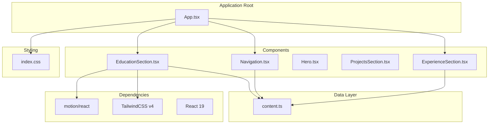
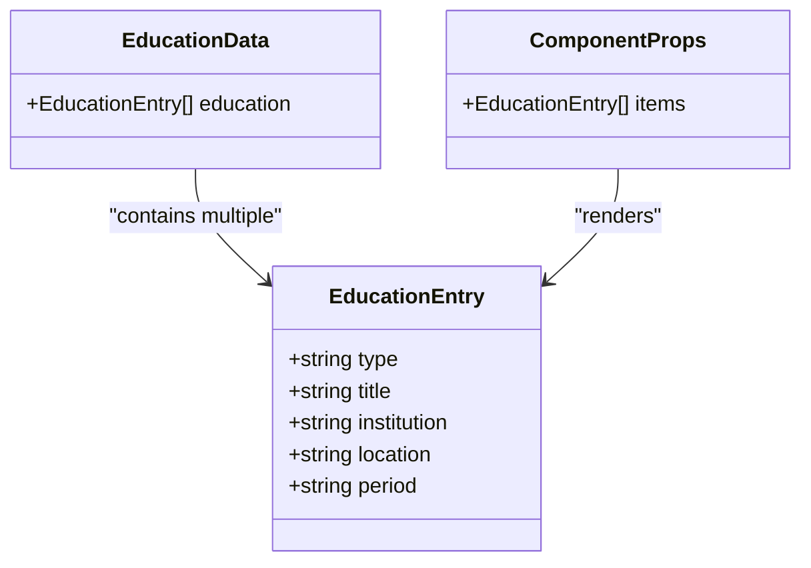
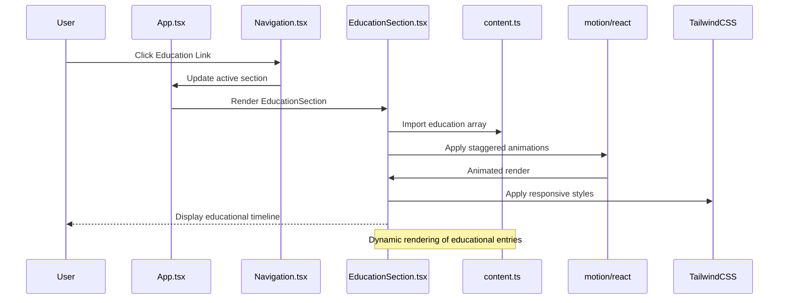
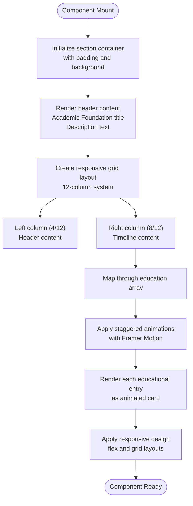
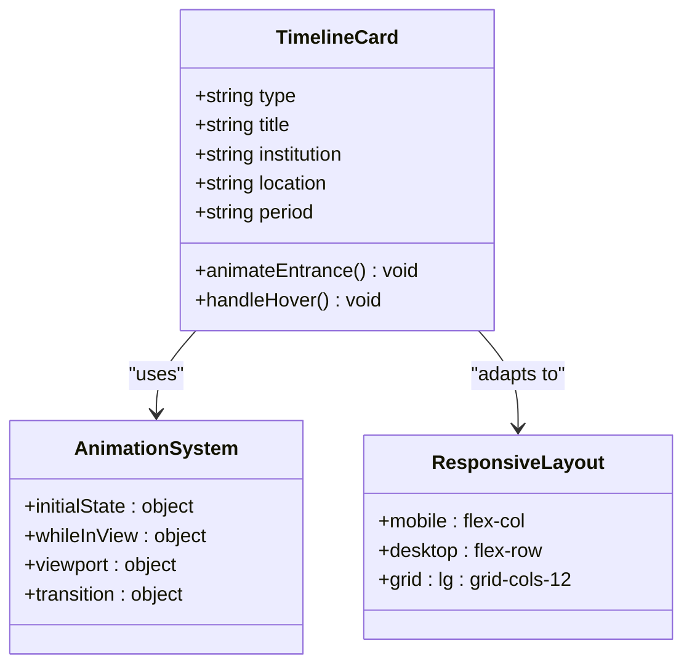
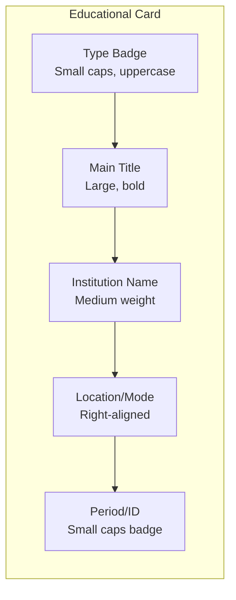
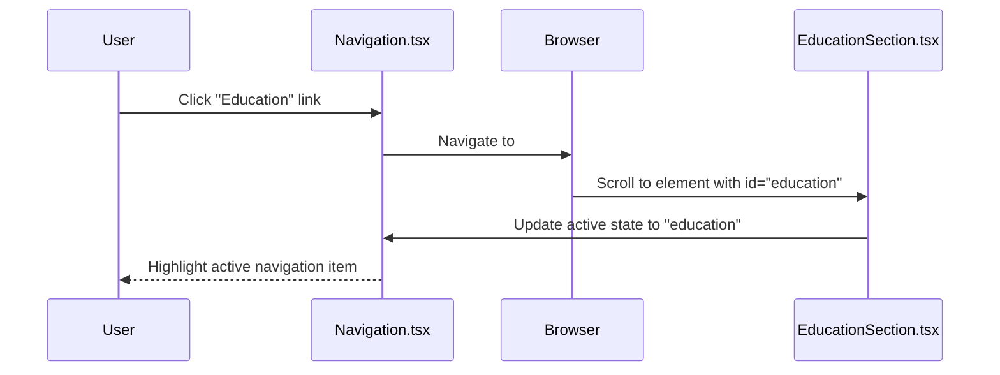
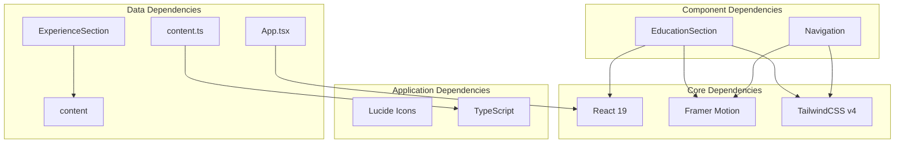
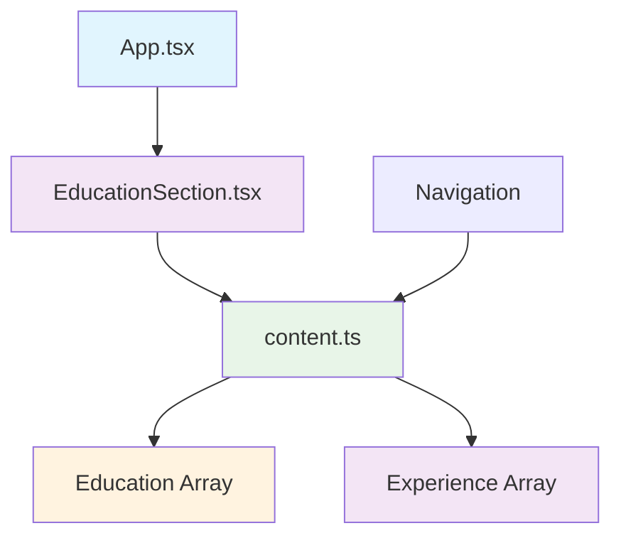

# EducationSection Component

<cite>
**Referenced Files in This Document**
- [EducationSection.tsx](file://src/components/EducationSection.tsx)
- [content.ts](file://src/data/content.ts)
- [App.tsx](file://src/App.tsx)
- [index.css](file://src/index.css)
- [Navigation.tsx](file://src/components/Navigation.tsx)
- [ExperienceSection.tsx](file://src/components/ExperienceSection.tsx)
- [package.json](file://package.json)
</cite>

## Update Summary
**Changes Made**
- Updated anchor navigation section to reflect the corrected section ID implementation
- Enhanced troubleshooting guide with navigation-related debugging steps
- Added comprehensive explanation of proper anchor navigation setup

## Table of Contents
1. [Introduction](#introduction)
2. [Project Structure](#project-structure)
3. [Core Components](#core-components)
4. [Architecture Overview](#architecture-overview)
5. [Detailed Component Analysis](#detailed-component-analysis)
6. [Anchor Navigation and Section IDs](#anchor-navigation-and-section-ids)
7. [Dependency Analysis](#dependency-analysis)
8. [Performance Considerations](#performance-considerations)
9. [Troubleshooting Guide](#troubleshooting-guide)
10. [Conclusion](#conclusion)

## Introduction

The EducationSection component is a specialized React component designed to present academic background and professional certifications in a visually appealing timeline format. This component serves as a crucial element in establishing educational credentials and professional qualifications for data analysts and professionals in the technology field.

The component utilizes modern React patterns including TypeScript interfaces, TailwindCSS styling, and Framer Motion animations to create an engaging user experience. It dynamically renders educational entries with smooth entrance animations and responsive design patterns that adapt to different screen sizes.

**Updated**: The component now features properly configured anchor navigation with the correct section ID `"education"` for seamless page navigation.

## Project Structure

The EducationSection component follows a modular architecture within the portfolio application structure:



**Diagram sources**
- [App.tsx:15-32](file://src/App.tsx#L15-L32)
- [EducationSection.tsx:1-58](file://src/components/EducationSection.tsx#L1-L58)
- [content.ts:38-60](file://src/data/content.ts#L38-L60)
- [ExperienceSection.tsx:1-80](file://src/components/ExperienceSection.tsx#L1-L80)

**Section sources**
- [App.tsx:15-32](file://src/App.tsx#L15-L32)
- [package.json:13-24](file://package.json#L13-L24)

## Core Components

### Educational Data Structure

The EducationSection component expects a specific data structure defined in the content.ts file. The educational entries follow a standardized interface that supports various types of academic and professional credentials:



**Diagram sources**
- [content.ts:58-80](file://src/data/content.ts#L58-L80)

The educational data structure consists of five essential fields:

- **type**: Categorizes the educational credential (e.g., "Post-Graduate Degree", "Certification", "Technical Mastery")
- **title**: The official name of the degree, certificate, or course
- **institution**: The educational institution or provider
- **location**: Geographic location or delivery mode (e.g., "Dublin, IE", "Remote", "Online")
- **period**: Timeframe or credential identifier

**Section sources**
- [content.ts:58-80](file://src/data/content.ts#L58-L80)

## Architecture Overview

The EducationSection component integrates seamlessly with the broader portfolio application architecture:



**Diagram sources**
- [App.tsx:24-25](file://src/App.tsx#L24-L25)
- [EducationSection.tsx:22-51](file://src/components/EducationSection.tsx#L22-L51)
- [content.ts:58-80](file://src/data/content.ts#L58-L80)

The component follows a unidirectional data flow pattern where the App component orchestrates rendering, the EducationSection handles presentation logic, and the content.ts file provides the data layer.

**Section sources**
- [App.tsx:24-25](file://src/App.tsx#L24-L25)
- [EducationSection.tsx:4-57](file://src/components/EducationSection.tsx#L4-L57)

## Detailed Component Analysis

### Component Structure and Layout

The EducationSection component implements a responsive two-column layout that transforms into a single column on smaller screens:



**Diagram sources**
- [EducationSection.tsx:10-55](file://src/components/EducationSection.tsx#L10-L55)

### Timeline Visualization Pattern

The component employs a sophisticated timeline visualization that presents educational entries in chronological order with visual emphasis:



**Diagram sources**
- [EducationSection.tsx:22-51](file://src/components/EducationSection.tsx#L22-L51)

The timeline visualization follows these key patterns:

1. **Staggered Animations**: Each educational entry receives a delayed animation effect using Framer Motion's viewport-based triggers
2. **Visual Hierarchy**: Clear typography hierarchy with bold titles, secondary text, and small caps labels
3. **Responsive Design**: Flexible layout that adapts from desktop grid to mobile stacked cards
4. **Interactive Elements**: Hover effects that enhance user engagement without compromising readability

### Certification Display Patterns

The component supports multiple certification types through the `type` field, enabling different visual treatments:

| Type Category | Visual Indicators | Typical Content |
|---------------|-------------------|-----------------|
| Post-Graduate Degree | Formal academic title | Master's degrees, diplomas |
| Certification | Professional credential | Industry certifications |
| Technical Mastery | Skill-based achievement | Course completion, mastery badges |

**Section sources**
- [EducationSection.tsx:32-48](file://src/components/EducationSection.tsx#L32-L48)
- [content.ts:58-80](file://src/data/content.ts#L58-L80)

### Academic Background Presentation

The component presents academic information through a structured card-based interface:



**Diagram sources**
- [EducationSection.tsx:31-49](file://src/components/EducationSection.tsx#L31-L49)

**Section sources**
- [EducationSection.tsx:31-49](file://src/components/EducationSection.tsx#L31-L49)

## Anchor Navigation and Section IDs

**Updated**: The EducationSection component now features properly configured anchor navigation with the correct section ID.

The component's anchor navigation system is built on a coordinated relationship between three key elements:

### Section ID Configuration

The EducationSection component defines its unique anchor point using the `id` attribute:

```typescript
<section
  id="education"
  className="py-32 px-8 md:px-16 lg:px-24 bg-surface-container-high"
>
```

**Section sources**
- [EducationSection.tsx:6-8](file://src/components/EducationSection.tsx#L6-L8)

### Navigation Link Synchronization

The navigation component maintains a synchronized mapping between link names and section IDs:

```typescript
export const navLinks: {
  name: string;
  href: string;
}[] = [
  { name: "Home", href: "#home" },
  { name: "Experience", href: "#experience" },
  { name: "Projects", href: "#projects" },
  { name: "Education", href: "#education" }, // ✅ Correctly points to education section
  { name: "Contact", href: "#contact" },
];
```

**Section sources**
- [content.ts:10-19](file://src/data/content.ts#L10-L19)

### Active State Management

The Navigation component automatically manages active states based on scroll position:

```typescript
function hrefToSectionId(href: string): string {
  return href.replace(/^#/, ""); // Converts "#education" to "education"
}

// ... scroll event handling ...
for (const id of sectionIds) {
  const el = document.getElementById(id); // ✅ Finds element with id="education"
  // ... positioning logic ...
}
```

**Section sources**
- [Navigation.tsx:6-8](file://src/components/Navigation.tsx#L6-L8)
- [Navigation.tsx:21-29](file://src/components/Navigation.tsx#L21-L29)

### Navigation Flow



**Diagram sources**
- [Navigation.tsx:49-83](file://src/components/Navigation.tsx#L49-L83)
- [EducationSection.tsx:6-8](file://src/components/EducationSection.tsx#L6-L8)

**Section sources**
- [Navigation.tsx:49-83](file://src/components/Navigation.tsx#L49-L83)
- [EducationSection.tsx:6-8](file://src/components/EducationSection.tsx#L6-L8)

## Dependency Analysis

### External Dependencies

The EducationSection component relies on several key external libraries:



**Diagram sources**
- [package.json:13-24](file://package.json#L13-L24)
- [EducationSection.tsx:1](file://src/components/EducationSection.tsx#L1)
- [ExperienceSection.tsx:1](file://src/components/ExperienceSection.tsx#L1)

### Internal Dependencies

The component maintains clean internal dependencies through the data layer pattern:



**Diagram sources**
- [App.tsx:8](file://src/App.tsx#L8)
- [EducationSection.tsx:2](file://src/components/EducationSection.tsx#L2)
- [content.ts:58](file://src/data/content.ts#L58)

**Section sources**
- [package.json:13-24](file://package.json#L13-L24)
- [EducationSection.tsx:1-2](file://src/components/EducationSection.tsx#L1-L2)

## Performance Considerations

### Animation Performance

The component implements efficient animation patterns using Framer Motion's viewport-based triggers:

- **Viewport Trigger**: Animations only activate when elements enter the viewport
- **Staggered Delays**: Sequential animation timing prevents performance bottlenecks
- **Layout Animation**: Smooth transitions without excessive reflows

### Responsive Optimization

The component leverages TailwindCSS utility classes for optimal responsive behavior:

- **Mobile-First Design**: Base styles optimized for smaller screens
- **Grid System**: Efficient 12-column layout for desktop breakpoints
- **Flexible Typography**: Responsive font sizing and spacing

### Memory Management

The component follows React best practices for memory efficiency:

- **Single Render Pass**: Efficient mapping over educational entries
- **Minimal State**: Stateless component with no local state
- **Clean Dependencies**: Proper cleanup of event listeners

## Troubleshooting Guide

### Common Issues and Solutions

**Issue**: Animations not triggering
- **Cause**: Viewport observer not detecting element visibility
- **Solution**: Verify element has proper height and is not hidden
- **Check**: Ensure parent containers have sufficient height

**Issue**: Incorrect data rendering
- **Cause**: Missing required fields in education array
- **Solution**: Verify each entry contains type, title, institution, location, period
- **Check**: Validate TypeScript interface compliance

**Issue**: Styling inconsistencies
- **Cause**: TailwindCSS configuration conflicts
- **Solution**: Check color palette definitions in index.css
- **Verify**: Font family and radius configurations

**Issue**: Responsive layout problems
- **Cause**: Breakpoint conflicts with other components
- **Solution**: Review grid column definitions and media queries
- **Check**: Ensure consistent spacing and padding values

**Issue**: Anchor navigation not working
- **Cause**: Mismatched section ID and navigation link
- **Solution**: Verify EducationSection has `id="education"` matches navigation link
- **Check**: Ensure Navigation component converts `href` to correct `id` format

### Debugging Tips

1. **Console Logging**: Add temporary console.log statements in the education mapping
2. **Props Validation**: Implement runtime validation for educational data
3. **Animation Testing**: Test animations in isolation with static data
4. **Responsive Testing**: Use browser developer tools to test different screen sizes
5. **Navigation Testing**: Use browser dev tools to verify element with `id="education"` exists

**Section sources**
- [EducationSection.tsx:22-51](file://src/components/EducationSection.tsx#L22-L51)
- [content.ts:58-80](file://src/data/content.ts#L58-L80)

## Conclusion

The EducationSection component represents a sophisticated implementation of educational presentation in modern web applications. Through its thoughtful combination of data-driven architecture, responsive design, and smooth animations, it effectively communicates academic achievements and professional qualifications.

The component's strength lies in its modular design that separates concerns between data, presentation, and interaction patterns. This separation enables easy maintenance, extensibility, and consistent user experience across different devices and screen sizes.

**Updated**: The component now features properly configured anchor navigation with the correct section ID `"education"`, ensuring seamless navigation between sections and proper active state management in the navigation bar.

Key architectural strengths include:
- Clean separation of data and presentation logic
- Responsive design patterns that adapt to various screen sizes
- Performance-conscious animation implementation
- Type-safe TypeScript integration
- Consistent styling through TailwindCSS utility classes
- Proper anchor navigation with synchronized section IDs and navigation links

The component successfully establishes educational credentials by presenting information in a clear, hierarchical format that emphasizes institutional reputation, academic achievements, and professional certifications. Its timeline visualization creates a logical narrative flow that helps visitors quickly understand the educational journey and professional development timeline.

Future enhancements could include interactive filtering capabilities, expanded certification metadata support, and integration with external educational databases for dynamic content updates.