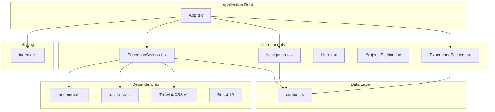
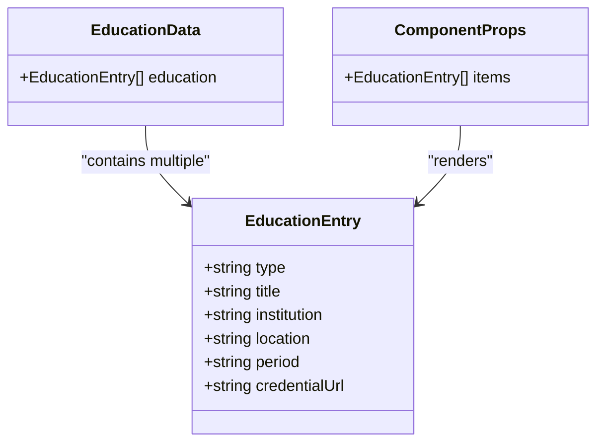
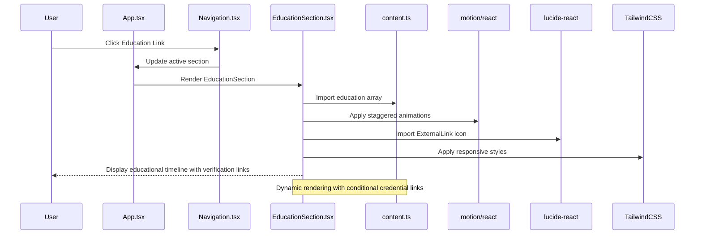
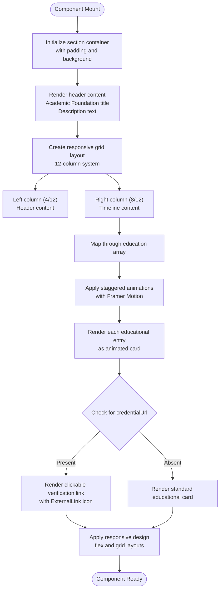
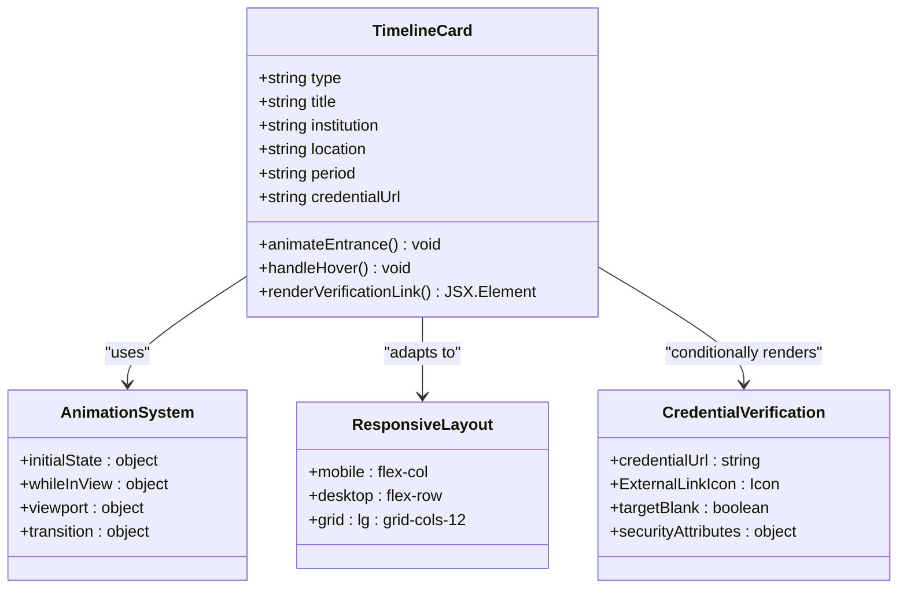
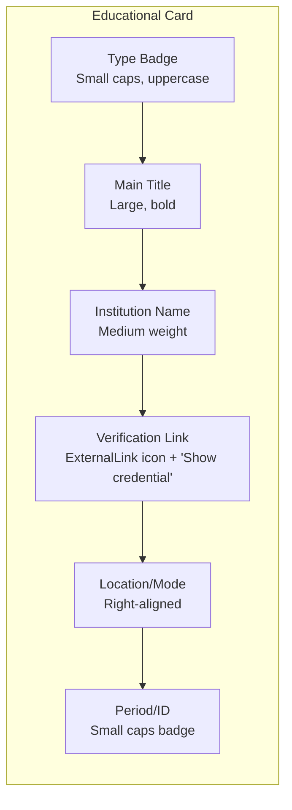
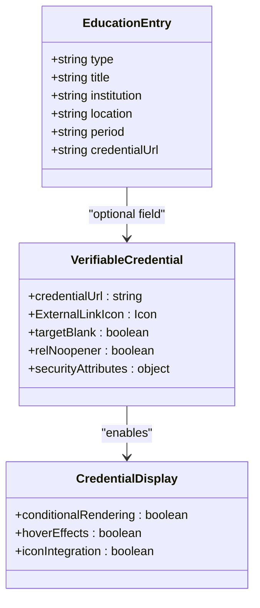
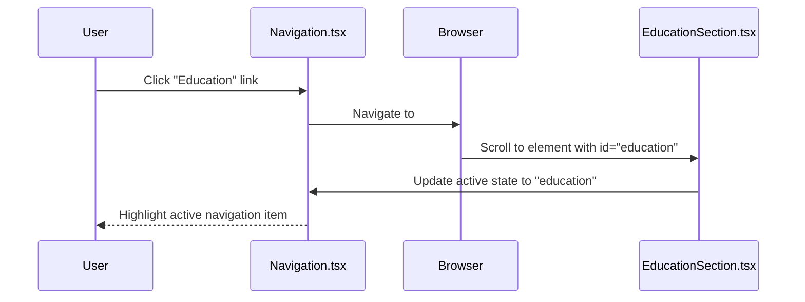
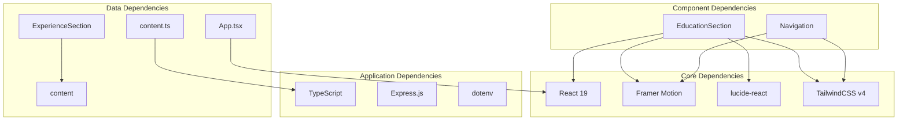
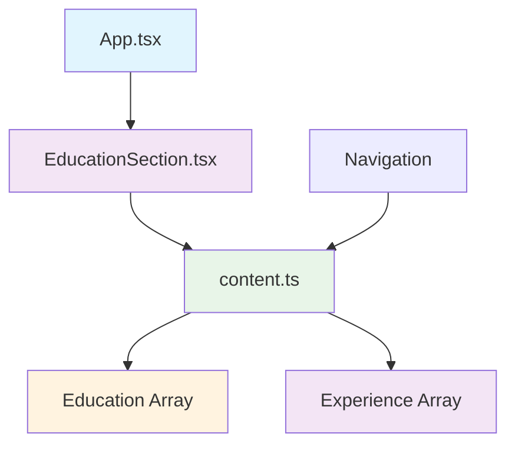

# EducationSection Component

<cite>
**Referenced Files in This Document**
- [EducationSection.tsx](file://src/components/EducationSection.tsx)
- [content.ts](file://src/data/content.ts)
- [App.tsx](file://src/App.tsx)
- [index.css](file://src/index.css)
- [Navigation.tsx](file://src/components/Navigation.tsx)
- [ExperienceSection.tsx](file://src/components/ExperienceSection.tsx)
- [package.json](file://package.json)
</cite>

## Update Summary
**Changes Made**
- Enhanced educational data structure to include optional `credentialUrl` field for verifiable certifications
- Added clickable credential verification links using ExternalLink icon from lucide-react
- Updated component rendering logic to conditionally display verification links
- Integrated proper URL handling with target="_blank" and security attributes
- Added comprehensive examples of verifiable credential URLs for SQL for Data Science and Claude 101 certifications

## Table of Contents
1. [Introduction](#introduction)
2. [Project Structure](#project-structure)
3. [Core Components](#core-components)
4. [Architecture Overview](#architecture-overview)
5. [Detailed Component Analysis](#detailed-component-analysis)
6. [Credential Verification System](#credential-verification-system)
7. [Anchor Navigation and Section IDs](#anchor-navigation-and-section-ids)
8. [Dependency Analysis](#dependency-analysis)
9. [Performance Considerations](#performance-considerations)
10. [Troubleshooting Guide](#troubleshooting-guide)
11. [Conclusion](#conclusion)

## Introduction

The EducationSection component is a specialized React component designed to present academic background and professional certifications in a visually appealing timeline format. This component serves as a crucial element in establishing educational credentials and professional qualifications for data analysts and professionals in the technology field.

The component utilizes modern React patterns including TypeScript interfaces, TailwindCSS styling, and Framer Motion animations to create an engaging user experience. It dynamically renders educational entries with smooth entrance animations and responsive design patterns that adapt to different screen sizes.

**Updated**: The component now features enhanced credential verification capabilities with clickable links for certifications, allowing visitors to validate educational credentials directly from the portfolio.

## Project Structure

The EducationSection component follows a modular architecture within the portfolio application structure:



**Diagram sources**
- [App.tsx:15-32](file://src/App.tsx#L15-L32)
- [EducationSection.tsx:1-3](file://src/components/EducationSection.tsx#L1-L3)
- [content.ts:38-60](file://src/data/content.ts#L38-L60)
- [ExperienceSection.tsx:1-80](file://src/components/ExperienceSection.tsx#L1-L80)
- [package.json:13-24](file://package.json#L13-L24)

**Section sources**
- [App.tsx:15-32](file://src/App.tsx#L15-L32)
- [package.json:13-24](file://package.json#L13-L24)

## Core Components

### Enhanced Educational Data Structure

The EducationSection component expects a comprehensive data structure defined in the content.ts file. The educational entries now support verifiable credentials through an optional `credentialUrl` field:



**Diagram sources**
- [content.ts:58-83](file://src/data/content.ts#L58-L83)

The educational data structure consists of six essential fields:

- **type**: Categorizes the educational credential (e.g., "Post-Graduate Degree", "Certification", "Technical Mastery")
- **title**: The official name of the degree, certificate, or course
- **institution**: The educational institution or provider
- **location**: Geographic location or delivery mode (e.g., "Dublin, IE", "Remote", "Online")
- **period**: Timeframe or credential identifier
- **credentialUrl**: Optional URL for verifiable credentials (added enhancement)

**Section sources**
- [content.ts:58-83](file://src/data/content.ts#L58-L83)

## Architecture Overview

The EducationSection component integrates seamlessly with the broader portfolio application architecture:



**Diagram sources**
- [App.tsx:24-25](file://src/App.tsx#L24-L25)
- [EducationSection.tsx:22-69](file://src/components/EducationSection.tsx#L22-L69)
- [content.ts:58-83](file://src/data/content.ts#L58-L83)

The component follows a unidirectional data flow pattern where the App component orchestrates rendering, the EducationSection handles presentation logic, and the content.ts file provides the data layer with enhanced credential verification capabilities.

**Section sources**
- [App.tsx:24-25](file://src/App.tsx#L24-L25)
- [EducationSection.tsx:4-69](file://src/components/EducationSection.tsx#L4-L69)

## Detailed Component Analysis

### Component Structure and Layout

The EducationSection component implements a responsive two-column layout that transforms into a single column on smaller screens:



**Diagram sources**
- [EducationSection.tsx:10-69](file://src/components/EducationSection.tsx#L10-L69)

### Timeline Visualization Pattern

The component employs a sophisticated timeline visualization that presents educational entries in chronological order with visual emphasis and enhanced credential verification:



**Diagram sources**
- [EducationSection.tsx:22-69](file://src/components/EducationSection.tsx#L22-L69)

The timeline visualization follows these key patterns:

1. **Staggered Animations**: Each educational entry receives a delayed animation effect using Framer Motion's viewport-based triggers
2. **Conditional Credential Links**: Verification links are only rendered when `credentialUrl` is present in the data
3. **Visual Hierarchy**: Clear typography hierarchy with bold titles, secondary text, and small caps labels
4. **Responsive Design**: Flexible layout that adapts from desktop grid to mobile stacked cards
5. **Interactive Elements**: Hover effects that enhance user engagement without compromising readability
6. **Security Compliance**: Proper handling of external links with target="_blank" and security attributes

### Certification Display Patterns

The component supports multiple certification types through the `type` field, with enhanced verification capabilities:

| Type Category | Visual Indicators | Typical Content | Verification Support |
|---------------|-------------------|-----------------|---------------------|
| Post-Graduate Degree | Formal academic title | Master's degrees, diplomas | No verification link |
| Certification | Professional credential | Industry certifications | **✅ Clickable verification link** |
| Technical Mastery | Skill-based achievement | Course completion, mastery badges | **✅ Clickable verification link** |

**Section sources**
- [EducationSection.tsx:32-69](file://src/components/EducationSection.tsx#L32-L69)
- [content.ts:58-83](file://src/data/content.ts#L58-L83)

### Academic Background Presentation

The component presents academic information through a structured card-based interface with enhanced credential verification:



**Diagram sources**
- [EducationSection.tsx:31-61](file://src/components/EducationSection.tsx#L31-L61)

**Section sources**
- [EducationSection.tsx:31-61](file://src/components/EducationSection.tsx#L31-L61)

## Credential Verification System

### Enhanced Data Structure with Verifiable Credentials

The educational data structure now includes optional credential verification URLs:



**Diagram sources**
- [content.ts:66-83](file://src/data/content.ts#L66-L83)
- [EducationSection.tsx:42-52](file://src/components/EducationSection.tsx#L42-L52)

### Implementation Details

The credential verification system is implemented through conditional rendering logic:

```typescript
{item.credentialUrl && (
  <a
    href={item.credentialUrl}
    target="_blank"
    rel="noopener noreferrer"
    className="inline-flex items-center gap-2 mt-2 text-sm font-medium text-tertiary-container hover:text-tertiary-fixed transition-colors"
  >
    <span>Show credential</span>
    <ExternalLink size={14} />
  </a>
)}
```

**Key Features**:
- **Conditional Rendering**: Links only appear when `credentialUrl` is present
- **External Link Handling**: Uses `target="_blank"` for new tab navigation
- **Security Compliance**: Includes `rel="noopener noreferrer"` for security
- **Icon Integration**: Uses ExternalLink icon from lucide-react for visual clarity
- **Accessibility**: Proper text alternatives with "Show credential" label

### Example Credential URLs

The component includes real-world examples of verifiable credentials:

**SQL for Data Science Certification**:
- Platform: Coursera
- URL: `https://www.coursera.org/account/accomplishments/verify/YWV7WCFCFDEC?utm_source=link&utm_medium=certificate&utm_content=cert_image&utm_campaign=sharing_cta&utm_product=course`

**Claude 101 Certification**:
- Platform: Skilljar
- URL: `https://verify.skilljar.com/c/2zoacjan4ehz`

**Section sources**
- [content.ts:66-83](file://src/data/content.ts#L66-L83)
- [EducationSection.tsx:42-52](file://src/components/EducationSection.tsx#L42-L52)

## Anchor Navigation and Section IDs

**Updated**: The EducationSection component now features properly configured anchor navigation with the correct section ID.

The component's anchor navigation system is built on a coordinated relationship between three key elements:

### Section ID Configuration

The EducationSection component defines its unique anchor point using the `id` attribute:

```typescript
<section
  id="education"
  className="py-32 px-8 md:px-16 lg:px-24 bg-surface-container-high"
>
```

**Section sources**
- [EducationSection.tsx:7-9](file://src/components/EducationSection.tsx#L7-L9)

### Navigation Link Synchronization

The navigation component maintains a synchronized mapping between link names and section IDs:

```typescript
export const navLinks: {
  name: string;
  href: string;
}[] = [
  { name: "Home", href: "#home" },
  { name: "Experience", href: "#experience" },
  { name: "Projects", href: "#projects" },
  { name: "Education", href: "#education" }, // ✅ Correctly points to education section
  { name: "Contact", href: "#contact" },
];
```

**Section sources**
- [content.ts:10-19](file://src/data/content.ts#L10-L19)

### Active State Management

The Navigation component automatically manages active states based on scroll position:

```typescript
function hrefToSectionId(href: string): string {
  return href.replace(/^#/, ""); // Converts "#education" to "education"
}

// ... scroll event handling ...
for (const id of sectionIds) {
  const el = document.getElementById(id); // ✅ Finds element with id="education"
  // ... positioning logic ...
}
```

**Section sources**
- [Navigation.tsx:6-8](file://src/components/Navigation.tsx#L6-L8)
- [Navigation.tsx:21-29](file://src/components/Navigation.tsx#L21-L29)

### Navigation Flow



**Diagram sources**
- [Navigation.tsx:49-83](file://src/components/Navigation.tsx#L49-L83)
- [EducationSection.tsx:7-9](file://src/components/EducationSection.tsx#L7-L9)

**Section sources**
- [Navigation.tsx:49-83](file://src/components/Navigation.tsx#L49-L83)
- [EducationSection.tsx:7-9](file://src/components/EducationSection.tsx#L7-L9)

## Dependency Analysis

### External Dependencies

The EducationSection component relies on several key external libraries:



**Diagram sources**
- [package.json:13-24](file://package.json#L13-L24)
- [EducationSection.tsx:1-3](file://src/components/EducationSection.tsx#L1-L3)
- [ExperienceSection.tsx:1](file://src/components/ExperienceSection.tsx#L1)

### Internal Dependencies

The component maintains clean internal dependencies through the data layer pattern:



**Diagram sources**
- [App.tsx:8](file://src/App.tsx#L8)
- [EducationSection.tsx:2](file://src/components/EducationSection.tsx#L2)
- [content.ts:58](file://src/data/content.ts#L58)

**Section sources**
- [package.json:13-24](file://package.json#L13-L24)
- [EducationSection.tsx:1-3](file://src/components/EducationSection.tsx#L1-L3)

## Performance Considerations

### Animation Performance

The component implements efficient animation patterns using Framer Motion's viewport-based triggers:

- **Viewport Trigger**: Animations only activate when elements enter the viewport
- **Staggered Delays**: Sequential animation timing prevents performance bottlenecks
- **Layout Animation**: Smooth transitions without excessive reflows

### Conditional Rendering Optimization

The credential verification links use conditional rendering to minimize DOM overhead:

- **Lazy Loading**: Links are only created when `credentialUrl` is present
- **Memory Efficiency**: No additional state or event handlers for non-verifiable entries
- **DOM Cleanup**: Proper cleanup of event listeners and observers

### Responsive Optimization

The component leverages TailwindCSS utility classes for optimal responsive behavior:

- **Mobile-First Design**: Base styles optimized for smaller screens
- **Grid System**: Efficient 12-column layout for desktop breakpoints
- **Flexible Typography**: Responsive font sizing and spacing

### Security Considerations

The component implements proper security measures for external links:

- **Target Blank**: Prevents tabnabbing attacks
- **Rel Noopener**: Prevents malicious takeover of opener window
- **HTTPS Validation**: Ensures secure credential URL handling

## Troubleshooting Guide

### Common Issues and Solutions

**Issue**: Credential verification links not appearing
- **Cause**: Missing `credentialUrl` field in education data
- **Solution**: Add `credentialUrl` property to certification entries
- **Check**: Verify URL format and accessibility

**Issue**: External links not opening in new tabs
- **Cause**: Missing `target="_blank"` attribute
- **Solution**: Ensure proper external link configuration
- **Verify**: Check security attributes are included

**Issue**: ExternalLink icon not displaying
- **Cause**: lucide-react dependency issues
- **Solution**: Verify lucide-react installation and import
- **Check**: Ensure proper icon sizing and styling

**Issue**: Animations not triggering
- **Cause**: Viewport observer not detecting element visibility
- **Solution**: Verify element has proper height and is not hidden
- **Check**: Ensure parent containers have sufficient height

**Issue**: Incorrect data rendering
- **Cause**: Missing required fields in education array
- **Solution**: Verify each entry contains type, title, institution, location, period
- **Check**: Validate TypeScript interface compliance

**Issue**: Styling inconsistencies
- **Cause**: TailwindCSS configuration conflicts
- **Solution**: Check color palette definitions in index.css
- **Verify**: Font family and radius configurations

**Issue**: Responsive layout problems
- **Cause**: Breakpoint conflicts with other components
- **Solution**: Review grid column definitions and media queries
- **Check**: Ensure consistent spacing and padding values

**Issue**: Anchor navigation not working
- **Cause**: Mismatched section ID and navigation link
- **Solution**: Verify EducationSection has `id="education"` matches navigation link
- **Check**: Ensure Navigation component converts `href` to correct `id` format

### Debugging Tips

1. **Console Logging**: Add temporary console.log statements in the education mapping
2. **Props Validation**: Implement runtime validation for educational data
3. **Animation Testing**: Test animations in isolation with static data
4. **Responsive Testing**: Use browser developer tools to test different screen sizes
5. **Navigation Testing**: Use browser dev tools to verify element with `id="education"` exists
6. **Credential URL Testing**: Manually verify credential URLs are accessible and valid

**Section sources**
- [EducationSection.tsx:22-69](file://src/components/EducationSection.tsx#L22-L69)
- [content.ts:58-83](file://src/data/content.ts#L58-L83)

## Conclusion

The EducationSection component represents a sophisticated implementation of educational presentation in modern web applications. Through its thoughtful combination of data-driven architecture, responsive design, and smooth animations, it effectively communicates academic achievements and professional qualifications.

**Updated**: The component now features enhanced credential verification capabilities that significantly strengthen its professional presentation by allowing visitors to validate educational credentials directly from the portfolio.

The component's strength lies in its modular design that separates concerns between data, presentation, and interaction patterns. This separation enables easy maintenance, extensibility, and consistent user experience across different devices and screen sizes.

**Enhanced Architectural Strengths**:
- Clean separation of data and presentation logic
- Responsive design patterns that adapt to various screen sizes
- Performance-conscious animation implementation
- Type-safe TypeScript integration
- Consistent styling through TailwindCSS utility classes
- Proper anchor navigation with synchronized section IDs and navigation links
- **New**: Conditional credential verification system with ExternalLink icons
- **New**: Security-compliant external link handling
- **New**: Real-world credential URL integration examples

The component successfully establishes educational credentials by presenting information in a clear, hierarchical format that emphasizes institutional reputation, academic achievements, and professional certifications. Its timeline visualization creates a logical narrative flow that helps visitors quickly understand the educational journey and professional development timeline.

The addition of verifiable credential links enhances the component's professional credibility by providing direct access to validation sources. This feature is particularly valuable for data analysts and technology professionals who need to demonstrate their qualifications to potential employers or clients.

Future enhancements could include interactive filtering capabilities, expanded certification metadata support, integration with external educational databases for dynamic content updates, and support for additional verification platforms beyond Coursera and Skilljar.