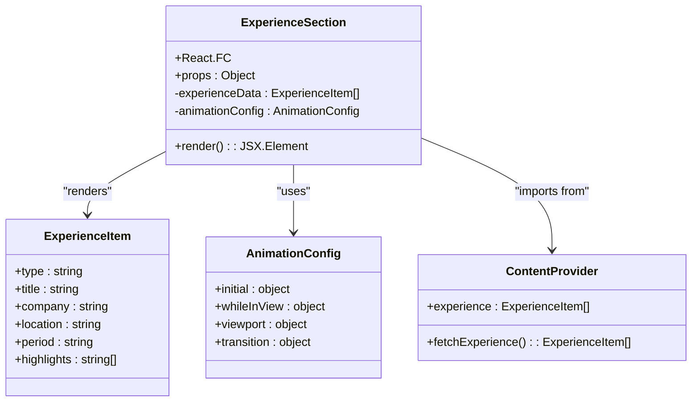
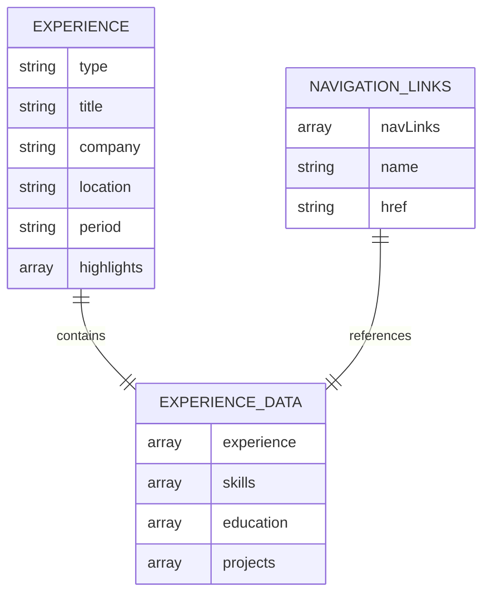
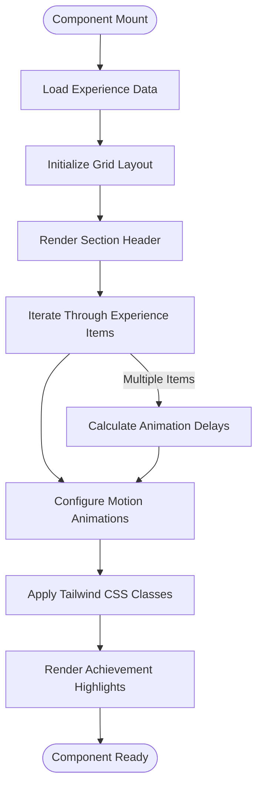
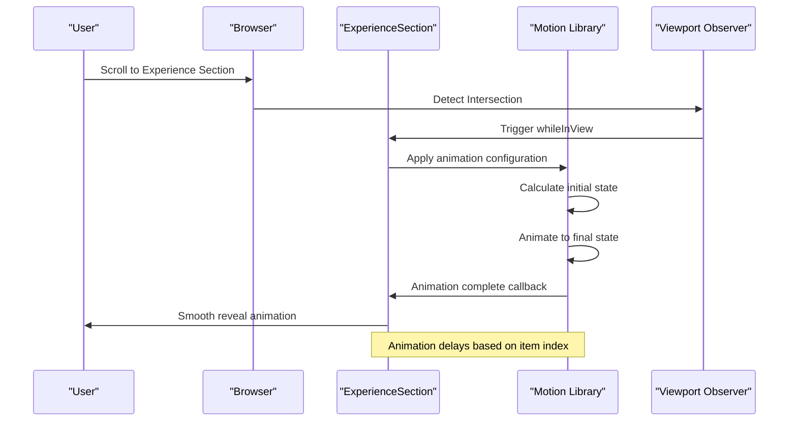
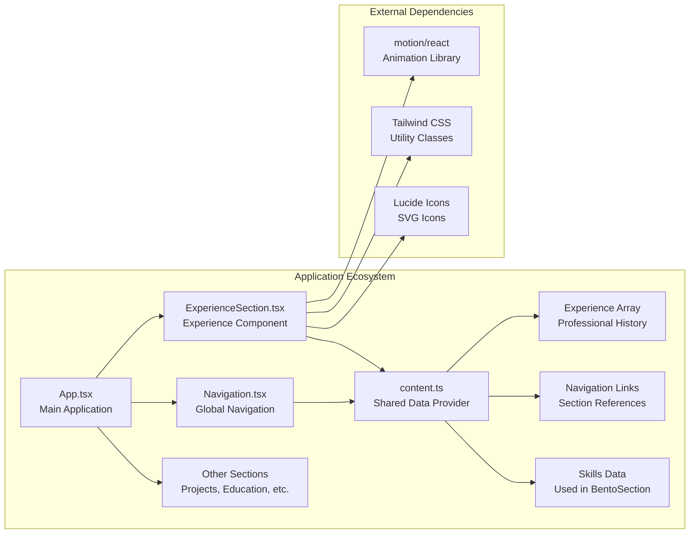

# ExperienceSection Component

<cite>
**Referenced Files in This Document**
- [ExperienceSection.tsx](file://src/components/ExperienceSection.tsx)
- [content.ts](file://src/data/content.ts)
- [App.tsx](file://src/App.tsx)
- [Navigation.tsx](file://src/components/Navigation.tsx)
- [package.json](file://package.json)
</cite>

## Table of Contents
1. [Introduction](#introduction)
2. [Component Architecture](#component-architecture)
3. [Data Structure Analysis](#data-structure-analysis)
4. [Visual Design Implementation](#visual-design-implementation)
5. [Animation and Interaction Patterns](#animation-and-interaction-patterns)
6. [Responsive Layout Strategy](#responsive-layout-strategy)
7. [Integration with Application Ecosystem](#integration-with-application-ecosystem)
8. [Performance Considerations](#performance-considerations)
9. [Accessibility Features](#accessibility-features)
10. [Troubleshooting Guide](#troubleshooting-guide)
11. [Conclusion](#conclusion)

## Introduction

The ExperienceSection component serves as a crucial portfolio element showcasing professional work history and achievements in a modern, data-driven format. Built with React and TypeScript, this component integrates seamlessly with the application's design system while providing dynamic animations and responsive layouts. The component demonstrates best practices in component composition, data-driven rendering, and modern web development patterns.

## Component Architecture

The ExperienceSection follows a modular architecture pattern that separates concerns between presentation, data management, and animation logic. The component utilizes React's functional component model with hooks for state management and effect handling.

**Diagram sources**
- [ExperienceSection.tsx:1-80](file://src/components/ExperienceSection.tsx#L1-L80)
- [content.ts:39-56](file://src/data/content.ts#L39-L56)

The component architecture emphasizes separation of concerns through:

- **Data Layer**: Centralized experience data management in content.ts
- **Presentation Layer**: Pure component rendering logic
- **Animation Layer**: Motion library integration for smooth transitions
- **Layout Layer**: Responsive grid system for adaptive design

**Section sources**
- [ExperienceSection.tsx:4-79](file://src/components/ExperienceSection.tsx#L4-L79)
- [content.ts:39-56](file://src/data/content.ts#L39-L56)

## Data Structure Analysis

The ExperienceSection consumes a structured data model that represents professional experience information. The data structure is designed for scalability and maintainability while supporting various display formats.

**Diagram sources**
- [content.ts:39-56](file://src/data/content.ts#L39-L56)
- [content.ts:10-19](file://src/data/content.ts#L10-L19)

The data structure supports:

- **Hierarchical Organization**: Experience items contain multiple highlight points
- **Flexible Formatting**: Support for various experience types (full-time, part-time, contract)
- **Internationalization Ready**: Location and period fields accommodate global audiences
- **Extensible Schema**: Easy addition of new experience attributes

**Section sources**
- [content.ts:39-56](file://src/data/content.ts#L39-L56)
- [content.ts:10-19](file://src/data/content.ts#L10-L19)

## Visual Design Implementation

The component implements a sophisticated visual design system that prioritizes readability and professional presentation. The design follows modern web standards with careful attention to typography, spacing, and color hierarchy.

**Diagram sources**
- [ExperienceSection.tsx:22-73](file://src/components/ExperienceSection.tsx#L22-L73)

The visual design incorporates:

- **Typography Hierarchy**: Clear distinction between headings, subheadings, and body text
- **Color System**: Consistent use of primary, secondary, and tertiary color schemes
- **Spacing System**: Responsive padding and margin calculations
- **Interactive Elements**: Hover states and transition effects

**Section sources**
- [ExperienceSection.tsx:10-77](file://src/components/ExperienceSection.tsx#L10-L77)

## Animation and Interaction Patterns

The ExperienceSection leverages the Motion library to create engaging micro-interactions that enhance user experience without being distracting. The animation system is carefully tuned to provide smooth transitions while maintaining performance.

**Diagram sources**
- [ExperienceSection.tsx:23-28](file://src/components/ExperienceSection.tsx#L23-L28)

The animation system features:

- **Intersection-Based Triggers**: Animations activate when sections enter the viewport
- **Sequential Delays**: Staggered animations create visual rhythm
- **Performance Optimization**: Configured to run only once per viewport intersection
- **Smooth Transitions**: CSS transforms for optimal performance

**Section sources**
- [ExperienceSection.tsx:23-28](file://src/components/ExperienceSection.tsx#L23-L28)

## Responsive Layout Strategy

The component implements a sophisticated responsive design system that adapts to various screen sizes while maintaining visual consistency and readability. The layout strategy employs a mobile-first approach with progressive enhancement.

```mermaid
graph TB
Container["Main Container<br/>max-w-7xl mx-auto"] --> Desktop["Desktop Layout<br/>lg:grid-cols-12"]
Desktop --> LeftColumn["Left Column<br/>lg:col-span-4"]
Desktop --> RightColumn["Right Column<br/>lg:col-span-8"]
LeftColumn --> Header["Professional Experience Header"]
LeftColumn --> Description["Experience Description"]
RightColumn --> ItemContainer["Experience Item Container<br/>space-y-8"]
ItemContainer --> Item["Individual Experience Item<br/>motion.div"]
Mobile["Mobile Layout<br/>Stacked Columns"] --> HeaderMobile["Header on Top"]
Mobile --> ItemContainerMobile["Items Below Header"]
Item --> ItemContent["Item Content<br/>flex-col md:flex-row"]
ItemContent --> LeftSide["Left Side<br/>Job Details"]
ItemContent --> RightSide["Right Side<br/>Location & Period"]
LeftSide --> TypeBadge["Type Badge<br/>font-label text-[10px]"]
LeftSide --> JobTitle["Job Title<br/>text-2xl md:text-3xl"]
LeftSide --> CompanyName["Company Name<br/>text-on-surface-variant"]
RightSide --> Location["Location<br/>text-base font-bold"]
RightSide --> Period["Period<br/>font-label uppercase"]
```

**Diagram sources**
- [ExperienceSection.tsx:11-74](file://src/components/ExperienceSection.tsx#L11-L74)

The responsive strategy includes:

- **Mobile-First Design**: Base styles optimized for small screens
- **Progressive Enhancement**: Additional styles for larger viewports
- **Flexible Grid System**: CSS Grid with automatic column sizing
- **Adaptive Typography**: Font sizes that scale appropriately across devices

**Section sources**
- [ExperienceSection.tsx:11-74](file://src/components/ExperienceSection.tsx#L11-L74)

## Integration with Application Ecosystem

The ExperienceSection integrates seamlessly with the broader application ecosystem through shared data providers, navigation systems, and design tokens. This integration ensures consistency across the entire portfolio experience.

**Diagram sources**
- [App.tsx:16-34](file://src/App.tsx#L16-L34)
- [Navigation.tsx:10-97](file://src/components/Navigation.tsx#L10-L97)
- [content.ts:10-134](file://src/data/content.ts#L10-L134)

The integration provides:

- **Consistent Navigation**: Experience section accessible via global navigation
- **Shared Data Access**: Centralized data management through content.ts
- **Design System Alignment**: Consistent styling with other components
- **Cross-Component Communication**: Seamless integration with related sections

**Section sources**
- [App.tsx:16-34](file://src/App.tsx#L16-L34)
- [Navigation.tsx:10-97](file://src/components/Navigation.tsx#L10-L97)
- [content.ts:10-134](file://src/data/content.ts#L10-L134)

## Performance Considerations

The ExperienceSection is optimized for performance through several strategic approaches that balance visual appeal with efficient resource usage. These optimizations ensure smooth user experiences across various devices and network conditions.

Key performance optimizations include:

- **Lazy Loading**: Animation triggers only when sections enter the viewport
- **Efficient Rendering**: Minimal DOM manipulation through CSS transforms
- **Memory Management**: Proper cleanup of event listeners and observers
- **Bundle Size**: Strategic import of animation libraries only where needed

**Section sources**
- [ExperienceSection.tsx:23-28](file://src/components/ExperienceSection.tsx#L23-L28)
- [package.json:23](file://package.json#L23)

## Accessibility Features

The component implements comprehensive accessibility features to ensure inclusive user experiences across diverse audiences. These features comply with WCAG guidelines and provide meaningful interactions for assistive technologies.

Accessibility features include:

- **Semantic HTML**: Proper use of section, header, and list elements
- **Keyboard Navigation**: Full keyboard accessibility for interactive elements
- **Screen Reader Support**: Descriptive text and ARIA attributes where appropriate
- **Color Contrast**: Sufficient contrast ratios for text and interactive elements
- **Focus Management**: Logical tab order and visible focus indicators

**Section sources**
- [ExperienceSection.tsx:6-8](file://src/components/ExperienceSection.tsx#L6-L8)
- [ExperienceSection.tsx:29](file://src/components/ExperienceSection.tsx#L29)

## Troubleshooting Guide

Common issues and their solutions when working with the ExperienceSection component:

### Animation Not Triggering
**Symptoms**: Experience items appear immediately without animation
**Causes**: 
- IntersectionObserver not supported in environment
- Viewport configuration incorrect
- Motion library not properly installed

**Solutions**:
- Verify browser compatibility for IntersectionObserver
- Check viewport configuration in animation props
- Ensure motion library is properly installed and imported

### Data Not Displaying
**Symptoms**: Empty experience section despite data availability
**Causes**:
- Incorrect import path for content data
- Data structure mismatch
- Missing experience array in content provider

**Solutions**:
- Verify import path matches actual file location
- Check data structure matches expected interface
- Ensure experience array is properly exported from content provider

### Responsive Layout Issues
**Symptoms**: Poor layout on mobile devices or tablets
**Causes**:
- Missing responsive utility classes
- CSS conflicts with other components
- Viewport meta tag missing

**Solutions**:
- Add appropriate responsive breakpoints
- Check for conflicting CSS declarations
- Verify viewport meta tag is present in HTML head

**Section sources**
- [ExperienceSection.tsx:22-73](file://src/components/ExperienceSection.tsx#L22-L73)
- [content.ts:39-56](file://src/data/content.ts#L39-L56)

## Conclusion

The ExperienceSection component exemplifies modern React development practices through its clean architecture, data-driven design, and attention to user experience. The component successfully balances aesthetic appeal with technical excellence, providing a robust foundation for showcasing professional experience in digital portfolios.

Key strengths of the implementation include:

- **Modular Design**: Clean separation of concerns enables easy maintenance and testing
- **Performance Optimization**: Strategic use of animations and lazy loading ensures smooth performance
- **Accessibility Compliance**: Comprehensive accessibility features support inclusive design
- **Responsive Flexibility**: Adaptive layout system works across all device types
- **Integration Capability**: Seamless integration with broader application ecosystem

The component serves as an excellent reference implementation for React developers seeking to create professional, data-driven portfolio sections that demonstrate both technical competence and design sensibility.