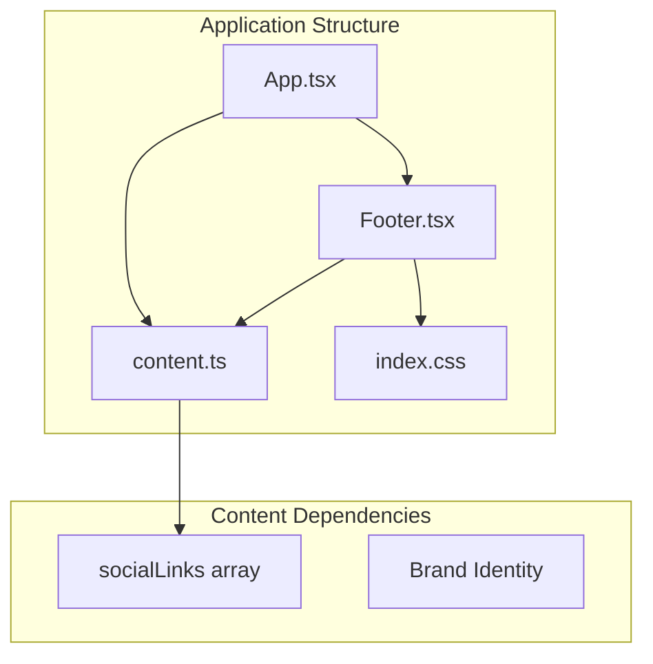
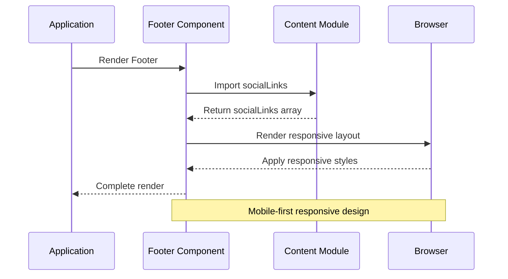
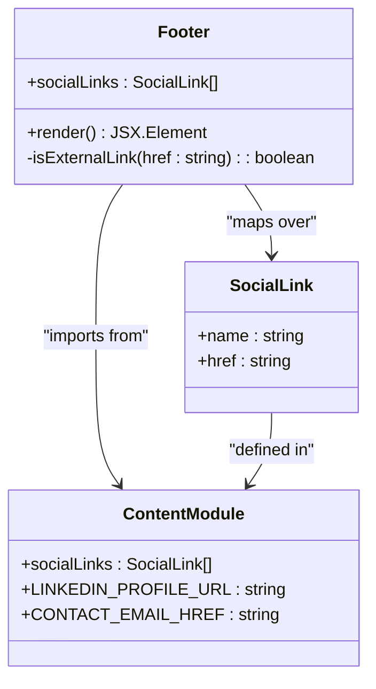
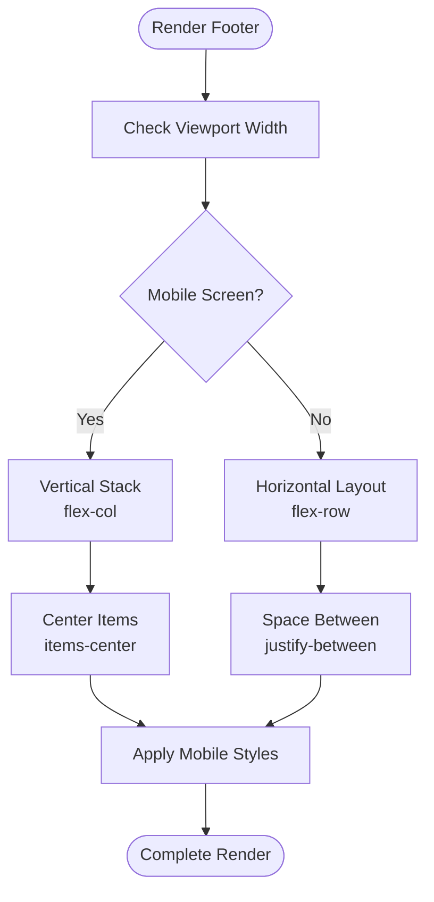
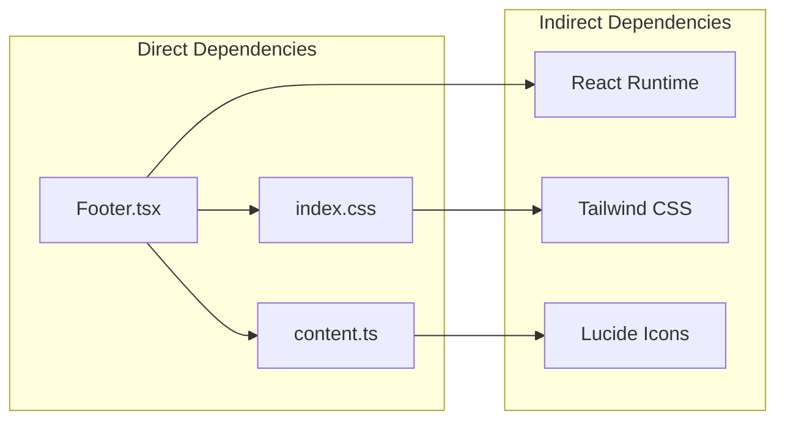

# Footer Component

<cite>
**Referenced Files in This Document**
- [Footer.tsx](file://src/components/Footer.tsx)
- [content.ts](file://src/data/content.ts)
- [App.tsx](file://src/App.tsx)
- [index.css](file://src/index.css)
- [Hero.tsx](file://src/components/Hero.tsx)
- [package.json](file://package.json)
</cite>

## Table of Contents
1. [Introduction](#introduction)
2. [Project Structure](#project-structure)
3. [Core Components](#core-components)
4. [Architecture Overview](#architecture-overview)
5. [Detailed Component Analysis](#detailed-component-analysis)
6. [Dependency Analysis](#dependency-analysis)
7. [Performance Considerations](#performance-considerations)
8. [Troubleshooting Guide](#troubleshooting-guide)
9. [Conclusion](#conclusion)

## Introduction
The Footer component serves as the portfolio's concluding interface element, providing essential navigation anchors, social media integration, and brand-consistent presentation. It maintains visual continuity with the rest of the application while offering a mobile-first responsive design that adapts seamlessly across screen sizes. The component integrates tightly with shared content definitions to ensure consistent branding and navigation across the site.

## Project Structure
The Footer component follows a modular architecture within the React application, positioned alongside other specialized sections. It imports shared content definitions and integrates with the global styling system to maintain design consistency.

**Diagram sources**
- [App.tsx:15-32](file://src/App.tsx#L15-L32)
- [Footer.tsx:1-35](file://src/components/Footer.tsx#L1-L35)
- [content.ts:68-75](file://src/data/content.ts#L68-L75)

**Section sources**
- [App.tsx:15-32](file://src/App.tsx#L15-L32)
- [Footer.tsx:1-35](file://src/components/Footer.tsx#L1-L35)
- [content.ts:68-75](file://src/data/content.ts#L68-L75)

## Core Components
The Footer component consists of three primary elements: brand identity display, copyright information, and social media navigation. These elements are arranged within a responsive container that adapts to different viewport sizes.

### Component Composition
- **Brand Identity Block**: Displays the professional title with typography consistent across the application
- **Copyright Information**: Shows standardized copyright notice with secondary text styling
- **Social Media Links**: Dynamic navigation built from shared content definitions

### Responsive Layout Implementation
The footer employs a flexible layout system that transforms from a vertical stack on mobile devices to a horizontal arrangement on larger screens, ensuring optimal readability and accessibility across all devices.

**Section sources**
- [Footer.tsx:3-35](file://src/components/Footer.tsx#L3-L35)
- [content.ts:68-75](file://src/data/content.ts#L68-L75)

## Architecture Overview
The Footer component demonstrates a clean separation of concerns through its integration with shared content definitions and global styling systems. This architecture ensures maintainability and consistency across the application.

**Diagram sources**
- [App.tsx:29](file://src/App.tsx#L29)
- [Footer.tsx:13-30](file://src/components/Footer.tsx#L13-L30)
- [content.ts:68-75](file://src/data/content.ts#L68-L75)

## Detailed Component Analysis

### Social Media Integration Pattern
The Footer implements a dynamic social media integration system that reads from centralized content definitions. This pattern ensures consistency across all sections of the portfolio while allowing easy modification of social presence.

**Diagram sources**
- [Footer.tsx:13-30](file://src/components/Footer.tsx#L13-L30)
- [content.ts:68-75](file://src/data/content.ts#L68-L75)

#### Link Detection Logic
The component includes intelligent link detection that automatically applies appropriate attributes for external versus internal links, enhancing security and user experience.

**Section sources**
- [Footer.tsx:14-24](file://src/components/Footer.tsx#L14-L24)
- [content.ts:62-65](file://src/data/content.ts#L62-L65)

### Copyright Information Display
The copyright system follows established design patterns with standardized typography and spacing. The implementation uses semantic HTML and consistent color theming.

### Responsive Footer Layout
The footer employs a sophisticated responsive design system that adapts to different screen sizes:

**Diagram sources**
- [Footer.tsx:6](file://src/components/Footer.tsx#L6)

#### Mobile-Friendly Design Considerations
- Flexible container with maximum width constraint
- Appropriate padding and spacing for touch interaction
- Typography scaling for optimal readability
- Responsive gap management between elements

**Section sources**
- [Footer.tsx:6](file://src/components/Footer.tsx#L6)

### Footer Navigation Structure
The navigation within the footer maintains consistency with the broader application's design language while serving as a secondary navigation aid for users.

**Section sources**
- [Footer.tsx:13-30](file://src/components/Footer.tsx#L13-L30)

## Dependency Analysis
The Footer component demonstrates excellent modularity through its dependency relationships and content sharing patterns.

**Diagram sources**
- [Footer.tsx:1](file://src/components/Footer.tsx#L1)
- [content.ts:1](file://src/data/content.ts#L1)
- [package.json:13-24](file://package.json#L13-L24)

### Content Sharing Pattern
The Footer shares social media configurations with other components, ensuring uniform branding across the application. This pattern reduces maintenance overhead and prevents inconsistencies.

**Section sources**
- [Footer.tsx:1](file://src/components/Footer.tsx#L1)
- [Hero.tsx:3](file://src/components/Hero.tsx#L3)
- [content.ts:68-75](file://src/data/content.ts#L68-L75)

## Performance Considerations
The Footer component is designed for optimal performance through several key strategies:

- **Minimal DOM Elements**: Efficient rendering with only essential elements
- **Static Content**: Uses pre-defined content arrays rather than dynamic API calls
- **Lightweight Styling**: Leverages utility classes for minimal CSS overhead
- **No External Dependencies**: Self-contained implementation reduces bundle size

## Troubleshooting Guide

### Adding New Social Links
To add new social media links to the footer:

1. **Update Content Definitions**: Add new entries to the socialLinks array in the content module
2. **Verify Type Safety**: Ensure the new platform name matches the union type definition
3. **Test Responsiveness**: Verify the new link renders correctly across all screen sizes
4. **Check Accessibility**: Confirm proper keyboard navigation and screen reader support

### Customizing Footer Styling
Styling modifications should be made through the centralized CSS configuration:

1. **Theme Variables**: Adjust color schemes using the established theme variables
2. **Typography Consistency**: Maintain font family and sizing consistency
3. **Spacing Guidelines**: Follow established spacing patterns for visual harmony
4. **Responsive Breakpoints**: Test changes across all device sizes

### Implementing Additional Footer Sections
To extend the footer with additional sections:

1. **Content Organization**: Define new content arrays in the content module
2. **Component Extension**: Modify the Footer component to render additional sections
3. **Layout Adaptation**: Ensure responsive layout accommodates new content
4. **Accessibility Compliance**: Maintain ARIA labels and semantic markup

**Section sources**
- [content.ts:68-75](file://src/data/content.ts#L68-L75)
- [Footer.tsx:13-30](file://src/components/Footer.tsx#L13-L30)

## Conclusion
The Footer component exemplifies modern React development practices through its modular architecture, responsive design, and content-driven approach. By centralizing social media configurations and leveraging shared styling systems, the component maintains consistency while remaining flexible for future enhancements. The implementation demonstrates best practices for component composition, responsive design, and content management that serve as a foundation for extending the portfolio's functionality.

The component's role in maintaining brand consistency extends beyond visual presentation to encompass user experience patterns, accessibility standards, and cross-platform compatibility. Its integration with the broader application architecture ensures that updates to social media presence or branding guidelines propagate consistently throughout the portfolio interface.