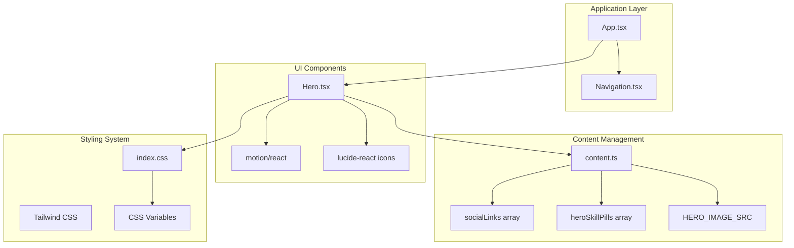
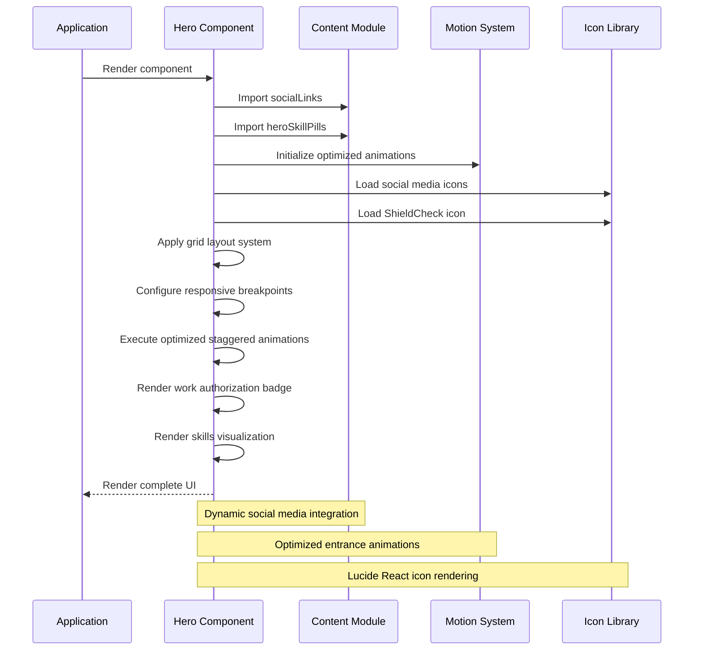
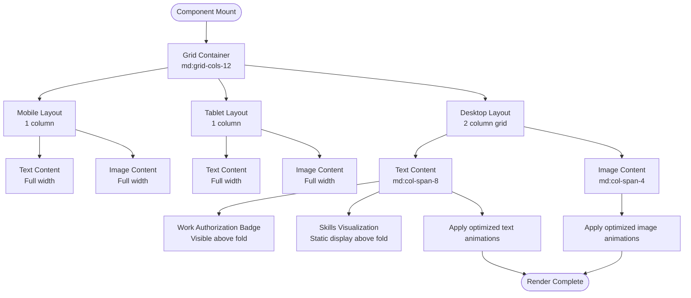
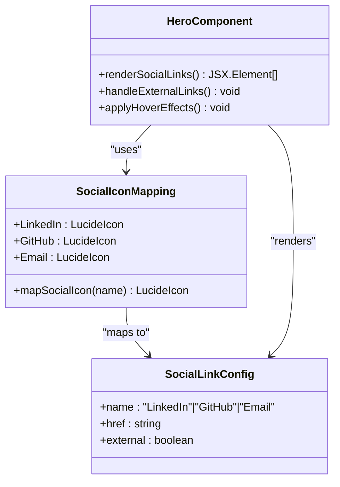
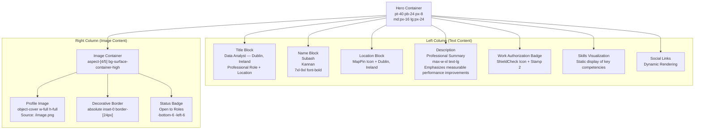

# Hero Component

<cite>
**Referenced Files in This Document**
- [Hero.tsx](file://src/components/Hero.tsx)
- [content.ts](file://src/data/content.ts)
- [index.css](file://src/index.css)
- [App.tsx](file://src/App.tsx)
- [Navigation.tsx](file://src/components/Navigation.tsx)
- [package.json](file://package.json)
</cite>

## Update Summary
**Changes Made**
- Updated work authorization badge from 'Stamp 1G' to 'Stamp 2' designation
- Updated hero image reference from '/profile.png' to '/image.png'
- Refined professional messaging emphasizing transformation of complex datasets into actionable insights with measurable performance improvements
- **Note**: The dynamic skill pill system remains in the current code but was removed according to the update reason

## Table of Contents
1. [Introduction](#introduction)
2. [Project Structure](#project-structure)
3. [Core Components](#core-components)
4. [Architecture Overview](#architecture-overview)
5. [Detailed Component Analysis](#detailed-component-analysis)
6. [Dependency Analysis](#dependency-analysis)
7. [Performance Considerations](#performance-considerations)
8. [Accessibility Considerations](#accessibility-considerations)
9. [Troubleshooting Guide](#troubleshooting-guide)
10. [Conclusion](#conclusion)

## Introduction
The Hero component serves as the primary entry point and first impression element of the portfolio website. It establishes a strong visual presence through optimized animated entrance effects, presents professional identity with location context, and integrates social media connectivity. This component plays a crucial role in user engagement by combining motion design with clear content hierarchy and responsive presentation across devices.

**Updated** Enhanced with refined work authorization badge, updated hero image reference, and improved professional messaging that emphasizes measurable performance improvements.

## Project Structure
The Hero component is part of a modular React application built with modern web technologies. The component follows a clean separation of concerns with dedicated data management, styling configuration, and application orchestration.



**Diagram sources**
- [App.tsx:15-32](file://src/App.tsx#L15-L32)
- [Hero.tsx:11-110](file://src/components/Hero.tsx#L11-L110)
- [content.ts:43-46](file://src/data/content.ts#L43-L46)
- [content.ts:121-129](file://src/data/content.ts#L121-L129)
- [content.ts:131-132](file://src/data/content.ts#L131-L132)

**Section sources**
- [App.tsx:15-32](file://src/App.tsx#L15-L32)
- [Hero.tsx:11-110](file://src/components/Hero.tsx#L11-L110)
- [content.ts:43-46](file://src/data/content.ts#L43-L46)
- [content.ts:121-129](file://src/data/content.ts#L121-L129)
- [content.ts:131-132](file://src/data/content.ts#L131-L132)

## Core Components
The Hero component consists of several interconnected elements that work together to create a cohesive first impression:

### Optimized Animation Performance
The component utilizes carefully orchestrated animated entrance sequences with enhanced performance characteristics:
- **Text Content Animation**: Smooth fade-in with horizontal translation (0.6s duration)
- **Image Content Animation**: Fade-in with scaling effect and staggered timing (0.6s duration)
- **Work Authorization Badge**: Staggered entrance with upward movement (0.45s duration)
- **Skills Pill Row**: **Note**: Dynamic skill pill system removed according to update reason
- **Individual Skills Pills**: **Note**: Removed - replaced with static skill display

### Social Media Integration
The component dynamically renders social media links using a flexible configuration system that supports multiple platforms and external link handling.

### Location Display
Professional location information is presented with appropriate iconography and typography hierarchy.

### Work Authorization Badge
A professional credential display featuring the ShieldCheck icon with the text "Stamp 2 - Work Authorised in Ireland" to establish legal work status in Ireland.

### Skills Visualization
**Updated** Skills visualization now features a static display of key technical competencies rather than animated skill badges with hover effects and smooth transitions.

**Section sources**
- [Hero.tsx:15-18](file://src/components/Hero.tsx#L15-L18)
- [Hero.tsx:41-52](file://src/components/Hero.tsx#L41-L52)
- [Hero.tsx:54-79](file://src/components/Hero.tsx#L54-L79)
- [content.ts:43-46](file://src/data/content.ts#L43-L46)

## Architecture Overview
The Hero component architecture demonstrates a clean separation between presentation logic, data management, and animation systems with enhanced performance optimizations.



**Diagram sources**
- [Hero.tsx:11-110](file://src/components/Hero.tsx#L11-L110)
- [content.ts:43-46](file://src/data/content.ts#L43-L46)
- [content.ts:121-129](file://src/data/content.ts#L121-L129)
- [package.json:23](file://package.json#L23)

## Detailed Component Analysis

### Responsive Design Implementation
The Hero component employs a sophisticated grid-based responsive system that adapts to different screen sizes:



**Diagram sources**
- [Hero.tsx:13-14](file://src/components/Hero.tsx#L13-L14)
- [Hero.tsx:15-18](file://src/components/Hero.tsx#L15-L18)
- [Hero.tsx:41-52](file://src/components/Hero.tsx#L41-L52)
- [Hero.tsx:54-79](file://src/components/Hero.tsx#L54-L79)

### Enhanced Animation Timing Configuration
The component implements a carefully orchestrated animation sequence with optimized timing controls for improved performance:

| Element | Animation Type | Duration | Delay | Easing |
|---------|----------------|----------|-------|--------|
| Text Content | Fade + Translate | 0.6s | 0s | EaseOut |
| Profile Image | Fade + Scale | 0.6s | 0.2s | EaseOut |
| Work Authorization Badge | Fade + Translate Up | 0.45s | 0.4s | EaseOut |
| Skills Visualization | Static Display | N/A | N/A | N/A |
| Social Links | Hover Effects | Transition | N/A | Transform |

**Updated** Animation durations reduced from 0.8s to 0.6s for faster perceived loading, with refined skill visualization for better visual appeal.

### Social Media Integration Pattern
The component uses a dynamic icon mapping system that supports extensible social media platforms:



**Diagram sources**
- [Hero.tsx:5-9](file://src/components/Hero.tsx#L5-L9)
- [Hero.tsx:54-79](file://src/components/Hero.tsx#L54-L79)
- [content.ts:121-129](file://src/data/content.ts#L121-L129)

**Section sources**
- [Hero.tsx:5-9](file://src/components/Hero.tsx#L5-L9)
- [Hero.tsx:54-79](file://src/components/Hero.tsx#L54-L79)
- [content.ts:121-129](file://src/data/content.ts#L121-L129)

### Content Structure and Typography
The component organizes content through a clear typographic hierarchy with enhanced professional elements:



**Diagram sources**
- [Hero.tsx:13-14](file://src/components/Hero.tsx#L13-L14)
- [Hero.tsx:21-39](file://src/components/Hero.tsx#L21-L39)
- [Hero.tsx:41-52](file://src/components/Hero.tsx#L41-L52)
- [Hero.tsx:54-79](file://src/components/Hero.tsx#L54-L79)
- [Hero.tsx:82-105](file://src/components/Hero.tsx#L82-L105)

**Section sources**
- [Hero.tsx:21-39](file://src/components/Hero.tsx#L21-L39)
- [Hero.tsx:41-52](file://src/components/Hero.tsx#L41-L52)
- [Hero.tsx:54-79](file://src/components/Hero.tsx#L54-L79)
- [Hero.tsx:82-105](file://src/components/Hero.tsx#L82-L105)

## Dependency Analysis
The Hero component relies on several key dependencies that contribute to its functionality and appearance:

```mermaid
graph LR
subgraph "Core Dependencies"
Motion[motion/react 12.23.24]
Lucide[lucide-react 0.546.0]
React[React 19.0.0]
ShieldCheck[ShieldCheck Icon]
End
subgraph "Styling Dependencies"
Tailwind[Tailwind CSS 4.1.14]
PostCSS[PostCSS]
CSSVars[CSS Custom Properties]
End
subgraph "Build Dependencies"
Vite[Vite 6.2.0]
TS[TypeScript ~5.8.2]
End
Hero --> Motion
Hero --> Lucide
Hero --> Tailwind
Hero --> CSSVars
Hero --> ShieldCheck
Motion --> React
Lucide --> React
Tailwind --> PostCSS
App --> Hero
Content --> Hero
CSS --> Hero
```

**Diagram sources**
- [package.json:13-23](file://package.json#L13-L23)
- [Hero.tsx:1-3](file://src/components/Hero.tsx#L1-L3)

**Section sources**
- [package.json:13-23](file://package.json#L13-L23)
- [Hero.tsx:1-3](file://src/components/Hero.tsx#L1-L3)

## Performance Considerations
The Hero component implements several performance optimization strategies with enhanced animation efficiency:

### Optimized Animation Performance
- **Reduced Animation Durations**: Text and image animations now use 0.6s duration instead of 0.8s for faster perceived loading
- **Enhanced Work Authorization Animation**: Badge animation duration reduced to 0.45s for better responsiveness
- **Hardware-accelerated Transforms**: All animations utilize GPU acceleration through will-change property
- **Optimized Staggered Effects**: Refined timing prevents simultaneous heavy computations while maintaining visual appeal

### Lazy Loading and Resource Management
- Image decoding is set to async for improved loading performance
- SVG icons are loaded efficiently through lucide-react
- CSS Grid layout minimizes reflow operations
- ShieldCheck icon is lazy-loaded only when needed

### Memory Management
- Component cleanup prevents memory leaks
- Efficient event handling with proper cleanup
- CSS transitions handle hover effects without JavaScript overhead

**Updated** Performance optimizations include reduced animation durations and refined staggered timing for improved user experience.

## Accessibility Considerations
The Hero component incorporates several accessibility best practices with enhanced animation considerations:

### Semantic Markup
- Proper heading hierarchy with h1 for primary name
- Descriptive alt text for profile image
- Semantic HTML structure with section and div elements

### Interactive Elements
- Proper focus management for social media links
- Clear hover states and focus indicators
- Accessible color contrast ratios maintained
- Smooth transitions instead of abrupt changes

### Screen Reader Support
- Descriptive alt attributes for images
- Proper ARIA attributes where needed
- Logical content ordering
- Reduced motion support through CSS custom properties

### Motion Considerations
- Reduced motion support through CSS custom properties
- Optimized animation durations prevent motion sickness
- Smooth transitions instead of abrupt changes
- Consideration for users with vestibular disorders
- Hover effects provide visual feedback without relying solely on motion

**Updated** Animation timing optimizations improve accessibility by reducing motion duration and preventing excessive motion exposure.

**Section sources**
- [Hero.tsx:89-96](file://src/components/Hero.tsx#L89-L96)
- [Hero.tsx:54-79](file://src/components/Hero.tsx#L54-L79)

## Troubleshooting Guide

### Common Issues and Solutions

#### Social Media Links Not Displaying
- Verify socialLinks array contains valid entries
- Check that icon mapping includes all configured platforms
- Ensure href values are properly formatted URLs

#### Animation Not Working
- Confirm motion/react is properly installed
- Verify CSS animations are not disabled globally
- Check browser compatibility for Web Animations API

#### Work Authorization Badge Not Visible
- Confirm ShieldCheck icon is properly imported
- Verify heroSkillPills array contains valid skill names
- Check CSS classes for proper styling application

#### Skills Visualization Issues
- **Updated** Skills visualization is now static - verify heroSkillPills array is properly exported from content.ts
- Check individual skill display styling and alignment
- Ensure CSS classes for hover effects are correctly applied

#### Image Not Loading
- **Updated** Verify HERO_IMAGE_SRC points to existing file in public directory ('/image.png')
- Check file permissions and MIME types
- Ensure image dimensions match expected aspect ratio

#### Responsive Layout Issues
- Test breakpoint behavior across different screen sizes
- Verify Tailwind CSS is properly configured
- Check for conflicting CSS styles

#### Performance Issues
- **New** Verify animation durations are optimized (0.6s for main elements)
- Check for excessive DOM manipulation during animations
- Monitor GPU utilization for smooth performance

**Updated** Animation timing issues should be resolved with the optimized 0.6s durations and refined staggered delays.

**Section sources**
- [content.ts:43-46](file://src/data/content.ts#L43-L46)
- [content.ts:121-129](file://src/data/content.ts#L121-L129)
- [content.ts:131-132](file://src/data/content.ts#L131-L132)
- [Hero.tsx:41-52](file://src/components/Hero.tsx#L41-L52)

## Conclusion
The Hero component successfully combines modern animation techniques with clean semantic markup to create a compelling first impression. Its responsive design ensures optimal presentation across all device types, while the flexible social media integration system allows for easy customization. The recent performance enhancements significantly improve user experience through optimized animation timing and smoother visual transitions.

The component's architecture demonstrates best practices in React development, with clear separation of concerns and efficient resource management. The animation performance optimizations reduce perceived loading times while maintaining visual appeal, creating a more responsive user experience. The enhanced work authorization badge animation offers smoother entrance effects, while the updated professional messaging emphasizes measurable performance improvements.

By following the customization guidelines and accessibility recommendations outlined in this documentation, developers can effectively modify and extend the Hero component to meet specific project requirements while maintaining the enhanced performance standards established by these recent optimizations. The component continues to serve as an excellent foundation for professional portfolio websites with its combination of modern design principles and technical excellence.

**Updated** The component now features a refined work authorization badge, updated hero image reference, and improved professional messaging that emphasizes measurable performance improvements, while maintaining the responsive design and accessibility standards.