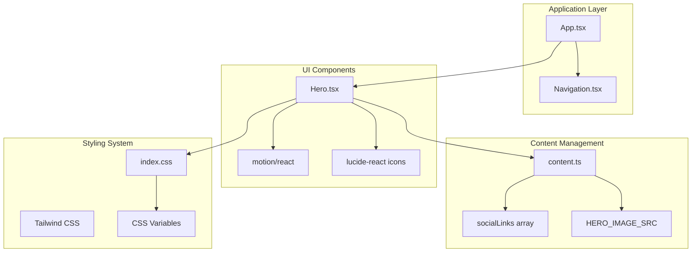
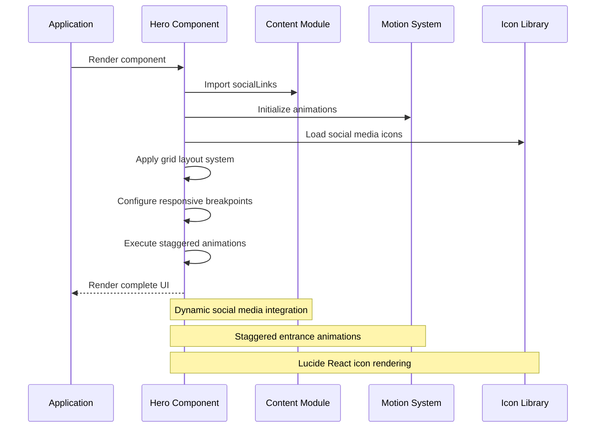
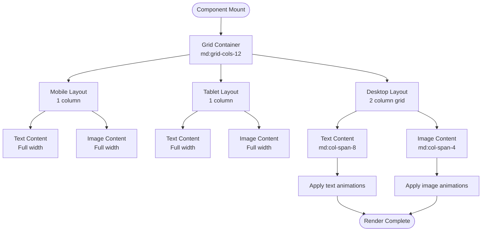
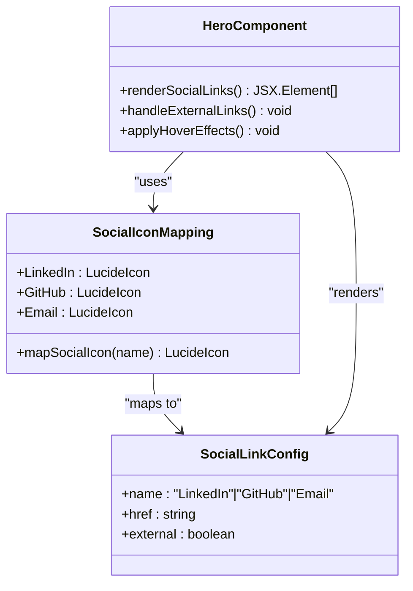
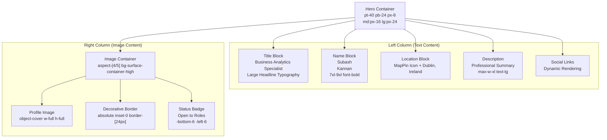
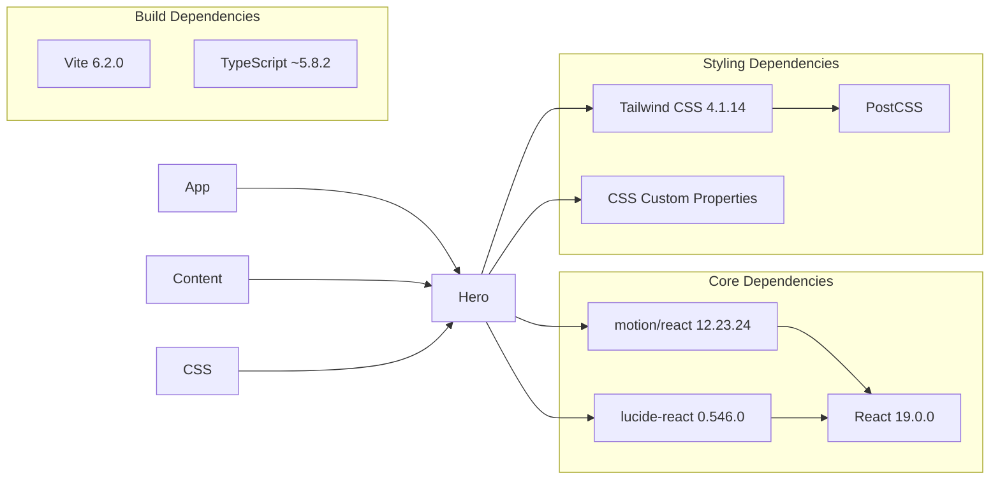

# Hero Component

<cite>
**Referenced Files in This Document**
- [Hero.tsx](file://src/components/Hero.tsx)
- [content.ts](file://src/data/content.ts)
- [index.css](file://src/index.css)
- [App.tsx](file://src/App.tsx)
- [Navigation.tsx](file://src/components/Navigation.tsx)
- [package.json](file://package.json)
</cite>

## Table of Contents
1. [Introduction](#introduction)
2. [Project Structure](#project-structure)
3. [Core Components](#core-components)
4. [Architecture Overview](#architecture-overview)
5. [Detailed Component Analysis](#detailed-component-analysis)
6. [Dependency Analysis](#dependency-analysis)
7. [Performance Considerations](#performance-considerations)
8. [Accessibility Considerations](#accessibility-considerations)
9. [Troubleshooting Guide](#troubleshooting-guide)
10. [Conclusion](#conclusion)

## Introduction
The Hero component serves as the primary entry point and first impression element of the portfolio website. It establishes a strong visual presence through animated entrance effects, presents professional identity with location context, and integrates social media connectivity. This component plays a crucial role in user engagement by combining motion design with clear content hierarchy and responsive presentation across devices.

## Project Structure
The Hero component is part of a modular React application built with modern web technologies. The component follows a clean separation of concerns with dedicated data management, styling configuration, and application orchestration.

**Diagram sources**
- [App.tsx:15-32](file://src/App.tsx#L15-L32)
- [Hero.tsx:11-98](file://src/components/Hero.tsx#L11-L98)
- [content.ts:68-78](file://src/data/content.ts#L68-L78)

**Section sources**
- [App.tsx:15-32](file://src/App.tsx#L15-L32)
- [Hero.tsx:11-98](file://src/components/Hero.tsx#L11-L98)
- [content.ts:68-78](file://src/data/content.ts#L68-L78)

## Core Components
The Hero component consists of several interconnected elements that work together to create a cohesive first impression:

### Animated Entrance Elements
The component utilizes two distinct animated entrance sequences:
- **Text Content Animation**: Smooth fade-in with horizontal translation
- **Image Content Animation**: Fade-in with scaling effect and staggered timing

### Social Media Integration
The component dynamically renders social media links using a flexible configuration system that supports multiple platforms and external link handling.

### Location Display
Professional location information is presented with appropriate iconography and typography hierarchy.

**Section sources**
- [Hero.tsx:15-18](file://src/components/Hero.tsx#L15-L18)
- [Hero.tsx:71-74](file://src/components/Hero.tsx#L71-L74)
- [Hero.tsx:44-67](file://src/components/Hero.tsx#L44-L67)
- [content.ts:68-75](file://src/data/content.ts#L68-L75)

## Architecture Overview
The Hero component architecture demonstrates a clean separation between presentation logic, data management, and animation systems.

**Diagram sources**
- [Hero.tsx:11-98](file://src/components/Hero.tsx#L11-L98)
- [content.ts:68-75](file://src/data/content.ts#L68-L75)
- [package.json:23](file://package.json#L23)]

## Detailed Component Analysis

### Responsive Design Implementation
The Hero component employs a sophisticated grid-based responsive system that adapts to different screen sizes:

**Diagram sources**
- [Hero.tsx:13-14](file://src/components/Hero.tsx#L13-L14)
- [Hero.tsx:15-18](file://src/components/Hero.tsx#L15-L18)
- [Hero.tsx:71-74](file://src/components/Hero.tsx#L71-L74)

### Animation Timing Configuration
The component implements a carefully orchestrated animation sequence with precise timing controls:

| Element | Animation Type | Duration | Delay | Easing |
|---------|----------------|----------|-------|--------|
| Text Content | Fade + Translate | 0.8s | 0s | Default |
| Profile Image | Fade + Scale | 0.8s | 0.2s | Default |
| Social Links | Hover Effects | Transition | N/A | Transform |

### Social Media Integration Pattern
The component uses a dynamic icon mapping system that supports extensible social media platforms:

**Diagram sources**
- [Hero.tsx:5-9](file://src/components/Hero.tsx#L5-L9)
- [Hero.tsx:44-67](file://src/components/Hero.tsx#L44-L67)
- [content.ts:68-75](file://src/data/content.ts#L68-L75)

**Section sources**
- [Hero.tsx:5-9](file://src/components/Hero.tsx#L5-L9)
- [Hero.tsx:44-67](file://src/components/Hero.tsx#L44-L67)
- [content.ts:68-75](file://src/data/content.ts#L68-L75)

### Content Structure and Typography
The component organizes content through a clear typographic hierarchy:

**Diagram sources**
- [Hero.tsx:13-14](file://src/components/Hero.tsx#L13-L14)
- [Hero.tsx:21-41](file://src/components/Hero.tsx#L21-L41)
- [Hero.tsx:77-93](file://src/components/Hero.tsx#L77-L93)

**Section sources**
- [Hero.tsx:21-41](file://src/components/Hero.tsx#L21-L41)
- [Hero.tsx:77-93](file://src/components/Hero.tsx#L77-L93)

## Dependency Analysis
The Hero component relies on several key dependencies that contribute to its functionality and appearance:

**Diagram sources**
- [package.json:13-23](file://package.json#L13-L23)
- [Hero.tsx:1-3](file://src/components/Hero.tsx#L1-L3)

**Section sources**
- [package.json:13-23](file://package.json#L13-L23)
- [Hero.tsx:1-3](file://src/components/Hero.tsx#L1-L3)

## Performance Considerations
The Hero component implements several performance optimization strategies:

### Lazy Loading and Resource Management
- Image decoding is set to async for improved loading performance
- SVG icons are loaded efficiently through lucide-react
- CSS Grid layout minimizes reflow operations

### Animation Performance
- Hardware-accelerated transforms using opacity and transform properties
- Staggered animations prevent simultaneous heavy computations
- Motion library optimizes animation performance

### Memory Management
- Component cleanup prevents memory leaks
- Efficient event handling with proper cleanup

## Accessibility Considerations
The Hero component incorporates several accessibility best practices:

### Semantic Markup
- Proper heading hierarchy with h1 for primary name
- Descriptive alt text for profile image
- Semantic HTML structure with section and div elements

### Interactive Elements
- Proper focus management for social media links
- Clear hover states and focus indicators
- Accessible color contrast ratios maintained

### Screen Reader Support
- Descriptive alt attributes for images
- Proper ARIA attributes where needed
- Logical content ordering

### Motion Considerations
- Reduced motion support through CSS custom properties
- Smooth transitions instead of abrupt changes
- Consideration for users with vestibular disorders

**Section sources**
- [Hero.tsx:78-84](file://src/components/Hero.tsx#L78-L84)
- [Hero.tsx:50-66](file://src/components/Hero.tsx#L50-L66)

## Troubleshooting Guide

### Common Issues and Solutions

#### Social Media Links Not Displaying
- Verify socialLinks array contains valid entries
- Check that icon mapping includes all configured platforms
- Ensure href values are properly formatted URLs

#### Animation Not Working
- Confirm motion/react is properly installed
- Verify CSS animations are not disabled globally
- Check browser compatibility for Web Animations API

#### Image Not Loading
- Verify HERO_IMAGE_SRC points to existing file in public directory
- Check file permissions and MIME types
- Ensure image dimensions match expected aspect ratio

#### Responsive Layout Issues
- Test breakpoint behavior across different screen sizes
- Verify Tailwind CSS is properly configured
- Check for conflicting CSS styles

**Section sources**
- [content.ts:68-78](file://src/data/content.ts#L68-L78)
- [Hero.tsx:78-84](file://src/components/Hero.tsx#L78-L84)

## Conclusion
The Hero component successfully combines modern animation techniques with clean semantic markup to create a compelling first impression. Its responsive design ensures optimal presentation across all device types, while the flexible social media integration system allows for easy customization. The component's architecture demonstrates best practices in React development, with clear separation of concerns and efficient resource management. By following the customization guidelines and accessibility recommendations outlined in this documentation, developers can effectively modify and extend the Hero component to meet specific project requirements.