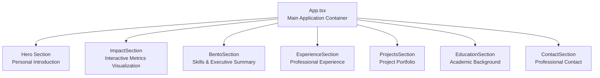
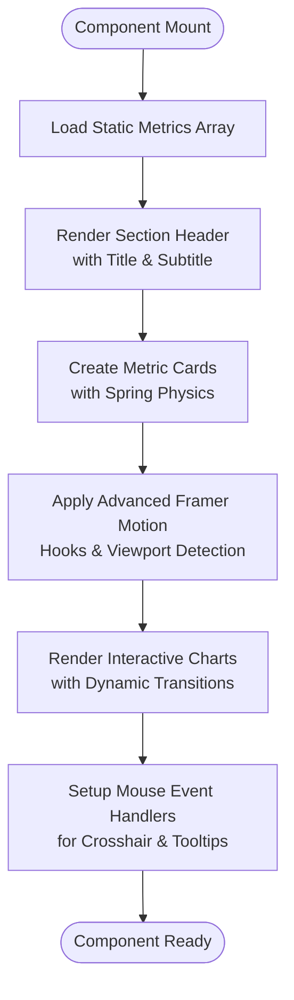
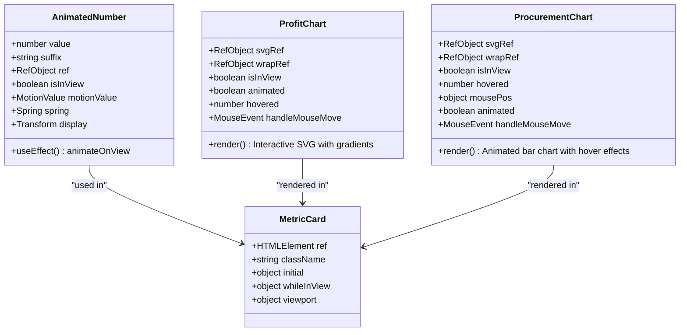
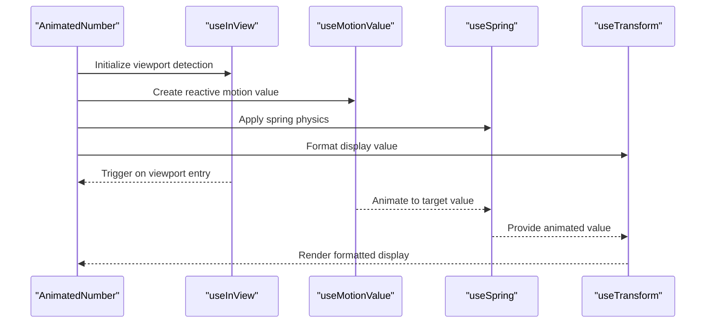
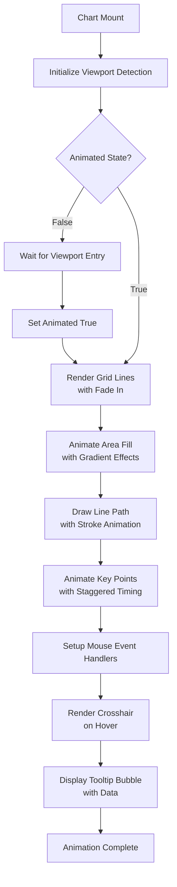
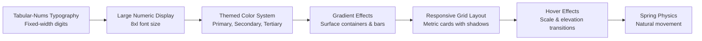
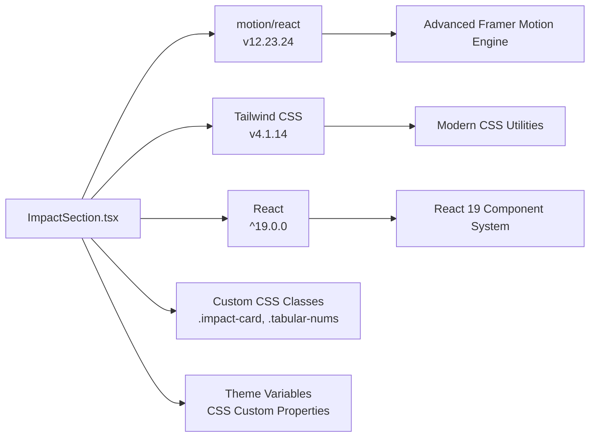

# ImpactSection Component

<cite>
**Referenced Files in This Document**
- [ImpactSection.tsx](file://src/components/ImpactSection.tsx)
- [content.ts](file://src/data/content.ts)
- [App.tsx](file://src/App.tsx)
- [index.css](file://src/index.css)
- [package.json](file://package.json)
</cite>

## Update Summary
**Changes Made**
- Completely redesigned component with sophisticated animated data visualizations
- Added interactive hover effects with crosshair guidance and tooltip bubbles
- Implemented custom SVG chart implementations with Framer Motion animations
- Enhanced ProfitChart with area fills, animated line drawing, and spring physics
- Added ProcurementChart with animated bar charts and gradient effects
- Integrated advanced animation system with useInView, useMotionValue, useSpring, useTransform
- Updated layout architecture with hover interactions and glass morphism effects

## Table of Contents
1. [Introduction](#introduction)
2. [Project Structure](#project-structure)
3. [Core Components](#core-components)
4. [Architecture Overview](#architecture-overview)
5. [Detailed Component Analysis](#detailed-component-analysis)
6. [Dependency Analysis](#dependency-analysis)
7. [Performance Considerations](#performance-considerations)
8. [Troubleshooting Guide](#troubleshooting-guide)
9. [Conclusion](#conclusion)

## Introduction
The ImpactSection component serves as a sophisticated showcase for quantifiable professional achievements and measurable results. It presents key performance indicators (KPIs) alongside interactive animated historical performance visualizations through custom SVG charts, creating a compelling narrative of professional impact. The component leverages modern React patterns with Framer Motion for advanced animations and Tailwind CSS for responsive design, positioning itself as a cornerstone element in demonstrating tangible outcomes and business value.

**Updated** The component has been completely redesigned with interactive hover effects, sophisticated animation sequences, and custom SVG implementations that provide users with engaging data exploration capabilities.

## Project Structure
The ImpactSection integrates seamlessly within the portfolio application's component hierarchy, positioned strategically between the Hero and Bento sections to create a logical flow from personal introduction to measurable achievements.

**Diagram sources**
- [App.tsx:16-34](file://src/App.tsx#L16-L34)

**Section sources**
- [App.tsx:16-34](file://src/App.tsx#L16-L34)

## Core Components
The ImpactSection component consists of four primary components that drive its functionality and presentation:

### AnimatedNumber Component
A sophisticated spring-physics powered number animation system that provides smooth, engaging numeric displays with customizable formatting and suffix support.

### Enhanced Animation System
The component utilizes Framer Motion's advanced hook-based animation system including useInView for viewport detection, useMotionValue for reactive values, useSpring for physics-based animations, and useTransform for derived value transformations.

### Interactive Chart Components
Two completely redesigned chart components with dynamic animations and interactive hover effects:
- **ProfitChart**: Features area fills with gradient effects, animated line drawing, and interactive crosshair guidance
- **ProcurementChart**: Implements animated bar charts with hover interactions, gradient fills, and tooltip bubbles

### Metric Card Layout System
The component implements a grid-based layout with hover-responsive metric cards, each containing:
- KPI identification header with animated accent bars
- Large animated numeric display with spring physics
- Professional achievement descriptions
- Interactive chart visualizations with hover effects

**Updated** Both chart components now feature sophisticated interactive hover effects including crosshair guidance, tooltip bubbles, and dynamic visual feedback.

**Section sources**
- [ImpactSection.tsx:4-18](file://src/components/ImpactSection.tsx#L4-L18)
- [ImpactSection.tsx:60-225](file://src/components/ImpactSection.tsx#L60-L225)
- [ImpactSection.tsx:262-446](file://src/components/ImpactSection.tsx#L262-L446)
- [ImpactSection.tsx:446-541](file://src/components/ImpactSection.tsx#L446-L541)

## Architecture Overview
The ImpactSection follows a sophisticated unidirectional data flow pattern where animated components drive dynamic presentation through Framer Motion hooks and CSS-in-JS styling, with interactive SVG elements providing enhanced user engagement.

**Diagram sources**
- [ImpactSection.tsx:446-541](file://src/components/ImpactSection.tsx#L446-L541)

## Detailed Component Analysis

### Advanced Animation System with Framer Motion Hooks
The component implements a sophisticated animation system using Framer Motion's latest hooks for optimal performance and user experience:

**Diagram sources**
- [ImpactSection.tsx:4-18](file://src/components/ImpactSection.tsx#L4-L18)
- [ImpactSection.tsx:60-225](file://src/components/ImpactSection.tsx#L60-L225)
- [ImpactSection.tsx:262-446](file://src/components/ImpactSection.tsx#L262-L446)

### Spring Physics-Based Numeric Animation
The AnimatedNumber component provides sophisticated spring physics animation with customizable formatting:

**Diagram sources**
- [ImpactSection.tsx:4-18](file://src/components/ImpactSection.tsx#L4-L18)

### Interactive Chart Animation Patterns
Both chart components implement sophisticated animation sequences with interactive hover effects:

**Diagram sources**
- [ImpactSection.tsx:60-225](file://src/components/ImpactSection.tsx#L60-L225)
- [ImpactSection.tsx:262-446](file://src/components/ImpactSection.tsx#L262-L446)

### Enhanced Visual Design System
The component implements a comprehensive visual design system with modern typography and gradient effects:

**Diagram sources**
- [ImpactSection.tsx:56-62](file://src/components/ImpactSection.tsx#L56-L62)
- [index.css:56-71](file://src/index.css#L56-L71)

### Data Binding Patterns and Content Integration
The component integrates seamlessly with the content system while maintaining flexibility for future enhancements:

**Section sources**
- [ImpactSection.tsx:446-541](file://src/components/ImpactSection.tsx#L446-L541)
- [content.ts:48-65](file://src/data/content.ts#L48-L65)

## Dependency Analysis
The component maintains optimized external dependencies while leveraging powerful libraries for enhanced user experience:

**Diagram sources**
- [package.json:13-24](file://package.json#L13-L24)
- [index.css:3-40](file://src/index.css#L3-L40)

**Section sources**
- [package.json:13-24](file://package.json#L13-L24)
- [index.css:56-71](file://src/index.css#L56-L71)

## Performance Considerations
The component implements several advanced performance optimization strategies:

### Optimized Animation Performance
- Uses `useInView` with `{ once: true }` to prevent repeated animations
- Implements staggered delays with precise timing (`idx * 0.06` for bars, `0.3 + i * 0.05` for dots)
- Leverages Framer Motion's optimized rendering pipeline with hardware acceleration
- Utilizes `useMotionValue` for efficient reactive value updates

### Advanced Layout Optimization
- Grid-based layout with CSS Grid for optimal responsive design
- Minimal re-renders through proper hook usage and memoization
- Efficient SVG rendering with optimized path calculations
- Hardware-accelerated CSS transitions and transforms

### Bundle Size and Loading Optimization
- Single-purpose component reduces bundle overhead
- Inline SVG eliminates external asset dependencies
- Minimal external dependencies limit payload size
- Lazy loading through viewport detection prevents unnecessary computations

### Interactive Performance Optimization
- Debounced mouse event handlers prevent excessive re-renders
- Efficient hover state management with proper cleanup
- Optimized SVG rendering with minimal DOM manipulation
- Hardware-accelerated animations for smooth user interactions

## Troubleshooting Guide

### Common Implementation Issues
**Animation Not Triggering**
- Verify viewport intersection observer is enabled and properly configured
- Check container dimensions and visibility requirements
- Ensure `useInView` hook receives a valid ref with proper sizing
- Confirm `once: true` configuration prevents repeated triggers

**Spring Physics Not Working**
- Verify `useMotionValue` is properly initialized before `useSpring`
- Check that target values are numeric and within expected ranges
- Ensure `useTransform` receives a valid function for value formatting
- Validate that `useEffect` cleanup properly handles animation state

**SVG Charts Not Rendering**
- Confirm SVG viewBox attributes are correctly set for responsive scaling
- Verify stroke and fill color classes match theme variables
- Check for CSS conflicts affecting SVG rendering and gradient fills
- Ensure proper namespace declarations for SVG elements

**Interactive Hover Effects Not Working**
- Verify mouse event handlers are properly attached to SVG elements
- Check that hover state management uses proper cleanup in `useEffect`
- Ensure coordinate calculations account for SVG scaling and positioning
- Validate that tooltip positioning respects chart boundaries

**Styling Issues**
- Validate Tailwind CSS configuration supports modern utilities
- Ensure theme variables are properly defined in CSS custom properties
- Check for CSS specificity conflicts with global styles
- Verify font-display properties for tabular-nums typography

### Performance Optimization Tips
- Monitor animation performance using browser dev tools and FPS counters
- Consider lazy loading for heavy SVG elements using viewport detection
- Optimize CSS custom properties for better rendering performance
- Implement proper cleanup in useEffect hooks to prevent memory leaks
- Use `useCallback` for event handlers to prevent unnecessary re-renders

**Section sources**
- [ImpactSection.tsx:4-18](file://src/components/ImpactSection.tsx#L4-L18)
- [ImpactSection.tsx:60-225](file://src/components/ImpactSection.tsx#L60-L225)
- [ImpactSection.tsx:262-446](file://src/components/ImpactSection.tsx#L262-L446)

## Conclusion
The ImpactSection component exemplifies modern React development practices by combining sophisticated Framer Motion animations, clean data structures, and professional visual design. Its modular architecture supports easy extension for additional metrics while maintaining excellent performance characteristics through advanced animation optimization and efficient rendering patterns.

**Updated** The component successfully transforms quantitative data into compelling visual narratives through:
- Advanced spring physics animations with AnimatedNumber component
- Sophisticated interactive chart animations with dynamic SVG rendering
- Modern typography with tabular-nums for professional number display
- Responsive grid layout with hover interactions and gradient effects
- Optimized performance through viewport detection and hardware acceleration
- Interactive hover effects with crosshair guidance and tooltip bubbles
- Custom SVG implementations with gradient fills and filter effects

Key architectural improvements include:
- Complete migration from Motion One to Framer Motion hooks
- Implementation of spring physics for natural, engaging animations
- Redesigned chart components with sophisticated animation sequences and interactive hover effects
- Enhanced visual design system with modern typography and gradients
- Improved layout architecture with separate metric cards and hover-responsive interactions
- Advanced SVG rendering with custom filters and gradient effects

Future enhancements could include dynamic data integration, additional interactive chart elements, expanded visualization types, and enhanced accessibility features while maintaining the component's focus on showcasing quantifiable results and professional accomplishments.