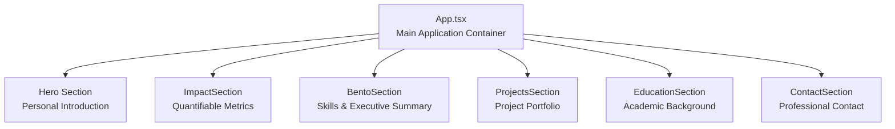
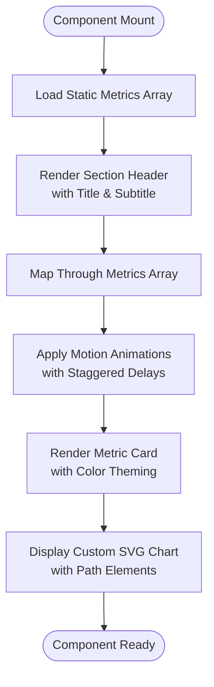
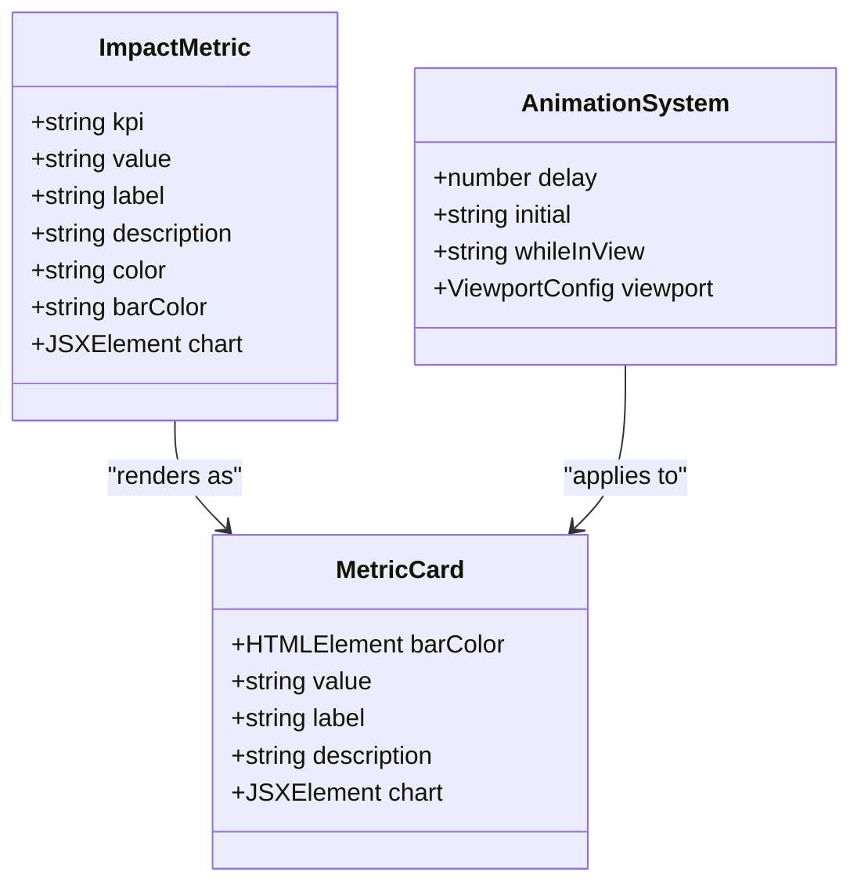
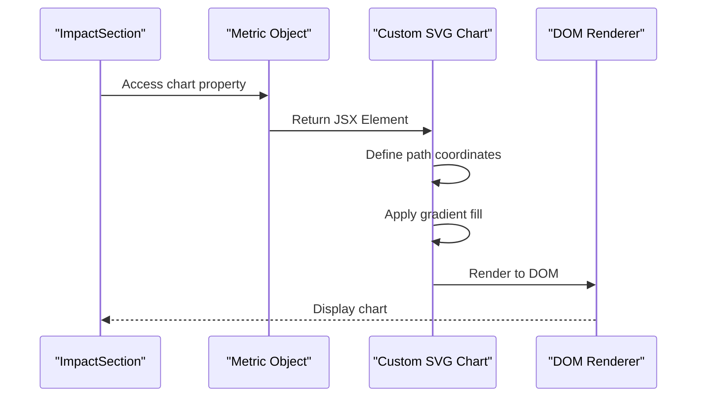
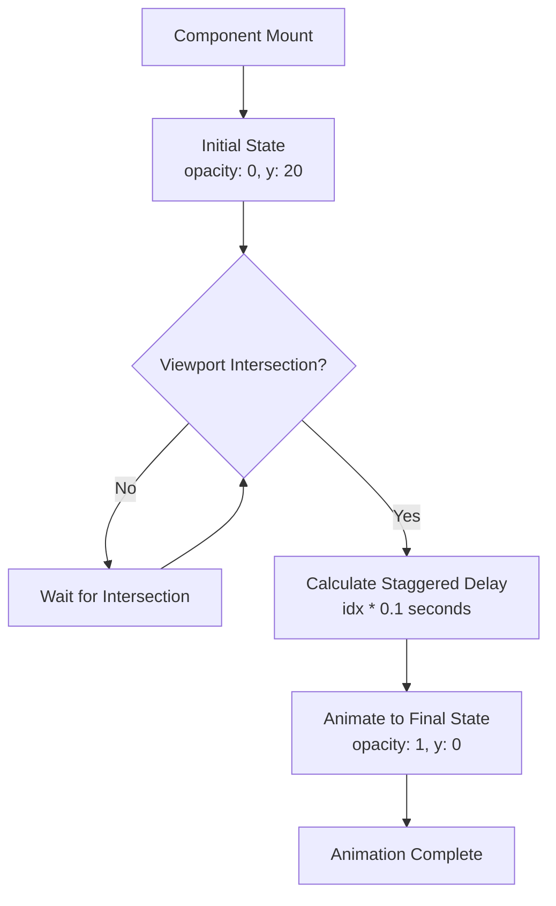
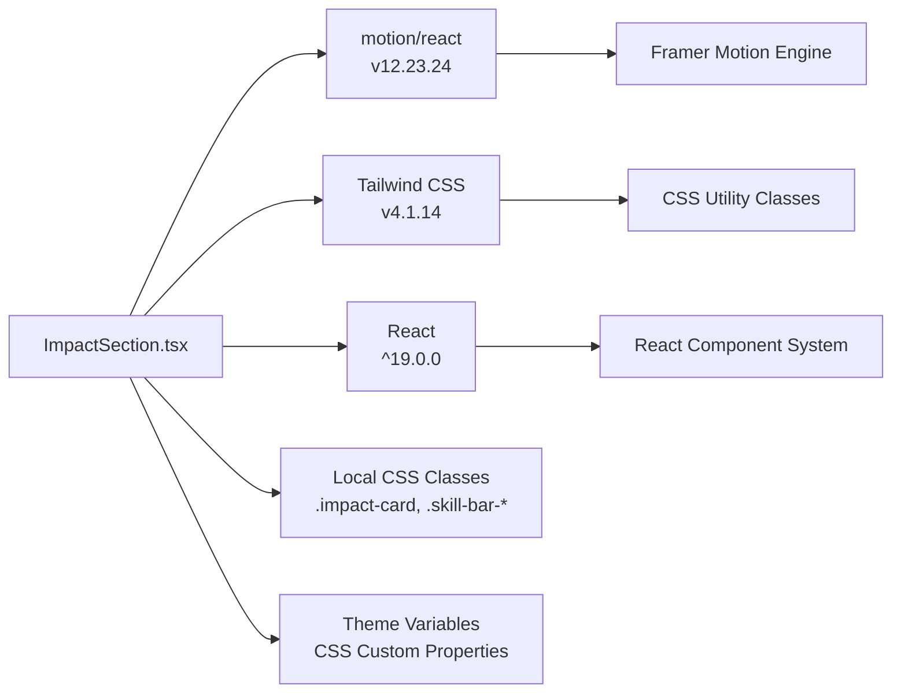

# ImpactSection Component

<cite>
**Referenced Files in This Document**
- [ImpactSection.tsx](file://src/components/ImpactSection.tsx)
- [content.ts](file://src/data/content.ts)
- [App.tsx](file://src/App.tsx)
- [index.css](file://src/index.css)
- [vite.config.ts](file://vite.config.ts)
- [package.json](file://package.json)
</cite>

## Table of Contents
1. [Introduction](#introduction)
2. [Project Structure](#project-structure)
3. [Core Components](#core-components)
4. [Architecture Overview](#architecture-overview)
5. [Detailed Component Analysis](#detailed-component-analysis)
6. [Dependency Analysis](#dependency-analysis)
7. [Performance Considerations](#performance-considerations)
8. [Troubleshooting Guide](#troubleshooting-guide)
9. [Conclusion](#conclusion)

## Introduction
The ImpactSection component serves as a dedicated showcase for quantifiable professional achievements and measurable results. It presents key performance indicators (KPIs) alongside historical performance visualization through custom SVG charts, creating a compelling narrative of professional impact. The component leverages modern React patterns with Motion One for smooth animations and Tailwind CSS for responsive design, positioning itself as a cornerstone element in demonstrating tangible outcomes and business value.

## Project Structure
The ImpactSection integrates seamlessly within the portfolio application's component hierarchy, positioned strategically between the Hero and Bento sections to create a logical flow from personal introduction to measurable achievements.

**Diagram sources**
- [App.tsx:15-32](file://src/App.tsx#L15-L32)

**Section sources**
- [App.tsx:15-32](file://src/App.tsx#L15-L32)

## Core Components
The ImpactSection component consists of two primary data structures that drive its functionality and presentation:

### Impact Metrics Array
The component defines a static array of metric objects, each containing:
- KPI identifier for tracking and categorization
- Quantified value display with professional formatting
- Descriptive label explaining the achievement context
- Detailed description elaborating on methodologies and outcomes
- Color theming system for visual consistency
- Custom SVG chart representation

### Animation System
The component utilizes Motion One's viewport-based animations to create staggered entrance effects, enhancing user engagement while maintaining performance through viewport intersection detection.

**Section sources**
- [ImpactSection.tsx:3-54](file://src/components/ImpactSection.tsx#L3-L54)
- [ImpactSection.tsx:56-105](file://src/components/ImpactSection.tsx#L56-L105)

## Architecture Overview
The ImpactSection follows a unidirectional data flow pattern where static content drives dynamic presentation through React components and CSS-in-JS styling.

**Diagram sources**
- [ImpactSection.tsx:56-105](file://src/components/ImpactSection.tsx#L56-L105)

## Detailed Component Analysis

### KPI Visualization Patterns
The component implements a sophisticated color theming system that ensures visual consistency across different metrics while highlighting individual achievements:

**Diagram sources**
- [ImpactSection.tsx:3-54](file://src/components/ImpactSection.tsx#L3-L54)
- [ImpactSection.tsx:70-100](file://src/components/ImpactSection.tsx#L70-L100)

### Historical Data Representation
The custom SVG chart implementation creates professional-looking trend visualizations using path elements with gradient fills:

**Diagram sources**
- [ImpactSection.tsx:12-27](file://src/components/ImpactSection.tsx#L12-L27)
- [ImpactSection.tsx:37-52](file://src/components/ImpactSection.tsx#L37-L52)

### Animation Sequences for Metric Displays
The component employs a sophisticated animation system that creates engaging entrance effects:

**Diagram sources**
- [ImpactSection.tsx:71-77](file://src/components/ImpactSection.tsx#L71-L77)

### Data Binding Patterns from Content.ts
While the ImpactSection currently uses static data, the component architecture supports seamless integration with external data sources through the existing props-based structure and TypeScript interfaces.

**Section sources**
- [ImpactSection.tsx:56-105](file://src/components/ImpactSection.tsx#L56-L105)

## Dependency Analysis
The component maintains minimal external dependencies while leveraging powerful libraries for enhanced user experience:

**Diagram sources**
- [package.json:13-24](file://package.json#L13-L24)
- [index.css:3-40](file://src/index.css#L3-L40)

**Section sources**
- [package.json:13-24](file://package.json#L13-L24)
- [vite.config.ts:1-25](file://vite.config.ts#L1-L25)

## Performance Considerations
The component implements several performance optimization strategies:

### Viewport-Based Animations
- Uses `viewport={{ once: true }}` to prevent repeated animations
- Implements staggered delays (`idx * 0.1`) for efficient animation sequencing
- Leverages Motion One's optimized rendering pipeline

### Minimal Re-renders
- Static data structure prevents unnecessary re-computation
- Pure component design with minimal state requirements
- Efficient grid layout using CSS Grid for responsive design

### Bundle Size Optimization
- Single-purpose component reduces bundle overhead
- Inline SVG eliminates external asset dependencies
- Minimal external dependencies limit payload size

## Troubleshooting Guide

### Common Implementation Issues
**Animation Not Triggering**
- Verify viewport intersection observer is enabled
- Check container height and visibility
- Ensure `viewport={{ once: true }}` is properly configured

**SVG Charts Not Rendering**
- Confirm SVG viewBox attributes are correctly set
- Verify stroke and fill color classes are available
- Check for CSS conflicts affecting SVG rendering

**Styling Issues**
- Validate Tailwind CSS configuration
- Ensure theme variables are properly defined
- Check for CSS specificity conflicts

### Performance Optimization Tips
- Monitor animation performance using browser dev tools
- Consider lazy loading for heavy SVG elements
- Optimize CSS custom properties for better rendering performance

**Section sources**
- [ImpactSection.tsx:71-77](file://src/components/ImpactSection.tsx#L71-L77)
- [index.css:56-71](file://src/index.css#L56-L71)

## Conclusion
The ImpactSection component exemplifies modern React development practices by combining clean data structures, sophisticated animations, and professional visual design. Its modular architecture supports easy extension for additional metrics while maintaining excellent performance characteristics. The component successfully transforms quantitative data into compelling visual narratives, positioning it as a crucial element in demonstrating measurable professional achievements and business impact.

The implementation demonstrates best practices in:
- Component composition and data binding
- Animation orchestration and user experience
- Responsive design and accessibility
- Performance optimization and maintainability

Future enhancements could include dynamic data integration, interactive chart elements, and expanded visualization types while maintaining the component's focus on showcasing quantifiable results and professional accomplishments.