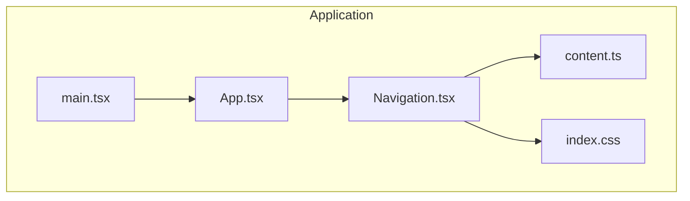
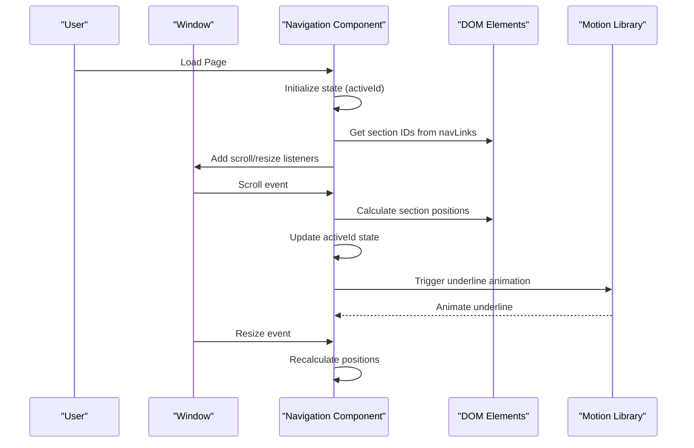
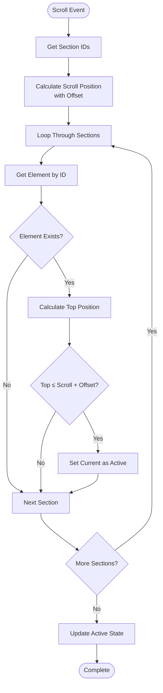
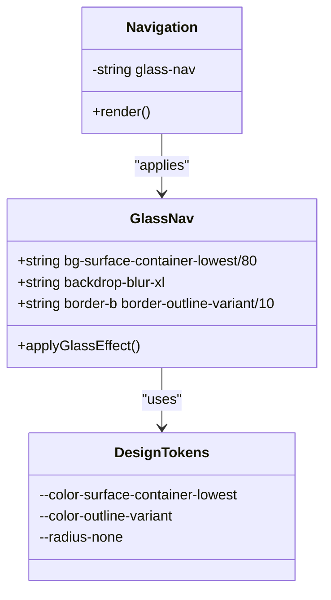
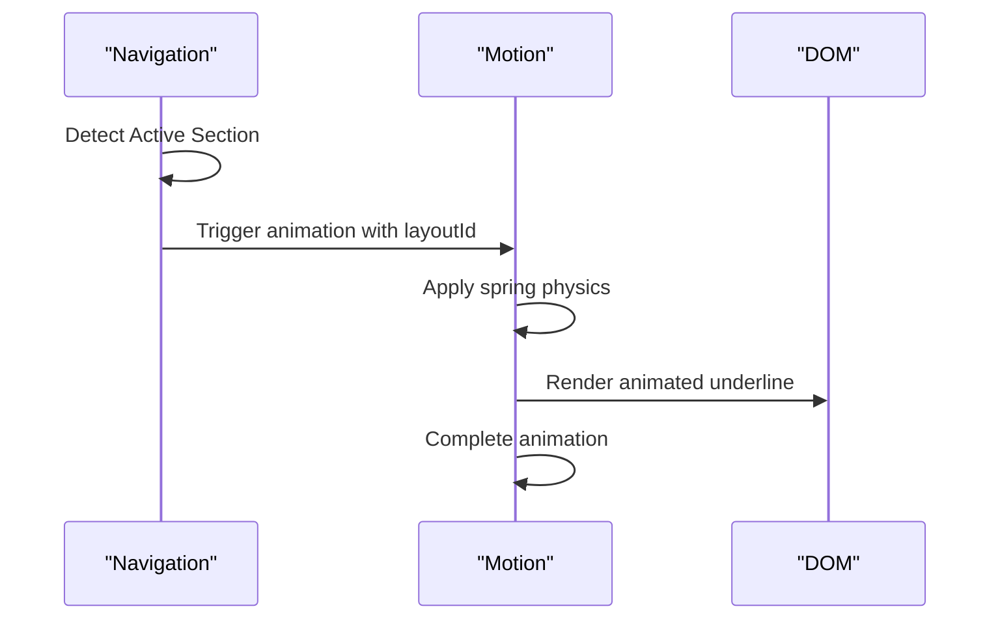
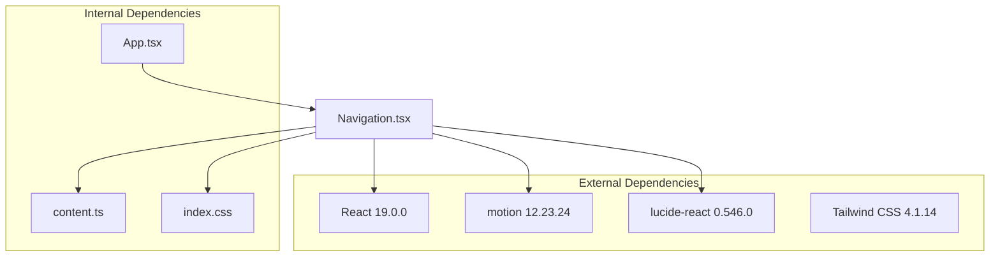

# Navigation Component

<cite>
**Referenced Files in This Document**
- [Navigation.tsx](file://src/components/Navigation.tsx)
- [content.ts](file://src/data/content.ts)
- [App.tsx](file://src/App.tsx)
- [index.css](file://src/index.css)
- [main.tsx](file://src/main.tsx)
- [package.json](file://package.json)
- [vite.config.ts](file://vite.config.ts)
</cite>

## Table of Contents
1. [Introduction](#introduction)
2. [Project Structure](#project-structure)
3. [Core Components](#core-components)
4. [Architecture Overview](#architecture-overview)
5. [Detailed Component Analysis](#detailed-component-analysis)
6. [Dependency Analysis](#dependency-analysis)
7. [Performance Considerations](#performance-considerations)
8. [Troubleshooting Guide](#troubleshooting-guide)
9. [Conclusion](#conclusion)

## Introduction
This document provides comprehensive documentation for the Navigation component, focusing on its scroll-based active section detection mechanism, glass-morphism design implementation, animated underline indicator, responsive behavior, CV download functionality, and performance considerations. The component integrates React hooks, the Motion library for animations, and Tailwind CSS for styling.

## Project Structure
The Navigation component is part of a React application built with Vite and Tailwind CSS. It relies on shared data from content.ts and integrates with the main application layout in App.tsx.

**Diagram sources**
- [App.tsx:15-32](file://src/App.tsx#L15-L32)
- [Navigation.tsx:10-97](file://src/components/Navigation.tsx#L10-L97)
- [content.ts:10-81](file://src/data/content.ts#L10-L81)
- [index.css:52-54](file://src/index.css#L52-L54)
- [main.tsx:6-10](file://src/main.tsx#L6-L10)

**Section sources**
- [App.tsx:15-32](file://src/App.tsx#L15-L32)
- [Navigation.tsx:10-97](file://src/components/Navigation.tsx#L10-L97)
- [content.ts:10-81](file://src/data/content.ts#L10-L81)
- [index.css:52-54](file://src/index.css#L52-L54)
- [main.tsx:6-10](file://src/main.tsx#L6-L10)

## Core Components
The Navigation component consists of:
- Scroll-based active section detection using IntersectionObserver-like logic
- Glass-morphism design via backdrop blur and translucent backgrounds
- Animated underline indicator powered by the Motion library
- Responsive layout with hidden navigation on small screens
- CV download functionality with accessibility attributes

Key implementation areas:
- Active section calculation and state updates
- Event listener management for scroll and resize
- Dynamic underline animation with layoutId
- Responsive breakpoint handling
- Accessibility-compliant download link

**Section sources**
- [Navigation.tsx:13-40](file://src/components/Navigation.tsx#L13-L40)
- [Navigation.tsx:42-97](file://src/components/Navigation.tsx#L42-L97)
- [content.ts:10-18](file://src/data/content.ts#L10-L18)

## Architecture Overview
The Navigation component follows a React functional component pattern with internal state management and effect hooks. It integrates with shared data and styling modules to provide a cohesive user interface.

**Diagram sources**
- [Navigation.tsx:13-40](file://src/components/Navigation.tsx#L13-L40)
- [Navigation.tsx:65-80](file://src/components/Navigation.tsx#L65-L80)

## Detailed Component Analysis

### Scroll-Based Active Section Detection
The component implements a custom scroll detection mechanism that determines the currently active navigation section based on viewport position.

#### Intersection Logic Implementation
The algorithm calculates the active section by:
1. Converting href values to section IDs
2. Computing scroll position with a fixed offset
3. Measuring element positions relative to viewport
4. Selecting the section whose top boundary is closest to the calculated threshold

**Diagram sources**
- [Navigation.tsx:17-31](file://src/components/Navigation.tsx#L17-L31)

#### Offset Calculations
The component uses a fixed offset value to account for the navigation bar height and provide smooth transitions between sections. The offset calculation considers:
- Fixed offset constant for consistent behavior
- Element positioning relative to viewport
- Threshold comparison with tolerance

**Section sources**
- [Navigation.tsx:15](file://src/components/Navigation.tsx#L15)
- [Navigation.tsx:24-28](file://src/components/Navigation.tsx#L24-L28)

### Glass-Morphism Design Implementation
The navigation employs a sophisticated glass-morphism effect achieved through Tailwind CSS utilities and custom styling.

#### Backdrop Blur Effects
The glass effect is implemented using:
- Translucent background with reduced opacity
- Backdrop blur with large radius values
- Subtle border styling for depth perception
- Color tokens from the design system

**Diagram sources**
- [index.css:52-54](file://src/index.css#L52-L54)

**Section sources**
- [index.css:52-54](file://src/index.css#L52-L54)
- [Navigation.tsx:43](file://src/components/Navigation.tsx#L43)

### Animated Underline Indicator
The underline indicator uses the Motion library to create smooth, spring-based animations when switching between navigation sections.

#### Animation Configuration
The underline animation features:
- Layout animation with layoutId for smooth transitions
- Spring physics with configurable stiffness and damping
- Opacity transitions for fade-in/fade-out effects
- Shadow enhancement for visual prominence

**Diagram sources**
- [Navigation.tsx:65-80](file://src/components/Navigation.tsx#L65-L80)

**Section sources**
- [Navigation.tsx:65-80](file://src/components/Navigation.tsx#L65-L80)

### Responsive Behavior
The navigation implements responsive design patterns to adapt to different screen sizes.

#### Mobile-First Approach
The component uses:
- Hidden navigation on small screens
- Flexbox layout for desktop
- Breakpoint-specific styling classes
- Adaptive spacing and typography

**Section sources**
- [Navigation.tsx:48](file://src/components/Navigation.tsx#L48)

### CV Download Functionality
The component includes a download button for the CV with proper accessibility attributes.

#### Accessibility Features
The download button provides:
- Proper aria-label for screen readers
- Semantic anchor element with download attribute
- Icon integration with aria-hidden flag
- Descriptive text for usability

**Section sources**
- [Navigation.tsx:85-93](file://src/components/Navigation.tsx#L85-L93)
- [content.ts:80-81](file://src/data/content.ts#L80-L81)

### Adding New Navigation Links
To add new navigation links, modify the navLinks array in content.ts with the desired name and href values.

**Section sources**
- [content.ts:10-18](file://src/data/content.ts#L10-L18)

### Customizing Styling
Styling customization can be achieved through:
- Modifying Tailwind classes in Navigation.tsx
- Adjusting design tokens in index.css
- Updating color schemes and typography
- Customizing animation parameters

**Section sources**
- [Navigation.tsx:42-97](file://src/components/Navigation.tsx#L42-L97)
- [index.css:52-54](file://src/index.css#L52-L54)

## Dependency Analysis
The Navigation component has several external dependencies that influence its functionality and performance.

**Diagram sources**
- [package.json:13-24](file://package.json#L13-L24)
- [Navigation.tsx:1-4](file://src/components/Navigation.tsx#L1-L4)
- [content.ts:10-81](file://src/data/content.ts#L10-L81)
- [index.css:52-54](file://src/index.css#L52-L54)
- [App.tsx:12](file://src/App.tsx#L12)

**Section sources**
- [package.json:13-24](file://package.json#L13-L24)
- [Navigation.tsx:1-4](file://src/components/Navigation.tsx#L1-L4)

## Performance Considerations

### Scroll Listener Optimizations
The component implements several performance optimizations:
- Passive scroll listeners to improve scrolling performance
- Efficient DOM queries using getElementById
- Minimal re-renders through targeted state updates
- Cleanup of event listeners on component unmount

### Memory Management Patterns
Event listener cleanup ensures:
- Removal of scroll event listeners
- Removal of resize event listeners
- Prevention of memory leaks during component lifecycle
- Proper resource deallocation

### Animation Performance
The Motion library provides:
- Hardware-accelerated animations
- Optimized layout animations with layoutId
- Configurable spring physics for smooth transitions
- Efficient opacity transitions

**Section sources**
- [Navigation.tsx:34-40](file://src/components/Navigation.tsx#L34-L40)

## Troubleshooting Guide

### Common Issues and Solutions
- **Active section not updating**: Verify section IDs match href values and elements exist in DOM
- **Animation not triggering**: Check layoutId consistency and Motion library installation
- **Glass effect not appearing**: Confirm Tailwind CSS is properly configured and classes are applied
- **Download button not working**: Ensure CV file exists in public directory and href is correct

### Debugging Steps
1. Verify navLinks array contains valid href values
2. Check that corresponding HTML sections exist with matching IDs
3. Inspect browser console for Motion library errors
4. Validate Tailwind CSS compilation and class application
5. Test CV file accessibility in browser developer tools

**Section sources**
- [Navigation.tsx:13-40](file://src/components/Navigation.tsx#L13-L40)
- [content.ts:10-18](file://src/data/content.ts#L10-L18)
- [content.ts:80-81](file://src/data/content.ts#L80-L81)

## Conclusion
The Navigation component demonstrates a robust implementation of scroll-based active section detection, modern glass-morphism design, and smooth animated transitions. Its responsive architecture and performance optimizations make it suitable for production use. The component's modular design allows for easy customization while maintaining accessibility standards and cross-browser compatibility.