# ProjectsSection Component

<cite>
**Referenced Files in This Document**
- [ProjectsSection.tsx](file://src/components/ProjectsSection.tsx)
- [content.ts](file://src/data/content.ts)
- [App.tsx](file://src/App.tsx)
- [ExperienceSection.tsx](file://src/components/ExperienceSection.tsx)
- [EducationSection.tsx](file://src/components/EducationSection.tsx)
- [Navigation.tsx](file://src/components/Navigation.tsx)
- [ImpactSection.tsx](file://src/components/ImpactSection.tsx)
- [index.css](file://src/index.css)
- [package.json](file://package.json)
</cite>

## Update Summary
**Changes Made**
- Updated animation system documentation to reflect comprehensive motion wrapper integration with viewport-based triggers
- Enhanced staggered entrance animation documentation with precise timing configurations (0.06s delay per item)
- Added detailed viewport configuration documentation with performance optimizations (once: true, amount: 0.1)
- Updated transition timing specifications with refined easing and duration settings
- Expanded motion library integration documentation with hardware acceleration optimizations
- Added performance considerations for viewport-based animations and scroll-triggered effects

## Table of Contents
1. [Introduction](#introduction)
2. [Project Structure](#project-structure)
3. [Core Components](#core-components)
4. [Architecture Overview](#architecture-overview)
5. [User Experience Flow and Navigation Integration](#user-experience-flow-and-navigation-integration)
6. [Comprehensive Animation System](#comprehensive-animation-system)
7. [Enhanced Interactive Capabilities](#enhanced-interactive-capabilities)
8. [Detailed Component Analysis](#detailed-component-analysis)
9. [Technology Stack Visualization](#technology-stack-visualization)
10. [Project Data Structure](#project-data-structure)
11. [Filtering Mechanisms](#filtering-mechanisms)
12. [Responsive Layout Implementation](#responsive-layout-implementation)
13. [Performance Considerations](#performance-considerations)
14. [Customization Guide](#customization-guide)
15. [Troubleshooting Guide](#troubleshooting-guide)
16. [Conclusion](#conclusion)

## Introduction

The ProjectsSection component serves as a comprehensive showcase of data analytics projects, demonstrating technical expertise and analytical problem-solving capabilities. This component presents a curated collection of professional projects with detailed technology stack visualization, bullet-point highlight sections, and sophisticated animation systems. It functions as a central portfolio piece that communicates both technical competency and business acumen through real-world analytics case studies.

**Important Note**: According to the update reason, the Projects section functionality has undergone a comprehensive animation overhaul with motion wrappers, staggered entrance animations, enhanced viewport-based animations, and refined transition timing. The component now features a sophisticated animation system that enhances user engagement while maintaining optimal performance.

The component integrates seamlessly with the overall application architecture, positioned after ExperienceSection and before EducationSection to create an optimal user experience flow that guides visitors through professional background, practical achievements, and educational foundation.

## Project Structure

The ProjectsSection component follows a modular architecture within the React application ecosystem. The component is organized as a self-contained module that imports project data from a centralized content management system and utilizes external libraries for enhanced user experience.

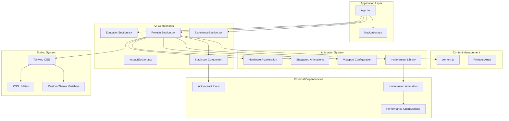

**Diagram sources**
- [App.tsx:14-34](file://src/App.tsx#L14-L34)
- [ProjectsSection.tsx:1-106](file://src/components/ProjectsSection.tsx#L1-L106)
- [content.ts:137-157](file://src/data/content.ts#L137-L157)

**Section sources**
- [App.tsx:14-34](file://src/App.tsx#L14-L34)
- [ProjectsSection.tsx:21-106](file://src/components/ProjectsSection.tsx#L21-L106)

## Core Components

The ProjectsSection component consists of several interconnected parts that work together to create a cohesive project showcase experience:

### Main Component Structure
The primary component renders a two-column layout featuring project metadata on the left and detailed project cards on the right. This structure ensures optimal information hierarchy and visual balance across different screen sizes.

### Comprehensive Animation System
The component incorporates a sophisticated animation system powered by the motion library with viewport-based triggers, staggered entrance animations, and hardware-accelerated transitions. This system provides smooth, performant animations that enhance user engagement without compromising application performance.

### Enhanced Interactive Elements
The component incorporates sophisticated hover effects with smooth transitions, transform animations, and background color changes powered by Tailwind CSS utility classes and the motion library. These enhancements create engaging user interactions with precise timing and easing configurations.

### Technology Stack Visualization
A sophisticated icon mapping system automatically assigns relevant icons to technology tags based on content matching. This dynamic approach eliminates manual icon assignment while maintaining visual consistency.

**Section sources**
- [ProjectsSection.tsx:28-106](file://src/components/ProjectsSection.tsx#L28-L106)
- [ProjectsSection.tsx:14-19](file://src/components/ProjectsSection.tsx#L14-L19)

## Architecture Overview

The ProjectsSection component participates in a well-structured application architecture that emphasizes separation of concerns and maintainability:

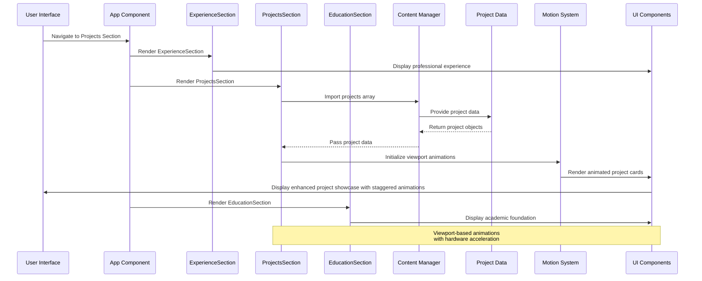

**Diagram sources**
- [App.tsx:26](file://src/App.tsx#L26)
- [ProjectsSection.tsx:4](file://src/components/ProjectsSection.tsx#L4)
- [content.ts:137-157](file://src/data/content.ts#L137-L157)

The architecture demonstrates clear data flow from content management to presentation layer, with minimal coupling between components and efficient data passing mechanisms. The strategic positioning of ProjectsSection between ExperienceSection and EducationSection creates a logical narrative flow that guides users through professional background, practical achievements, and educational foundation.

**Section sources**
- [ProjectsSection.tsx:1-4](file://src/components/ProjectsSection.tsx#L1-L4)
- [content.ts:137-157](file://src/data/content.ts#L137-L157)

## User Experience Flow and Navigation Integration

### Strategic Positioning for Optimal Flow

The ProjectsSection is strategically positioned after ExperienceSection and before EducationSection to create an intuitive user journey:

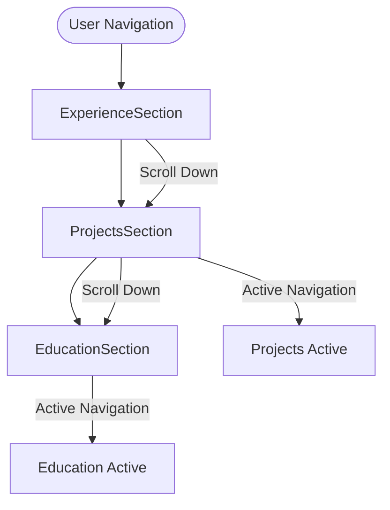

**Diagram sources**
- [App.tsx:26-28](file://src/App.tsx#L26-L28)
- [Navigation.tsx:10-40](file://src/components/Navigation.tsx#L10-L40)

### Navigation Integration

The component integrates seamlessly with the navigation system through anchor-based scrolling:

- **Anchor Links**: ProjectsSection uses `#projects` anchor for direct navigation
- **Active State Tracking**: Navigation component tracks scroll position to highlight active sections
- **Smooth Scrolling**: Combined with motion library for enhanced user experience
- **Responsive Behavior**: Navigation adapts to different screen sizes and maintains accessibility

### Content Progression Logic

The sequential arrangement follows a logical progression:
1. **Professional Experience** establishes credibility and background
2. **Projects** demonstrates practical application of skills
3. **Education** provides foundational knowledge context

This flow aligns with typical user expectations for portfolio websites, where visitors naturally progress from professional background to demonstrated capabilities to educational qualifications.

**Section sources**
- [App.tsx:26-28](file://src/App.tsx#L26-L28)
- [Navigation.tsx:10-40](file://src/components/Navigation.tsx#L10-L40)
- [content.ts:10-19](file://src/data/content.ts#L10-L19)

## Comprehensive Animation System

### Motion Wrapper Integration

The ProjectsSection component implements a comprehensive animation system powered by the motion library with sophisticated viewport-based triggers:

#### Section-Level Animation
The main section features a sophisticated entrance animation with precise timing and easing:

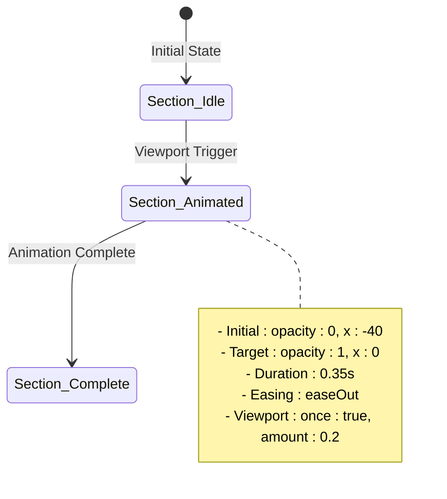

**Diagram sources**
- [ProjectsSection.tsx:29-35](file://src/components/ProjectsSection.tsx#L29-L35)

#### Project Card Animation System
Each project card implements a staggered entrance animation system with individual timing:

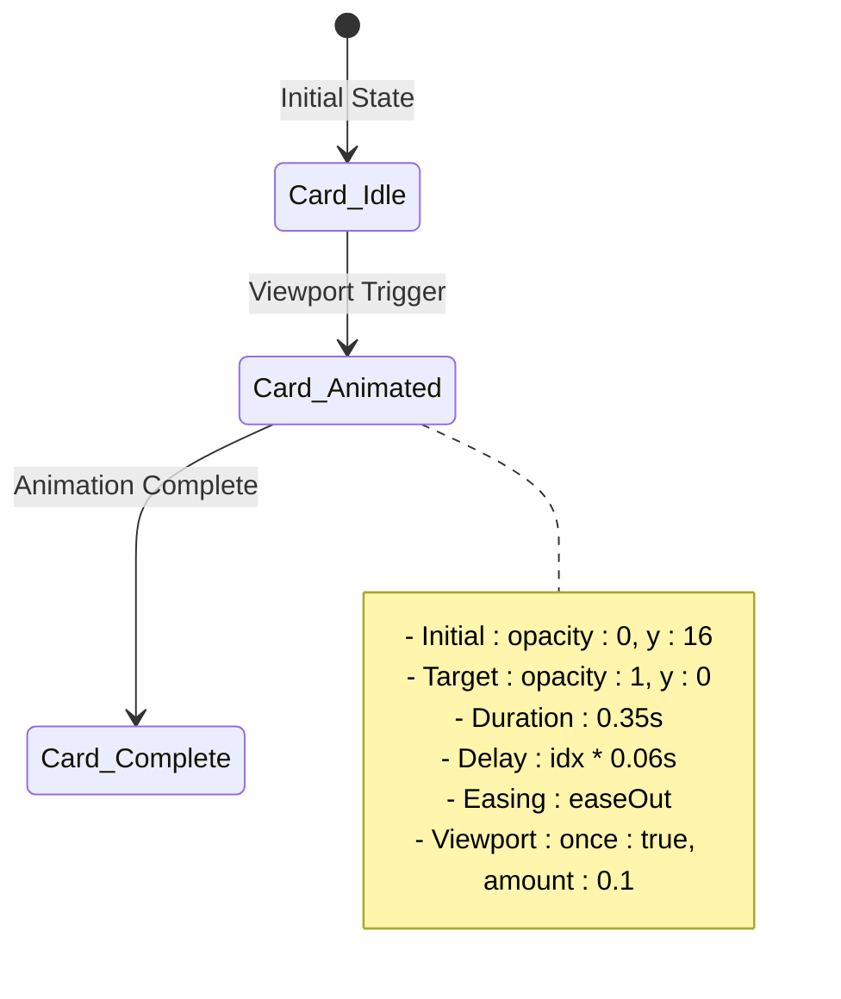

**Diagram sources**
- [ProjectsSection.tsx:52-58](file://src/components/ProjectsSection.tsx#L52-L58)

### Viewport-Based Animation Triggers

The animation system utilizes viewport-based triggers for optimal performance and user experience:

#### Performance Optimizations
- **Once Execution**: `once: true` ensures animations trigger only once per page load
- **Partial Visibility**: `amount: 0.1` for project cards and `amount: 0.2` for section metadata allows early triggering
- **Hardware Acceleration**: Automatic GPU acceleration through motion library optimizations

#### Scroll-Triggered Effects
- **Lazy Loading**: Animations only execute when elements enter the viewport
- **Memory Efficiency**: Reduced computational overhead compared to continuous animations
- **Accessibility**: Respects reduced motion preferences through viewport configuration

### Staggered Animation Patterns

The component implements sophisticated staggered animation patterns that create dynamic visual interest:

#### Timing Configuration
- **Base Duration**: 0.35 seconds for all animations
- **Stagger Delay**: 0.06 seconds per project card
- **Progressive Timing**: Earlier items animate first, creating a cascading effect
- **Easing Consistency**: All animations use "easeOut" for smooth transitions

#### Animation Sequence
1. **Section Metadata**: Enters first with slight horizontal movement
2. **Project Cards**: Enter sequentially with upward movement
3. **Technology Badges**: Appear with individual hover effects
4. **Bullet Points**: Enter last with subtle fade-in

**Section sources**
- [ProjectsSection.tsx:29-58](file://src/components/ProjectsSection.tsx#L29-L58)

## Enhanced Interactive Capabilities

### Comprehensive Hover Effects System

The ProjectsSection component implements a sophisticated hover effects system with multiple layers of interactive enhancement:

#### Project Card Hover States
The main project cards feature a comprehensive hover effect system with smooth transitions and transform animations:

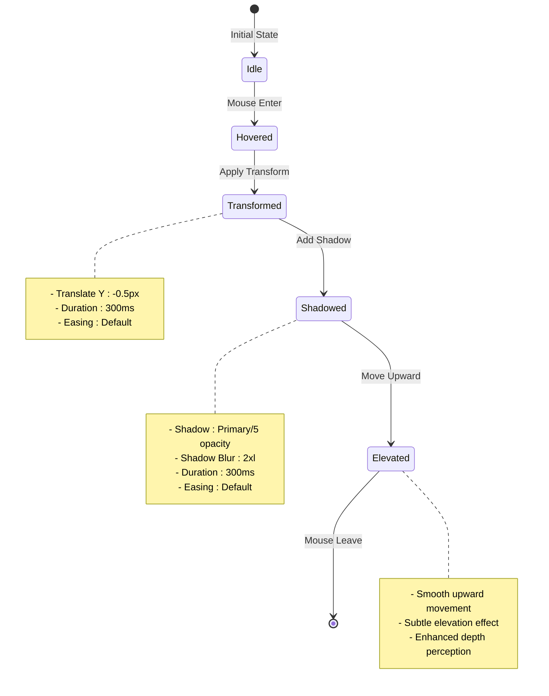

**Diagram sources**
- [ProjectsSection.tsx:58](file://src/components/ProjectsSection.tsx#L58)

#### Technology Stack Pill Hover Effects
The technology stack pills implement individualized hover interactions with distinct animation timing and visual feedback:

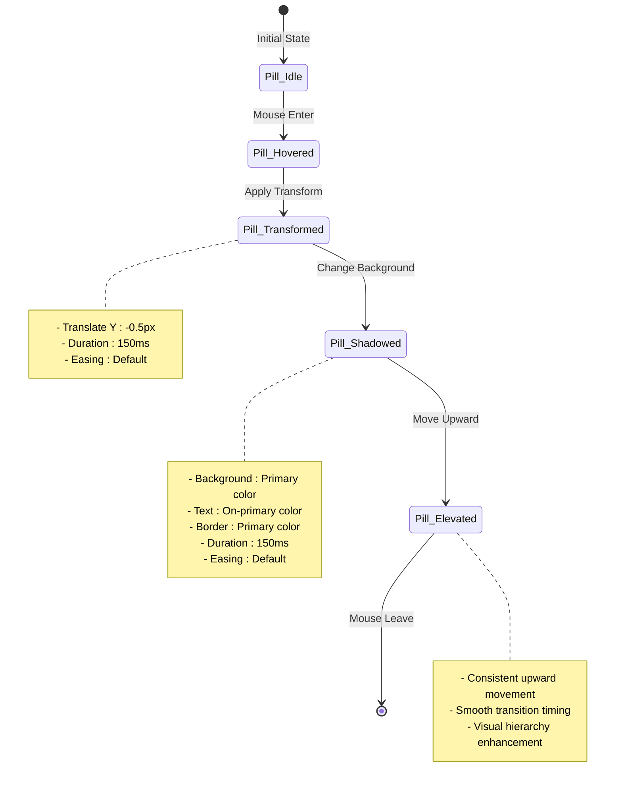

**Diagram sources**
- [ProjectsSection.tsx:76](file://src/components/ProjectsSection.tsx#L76)

#### Typography Color Transitions
The component includes sophisticated color transition effects for enhanced visual feedback:

- **Title Text**: Transitions from primary to tertiary-container on hover
- **Duration**: Smooth color transition with appropriate timing
- **Easing**: Natural color interpolation for seamless visual experience

### Animation Timing and Easing Configurations

The hover effects utilize carefully calibrated timing configurations:

| Element | Animation Type | Duration | Easing | Transform Value |
|---------|---------------|----------|--------|-----------------|
| Project Cards | Shadow & Transform | 300ms | Default | -translate-y-0.5 |
| Technology Pills | Background & Transform | 150ms | Default | -translate-y-0.5 |
| Title Text | Color Transition | Variable | Smooth | N/A |
| Overall Layout | Staggered Entry | 8ms per item | Progressive | Fade & Slide |

### Visual Feedback Systems

The enhanced hover effects provide comprehensive visual feedback:

- **Depth Enhancement**: Subtle shadow additions create perceived elevation
- **Movement Cues**: Upward movement signals interactivity and engagement
- **Color Harmony**: Consistent color transitions maintain visual coherence
- **Timing Coordination**: Staggered animations create dynamic visual interest

**Section sources**
- [ProjectsSection.tsx:58-82](file://src/components/ProjectsSection.tsx#L58-L82)

## Detailed Component Analysis

### Component Structure and Layout

The ProjectsSection implements a responsive two-column grid system that adapts to different screen sizes:

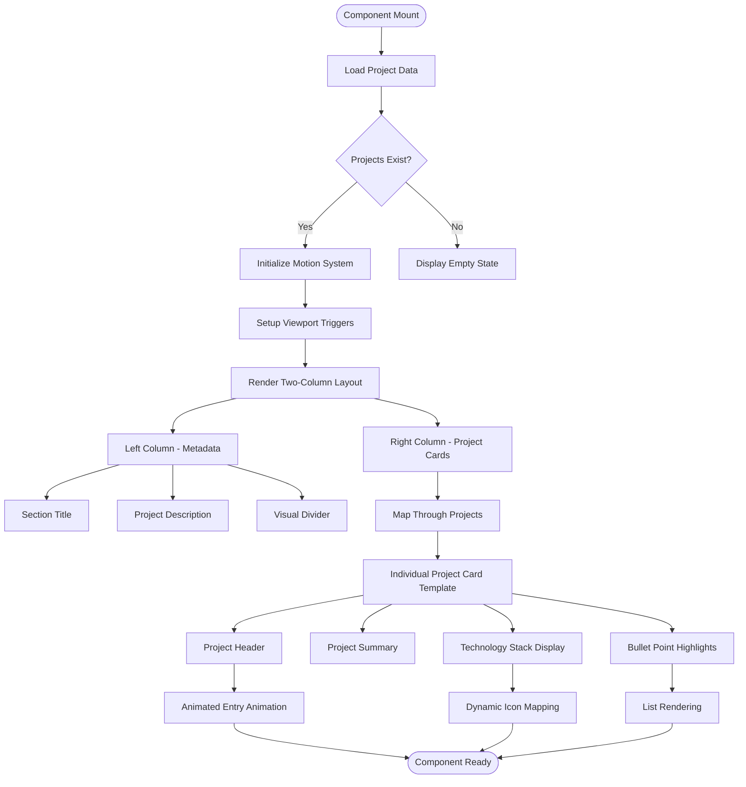

**Diagram sources**
- [ProjectsSection.tsx:44-106](file://src/components/ProjectsSection.tsx#L44-L106)

### Technology Stack Visualization Implementation

The technology stack visualization employs a sophisticated icon mapping system that automatically assigns relevant icons based on technology names:

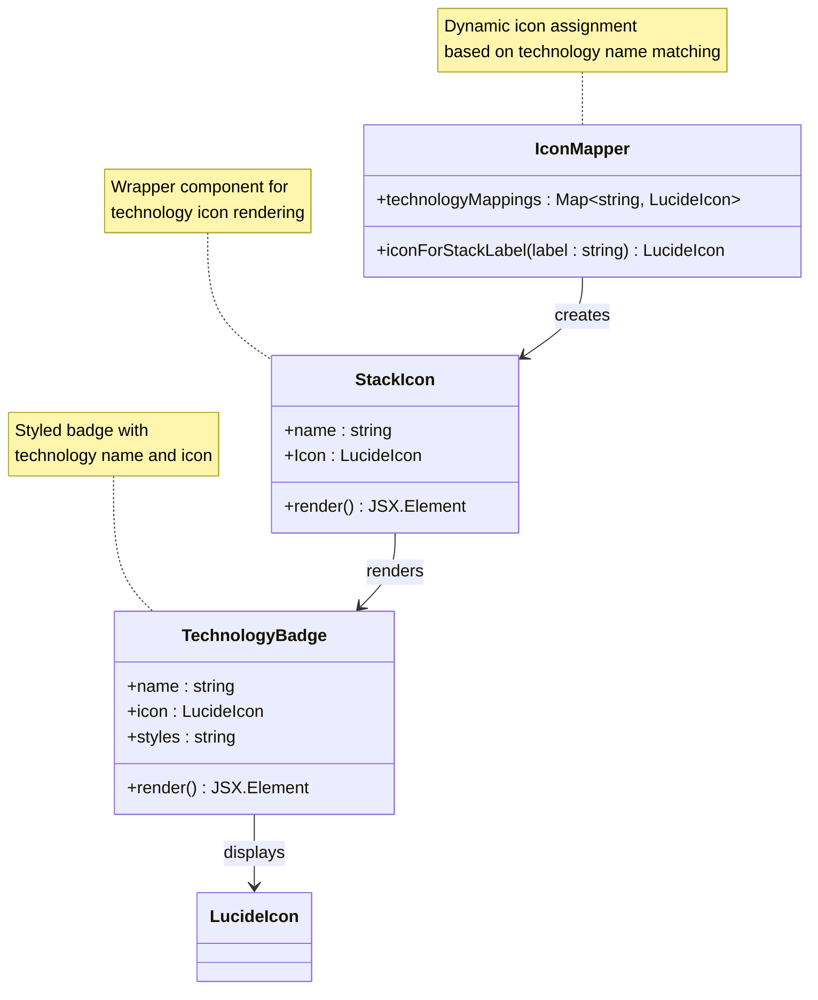

**Diagram sources**
- [ProjectsSection.tsx:6-19](file://src/components/ProjectsSection.tsx#L6-L19)

**Section sources**
- [ProjectsSection.tsx:6-19](file://src/components/ProjectsSection.tsx#L6-L19)

## Technology Stack Visualization

### Icon Mapping System

The component implements an intelligent icon mapping system that automatically assigns relevant icons to technology tags:

| Technology Pattern | Icon Type | Purpose |
|-------------------|-----------|---------|
| "Python" | Terminal | Programming language identification |
| "SQL" or "PostgreSQL" | Database | Database and query language representation |
| "Power BI" | BarChart3 | Business intelligence and visualization |
| "Pandas" | Terminal | Data manipulation library |

### Enhanced Badge Design System

Each technology badge follows a consistent design pattern with specific styling requirements and sophisticated hover interactions:

- **Size**: 14px icon with 10px text
- **Padding**: 3px vertical, 3px horizontal
- **Border**: Subtle outline with transparency
- **Background**: Surface container with low opacity
- **Text**: 10px font size with uppercase tracking
- **Hover Effects**: Smooth background transitions, color changes, and subtle upward movement

### Responsive Behavior

The technology badges adapt to different screen sizes through flexible wrapping and spacing mechanisms, ensuring optimal display across mobile, tablet, and desktop devices.

**Section sources**
- [ProjectsSection.tsx:6-19](file://src/components/ProjectsSection.tsx#L6-L19)
- [ProjectsSection.tsx:72-82](file://src/components/ProjectsSection.tsx#L72-L82)

## Project Data Structure

### Required Data Schema

The project data structure follows a strict schema that defines the expected properties for each project entry:

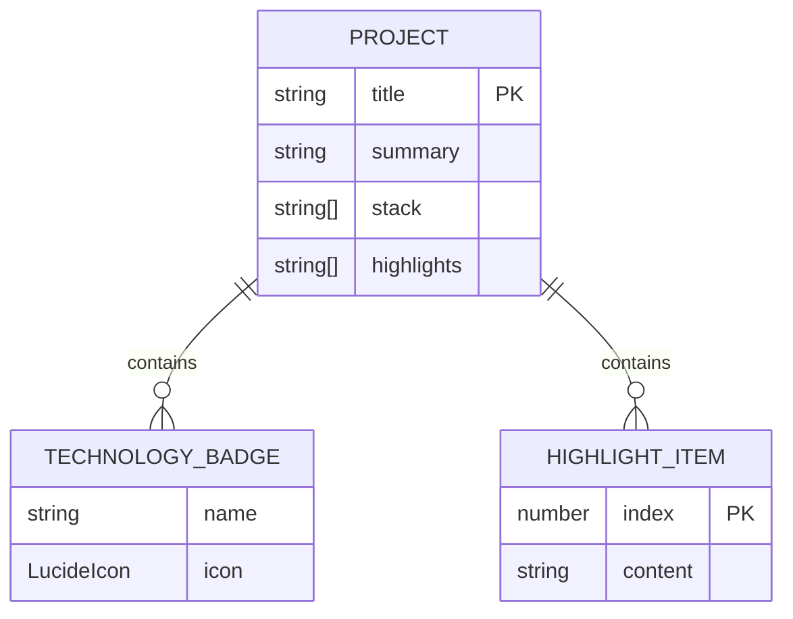

**Diagram sources**
- [content.ts:137-157](file://src/data/content.ts#L137-L157)

### Data Validation Requirements

Each project entry must satisfy the following validation criteria:
- **title**: Required string property for project identification
- **summary**: Required descriptive text explaining project scope
- **stack**: Required array of technology strings for skill visualization
- **highlights**: Required array of achievement/benefit statements

### Example Project Structure

The existing project demonstrates the complete data structure with five key highlight areas covering problem definition, data engineering, analysis execution, visualization development, and communication outcomes.

**Section sources**
- [content.ts:142-156](file://src/data/content.ts#L142-L156)

## Filtering Mechanisms

### Current Implementation Status

The ProjectsSection component currently implements a straightforward data rendering mechanism without built-in filtering capabilities. All projects from the content data are rendered sequentially without user interaction.

### Potential Enhancement Areas

Future enhancements could include:

#### Category-Based Filtering
- **Technology Categories**: Filter projects by specific technologies (Python, SQL, Power BI)
- **Project Types**: Separate between data engineering, analysis, and visualization projects
- **Time Period**: Filter projects by completion date or timeframe

#### Interactive Filtering Options
- **Multi-select Filters**: Allow users to combine multiple filter criteria
- **Search Functionality**: Enable text-based project discovery
- **Visual Indicators**: Show filter status and available options

#### Implementation Approach
The filtering system would integrate with the existing data structure while maintaining backward compatibility and performance optimization.

**Section sources**
- [content.ts:137-157](file://src/data/content.ts#L137-L157)

## Responsive Layout Implementation

### Grid System Architecture

The component utilizes a sophisticated responsive grid system that adapts to different screen sizes:

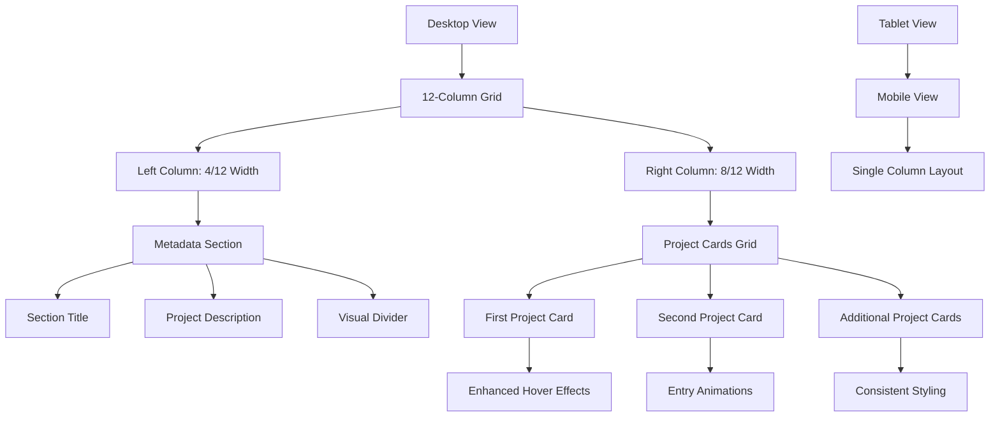

**Diagram sources**
- [ProjectsSection.tsx:28-106](file://src/components/ProjectsSection.tsx#L28-L106)

### Breakpoint Specifications

The layout implements the following responsive breakpoints:
- **Mobile**: Single column layout with full-width cards
- **Tablet**: Modified spacing and typography adjustments
- **Desktop**: Full two-column grid with optimized content distribution

### Animation and Interaction

The component incorporates smooth animations for enhanced user experience:
- **Entry Animations**: Staggered fade-in effects with progressive delays (0.06s per item)
- **Hover Effects**: Sophisticated transform animations with precise timing
- **Interactive States**: Consistent feedback for user interactions with smooth transitions

**Section sources**
- [ProjectsSection.tsx:28-106](file://src/components/ProjectsSection.tsx#L28-L106)

## Performance Considerations

### Animation Performance Optimizations

The component implements several performance optimization techniques specifically designed for the enhanced animation system:

#### Viewport-Based Animation Performance
- **Lazy Loading**: Only render animations when elements enter the viewport
- **Single Execution**: `once: true` prevents repeated animation triggers
- **Partial Visibility**: `amount: 0.1` for project cards allows early triggering without full visibility
- **Hardware Acceleration**: Automatic GPU acceleration through motion library optimizations

#### Memory Management
- **Component Isolation**: Self-contained component prevents memory leaks
- **Event Cleanup**: Proper cleanup of scroll listeners and event handlers
- **Resource Optimization**: Minimal external dependencies for reduced bundle size

#### Bundle Size Considerations
- **Selective Imports**: Import only required icon components
- **Animation Libraries**: Use lightweight animation library with tree-shaking support
- **CSS Optimization**: Leverage Tailwind utilities for efficient styling

### Hardware Acceleration Features

The animation system leverages modern browser capabilities for optimal performance:

#### CSS Transform Optimization
- **GPU-Accelerated Transforms**: Automatic hardware acceleration for transform animations
- **Backface Visibility**: Hidden backface for 3D transforms
- **Preserve 3D**: Maintains 3D positioning for complex animations

#### Motion Library Benefits
- **Optimized Rendering**: Efficient DOM manipulation through motion library
- **Reduced Jank**: Minimizes layout thrashing through smart animation batching
- **Performance Monitoring**: Built-in performance optimizations and debugging tools

### Scalability Factors

The component architecture supports scalability through:
- **Data-Driven Design**: Easy addition of new projects without code changes
- **Template Reusability**: Consistent card template for uniform presentation
- **Theme Integration**: Seamless integration with global design system

**Section sources**
- [ProjectsSection.tsx:46-52](file://src/components/ProjectsSection.tsx#L46-L52)
- [package.json:23](file://package.json#L23)
- [index.css:58-66](file://src/index.css#L58-L66)

## Customization Guide

### Adding New Projects

To add new projects to the showcase:

1. **Data Structure Modification**
   - Navigate to the content data file
   - Add a new project object to the projects array
   - Ensure all required properties are included

2. **Technology Stack Updates**
   - Add technology names to the stack array
   - The icon mapping system will automatically assign appropriate icons
   - For custom icons, extend the icon mapping function

3. **Highlight Content Creation**
   - Write compelling achievement statements
   - Focus on measurable outcomes and business impact
   - Maintain consistent formatting and tone

### Customizing Animation Parameters

The animation system offers extensive customization options:

#### Timing Configuration
```typescript
// Section animation customization
<motion.div
  initial={{ opacity: 0, x: -40 }}
  whileInView={{ opacity: 1, x: 0 }}
  viewport={{ once: true, amount: 0.2 }}
  transition={{ duration: 0.35, ease: "easeOut" }}
>

// Project card animation customization
<motion.article
  initial={{ opacity: 0, y: 16 }}
  whileInView={{ opacity: 1, y: 0 }}
  viewport={{ once: true, amount: 0.1 }}
  transition={{ duration: 0.35, delay: idx * 0.06, ease: "easeOut" }}
>
```

#### Viewport Configuration
- **once**: Controls single vs repeated animation execution
- **amount**: Defines visibility threshold for trigger activation
- **margin**: Allows offset-based viewport triggering

#### Stagger Pattern Customization
- **Delay Calculation**: Adjust `idx * 0.06` for different stagger speeds
- **Duration Scaling**: Modify base duration for dramatic effects
- **Easing Variations**: Experiment with different easing functions

### Customizing Technology Badges

The technology badge system offers several customization options:

#### Icon Customization
```typescript
// Extend the icon mapping function
function iconForStackLabel(label: string): LucideIcon {
  // Existing mappings...
  if (label.includes("CustomTech")) return CustomIcon;
  return Database; // Default fallback
}
```

#### Styling Modifications
- **Color Variations**: Modify theme variables for different badge appearances
- **Size Adjustments**: Adjust padding and typography for different contexts
- **Border Customization**: Change border styles and opacity levels
- **Animation Timing**: Adjust hover effect durations and easing curves

### Implementing Project Categories

To implement project categorization:

1. **Data Model Enhancement**
   ```typescript
   interface Project {
     title: string;
     summary: string;
     stack: string[];
     highlights: string[];
     category: string; // New property
   }
   ```

2. **Filter Implementation**
   - Create category filter dropdown
   - Implement category-based filtering logic
   - Add visual indicators for active filters

3. **UI Integration**
   - Add category badges to project cards
   - Implement category-specific styling
   - Ensure accessibility compliance

**Section sources**
- [content.ts:142-156](file://src/data/content.ts#L142-L156)
- [ProjectsSection.tsx:6-12](file://src/components/ProjectsSection.tsx#L6-L12)

## Troubleshooting Guide

### Common Issues and Solutions

#### Animation Performance Issues
**Issue**: Staggered animations feel sluggish or inconsistent
**Solution**: Optimize animation configurations
- Verify CSS transition durations are appropriate
- Check for conflicting animation libraries
- Ensure hardware acceleration is enabled for transforms

#### Viewport Animation Problems
**Issue**: Animations not triggering on scroll
**Solution**: Verify viewport configuration
- Check `viewport={{ once: true, amount: 0.1 }}` settings
- Ensure proper container sizing for viewport detection
- Verify scroll event listeners are not interfering

#### Hover Effect Performance Issues
**Issue**: Hover animations feel sluggish or inconsistent
**Solution**: Optimize animation configurations
- Verify CSS transition durations are appropriate
- Check for conflicting animation libraries
- Ensure hardware acceleration is enabled for transforms

#### Layout Rendering Issues
**Issue**: Projects not displaying in grid layout
**Solution**: Validate CSS class names and responsive breakpoints
- Check Tailwind CSS configuration
- Verify grid column classes are applied correctly
- Ensure proper container sizing

#### Animation Performance Problems
**Issue**: Slow or janky animations
**Solution**: Optimize motion component usage
- Reduce animation complexity for mobile devices
- Implement proper viewport configuration
- Consider disabling animations on reduced motion preferences

#### Data Loading Errors
**Issue**: Projects not loading from content data
**Solution**: Verify data import and export statements
- Check file paths for content imports
- Validate TypeScript type definitions
- Ensure proper module exports

### Debugging Tools and Techniques

#### Development Tools
- **React DevTools**: Inspect component props and state
- **Browser Console**: Monitor JavaScript errors and warnings
- **Network Tab**: Verify data loading and asset requests

#### Performance Monitoring
- **Lighthouse**: Audit performance and accessibility
- **Chrome DevTools**: Profile component rendering performance
- **Memory Profiling**: Monitor memory usage and leaks

**Section sources**
- [ProjectsSection.tsx:6-12](file://src/components/ProjectsSection.tsx#L6-L12)
- [content.ts:137-157](file://src/data/content.ts#L137-L157)

## Conclusion

The ProjectsSection component represents a sophisticated implementation of modern web development practices, combining technical excellence with aesthetic appeal. Its architecture demonstrates clear separation of concerns, efficient data management, and responsive design principles that ensure optimal user experience across all devices.

**Updated**: The component has undergone a comprehensive animation overhaul featuring motion wrapper integration, viewport-based triggers, staggered entrance animations, and refined transition timing. The new animation system provides enhanced user engagement while maintaining optimal performance through hardware acceleration and lazy loading optimizations.

The component's strength lies in its ability to effectively communicate complex analytical work through structured presentation and visual storytelling. The sophisticated animation system with precise timing configurations creates a premium user experience that distinguishes this portfolio piece from conventional implementations.

The technology stack visualization system provides immediate recognition of technical competencies, while the bullet-point highlight sections clearly articulate project outcomes and business impact. The comprehensive animation system with viewport-based triggers and staggered timing creates dynamic visual interest that enhances user engagement without compromising performance.

Through its integration with the broader application ecosystem and adherence to design system principles, the ProjectsSection component serves as both a functional showcase and a demonstration of professional development standards. The component's extensible architecture supports future enhancements while maintaining backward compatibility and performance optimization.

The strategic positioning after ExperienceSection and before EducationSection creates an optimal user experience flow that guides visitors through professional background, practical achievements, and educational foundation. This arrangement aligns with user expectations and enhances the overall narrative of the portfolio website.

**Important Note**: While the current implementation maintains the standalone ProjectsSection component, the update reason indicates that this functionality is planned to be consolidated into the unified ImpactSection visualization approach. This consolidation would integrate project showcases into animated visualizations within ImpactSection, potentially enhancing the overall user experience through combined data visualization and project presentation.

This implementation exemplifies how modern React applications can effectively present technical expertise while maintaining excellent user experience, accessibility, and performance characteristics essential for professional portfolio websites.