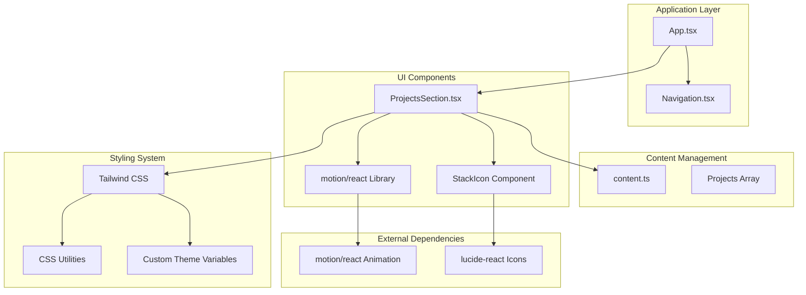
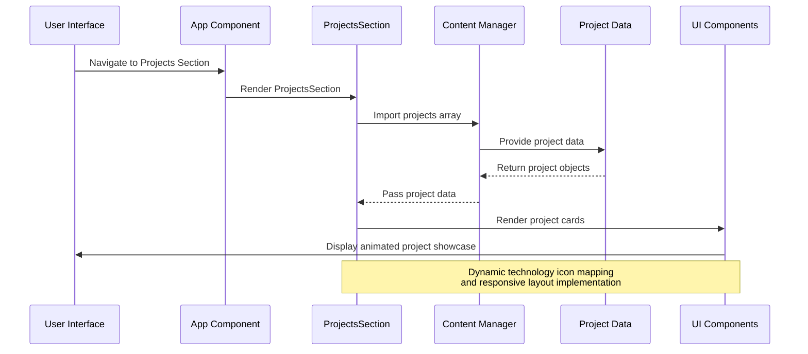
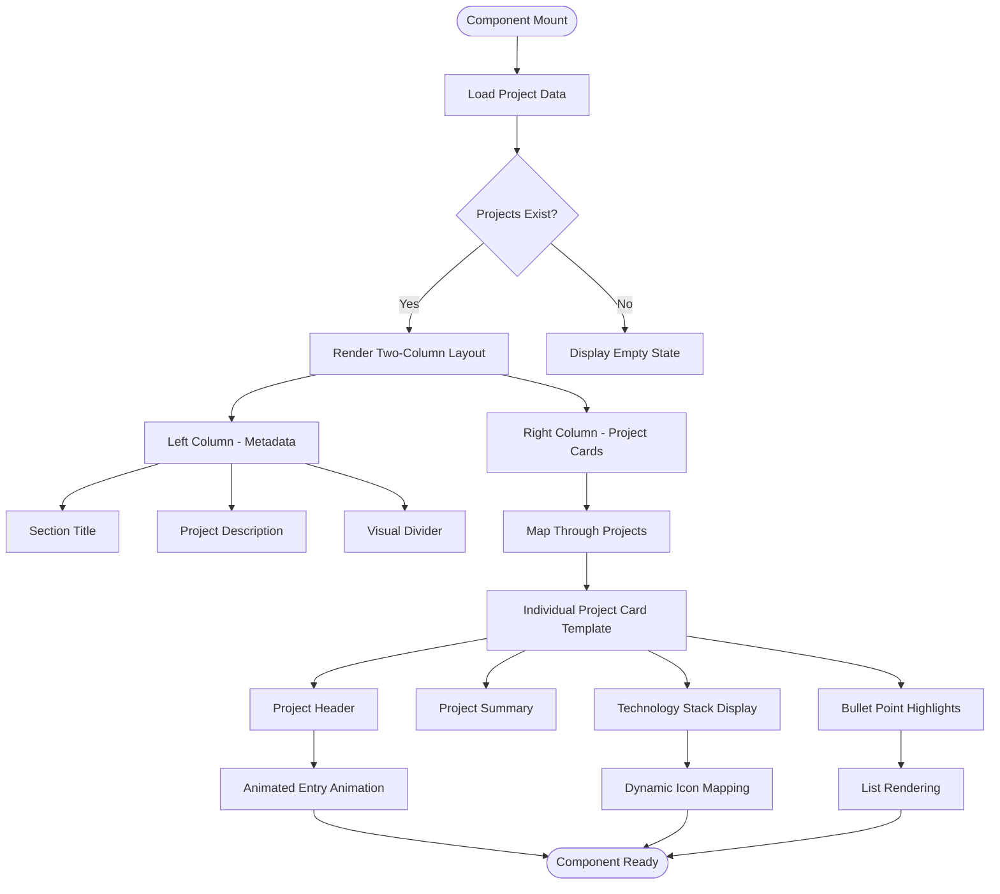
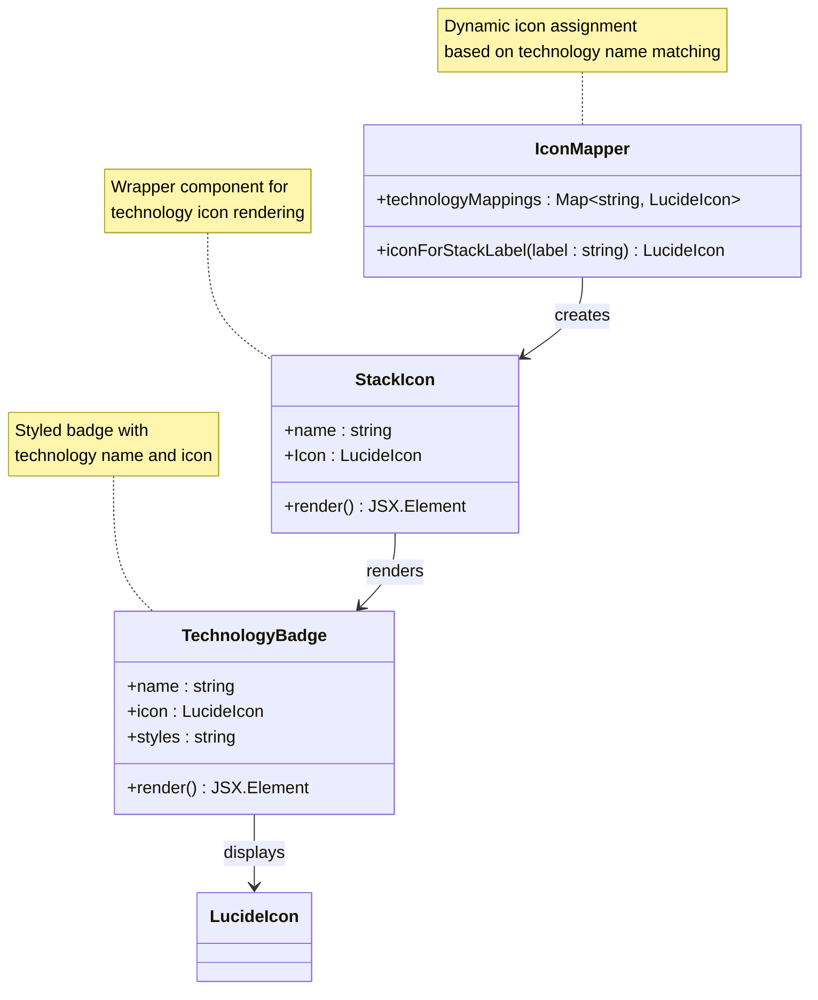
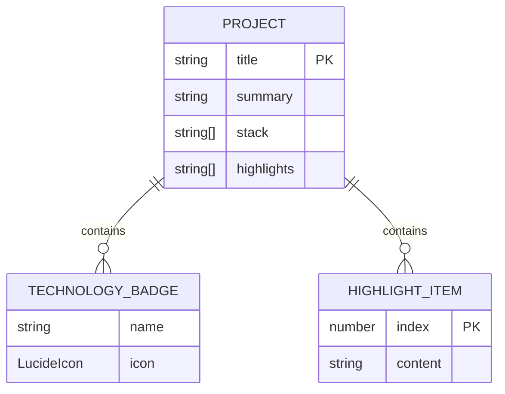
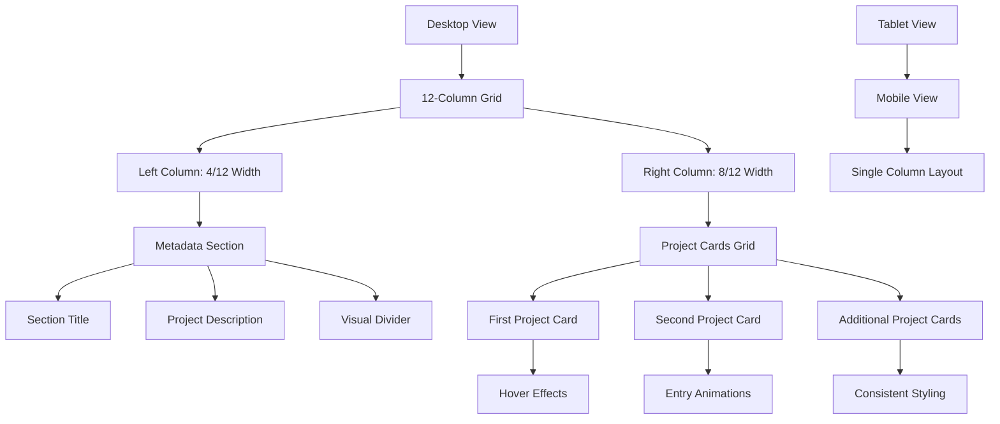

# ProjectsSection Component

<cite>
**Referenced Files in This Document**
- [ProjectsSection.tsx](file://src/components/ProjectsSection.tsx)
- [content.ts](file://src/data/content.ts)
- [App.tsx](file://src/App.tsx)
- [Navigation.tsx](file://src/components/Navigation.tsx)
- [index.css](file://src/index.css)
- [package.json](file://package.json)
</cite>

## Table of Contents
1. [Introduction](#introduction)
2. [Project Structure](#project-structure)
3. [Core Components](#core-components)
4. [Architecture Overview](#architecture-overview)
5. [Detailed Component Analysis](#detailed-component-analysis)
6. [Technology Stack Visualization](#technology-stack-visualization)
7. [Project Data Structure](#project-data-structure)
8. [Filtering Mechanisms](#filtering-mechanisms)
9. [Responsive Layout Implementation](#responsive-layout-implementation)
10. [Performance Considerations](#performance-considerations)
11. [Customization Guide](#customization-guide)
12. [Troubleshooting Guide](#troubleshooting-guide)
13. [Conclusion](#conclusion)

## Introduction

The ProjectsSection component serves as a comprehensive showcase of data analytics projects, demonstrating technical expertise and analytical problem-solving capabilities. This component presents a curated collection of professional projects with detailed technology stack visualization, bullet-point highlight sections, and responsive design implementation. It functions as a central portfolio piece that communicates both technical competency and business acumen through real-world analytics case studies.

The component integrates seamlessly with the overall application architecture, positioned strategically within the main content flow to maximize visibility and impact. Its design emphasizes clean presentation of complex analytical work while maintaining excellent readability and accessibility standards.

## Project Structure

The ProjectsSection component follows a modular architecture within the React application ecosystem. The component is organized as a self-contained module that imports project data from a centralized content management system and utilizes external libraries for enhanced user experience.



**Diagram sources**
- [App.tsx:15-32](file://src/App.tsx#L15-L32)
- [ProjectsSection.tsx:1-100](file://src/components/ProjectsSection.tsx#L1-L100)
- [content.ts:83-103](file://src/data/content.ts#L83-L103)

**Section sources**
- [App.tsx:15-32](file://src/App.tsx#L15-L32)
- [ProjectsSection.tsx:21-99](file://src/components/ProjectsSection.tsx#L21-L99)

## Core Components

The ProjectsSection component consists of several interconnected parts that work together to create a cohesive project showcase experience:

### Main Component Structure
The primary component renders a two-column layout featuring project metadata on the left and detailed project cards on the right. This structure ensures optimal information hierarchy and visual balance across different screen sizes.

### Technology Stack Visualization
A sophisticated icon mapping system automatically assigns relevant icons to technology tags based on content matching. This dynamic approach eliminates manual icon assignment while maintaining visual consistency.

### Interactive Elements
The component incorporates smooth animations and hover effects powered by the motion library, creating engaging user interactions without compromising performance.

**Section sources**
- [ProjectsSection.tsx:28-96](file://src/components/ProjectsSection.tsx#L28-L96)
- [ProjectsSection.tsx:14-19](file://src/components/ProjectsSection.tsx#L14-L19)

## Architecture Overview

The ProjectsSection component participates in a well-structured application architecture that emphasizes separation of concerns and maintainability:



**Diagram sources**
- [App.tsx:24](file://src/App.tsx#L24)
- [ProjectsSection.tsx:4](file://src/components/ProjectsSection.tsx#L4)
- [content.ts:83-103](file://src/data/content.ts#L83-L103)

The architecture demonstrates clear data flow from content management to presentation layer, with minimal coupling between components and efficient data passing mechanisms.

**Section sources**
- [ProjectsSection.tsx:1-4](file://src/components/ProjectsSection.tsx#L1-L4)
- [content.ts:83-103](file://src/data/content.ts#L83-L103)

## Detailed Component Analysis

### Component Structure and Layout

The ProjectsSection implements a responsive two-column grid system that adapts to different screen sizes:



**Diagram sources**
- [ProjectsSection.tsx:44-93](file://src/components/ProjectsSection.tsx#L44-L93)

### Technology Stack Visualization Implementation

The technology stack visualization employs a sophisticated icon mapping system that automatically assigns relevant icons based on technology names:



**Diagram sources**
- [ProjectsSection.tsx:6-19](file://src/components/ProjectsSection.tsx#L6-L19)

**Section sources**
- [ProjectsSection.tsx:6-19](file://src/components/ProjectsSection.tsx#L6-L19)

## Technology Stack Visualization

### Icon Mapping System

The component implements an intelligent icon mapping system that automatically assigns relevant icons to technology tags:

| Technology Pattern | Icon Type | Purpose |
|-------------------|-----------|---------|
| "Python" | Terminal | Programming language identification |
| "SQL" or "PostgreSQL" | Database | Database and query language representation |
| "Power BI" | BarChart3 | Business intelligence and visualization |
| "Pandas" | Terminal | Data manipulation library |

### Badge Design System

Each technology badge follows a consistent design pattern with specific styling requirements:
- **Size**: 14px icon with 10px text
- **Padding**: 3px vertical, 3px horizontal
- **Border**: Subtle outline with transparency
- **Background**: Surface container with low opacity
- **Text**: 10px font size with uppercase tracking

### Responsive Behavior

The technology badges adapt to different screen sizes through flexible wrapping and spacing mechanisms, ensuring optimal display across mobile, tablet, and desktop devices.

**Section sources**
- [ProjectsSection.tsx:6-19](file://src/components/ProjectsSection.tsx#L6-L19)
- [ProjectsSection.tsx:66-76](file://src/components/ProjectsSection.tsx#L66-L76)

## Project Data Structure

### Required Data Schema

The project data structure follows a strict schema that defines the expected properties for each project entry:



**Diagram sources**
- [content.ts:83-103](file://src/data/content.ts#L83-L103)

### Data Validation Requirements

Each project entry must satisfy the following validation criteria:
- **title**: Required string property for project identification
- **summary**: Required descriptive text explaining project scope
- **stack**: Required array of technology strings for skill visualization
- **highlights**: Required array of achievement/benefit statements

### Example Project Structure

The existing project demonstrates the complete data structure with five key highlight areas covering problem definition, data engineering, analysis execution, visualization development, and communication outcomes.

**Section sources**
- [content.ts:88-102](file://src/data/content.ts#L88-L102)

## Filtering Mechanisms

### Current Implementation Status

The ProjectsSection component currently implements a straightforward data rendering mechanism without built-in filtering capabilities. All projects from the content data are rendered sequentially without user interaction.

### Potential Enhancement Areas

Future enhancements could include:

#### Category-Based Filtering
- **Technology Categories**: Filter projects by specific technologies (Python, SQL, Power BI)
- **Project Types**: Separate between data engineering, analysis, and visualization projects
- **Time Period**: Filter projects by completion date or timeframe

#### Interactive Filtering Options
- **Multi-select Filters**: Allow users to combine multiple filter criteria
- **Search Functionality**: Enable text-based project discovery
- **Visual Indicators**: Show filter status and available options

#### Implementation Approach
The filtering system would integrate with the existing data structure while maintaining backward compatibility and performance optimization.

**Section sources**
- [content.ts:83-103](file://src/data/content.ts#L83-L103)

## Responsive Layout Implementation

### Grid System Architecture

The component utilizes a sophisticated responsive grid system that adapts to different screen sizes:



**Diagram sources**
- [ProjectsSection.tsx:28-96](file://src/components/ProjectsSection.tsx#L28-L96)

### Breakpoint Specifications

The layout implements the following responsive breakpoints:
- **Mobile**: Single column layout with full-width cards
- **Tablet**: Modified spacing and typography adjustments
- **Desktop**: Full two-column grid with optimized content distribution

### Animation and Interaction

The component incorporates smooth animations for enhanced user experience:
- **Entry Animations**: Staggered fade-in effects with progressive delays
- **Hover Effects**: Subtle elevation and shadow transitions
- **Interactive States**: Consistent feedback for user interactions

**Section sources**
- [ProjectsSection.tsx:28-96](file://src/components/ProjectsSection.tsx#L28-L96)

## Performance Considerations

### Optimization Strategies

The component implements several performance optimization techniques:

#### Lazy Loading Implementation
- **Motion Components**: Only render animations when elements enter the viewport
- **Conditional Rendering**: Prevent unnecessary re-renders through proper key usage
- **Efficient Data Binding**: Map over static arrays without complex computations

#### Memory Management
- **Component Isolation**: Self-contained component prevents memory leaks
- **Event Cleanup**: Proper cleanup of scroll listeners and event handlers
- **Resource Optimization**: Minimal external dependencies for reduced bundle size

#### Bundle Size Considerations
- **Selective Imports**: Import only required icon components
- **Animation Libraries**: Use lightweight animation library with tree-shaking support
- **CSS Optimization**: Leverage Tailwind utilities for efficient styling

### Scalability Factors

The component architecture supports scalability through:
- **Data-Driven Design**: Easy addition of new projects without code changes
- **Template Reusability**: Consistent card template for uniform presentation
- **Theme Integration**: Seamless integration with global design system

**Section sources**
- [ProjectsSection.tsx:46-52](file://src/components/ProjectsSection.tsx#L46-L52)
- [package.json:13-24](file://package.json#L13-L24)

## Customization Guide

### Adding New Projects

To add new projects to the showcase:

1. **Data Structure Modification**
   - Navigate to the content data file
   - Add a new project object to the projects array
   - Ensure all required properties are included

2. **Technology Stack Updates**
   - Add technology names to the stack array
   - The icon mapping system will automatically assign appropriate icons
   - For custom icons, extend the icon mapping function

3. **Highlight Content Creation**
   - Write compelling achievement statements
   - Focus on measurable outcomes and business impact
   - Maintain consistent formatting and tone

### Customizing Technology Badges

The technology badge system offers several customization options:

#### Icon Customization
```typescript
// Extend the icon mapping function
function iconForStackLabel(label: string): LucideIcon {
  // Existing mappings...
  if (label.includes("CustomTech")) return CustomIcon;
  return Database; // Default fallback
}
```

#### Styling Modifications
- **Color Variations**: Modify theme variables for different badge appearances
- **Size Adjustments**: Adjust padding and typography for different contexts
- **Border Customization**: Change border styles and opacity levels

### Implementing Project Categories

To implement project categorization:

1. **Data Model Enhancement**
   ```typescript
   interface Project {
     title: string;
     summary: string;
     stack: string[];
     highlights: string[];
     category: string; // New property
   }
   ```

2. **Filter Implementation**
   - Create category filter dropdown
   - Implement category-based filtering logic
   - Add visual indicators for active filters

3. **UI Integration**
   - Add category badges to project cards
   - Implement category-specific styling
   - Ensure accessibility compliance

**Section sources**
- [content.ts:88-102](file://src/data/content.ts#L88-L102)
- [ProjectsSection.tsx:6-12](file://src/components/ProjectsSection.tsx#L6-L12)

## Troubleshooting Guide

### Common Issues and Solutions

#### Icon Display Problems
**Issue**: Technology icons not displaying correctly
**Solution**: Verify technology names match the icon mapping criteria
- Check for typos in technology names
- Ensure proper case sensitivity in matching logic
- Confirm lucide-react icons are properly imported

#### Layout Rendering Issues
**Issue**: Projects not displaying in grid layout
**Solution**: Validate CSS class names and responsive breakpoints
- Check Tailwind CSS configuration
- Verify grid column classes are applied correctly
- Ensure proper container sizing

#### Animation Performance Problems
**Issue**: Slow or janky animations
**Solution**: Optimize motion component usage
- Reduce animation complexity for mobile devices
- Implement proper viewport configuration
- Consider disabling animations on reduced motion preferences

#### Data Loading Errors
**Issue**: Projects not loading from content data
**Solution**: Verify data import and export statements
- Check file paths for content imports
- Validate TypeScript type definitions
- Ensure proper module exports

### Debugging Tools and Techniques

#### Development Tools
- **React DevTools**: Inspect component props and state
- **Browser Console**: Monitor JavaScript errors and warnings
- **Network Tab**: Verify data loading and asset requests

#### Performance Monitoring
- **Lighthouse**: Audit performance and accessibility
- **Chrome DevTools**: Profile component rendering performance
- **Memory Profiling**: Monitor memory usage and leaks

**Section sources**
- [ProjectsSection.tsx:6-12](file://src/components/ProjectsSection.tsx#L6-L12)
- [content.ts:83-103](file://src/data/content.ts#L83-L103)

## Conclusion

The ProjectsSection component represents a sophisticated implementation of modern web development practices, combining technical excellence with aesthetic appeal. Its architecture demonstrates clear separation of concerns, efficient data management, and responsive design principles that ensure optimal user experience across all devices.

The component's strength lies in its ability to effectively communicate complex analytical work through structured presentation and visual storytelling. The technology stack visualization system provides immediate recognition of technical competencies, while the bullet-point highlight sections clearly articulate project outcomes and business impact.

Through its integration with the broader application ecosystem and adherence to design system principles, the ProjectsSection component serves as both a functional showcase and a demonstration of professional development standards. The component's extensible architecture supports future enhancements while maintaining backward compatibility and performance optimization.

This implementation exemplifies how modern React applications can effectively present technical expertise while maintaining excellent user experience, accessibility, and performance characteristics essential for professional portfolio websites.