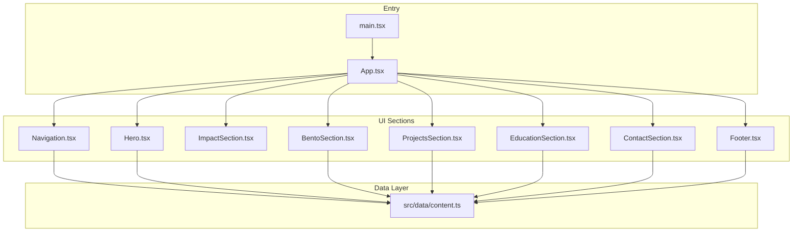
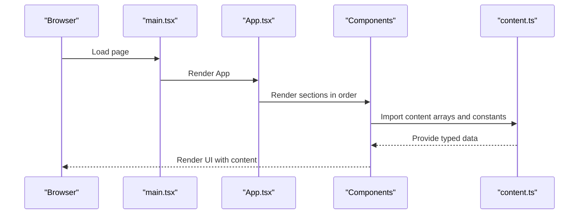
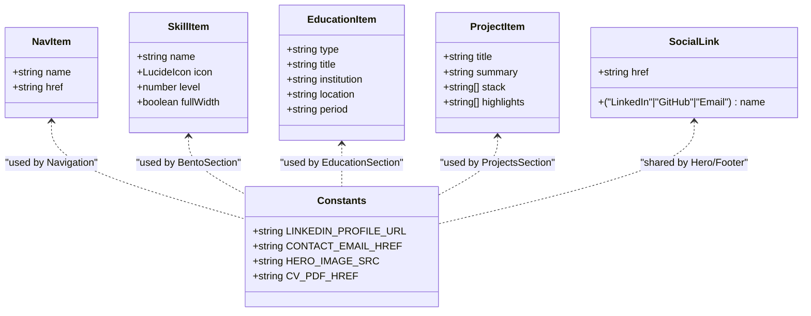
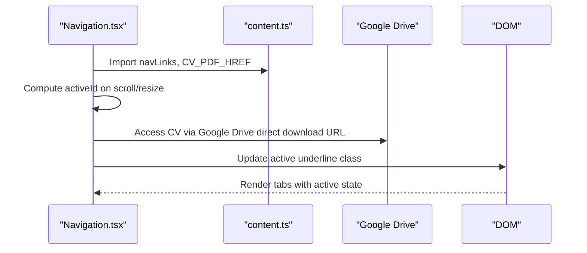
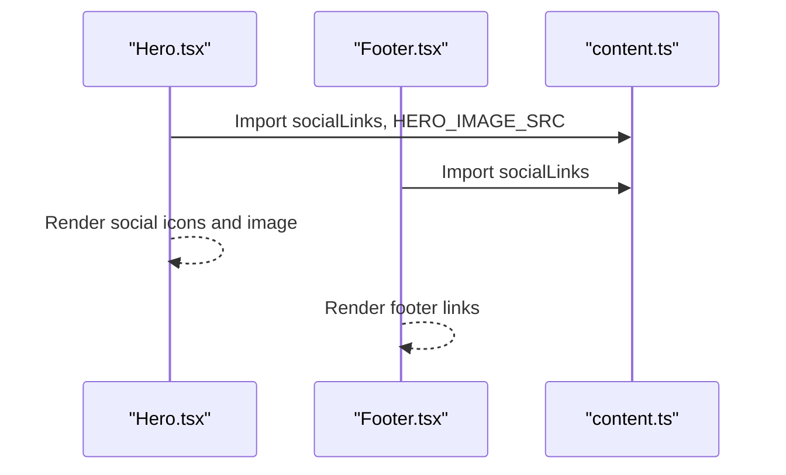
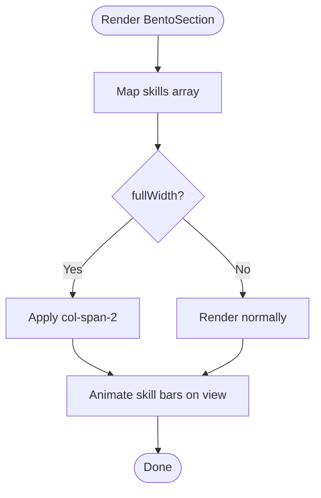
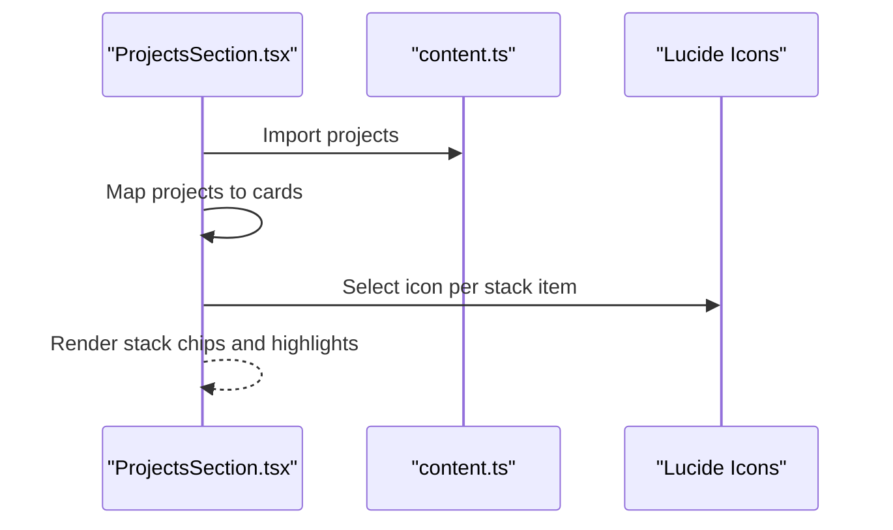
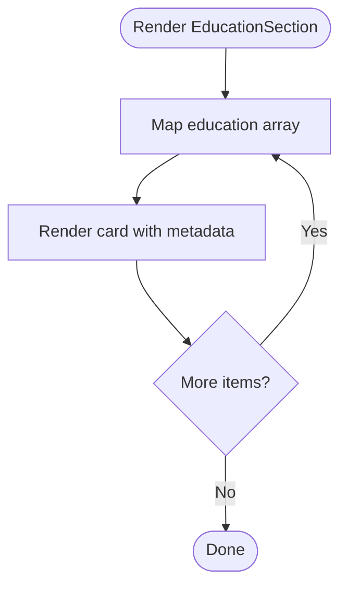
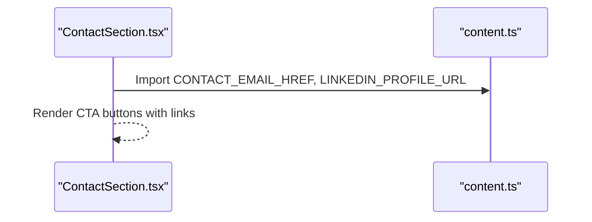
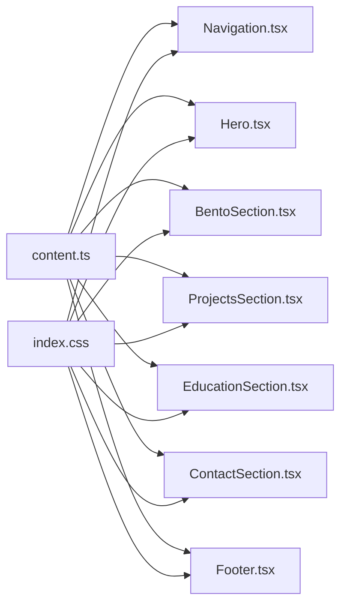

# Content Management System

<cite>
**Referenced Files in This Document**
- [content.ts](file://src/data/content.ts)
- [App.tsx](file://src/App.tsx)
- [main.tsx](file://src/main.tsx)
- [Navigation.tsx](file://src/components/Navigation.tsx)
- [Hero.tsx](file://src/components/Hero.tsx)
- [BentoSection.tsx](file://src/components/BentoSection.tsx)
- [ProjectsSection.tsx](file://src/components/ProjectsSection.tsx)
- [EducationSection.tsx](file://src/components/EducationSection.tsx)
- [ContactSection.tsx](file://src/components/ContactSection.tsx)
- [Footer.tsx](file://src/components/Footer.tsx)
- [index.css](file://src/index.css)
- [package.json](file://package.json)
- [README.md](file://README.md)
</cite>

## Update Summary
**Changes Made**
- Updated CV PDF hosting mechanism documentation to reflect Google Drive integration
- Added troubleshooting guidance for external PDF hosting
- Enhanced content validation and backup strategies for cloud-hosted assets
- Updated deployment considerations for CV PDF distribution

## Table of Contents
1. [Introduction](#introduction)
2. [Project Structure](#project-structure)
3. [Core Components](#core-components)
4. [Architecture Overview](#architecture-overview)
5. [Detailed Component Analysis](#detailed-component-analysis)
6. [Dependency Analysis](#dependency-analysis)
7. [Performance Considerations](#performance-considerations)
8. [Troubleshooting Guide](#troubleshooting-guide)
9. [Conclusion](#conclusion)
10. [Appendices](#appendices)

## Introduction
This document explains the centralized, data-driven content management approach used in the portfolio. All content—navigation, professional background, skills visualization, project showcase, academic timeline, and contact integration—is defined in a single TypeScript module and consumed by React components. The system emphasizes type safety, predictable updates, and scalable extension points for adding new content, adjusting visuals, and maintaining consistency across the application.

**Updated** The CV PDF hosting mechanism has been migrated from local public folder hosting to Google Drive integration for improved reliability and accessibility.

## Project Structure
The portfolio follows a clear separation of concerns:
- Centralized content definitions live under src/data/content.ts.
- UI components under src/components consume content via imports.
- The root App renders sections in a fixed order, ensuring consistent layout.
- Styling is theme-driven via TailwindCSS and custom CSS variables.

**Diagram sources**
- [main.tsx:1-11](file://src/main.tsx#L1-L11)
- [App.tsx:15-32](file://src/App.tsx#L15-L32)
- [content.ts:10-18](file://src/data/content.ts#L10-L18)
- [content.ts:20-36](file://src/data/content.ts#L20-L36)
- [content.ts:38-60](file://src/data/content.ts#L38-L60)
- [content.ts:62-82](file://src/data/content.ts#L62-L82)
- [content.ts:83-102](file://src/data/content.ts#L83-L102)

**Section sources**
- [main.tsx:1-11](file://src/main.tsx#L1-L11)
- [App.tsx:15-32](file://src/App.tsx#L15-L32)

## Core Components
This section documents the content model and how it is consumed across the application.

- Navigation links
  - Purpose: Define top-level anchors and labels for smooth scrolling.
  - Consumption: Navigation component reads navLinks to render tabs and track active section via scroll.
  - Extending: Add or reorder entries in the array; ensure anchor IDs match section IDs.

- Skills visualization
  - Purpose: Display technical competencies with icons and proficiency levels.
  - Consumption: BentoSection renders skill bars and icons; levels animate on view.
  - Extending: Append entries with name, icon, level, optional fullWidth flag.

- Projects showcase
  - Purpose: Present portfolio case studies with technology stacks and highlights.
  - Consumption: ProjectsSection maps over projects to render cards and stack chips.
  - Extending: Add new project entries with title, summary, stack, and highlights.

- Academic background
  - Purpose: Timeline-style presentation of degrees, certifications, and technical mastery.
  - Consumption: EducationSection renders items with type, title, institution, location, and period.
  - Extending: Add new entries with appropriate fields.

- Contact integration
  - Purpose: Provide quick access to email and LinkedIn profiles.
  - Consumption: ContactSection links to CONTACT_EMAIL_HREF and LINKEDIN_PROFILE_URL.
  - Extending: Update constants to change outbound links.

- Social links and hero assets
  - Purpose: Consistent branding and social presence across Hero and Footer.
  - Consumption: Hero and Footer map over socialLinks; Hero uses HERO_IMAGE_SRC; Footer reuses socialLinks.
  - Extending: Update socialLinks and image/pdf paths as needed.

- **CV PDF Hosting**
  - Purpose: Provide downloadable CV in PDF format.
  - Consumption: Navigation component uses CV_PDF_HREF for CV download button.
  - Hosting Mechanism: Now hosted on Google Drive with direct download URL.
  - Extending: Update CV_PDF_HREF with new Google Drive file ID for CV updates.

- Type safety and interfaces
  - Purpose: Strong typing for content arrays and constants to prevent runtime errors.
  - Mechanisms: Explicit types for navLinks, skills, education, projects, and constants; union literal types for social link names.

**Section sources**
- [content.ts:10-18](file://src/data/content.ts#L10-L18)
- [content.ts:20-36](file://src/data/content.ts#L20-L36)
- [content.ts:38-60](file://src/data/content.ts#L38-L60)
- [content.ts:62-82](file://src/data/content.ts#L62-L82)
- [content.ts:83-102](file://src/data/content.ts#L83-L102)
- [content.ts:134-135](file://src/data/content.ts#L134-L135)
- [BentoSection.tsx:59-81](file://src/components/BentoSection.tsx#L59-L81)
- [ProjectsSection.tsx:45-93](file://src/components/ProjectsSection.tsx#L45-L93)
- [EducationSection.tsx:22-51](file://src/components/EducationSection.tsx#L22-L51)
- [ContactSection.tsx:1-38](file://src/components/ContactSection.tsx#L1-L38)
- [Hero.tsx:44-67](file://src/components/Hero.tsx#L44-L67)
- [Footer.tsx:14-31](file://src/components/Footer.tsx#L14-L31)

## Architecture Overview
The content-driven architecture ensures that:
- All content is authored in one place (content.ts).
- Components remain declarative and reusable.
- Changes propagate automatically through imports.
- Type definitions enforce correctness at development time.

**Diagram sources**
- [main.tsx:6-10](file://src/main.tsx#L6-L10)
- [App.tsx:15-32](file://src/App.tsx#L15-L32)
- [content.ts:10-18](file://src/data/content.ts#L10-L18)
- [content.ts:20-36](file://src/data/content.ts#L20-L36)
- [content.ts:38-60](file://src/data/content.ts#L38-L60)
- [content.ts:62-82](file://src/data/content.ts#L62-L82)
- [content.ts:83-102](file://src/data/content.ts#L83-L102)

## Detailed Component Analysis

### Content Model and Interfaces
The content module defines:
- navLinks: Array of navigation entries with name and href.
- skills: Array of competency entries with name, icon, level, and optional fullWidth.
- education: Array of academic entries with type, title, institution, location, and period.
- projects: Array of portfolio entries with title, summary, stack, and highlights.
- Constants: LINKEDIN_PROFILE_URL, CONTACT_EMAIL_HREF, socialLinks, HERO_IMAGE_SRC, CV_PDF_HREF.

Type safety mechanisms:
- Explicit object types for arrays.
- Literal union for social link names.
- Icon type constraint via LucideIcon.

**Diagram sources**
- [content.ts:10-18](file://src/data/content.ts#L10-L18)
- [content.ts:20-36](file://src/data/content.ts#L20-L36)
- [content.ts:38-60](file://src/data/content.ts#L38-L60)
- [content.ts:62-82](file://src/data/content.ts#L62-L82)
- [content.ts:83-102](file://src/data/content.ts#L83-L102)
- [content.ts:134-135](file://src/data/content.ts#L134-L135)

**Section sources**
- [content.ts:10-18](file://src/data/content.ts#L10-L18)
- [content.ts:20-36](file://src/data/content.ts#L20-L36)
- [content.ts:38-60](file://src/data/content.ts#L38-L60)
- [content.ts:62-82](file://src/data/content.ts#L62-L82)
- [content.ts:83-102](file://src/data/content.ts#L83-L102)
- [content.ts:134-135](file://src/data/content.ts#L134-L135)

### Navigation Component
- Reads navLinks to render tabs and compute active section based on scroll position.
- Uses a layout animation identifier to animate active underline.
- Downloads CV via CV_PDF_HREF from Google Drive.

**Diagram sources**
- [Navigation.tsx:10-98](file://src/components/Navigation.tsx#L10-L98)
- [content.ts:10-18](file://src/data/content.ts#L10-L18)
- [content.ts:134-135](file://src/data/content.ts#L134-L135)

**Section sources**
- [Navigation.tsx:10-98](file://src/components/Navigation.tsx#L10-L98)
- [content.ts:10-18](file://src/data/content.ts#L10-L18)
- [content.ts:134-135](file://src/data/content.ts#L134-L135)

### Hero and Footer
- Hero displays profile headline, location, description, and social links.
- Footer mirrors social links and branding.
- Both import socialLinks and hero image constant.

**Diagram sources**
- [Hero.tsx:11-99](file://src/components/Hero.tsx#L11-L99)
- [Footer.tsx:3-36](file://src/components/Footer.tsx#L3-L36)
- [content.ts:62-82](file://src/data/content.ts#L62-L82)
- [content.ts:68-75](file://src/data/content.ts#L68-L75)

**Section sources**
- [Hero.tsx:11-99](file://src/components/Hero.tsx#L11-L99)
- [Footer.tsx:3-36](file://src/components/Footer.tsx#L3-L36)
- [content.ts:62-82](file://src/data/content.ts#L62-L82)
- [content.ts:68-75](file://src/data/content.ts#L68-L75)

### Skills Visualization (BentoSection)
- Renders a grid of skills with animated progress bars.
- Uses skill.icon to render the appropriate Lucide icon per skill.
- fullWidth allows a skill to span two columns.

**Diagram sources**
- [BentoSection.tsx:59-81](file://src/components/BentoSection.tsx#L59-L81)
- [content.ts:20-36](file://src/data/content.ts#L20-L36)

**Section sources**
- [BentoSection.tsx:59-81](file://src/components/BentoSection.tsx#L59-L81)
- [content.ts:20-36](file://src/data/content.ts#L20-L36)

### Projects Showcase (ProjectsSection)
- Renders a list of projects with dynamic stack icons.
- StackIcon selects an icon based on keywords in the stack label.
- Highlights are rendered as bullet points.

**Diagram sources**
- [ProjectsSection.tsx:6-19](file://src/components/ProjectsSection.tsx#L6-L19)
- [ProjectsSection.tsx:45-93](file://src/components/ProjectsSection.tsx#L45-L93)
- [content.ts:83-102](file://src/data/content.ts#L83-L102)

**Section sources**
- [ProjectsSection.tsx:6-19](file://src/components/ProjectsSection.tsx#L6-L19)
- [ProjectsSection.tsx:45-93](file://src/components/ProjectsSection.tsx#L45-L93)
- [content.ts:83-102](file://src/data/content.ts#L83-L102)

### Academic Background (EducationSection)
- Displays education items in a responsive grid.
- Each item shows type, title, institution, location, and period.

**Diagram sources**
- [EducationSection.tsx:22-51](file://src/components/EducationSection.tsx#L22-L51)
- [content.ts:38-60](file://src/data/content.ts#L38-L60)

**Section sources**
- [EducationSection.tsx:22-51](file://src/components/EducationSection.tsx#L22-L51)
- [content.ts:38-60](file://src/data/content.ts#L38-L60)

### Contact Integration (ContactSection)
- Provides primary actions to initiate email and connect on LinkedIn.
- Uses CONTACT_EMAIL_HREF and LINKEDIN_PROFILE_URL.

**Diagram sources**
- [ContactSection.tsx:1-38](file://src/components/ContactSection.tsx#L1-L38)
- [content.ts:62-65](file://src/data/content.ts#L62-L65)

**Section sources**
- [ContactSection.tsx:1-38](file://src/components/ContactSection.tsx#L1-L38)
- [content.ts:62-65](file://src/data/content.ts#L62-L65)

## Dependency Analysis
- Content module acts as the single source of truth for all UI sections.
- Components depend on content exports but do not mutate them.
- Theme and styles are centralized in index.css, supporting consistent rendering.

**Diagram sources**
- [content.ts:10-18](file://src/data/content.ts#L10-L18)
- [content.ts:20-36](file://src/data/content.ts#L20-L36)
- [content.ts:38-60](file://src/data/content.ts#L38-L60)
- [content.ts:62-82](file://src/data/content.ts#L62-L82)
- [content.ts:83-102](file://src/data/content.ts#L83-L102)
- [index.css:3-40](file://src/index.css#L3-L40)

**Section sources**
- [content.ts:10-18](file://src/data/content.ts#L10-L18)
- [content.ts:20-36](file://src/data/content.ts#L20-L36)
- [content.ts:38-60](file://src/data/content.ts#L38-L60)
- [content.ts:62-82](file://src/data/content.ts#L62-L82)
- [content.ts:83-102](file://src/data/content.ts#L83-L102)
- [index.css:3-40](file://src/index.css#L3-L40)

## Performance Considerations
- Centralized content reduces prop drilling and improves cache locality for repeated renders.
- Components leverage viewport-triggered animations; keep lists concise to avoid layout thrashing.
- Use fullWidth sparingly to maintain grid balance and readability.
- Keep image and PDF assets optimized; ensure public assets are served efficiently.

**Updated** CV PDF hosting via Google Drive provides improved reliability and global CDN distribution, reducing latency for international visitors.

## Troubleshooting Guide
Common issues and resolutions:
- Broken navigation anchors
  - Symptom: Active underline does not highlight or smooth scroll fails.
  - Cause: navLinks hrefs do not match section IDs.
  - Fix: Ensure each navLinks href corresponds to a section id present in the DOM.

- Missing icons or incorrect icons in skills
  - Symptom: Wrong icon appears for a skill.
  - Cause: skill.icon mismatch or missing icon import.
  - Fix: Verify icon assignment and ensure LucideIcon is imported.

- Incorrect stack icons in projects
  - Symptom: Wrong icon for a technology.
  - Cause: keyword matching in iconForStackLabel does not cover the label.
  - Fix: Extend the matching logic to include the technology name.

- Social links open in new tab unexpectedly
  - Symptom: Internal links open in new tabs.
  - Cause: href does not start with http/https.
  - Fix: Ensure internal links do not include protocol prefixes.

- **CV download not working**
  - Symptom: Clicking CV button does nothing or downloads fail.
  - Cause: CV_PDF_HREF points to non-existent or private Google Drive file.
  - Fix: 
    - Verify Google Drive file is publicly accessible or has proper sharing settings
    - Ensure the direct download URL format is correct: `https://drive.google.com/uc?export=download&id=FILE_ID`
    - Test the URL directly in browser to confirm accessibility
    - Update CV_PDF_HREF with the correct file ID if the CV has been updated

- Styling inconsistencies
  - Symptom: Colors or fonts appear off.
  - Cause: Tailwind theme overrides or missing CSS variables.
  - Fix: Verify index.css theme variables and Tailwind configuration.

**Updated** Added specific troubleshooting steps for Google Drive CV hosting issues.

**Section sources**
- [Navigation.tsx:6-9](file://src/components/Navigation.tsx#L6-L9)
- [ProjectsSection.tsx:6-12](file://src/components/ProjectsSection.tsx#L6-L12)
- [Hero.tsx:44-67](file://src/components/Hero.tsx#L44-L67)
- [Footer.tsx:14-31](file://src/components/Footer.tsx#L14-L31)
- [BentoSection.tsx:64-78](file://src/components/BentoSection.tsx#L64-L78)
- [index.css:3-40](file://src/index.css#L3-L40)

## Conclusion
The portfolio's content management system centralizes all content in a strongly typed module and distributes it declaratively across components. This approach simplifies maintenance, enforces type safety, and enables rapid iteration. By following the extension guidelines below, teams can confidently add new projects, refine skills, update education, and expand navigation while preserving consistency and performance.

**Updated** The migration to Google Drive hosting enhances the CV PDF delivery mechanism, providing improved reliability and accessibility for international visitors.

## Appendices

### Practical Extension Examples
- Adding a new project
  - Steps:
    - Open the content module and append a new project entry to the projects array with title, summary, stack, and highlights.
    - Save and verify rendering in ProjectsSection.
  - Reference: [content.ts:83-102](file://src/data/content.ts#L83-L102), [ProjectsSection.tsx:45-93](file://src/components/ProjectsSection.tsx#L45-L93)

- Updating skills
  - Steps:
    - Modify an existing skill's level or add a new skill entry to the skills array.
    - Optionally set fullWidth to span across columns.
  - Reference: [content.ts:20-36](file://src/data/content.ts#L20-L36), [BentoSection.tsx:59-81](file://src/components/BentoSection.tsx#L59-L81)

- Modifying educational details
  - Steps:
    - Add or edit an entry in the education array with type, title, institution, location, and period.
  - Reference: [content.ts:38-60](file://src/data/content.ts#L38-L60), [EducationSection.tsx:22-51](file://src/components/EducationSection.tsx#L22-L51)

- **Updating CV PDF**
  - Steps:
    - Upload new CV to Google Drive and obtain the file ID from the shareable link
    - Update CV_PDF_HREF with the new Google Drive direct download URL format
    - Test the download functionality in the Navigation component
  - Reference: [content.ts:134-135](file://src/data/content.ts#L134-L135), [Navigation.tsx:85-89](file://src/components/Navigation.tsx#L85-L89)

- Extending navigation links
  - Steps:
    - Add a new navLinks entry with name and href; ensure the href matches a section id.
  - Reference: [content.ts:10-18](file://src/data/content.ts#L10-L18), [Navigation.tsx:10-98](file://src/components/Navigation.tsx#L10-L98)

**Updated** Added CV PDF update procedure with Google Drive integration.

### Guidelines for Content Consistency
- Use consistent terminology for types and titles across education and projects.
- Keep stack labels concise and standardized for accurate icon mapping.
- Maintain a single source of truth for URLs and asset paths.
- Review socialLinks for brand alignment and accessibility.
- **Ensure CV PDF hosting URLs are accessible and properly formatted for Google Drive integration.**

**Updated** Added guideline for CV PDF hosting URL validation.

### Multilingual Considerations
- Current implementation uses hardcoded strings; to support multiple languages:
  - Extract strings into locale-specific content modules.
  - Introduce a locale selector and dynamic content loader.
  - Ensure all components consume localized content via context or props.

### Optimizing for Different Screen Sizes
- Responsive grids are already used in major sections; maintain aspect ratios for images and avoid overly dense text.
- Test breakpoints for navigation tabs and skill bars to ensure readability.
- **Test CV download functionality across different devices and network conditions when using Google Drive hosting.**

**Updated** Added optimization consideration for CV download across devices.

### Content Validation and Quality Assurance
- Enforce type checks during builds using TypeScript.
- Add unit tests for content shape validation if content grows complex.
- Use linters to catch unused or malformed keys.
- **Validate external asset URLs (like Google Drive CV) during build or CI processes to prevent broken links.**

**Updated** Added validation step for external asset URLs.

### Backup and Version Control
- Treat content.ts as a primary artifact; commit changes with clear messages.
- Use feature branches for major content updates; review diffs carefully.
- Back up critical content snapshots before large-scale restructuring.
- **Maintain version control for CV PDF updates by tracking Google Drive file ID changes in CV_PDF_HREF.**

**Updated** Added version control guidance for CV PDF hosting changes.

**Section sources**
- [content.ts:10-18](file://src/data/content.ts#L10-L18)
- [content.ts:20-36](file://src/data/content.ts#L20-L36)
- [content.ts:38-60](file://src/data/content.ts#L38-L60)
- [content.ts:62-82](file://src/data/content.ts#L62-L82)
- [content.ts:83-102](file://src/data/content.ts#L83-L102)
- [content.ts:134-135](file://src/data/content.ts#L134-L135)
- [Navigation.tsx:10-98](file://src/components/Navigation.tsx#L10-L98)
- [BentoSection.tsx:59-81](file://src/components/BentoSection.tsx#L59-L81)
- [ProjectsSection.tsx:45-93](file://src/components/ProjectsSection.tsx#L45-L93)
- [EducationSection.tsx:22-51](file://src/components/EducationSection.tsx#L22-L51)
- [Hero.tsx:44-67](file://src/components/Hero.tsx#L44-L67)
- [Footer.tsx:14-31](file://src/components/Footer.tsx#L14-L31)
- [index.css:3-40](file://src/index.css#L3-L40)
- [package.json:1-35](file://package.json#L1-L35)
- [README.md:1-21](file://README.md#L1-L21)