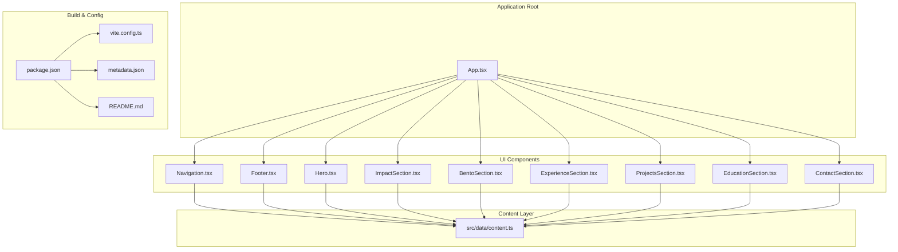
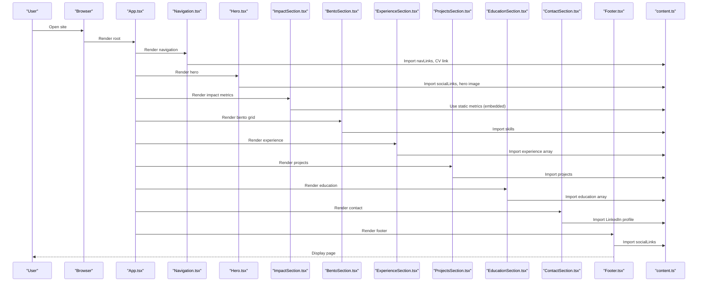
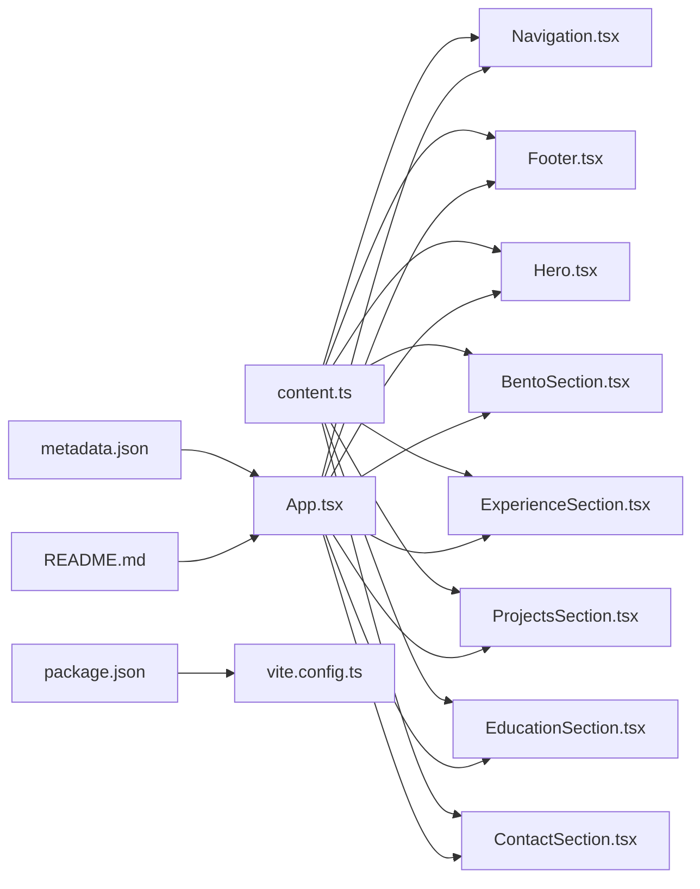

# Content Management

<cite>
**Referenced Files in This Document**
- [content.ts](file://src/data/content.ts)
- [App.tsx](file://src/App.tsx)
- [Hero.tsx](file://src/components/Hero.tsx)
- [ExperienceSection.tsx](file://src/components/ExperienceSection.tsx)
- [ProjectsSection.tsx](file://src/components/ProjectsSection.tsx)
- [EducationSection.tsx](file://src/components/EducationSection.tsx)
- [ImpactSection.tsx](file://src/components/ImpactSection.tsx)
- [BentoSection.tsx](file://src/components/BentoSection.tsx)
- [Navigation.tsx](file://src/components/Navigation.tsx)
- [Footer.tsx](file://src/components/Footer.tsx)
- [ContactSection.tsx](file://src/components/ContactSection.tsx)
- [package.json](file://package.json)
- [vite.config.ts](file://vite.config.ts)
- [metadata.json](file://metadata.json)
- [README.md](file://README.md)
</cite>

## Table of Contents
1. [Introduction](#introduction)
2. [Project Structure](#project-structure)
3. [Core Components](#core-components)
4. [Architecture Overview](#architecture-overview)
5. [Detailed Component Analysis](#detailed-component-analysis)
6. [Dependency Analysis](#dependency-analysis)
7. [Performance Considerations](#performance-considerations)
8. [Troubleshooting Guide](#troubleshooting-guide)
9. [Conclusion](#conclusion)

## Introduction
This document explains the Content Management system used in a React-based portfolio website. The site presents professional experience, projects, education, and contact information in a structured, data-driven manner. Content is centralized in a single TypeScript module and consumed by multiple UI components. The system emphasizes maintainability, reusability, and responsive presentation across sections.

## Project Structure
The project follows a component-based architecture with content decoupled from presentation. Key elements:
- Centralized content definitions in a single module
- Reusable UI components organized by semantic sections
- Build configuration supporting React, Tailwind CSS, and Vite
- Metadata and deployment-related configuration

**Diagram sources**
- [App.tsx:16-34](file://src/App.tsx#L16-L34)
- [content.ts:10-148](file://src/data/content.ts#L10-L148)
- [Navigation.tsx:10-98](file://src/components/Navigation.tsx#L10-L98)
- [Footer.tsx:1-36](file://src/components/Footer.tsx#L1-L36)
- [Hero.tsx:11-99](file://src/components/Hero.tsx#L11-L99)
- [ImpactSection.tsx:56-106](file://src/components/ImpactSection.tsx#L56-L106)
- [BentoSection.tsx:4-87](file://src/components/BentoSection.tsx#L4-L87)
- [ExperienceSection.tsx:4-80](file://src/components/ExperienceSection.tsx#L4-L80)
- [ProjectsSection.tsx:21-100](file://src/components/ProjectsSection.tsx#L21-L100)
- [EducationSection.tsx:5-85](file://src/components/EducationSection.tsx#L5-L85)
- [ContactSection.tsx:5-167](file://src/components/ContactSection.tsx#L5-L167)
- [package.json:1-35](file://package.json#L1-L35)
- [vite.config.ts:1-25](file://vite.config.ts#L1-L25)
- [metadata.json:1-6](file://metadata.json#L1-L6)
- [README.md:1-21](file://README.md#L1-L21)

**Section sources**
- [App.tsx:16-34](file://src/App.tsx#L16-L34)
- [content.ts:10-148](file://src/data/content.ts#L10-L148)
- [package.json:1-35](file://package.json#L1-L35)
- [vite.config.ts:1-25](file://vite.config.ts#L1-L25)
- [metadata.json:1-6](file://metadata.json#L1-L6)
- [README.md:1-21](file://README.md#L1-L21)

## Core Components
The content management relies on a single source of truth for all textual and media assets:
- Navigation links and anchors
- Skill set definitions with icons and proficiency levels
- Professional experience entries with bullet points
- Educational background with logos and credential links
- Social profiles and contact channels
- Hero image and CV link
- Project summaries, stacks, and outcomes
- Quantified impact metrics with visualizations

These definitions are imported by UI components to render consistent, localized content across the site.

**Section sources**
- [content.ts:10-148](file://src/data/content.ts#L10-L148)

## Architecture Overview
The content flow is unidirectional: content definitions feed UI components, which assemble the page. Navigation and footer consume shared content arrays. Each section component renders its specific dataset and applies animations and responsive layouts.

**Diagram sources**
- [App.tsx:16-34](file://src/App.tsx#L16-L34)
- [Navigation.tsx:10-98](file://src/components/Navigation.tsx#L10-L98)
- [Hero.tsx:11-99](file://src/components/Hero.tsx#L11-L99)
- [ImpactSection.tsx:56-106](file://src/components/ImpactSection.tsx#L56-L106)
- [BentoSection.tsx:4-87](file://src/components/BentoSection.tsx#L4-L87)
- [ExperienceSection.tsx:4-80](file://src/components/ExperienceSection.tsx#L4-L80)
- [ProjectsSection.tsx:21-100](file://src/components/ProjectsSection.tsx#L21-L100)
- [EducationSection.tsx:5-85](file://src/components/EducationSection.tsx#L5-L85)
- [ContactSection.tsx:5-167](file://src/components/ContactSection.tsx#L5-L167)
- [Footer.tsx:1-36](file://src/components/Footer.tsx#L1-L36)
- [content.ts:10-148](file://src/data/content.ts#L10-L148)

## Detailed Component Analysis

### Content Module (`content.ts`)
Responsibilities:
- Defines navigation anchors and labels
- Lists skills with associated Lucide icons and proficiency levels
- Provides professional experience entries with detailed highlights
- Maintains educational background with optional credential links and logos
- Supplies social links, contact details, and media asset paths
- Exposes project summaries, stacks, and outcomes

Implementation characteristics:
- Strongly typed content structures for robust developer experience
- Icon references mapped to Lucide components for consistent rendering
- Asset paths resolved from the public directory for images and PDFs

**Section sources**
- [content.ts:10-148](file://src/data/content.ts#L10-L148)

### Navigation (`Navigation.tsx`)
Responsibilities:
- Renders top navigation with animated active indicator
- Computes active section based on scroll position
- Links to anchor sections and provides CV download

Processing logic:
- Converts nav link hrefs to section IDs
- Uses scroll and resize events to track active section
- Applies motion animation for underline transition

**Section sources**
- [Navigation.tsx:6-40](file://src/components/Navigation.tsx#L6-L40)
- [Navigation.tsx:42-98](file://src/components/Navigation.tsx#L42-L98)

### Hero (`Hero.tsx`)
Responsibilities:
- Displays personal introduction, location, and tagline
- Renders social links with appropriate external link handling
- Shows profile image sourced from public assets

Processing logic:
- Maps social link names to Lucide icons
- Determines external vs internal links for safe rendering
- Uses motion for staggered entrance animations

**Section sources**
- [Hero.tsx:5-9](file://src/components/Hero.tsx#L5-L9)
- [Hero.tsx:11-99](file://src/components/Hero.tsx#L11-L99)

### Impact Metrics (`ImpactSection.tsx`)
Responsibilities:
- Presents quantified business outcomes with embedded SVG charts
- Uses motion for staggered card reveals

Processing logic:
- Static metric definitions embedded in the component
- Color and chart styling applied per metric

**Section sources**
- [ImpactSection.tsx:3-54](file://src/components/ImpactSection.tsx#L3-L54)
- [ImpactSection.tsx:56-106](file://src/components/ImpactSection.tsx#L56-L106)

### Bento Grid (`BentoSection.tsx`)
Responsibilities:
- Shows executive summary and signature
- Renders technical toolkit with animated skill bars

Processing logic:
- Iterates over skills to render icons, labels, and progress bars
- Supports full-width rows for specific skills

**Section sources**
- [BentoSection.tsx:4-87](file://src/components/BentoSection.tsx#L4-L87)

### Experience (`ExperienceSection.tsx`)
Responsibilities:
- Displays professional roles with type, title, company, location, and period
- Renders detailed highlights as bullet points

Processing logic:
- Maps experience array to cards with staggered animations
- Uses motion for horizontal slide-in effects

**Section sources**
- [ExperienceSection.tsx:22-74](file://src/components/ExperienceSection.tsx#L22-L74)

### Projects (`ProjectsSection.tsx`)
Responsibilities:
- Presents portfolio case studies with summaries and technology stacks
- Associates stack items with icons based on labels

Processing logic:
- Icon mapping function selects Lucide icons per stack label
- Renders each project with animated cards and highlight lists

**Section sources**
- [ProjectsSection.tsx:6-12](file://src/components/ProjectsSection.tsx#L6-L12)
- [ProjectsSection.tsx:14-19](file://src/components/ProjectsSection.tsx#L14-L19)
- [ProjectsSection.tsx:21-100](file://src/components/ProjectsSection.tsx#L21-L100)

### Education (`EducationSection.tsx`)
Responsibilities:
- Shows academic and certification history
- Handles optional logo rendering and credential verification links

Processing logic:
- Conditionally renders institution logos or fallback icon
- Adds external link handling for credential URLs

**Section sources**
- [EducationSection.tsx:23-78](file://src/components/EducationSection.tsx#L23-L78)

### Contact (`ContactSection.tsx`)
Responsibilities:
- Provides two modes: quick action buttons and a form
- Submits form data to open a pre-filled email composition

Processing logic:
- Toggles between button and form views
- Constructs mailto URL with encoded subject and body
- Uses motion for smooth transitions between states

**Section sources**
- [ContactSection.tsx:6-22](file://src/components/ContactSection.tsx#L6-L22)
- [ContactSection.tsx:24-167](file://src/components/ContactSection.tsx#L24-L167)

### Footer (`Footer.tsx`)
Responsibilities:
- Renders brand identity, copyright, and social links
- Applies external link handling for social profiles

**Section sources**
- [Footer.tsx:1-36](file://src/components/Footer.tsx#L1-L36)

## Dependency Analysis
The system exhibits low coupling and high cohesion:
- UI components depend only on the content module for data
- Navigation and footer share the same content arrays
- Each section component encapsulates its own rendering logic
- Build configuration integrates React, Tailwind CSS, and Vite

**Diagram sources**
- [content.ts:10-148](file://src/data/content.ts#L10-L148)
- [App.tsx:16-34](file://src/App.tsx#L16-L34)
- [Navigation.tsx:10-98](file://src/components/Navigation.tsx#L10-L98)
- [Footer.tsx:1-36](file://src/components/Footer.tsx#L1-L36)
- [Hero.tsx:11-99](file://src/components/Hero.tsx#L11-L99)
- [BentoSection.tsx:4-87](file://src/components/BentoSection.tsx#L4-L87)
- [ExperienceSection.tsx:4-80](file://src/components/ExperienceSection.tsx#L4-L80)
- [ProjectsSection.tsx:21-100](file://src/components/ProjectsSection.tsx#L21-L100)
- [EducationSection.tsx:5-85](file://src/components/EducationSection.tsx#L5-L85)
- [ContactSection.tsx:5-167](file://src/components/ContactSection.tsx#L5-L167)
- [package.json:1-35](file://package.json#L1-L35)
- [vite.config.ts:1-25](file://vite.config.ts#L1-L25)
- [metadata.json:1-6](file://metadata.json#L1-L6)
- [README.md:1-21](file://README.md#L1-L21)

**Section sources**
- [content.ts:10-148](file://src/data/content.ts#L10-L148)
- [App.tsx:16-34](file://src/App.tsx#L16-L34)
- [package.json:1-35](file://package.json#L1-L35)
- [vite.config.ts:1-25](file://vite.config.ts#L1-L25)
- [metadata.json:1-6](file://metadata.json#L1-L6)
- [README.md:1-21](file://README.md#L1-L21)

## Performance Considerations
- Content is centralized to minimize repeated data and reduce bundle size
- Components use lazy animations via motion to avoid heavy computations during initial render
- Public assets are referenced directly by path for efficient loading
- Minimal event listeners (scroll and resize) are attached in navigation with cleanup to prevent memory leaks

## Troubleshooting Guide
Common issues and resolutions:
- Missing icons: Verify Lucide icon imports match the names used in content definitions
- Broken social links: Ensure href values in content are valid URLs and include proper protocol prefixes
- Missing images: Confirm asset paths exist in the public directory and filenames match content references
- Scroll-based navigation not updating: Check that section IDs in content match DOM element IDs and that offsets are correctly configured
- Form submission not opening email client: Validate mailto URL construction and browser support for opening external clients

**Section sources**
- [content.ts:113-127](file://src/data/content.ts#L113-L127)
- [Navigation.tsx:13-40](file://src/components/Navigation.tsx#L13-L40)
- [ContactSection.tsx:8-22](file://src/components/ContactSection.tsx#L8-L22)

## Conclusion
The Content Management system is designed around a single, strongly typed content module that feeds multiple UI components. This approach ensures consistency, simplifies updates, and maintains a clean separation between data and presentation. The architecture supports responsive design, accessibility, and future extensibility with minimal coupling.