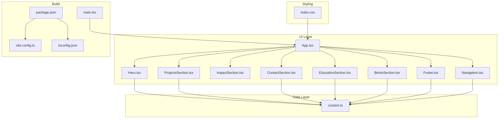
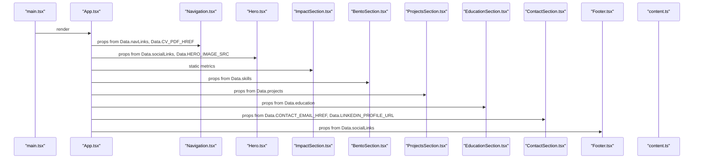
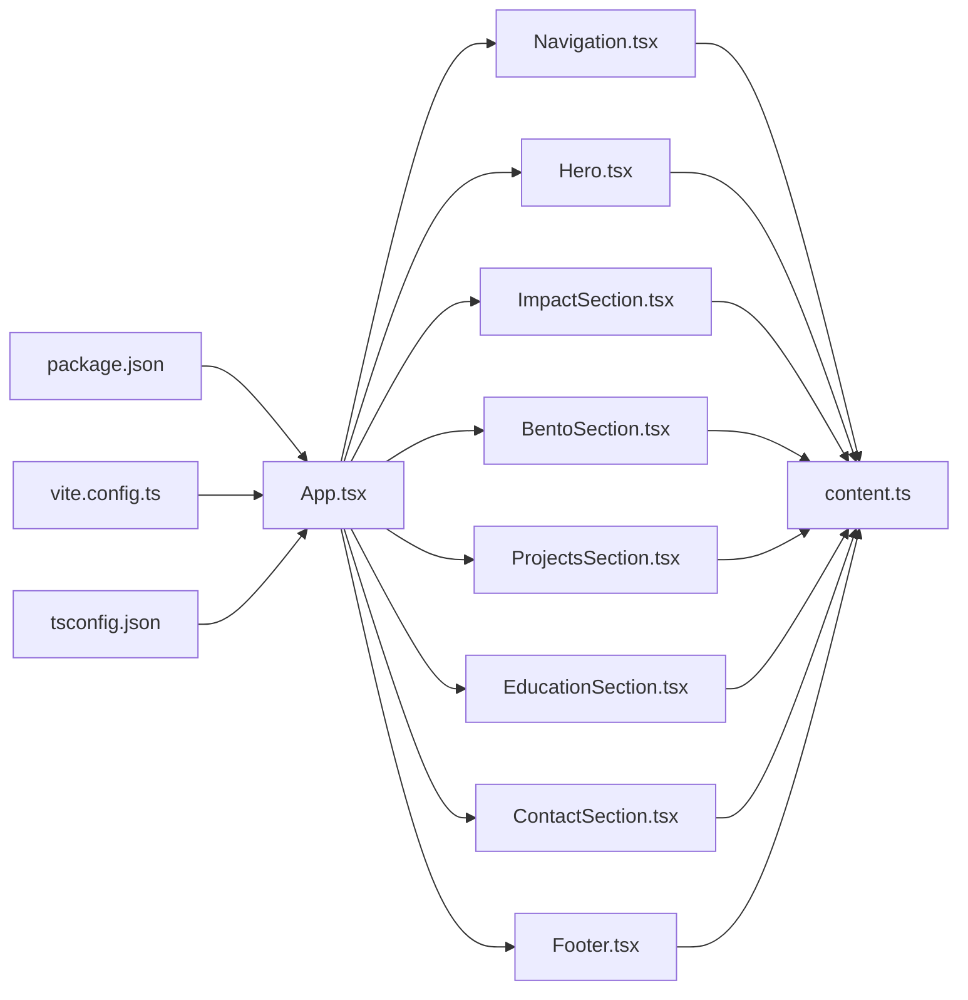

# Customization & Extension Guide

<cite>
**Referenced Files in This Document**
- [content.ts](file://src/data/content.ts)
- [Hero.tsx](file://src/components/Hero.tsx)
- [ProjectsSection.tsx](file://src/components/ProjectsSection.tsx)
- [ContactSection.tsx](file://src/components/ContactSection.tsx)
- [EducationSection.tsx](file://src/components/EducationSection.tsx)
- [BentoSection.tsx](file://src/components/BentoSection.tsx)
- [Footer.tsx](file://src/components/Footer.tsx)
- [Navigation.tsx](file://src/components/Navigation.tsx)
- [ImpactSection.tsx](file://src/components/ImpactSection.tsx)
- [App.tsx](file://src/App.tsx)
- [index.css](file://src/index.css)
- [package.json](file://package.json)
- [vite.config.ts](file://vite.config.ts)
- [tsconfig.json](file://tsconfig.json)
- [main.tsx](file://src/main.tsx)
</cite>

## Table of Contents
1. [Introduction](#introduction)
2. [Project Structure](#project-structure)
3. [Core Components](#core-components)
4. [Architecture Overview](#architecture-overview)
5. [Detailed Component Analysis](#detailed-component-analysis)
6. [Dependency Analysis](#dependency-analysis)
7. [Performance Considerations](#performance-considerations)
8. [Troubleshooting Guide](#troubleshooting-guide)
9. [Conclusion](#conclusion)
10. [Appendices](#appendices)

## Introduction
This guide explains how to customize and extend the portfolio. It focuses on:
- Extending the content data structure to add new sections and entries
- Modifying existing components by editing React files
- Creating new components to extend functionality
- Extending TypeScript types safely
- Implementing animations and responsive behavior
- Maintaining performance, testing, and long-term updates

## Project Structure
The portfolio is a React + Vite + TailwindCSS project. Content is centralized in a single data module, and UI is composed of small, focused components. Styling is theme-driven via TailwindCSS variables.

**Diagram sources**
- [App.tsx:15-32](file://src/App.tsx#L15-L32)
- [content.ts:10-103](file://src/data/content.ts#L10-L103)
- [index.css:3-40](file://src/index.css#L3-L40)
- [package.json:13-33](file://package.json#L13-L33)
- [vite.config.ts:6-24](file://vite.config.ts#L6-L24)
- [tsconfig.json:1-27](file://tsconfig.json#L1-L27)
- [main.tsx:1-11](file://src/main.tsx#L1-L11)

**Section sources**
- [App.tsx:15-32](file://src/App.tsx#L15-L32)
- [content.ts:10-103](file://src/data/content.ts#L10-L103)
- [index.css:3-40](file://src/index.css#L3-L40)
- [package.json:13-33](file://package.json#L13-L33)
- [vite.config.ts:6-24](file://vite.config.ts#L6-L24)
- [tsconfig.json:1-27](file://tsconfig.json#L1-L27)
- [main.tsx:1-11](file://src/main.tsx#L1-L11)

## Core Components
- Navigation: Reads navigation links and active section tracking from content, renders a sticky header with animated active indicator.
- Hero: Renders headline, tagline, location, image, and social links; integrates animations.
- ImpactSection: Renders quantified metrics with SVG charts and animated bars.
- BentoSection: Renders executive summary and skills with animated skill bars.
- ProjectsSection: Renders project cards with dynamic icons per technology and highlight lists.
- EducationSection: Renders academic timeline entries with staggered animations.
- ContactSection: Renders primary contact actions with gradient overlay.
- Footer: Renders brand identity and shared social links.

Key data sources:
- Navigation links, hero image, CV link, social links, skills, projects, and education are defined in the content module.

**Section sources**
- [Navigation.tsx:10-98](file://src/components/Navigation.tsx#L10-L98)
- [Hero.tsx:11-99](file://src/components/Hero.tsx#L11-L99)
- [ImpactSection.tsx:56-106](file://src/components/ImpactSection.tsx#L56-L106)
- [BentoSection.tsx:4-87](file://src/components/BentoSection.tsx#L4-L87)
- [ProjectsSection.tsx:21-100](file://src/components/ProjectsSection.tsx#L21-L100)
- [EducationSection.tsx:4-58](file://src/components/EducationSection.tsx#L4-L58)
- [ContactSection.tsx:3-39](file://src/components/ContactSection.tsx#L3-L39)
- [Footer.tsx:3-36](file://src/components/Footer.tsx#L3-L36)
- [content.ts:10-103](file://src/data/content.ts#L10-L103)

## Architecture Overview
The app composes UI sections from a central data source. Components are decoupled and rely on props derived from content.ts. Animations leverage Motion One. Styling is theme-driven via TailwindCSS variables.

**Diagram sources**
- [main.tsx:6-10](file://src/main.tsx#L6-L10)
- [App.tsx:15-32](file://src/App.tsx#L15-L32)
- [Navigation.tsx:4-98](file://src/components/Navigation.tsx#L4-L98)
- [Hero.tsx:3-99](file://src/components/Hero.tsx#L3-L99)
- [ImpactSection.tsx:56-106](file://src/components/ImpactSection.tsx#L56-L106)
- [BentoSection.tsx:2-87](file://src/components/BentoSection.tsx#L2-L87)
- [ProjectsSection.tsx:4-100](file://src/components/ProjectsSection.tsx#L4-L100)
- [EducationSection.tsx:2-58](file://src/components/EducationSection.tsx#L2-L58)
- [ContactSection.tsx:1-39](file://src/components/ContactSection.tsx#L1-L39)
- [Footer.tsx:1-36](file://src/components/Footer.tsx#L1-L36)
- [content.ts:10-103](file://src/data/content.ts#L10-L103)

## Detailed Component Analysis

### Content Data Model (content.ts)
- Navigation links: array of name and href
- Skills: array of name, icon, level, optional fullWidth flag
- Education: array of type, title, institution, location, period
- Social links: array of name and href; name constrained to specific literal union
- Projects: array of title, summary, stack (technology list), highlights (bulletpoints)
- Constants: profile image path, CV PDF path, email and LinkedIn URLs

Type safety tips:
- Keep literal unions for social link names to avoid typos
- Add optional flags for new fields to maintain backward compatibility
- Use arrays for lists to enable iteration in components

Extensibility examples:
- Add new social networks by extending the union type and adding entries
- Add new skills with optional fullWidth to span two columns
- Append new education entries
- Add new project entries with technology stacks and highlights

**Section sources**
- [content.ts:10-103](file://src/data/content.ts#L10-L103)

### Navigation (Navigation.tsx)
- Reads navLinks and CV PDF href
- Tracks active section via scroll and updates a state
- Renders animated underline using layoutId and Motion One

Customization:
- Add/remove nav items by editing content.ts navLinks
- Adjust scroll thresholds and offsets in the effect
- Modify animation curves and timing in the motion element

**Section sources**
- [Navigation.tsx:4-98](file://src/components/Navigation.tsx#L4-L98)
- [content.ts:10-18](file://src/data/content.ts#L10-L18)

### Hero (Hero.tsx)
- Renders headline, subtitle, location, bio, and social links
- Uses icons mapped from social link names
- Applies staggered Motion One animations

Customization:
- Add new social links in content.ts and ensure an icon exists in the mapping
- Change hero image by updating the constant in content.ts
- Adjust animation timings and easing

**Section sources**
- [Hero.tsx:3-99](file://src/components/Hero.tsx#L3-L99)
- [content.ts:62-78](file://src/data/content.ts#L62-L78)

### ImpactSection (ImpactSection.tsx)
- Static metrics with KPI, value, label, description, color tokens, and SVG charts
- Uses motion for staggered entrance

Customization:
- Add new metrics by appending to the static array
- Choose color tokens from the theme for consistent palette
- Provide matching SVG paths for each metric

**Section sources**
- [ImpactSection.tsx:3-106](file://src/components/ImpactSection.tsx#L3-L106)
- [index.css:3-40](file://src/index.css#L3-L40)

### BentoSection (BentoSection.tsx)
- Renders executive summary and skills with animated bars
- Uses Motion One to animate skill bar widths

Customization:
- Add new skills in content.ts; use fullWidth to span two columns
- Adjust animation duration and easing
- Change layout columns to accommodate more skills

**Section sources**
- [BentoSection.tsx:2-87](file://src/components/BentoSection.tsx#L2-L87)
- [content.ts:20-36](file://src/data/content.ts#L20-L36)

### ProjectsSection (ProjectsSection.tsx)
- Renders project cards with dynamic icons based on technology keywords
- Iterates over projects and highlights

Customization:
- Add new projects in content.ts
- Extend the icon mapping function to support new technologies
- Customize card styles and hover effects

**Section sources**
- [ProjectsSection.tsx:4-100](file://src/components/ProjectsSection.tsx#L4-L100)
- [content.ts:83-103](file://src/data/content.ts#L83-L103)

### EducationSection (EducationSection.tsx)
- Renders academic timeline entries with staggered animations

Customization:
- Add new education entries in content.ts
- Adjust animation delays per item

**Section sources**
- [EducationSection.tsx:2-58](file://src/components/EducationSection.tsx#L2-L58)
- [content.ts:38-60](file://src/data/content.ts#L38-L60)

### ContactSection (ContactSection.tsx)
- Renders primary contact actions and links to email and LinkedIn

Customization:
- Add new contact methods by editing content.ts constants and rendering links
- Update button styles and hover states

**Section sources**
- [ContactSection.tsx:1-39](file://src/components/ContactSection.tsx#L1-L39)
- [content.ts:62-81](file://src/data/content.ts#L62-L81)

### Footer (Footer.tsx)
- Renders brand identity and social links

Customization:
- Add new social links in content.ts; footer will iterate automatically

**Section sources**
- [Footer.tsx:1-36](file://src/components/Footer.tsx#L1-L36)
- [content.ts:68-78](file://src/data/content.ts#L68-L78)

### Adding New Content Sections
Steps:
1. Define the new data in content.ts (e.g., new array or object)
2. Create a new component under src/components/ to render the section
3. Import and render the component in App.tsx
4. Optionally add navigation links in content.ts navLinks

Example: Adding a “Certifications” section
- Add a certifications array in content.ts
- Create CertificationsSection.tsx that iterates over the array
- Import and render it in App.tsx after ProjectsSection
- Add a link in navLinks if needed

**Section sources**
- [content.ts:10-103](file://src/data/content.ts#L10-L103)
- [App.tsx:15-32](file://src/App.tsx#L15-L32)

### Modifying Existing Components
Steps:
- Edit the component’s JSX and logic in the relevant file
- Update content.ts to reflect any new data expectations
- Verify animations and responsive behavior

Examples:
- Changing animation timings in Hero or BentoSection
- Updating hover states in Cards in ProjectsSection
- Adjusting scroll thresholds in Navigation

**Section sources**
- [Hero.tsx:11-99](file://src/components/Hero.tsx#L11-L99)
- [BentoSection.tsx:4-87](file://src/components/BentoSection.tsx#L4-L87)
- [ProjectsSection.tsx:21-100](file://src/components/ProjectsSection.tsx#L21-L100)
- [Navigation.tsx:13-40](file://src/components/Navigation.tsx#L13-L40)

### Extending Functionality Through New Components
Steps:
- Create a new component file under src/components/
- Keep it self-contained and props-driven
- Render it in App.tsx
- Add any required data to content.ts

Example: Adding a “Testimonials” section
- Add testimonials array in content.ts
- Create TestimonialsSection.tsx
- Import and render it in App.tsx

**Section sources**
- [content.ts:10-103](file://src/data/content.ts#L10-L103)
- [App.tsx:15-32](file://src/App.tsx#L15-L32)

### TypeScript Type System Modifications
Guidelines:
- Prefer literal unions for constrained enums (e.g., social link names)
- Add optional fields to preserve backward compatibility
- Export types alongside data for reuse across components

Examples:
- Social link names: keep the union to prevent typos
- Skills: fullWidth is optional; new fields should be optional
- Projects: stack and highlights are arrays; extend content without breaking existing components

**Section sources**
- [content.ts:68-75](file://src/data/content.ts#L68-L75)
- [content.ts:20-36](file://src/data/content.ts#L20-L36)
- [content.ts:83-103](file://src/data/content.ts#L83-L103)

### Animation Customizations
Where animations live:
- Motion One is used in Hero, BentoSection, ProjectsSection, EducationSection, and ImpactSection
- Navigation uses layoutId for animated underline

How to customize:
- Adjust durations, easings, and delays in motion props
- Use viewport-based triggers for scroll-aware animations
- Keep animations smooth and performant; avoid heavy transforms

**Section sources**
- [Hero.tsx:15-94](file://src/components/Hero.tsx#L15-L94)
- [BentoSection.tsx:71-77](file://src/components/BentoSection.tsx#L71-L77)
- [ProjectsSection.tsx:46-51](file://src/components/ProjectsSection.tsx#L46-L51)
- [EducationSection.tsx:23-28](file://src/components/EducationSection.tsx#L23-L28)
- [ImpactSection.tsx:71-76](file://src/components/ImpactSection.tsx#L71-L76)
- [Navigation.tsx:66-79](file://src/components/Navigation.tsx#L66-L79)

### Responsive Breakpoints
Current breakpoints:
- Mobile-first with md, lg grid spans and typography scales

How to extend:
- Add new lg: prefixes for larger layouts
- Introduce new breakpoint-specific classes in index.css if needed
- Test across devices and adjust grid spans accordingly

**Section sources**
- [Hero.tsx:13-14](file://src/components/Hero.tsx#L13-L14)
- [ProjectsSection.tsx:28-29](file://src/components/ProjectsSection.tsx#L28-L29)
- [BentoSection.tsx:7-8](file://src/components/BentoSection.tsx#L7-L8)

### Color Scheme and Theme Tokens
Theme tokens:
- Primary, secondary, tertiary palettes and surface/background tokens
- Surface containers and on-color variants

How to customize:
- Update TailwindCSS variables in index.css
- Use tokens consistently across components
- Keep contrast and accessibility in mind

**Section sources**
- [index.css:3-40](file://src/index.css#L3-L40)

### Step-by-Step Examples

#### Example 1: Add a New Social Media Link
- Add a new entry to socialLinks in content.ts with a new name and URL
- Ensure the name matches the union type or extend the union
- Map the icon in Hero.tsx if needed
- Footer.tsx will automatically render the new link

**Section sources**
- [content.ts:68-78](file://src/data/content.ts#L68-L78)
- [Hero.tsx:5-9](file://src/components/Hero.tsx#L5-L9)
- [Footer.tsx:14-30](file://src/components/Footer.tsx#L14-L30)

#### Example 2: Modify Color Scheme
- Update color tokens in index.css
- Use tokens in components (e.g., backgrounds, borders)
- Rebuild and preview changes

**Section sources**
- [index.css:3-40](file://src/index.css#L3-L40)

#### Example 3: Extend Responsive Breakpoints
- Add lg: spans in grid classes in components
- Introduce new tokens in index.css if needed
- Test on multiple screen sizes

**Section sources**
- [ProjectsSection.tsx:28-29](file://src/components/ProjectsSection.tsx#L28-L29)
- [BentoSection.tsx:7-8](file://src/components/BentoSection.tsx#L7-L8)

#### Example 4: Implement Custom Animations
- Add motion props to a component (e.g., staggered entrance)
- Tune duration, easing, and viewport triggers
- Keep animations subtle and performant

**Section sources**
- [EducationSection.tsx:23-28](file://src/components/EducationSection.tsx#L23-L28)
- [ImpactSection.tsx:71-76](file://src/components/ImpactSection.tsx#L71-L76)

## Dependency Analysis
External libraries:
- React, React DOM
- Motion One for animations
- Lucide React for icons
- TailwindCSS v4 for styling

Internal dependencies:
- App.tsx composes all sections
- Components depend on content.ts for data
- Navigation depends on content.ts for navLinks and CV PDF

**Diagram sources**
- [package.json:13-33](file://package.json#L13-L33)
- [vite.config.ts:6-24](file://vite.config.ts#L6-L24)
- [tsconfig.json:1-27](file://tsconfig.json#L1-L27)
- [App.tsx:15-32](file://src/App.tsx#L15-L32)
- [Navigation.tsx:4-98](file://src/components/Navigation.tsx#L4-L98)
- [Hero.tsx:3-99](file://src/components/Hero.tsx#L3-L99)
- [ImpactSection.tsx:56-106](file://src/components/ImpactSection.tsx#L56-L106)
- [BentoSection.tsx:2-87](file://src/components/BentoSection.tsx#L2-L87)
- [ProjectsSection.tsx:4-100](file://src/components/ProjectsSection.tsx#L4-L100)
- [EducationSection.tsx:2-58](file://src/components/EducationSection.tsx#L2-L58)
- [ContactSection.tsx:1-39](file://src/components/ContactSection.tsx#L1-L39)
- [Footer.tsx:1-36](file://src/components/Footer.tsx#L1-L36)
- [content.ts:10-103](file://src/data/content.ts#L10-L103)

**Section sources**
- [package.json:13-33](file://package.json#L13-L33)
- [vite.config.ts:6-24](file://vite.config.ts#L6-L24)
- [tsconfig.json:1-27](file://tsconfig.json#L1-L27)
- [App.tsx:15-32](file://src/App.tsx#L15-L32)

## Performance Considerations
- Keep animations lightweight; prefer transform and opacity
- Use viewport-based triggers to avoid unnecessary computations
- Memoize expensive computations inside components
- Lazy-load images and assets
- Minimize re-renders by keeping props minimal and stable
- Use CSS variables for theme tokens to reduce style recalculation

[No sources needed since this section provides general guidance]

## Troubleshooting Guide
Common issues and resolutions:
- Social link icons missing: ensure the icon mapping includes the new name
- Animation not triggering: verify viewport and once flags; check scroll container
- Links opening in new tab: confirm href scheme detection logic
- Build errors after adding new fields: add optional types to preserve compatibility

**Section sources**
- [Hero.tsx:44-67](file://src/components/Hero.tsx#L44-L67)
- [Navigation.tsx:13-40](file://src/components/Navigation.tsx#L13-L40)
- [Footer.tsx:14-30](file://src/components/Footer.tsx#L14-L30)

## Conclusion
This portfolio is designed for easy extension. Centralize data in content.ts, keep components small and props-driven, and leverage Motion One and TailwindCSS for animations and styling. Follow the type-safe patterns and responsive guidelines to maintain performance and accessibility.

[No sources needed since this section summarizes without analyzing specific files]

## Appendices

### Appendix A: Adding New Skills with Progress Indicators
Steps:
- Add a new skill object to the skills array in content.ts
- Optionally set fullWidth to span two columns
- Adjust animation duration in BentoSection if needed

**Section sources**
- [content.ts:20-36](file://src/data/content.ts#L20-L36)
- [BentoSection.tsx:71-77](file://src/components/BentoSection.tsx#L71-L77)

### Appendix B: Creating Custom Project Showcases
Steps:
- Add a new project object to the projects array in content.ts
- Extend the icon mapping function in ProjectsSection.tsx if needed
- Customize card styles and hover effects

**Section sources**
- [content.ts:83-103](file://src/data/content.ts#L83-L103)
- [ProjectsSection.tsx:6-12](file://src/components/ProjectsSection.tsx#L6-L12)

### Appendix C: Implementing Additional Education Timeline Entries
Steps:
- Add a new education object to the education array in content.ts
- Adjust animation delays if necessary

**Section sources**
- [content.ts:38-60](file://src/data/content.ts#L38-L60)
- [EducationSection.tsx:22-51](file://src/components/EducationSection.tsx#L22-L51)

### Appendix D: Integrating New Contact Methods
Steps:
- Add new constants or entries to content.ts
- Update ContactSection.tsx to render new links
- Ensure external link handling is consistent

**Section sources**
- [content.ts:62-81](file://src/data/content.ts#L62-L81)
- [ContactSection.tsx:19-34](file://src/components/ContactSection.tsx#L19-L34)

### Appendix E: Testing Strategies for Custom Components
- Unit test data shape with Jest/React Testing Library
- Snapshot test rendered HTML for visual regressions
- Manual QA across devices and browsers
- Accessibility checks with axe-core

[No sources needed since this section provides general guidance]

### Appendix F: Maintenance Considerations for Portfolio Updates
- Keep content.ts as the single source of truth
- Version control changes to data and components separately
- Document new data fields and component props
- Monitor build warnings and TypeScript errors

[No sources needed since this section provides general guidance]