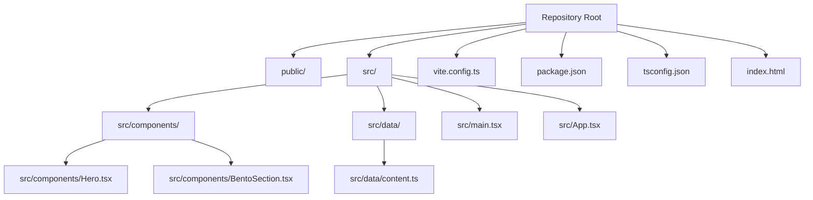
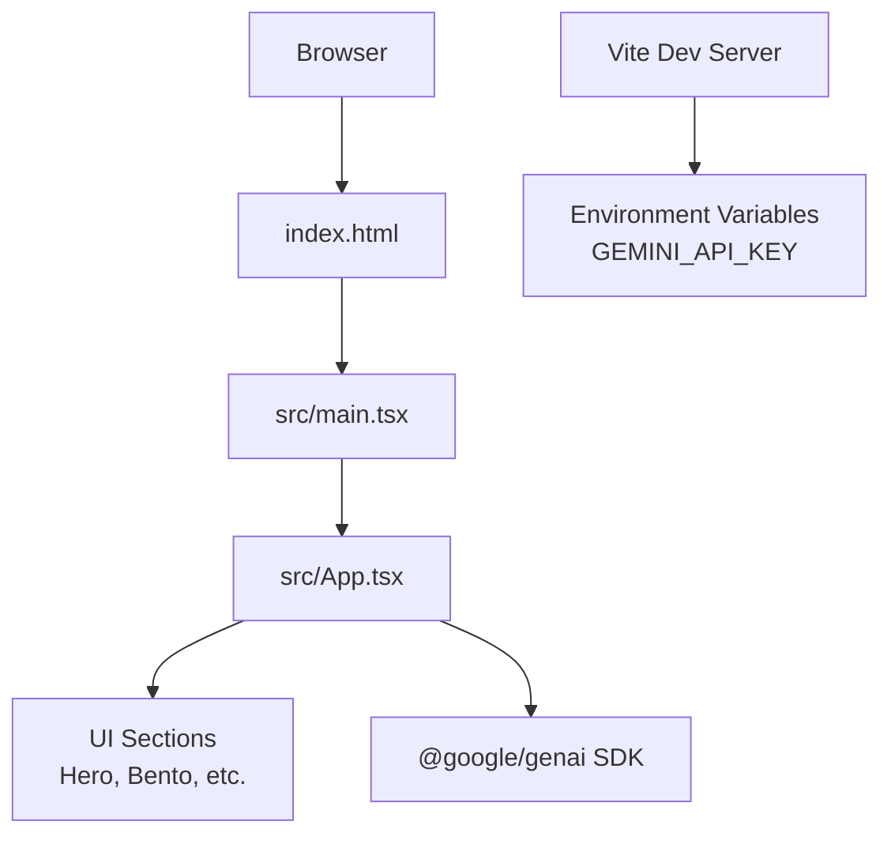
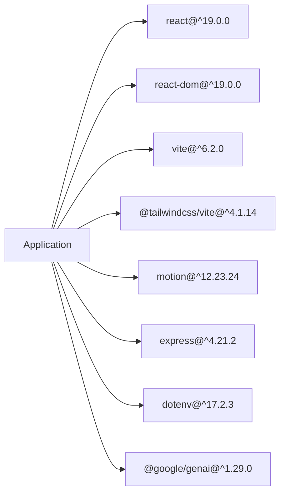
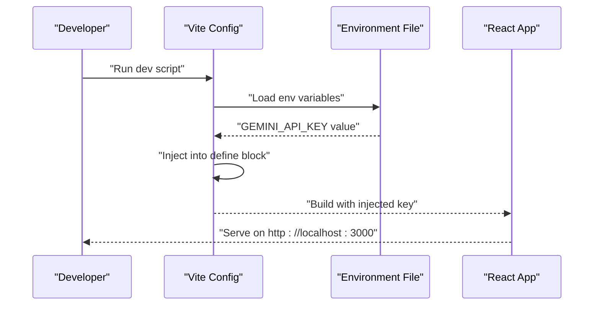

# Getting Started

<cite>
**Referenced Files in This Document**
- [README.md](file://README.md)
- [package.json](file://package.json)
- [vite.config.ts](file://vite.config.ts)
- [tsconfig.json](file://tsconfig.json)
- [index.html](file://index.html)
- [src/main.tsx](file://src/main.tsx)
- [src/App.tsx](file://src/App.tsx)
- [src/data/content.ts](file://src/data/content.ts)
- [src/components/Hero.tsx](file://src/components/Hero.tsx)
- [src/components/BentoSection.tsx](file://src/components/BentoSection.tsx)
</cite>

## Table of Contents
1. [Introduction](#introduction)
2. [Project Structure](#project-structure)
3. [Core Components](#core-components)
4. [Architecture Overview](#architecture-overview)
5. [Detailed Component Analysis](#detailed-component-analysis)
6. [Dependency Analysis](#dependency-analysis)
7. [Performance Considerations](#performance-considerations)
8. [Troubleshooting Guide](#troubleshooting-guide)
9. [Conclusion](#conclusion)
10. [Appendices](#appendices)

## Introduction
This guide helps you set up and run Subash Kannan’s Data Analyst Portfolio locally. It covers prerequisites, environment setup, installing dependencies, configuring the Gemini AI API, running the development server, and deploying via AI Studio. The instructions are beginner-friendly and include troubleshooting tips for common issues.

## Project Structure
The project is a React + Vite TypeScript application with Tailwind CSS styling. It uses the @google/genai SDK for AI features and defines environment variables for the Gemini API key. The app runs on Vite’s dev server and can be deployed to AI Studio.

**Diagram sources**
- [index.html:1-14](file://index.html#L1-L14)
- [src/main.tsx:1-11](file://src/main.tsx#L1-L11)
- [src/App.tsx:1-33](file://src/App.tsx#L1-L33)
- [src/data/content.ts:1-103](file://src/data/content.ts#L1-L103)
- [src/components/Hero.tsx:1-99](file://src/components/Hero.tsx#L1-L99)
- [src/components/BentoSection.tsx:1-87](file://src/components/BentoSection.tsx#L1-L87)
- [vite.config.ts:1-25](file://vite.config.ts#L1-L25)
- [package.json:1-35](file://package.json#L1-L35)
- [tsconfig.json:1-27](file://tsconfig.json#L1-L27)

**Section sources**
- [index.html:1-14](file://index.html#L1-L14)
- [src/main.tsx:1-11](file://src/main.tsx#L1-L11)
- [src/App.tsx:1-33](file://src/App.tsx#L1-L33)
- [src/data/content.ts:1-103](file://src/data/content.ts#L1-L103)
- [src/components/Hero.tsx:1-99](file://src/components/Hero.tsx#L1-L99)
- [src/components/BentoSection.tsx:1-87](file://src/components/BentoSection.tsx#L1-L87)
- [vite.config.ts:1-25](file://vite.config.ts#L1-L25)
- [package.json:1-35](file://package.json#L1-L35)
- [tsconfig.json:1-27](file://tsconfig.json#L1-L27)

## Core Components
- Application entrypoint initializes React and renders the root App component.
- App composes page sections: Navigation, Hero, Impact, Bento, Projects, Education, and Footer.
- Content such as navigation links, skills, education, and media URLs are centralized in a single data module for maintainability.
- Vite configuration loads environment variables and injects the Gemini API key into the app at build time.

Key implementation references:
- Entry and rendering: [src/main.tsx:1-11](file://src/main.tsx#L1-L11)
- App composition: [src/App.tsx:1-33](file://src/App.tsx#L1-L33)
- Content data: [src/data/content.ts:1-103](file://src/data/content.ts#L1-L103)
- Environment variable injection: [vite.config.ts:6-12](file://vite.config.ts#L6-L12)

**Section sources**
- [src/main.tsx:1-11](file://src/main.tsx#L1-L11)
- [src/App.tsx:1-33](file://src/App.tsx#L1-L33)
- [src/data/content.ts:1-103](file://src/data/content.ts#L1-L103)
- [vite.config.ts:6-12](file://vite.config.ts#L6-L12)

## Architecture Overview
The runtime architecture consists of:
- Browser client bootstrapped by index.html
- React application rendered by main.tsx
- App component orchestrating UI sections
- Vite dev server with environment variable injection
- Optional AI Studio deployment pipeline

**Diagram sources**
- [index.html:1-14](file://index.html#L1-L14)
- [src/main.tsx:1-11](file://src/main.tsx#L1-L11)
- [src/App.tsx:1-33](file://src/App.tsx#L1-L33)
- [vite.config.ts:6-12](file://vite.config.ts#L6-L12)
- [package.json:13-24](file://package.json#L13-L24)

**Section sources**
- [index.html:1-14](file://index.html#L1-L14)
- [src/main.tsx:1-11](file://src/main.tsx#L1-L11)
- [src/App.tsx:1-33](file://src/App.tsx#L1-L33)
- [vite.config.ts:6-12](file://vite.config.ts#L6-L12)
- [package.json:13-24](file://package.json#L13-L24)

## Detailed Component Analysis

### Prerequisites and Environment Setup
- Node.js requirement: The project depends on @google/genai which requires Node.js version 20 or higher. Ensure your local Node.js version satisfies this engine constraint before proceeding.
- Environment variable: The Gemini API key must be configured in a local environment file so Vite can inject it at build time.

References:
- Engine requirement: [package.json:712-724](file://package.json#L712-L724)
- Environment injection: [vite.config.ts:6-12](file://vite.config.ts#L6-L12)
- Local run instructions: [README.md:11-20](file://README.md#L11-L20)

**Section sources**
- [package.json:712-724](file://package.json#L712-L724)
- [vite.config.ts:6-12](file://vite.config.ts#L6-L12)
- [README.md:11-20](file://README.md#L11-L20)

### Step-by-Step Installation
1. Install dependencies
   - Run the standard dependency installer to fetch all required packages.
   - Reference: [README.md:16-17](file://README.md#L16-L17), [package.json:13-12](file://package.json#L13-L12)

2. Configure the Gemini API key
   - Add your GEMINI_API_KEY to a local environment file so Vite can inject it into the app.
   - Reference: [README.md](file://README.md#L18), [vite.config.ts:6-12](file://vite.config.ts#L6-L12)

3. Start the development server
   - Launch the Vite dev server with the configured port and host.
   - Reference: [README.md:19-20](file://README.md#L19-L20), [package.json:7-8](file://package.json#L7-L8)

4. Access the app
   - Open the URL shown by the dev server in your browser.
   - Reference: [index.html:1-14](file://index.html#L1-L14)

**Section sources**
- [README.md:11-20](file://README.md#L11-L20)
- [package.json:7-12](file://package.json#L7-L12)
- [vite.config.ts:6-12](file://vite.config.ts#L6-L12)
- [index.html:1-14](file://index.html#L1-L14)

### AI Studio Deployment Option
- The project includes a deployment-ready configuration and a published AI Studio app URL for quick viewing.
- Reference: [README.md](file://README.md#L9)

**Section sources**
- [README.md](file://README.md#L9)

## Dependency Analysis
The project relies on a small set of core libraries:
- React and React DOM for UI rendering
- Vite for development and build tooling
- Tailwind CSS via a Vite plugin
- Motion for animations
- Express and dotenv for optional backend/local server usage
- @google/genai for AI integrations

**Diagram sources**
- [package.json:13-24](file://package.json#L13-L24)

**Section sources**
- [package.json:13-24](file://package.json#L13-L24)

## Performance Considerations
- Use Vite’s built-in dev server for fast reloads and efficient builds.
- Keep the development environment minimal; avoid unnecessary plugins or heavy assets during local iteration.
- For production builds, rely on Vite’s optimized bundling and minification.

[No sources needed since this section provides general guidance]

## Troubleshooting Guide
Common setup issues and resolutions:

- Node.js version mismatch
  - Symptom: Installation fails or runtime errors related to unsupported Node.js features.
  - Cause: Using a Node.js version lower than the required minimum for @google/genai.
  - Fix: Upgrade Node.js to version 20 or higher.
  - Reference: [package.json:722-724](file://package.json#L722-L724)

- Missing or invalid GEMINI_API_KEY
  - Symptom: AI features fail or show configuration errors at runtime.
  - Cause: The environment variable is not present or incorrect.
  - Fix: Add the API key to your local environment file and ensure Vite injects it.
  - References: [README.md](file://README.md#L18), [vite.config.ts:6-12](file://vite.config.ts#L6-L12)

- Port conflicts on localhost
  - Symptom: The dev server fails to start due to port 3000 being in use.
  - Cause: Another process is using the default port.
  - Fix: Change the port in the dev script or stop the conflicting service.
  - References: [package.json:7-8](file://package.json#L7-L8), [vite.config.ts:18-22](file://vite.config.ts#L18-L22)

- Hot Module Replacement (HMR) behavior in AI Studio
  - Symptom: HMR appears disabled or flickering during editing.
  - Cause: Controlled by an environment variable in the Vite config.
  - Fix: Leave the HMR configuration as-is unless advised otherwise.
  - Reference: [vite.config.ts:18-22](file://vite.config.ts#L18-L22)

**Section sources**
- [package.json:7-8](file://package.json#L7-L8)
- [package.json:722-724](file://package.json#L722-L724)
- [README.md](file://README.md#L18)
- [vite.config.ts:6-12](file://vite.config.ts#L6-L12)
- [vite.config.ts:18-22](file://vite.config.ts#L18-L22)

## Conclusion
You now have the essentials to run Subash Kannan’s Data Analyst Portfolio locally, configure the Gemini API, and deploy via AI Studio. Follow the steps above, verify your Node.js version, set the API key, and launch the dev server. If issues arise, consult the troubleshooting section for targeted fixes.

[No sources needed since this section summarizes without analyzing specific files]

## Appendices

### Appendix A: Quick Commands
- Install dependencies: [README.md:16-17](file://README.md#L16-L17)
- Start dev server: [README.md:19-20](file://README.md#L19-L20)
- Build for production: [package.json:8-8](file://package.json#L8-L8)
- Preview production build: [package.json:9-9](file://package.json#L9-L9)

**Section sources**
- [README.md:16-20](file://README.md#L16-L20)
- [package.json:8-9](file://package.json#L8-L9)

### Appendix B: Environment Variable Injection Flow
This sequence illustrates how the environment variable is loaded and injected at build time.

**Diagram sources**
- [vite.config.ts:6-12](file://vite.config.ts#L6-L12)
- [README.md](file://README.md#L18)