# Project Overview

<cite>
**Referenced Files in This Document**
- [README.md](file://README.md)
- [package.json](file://package.json)
- [index.html](file://index.html)
- [src/main.tsx](file://src/main.tsx)
- [src/App.tsx](file://src/App.tsx)
- [src/index.css](file://src/index.css)
- [src/data/content.ts](file://src/data/content.ts)
- [src/components/Navigation.tsx](file://src/components/Navigation.tsx)
- [src/components/Hero.tsx](file://src/components/Hero.tsx)
- [src/components/ImpactSection.tsx](file://src/components/ImpactSection.tsx)
- [src/components/BentoSection.tsx](file://src/components/BentoSection.tsx)
- [src/components/ProjectsSection.tsx](file://src/components/ProjectsSection.tsx)
- [src/components/EducationSection.tsx](file://src/components/EducationSection.tsx)
- [src/components/ContactSection.tsx](file://src/components/ContactSection.tsx)
- [src/components/Footer.tsx](file://src/components/Footer.tsx)
</cite>

## Table of Contents
1. [Introduction](#introduction)
2. [Project Structure](#project-structure)
3. [Core Components](#core-components)
4. [Architecture Overview](#architecture-overview)
5. [Detailed Component Analysis](#detailed-component-analysis)
6. [Dependency Analysis](#dependency-analysis)
7. [Performance Considerations](#performance-considerations)
8. [Troubleshooting Guide](#troubleshooting-guide)
9. [Conclusion](#conclusion)
10. [Appendices](#appendices)

## Introduction
This project is Subash Kannan’s professional Data Analyst portfolio website. It is designed to present a concise yet compelling narrative of business analytics expertise, e-commerce logistics knowledge, and TikTok Commerce scalability experience. The site targets recruiters, hiring managers, and potential clients who seek a modern, data-driven showcase of analytical capabilities, practical outcomes, and technical proficiency.

Key positioning:
- Professional portfolio highlighting analytics outcomes and storytelling
- Clear demonstration of technical skills and tools (SQL, Python, Power BI, Excel)
- Case study-style project presentation aligned with revenue and partner-facing narratives
- Modern, accessible UI with smooth interactions and responsive design

Target audience:
- Recruiters and hiring managers evaluating candidates for data analyst, business analytics, or analytics engineering roles
- Potential clients seeking analysts with e-commerce and social commerce expertise
- Hiring platforms and internal ATS systems scanning for keywords and structure

## Project Structure
The portfolio is a React application built with Vite and styled using Tailwind CSS. It follows a component-based architecture with a single-page layout segmented into clearly defined sections. Content is centralized in a shared data module for maintainability and consistency.

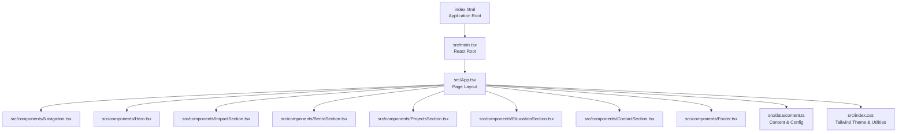

**Diagram sources**
- [index.html:1-14](file://index.html#L1-L14)
- [src/main.tsx:1-11](file://src/main.tsx#L1-L11)
- [src/App.tsx:1-33](file://src/App.tsx#L1-L33)
- [src/index.css:1-71](file://src/index.css#L1-L71)
- [src/data/content.ts:1-103](file://src/data/content.ts#L1-L103)

**Section sources**
- [index.html:1-14](file://index.html#L1-L14)
- [src/main.tsx:1-11](file://src/main.tsx#L1-L11)
- [src/App.tsx:1-33](file://src/App.tsx#L1-L33)
- [src/index.css:1-71](file://src/index.css#L1-L71)
- [src/data/content.ts:1-103](file://src/data/content.ts#L1-L103)

## Core Components
The portfolio is composed of modular React components that render cohesive sections. Each component encapsulates a distinct aspect of the narrative and presentation.

- Navigation: Sticky header with animated active indicators, responsive layout, and CV download action
- Hero: Personal introduction, location, tagline, and social links with animated entrance
- ImpactSection: Quantified outcomes with custom SVG charts and animated reveal
- BentoSection: Executive summary and skills visualization with animated progress bars
- ProjectsSection: Portfolio case studies with stack badges and highlight bullets
- EducationSection: Academic background and certifications with staggered animations
- ContactSection: Call-to-action for engagement with linked channels
- Footer: Persistent branding and social links

These components collectively form a seamless, scroll-driven experience that emphasizes clarity, visual impact, and accessibility.

**Section sources**
- [src/components/Navigation.tsx:1-98](file://src/components/Navigation.tsx#L1-L98)
- [src/components/Hero.tsx:1-99](file://src/components/Hero.tsx#L1-L99)
- [src/components/ImpactSection.tsx:1-106](file://src/components/ImpactSection.tsx#L1-L106)
- [src/components/BentoSection.tsx:1-87](file://src/components/BentoSection.tsx#L1-L87)
- [src/components/ProjectsSection.tsx:1-100](file://src/components/ProjectsSection.tsx#L1-L100)
- [src/components/EducationSection.tsx:1-58](file://src/components/EducationSection.tsx#L1-L58)
- [src/components/ContactSection.tsx:1-39](file://src/components/ContactSection.tsx#L1-L39)
- [src/components/Footer.tsx:1-36](file://src/components/Footer.tsx#L1-L36)

## Architecture Overview
The application architecture is straightforward and component-centric:
- Single entry point renders the App component
- App composes page sections in order
- Shared content and constants live in a single data module
- Styling leverages Tailwind utilities with a custom theme
- Motion library powers animations and transitions

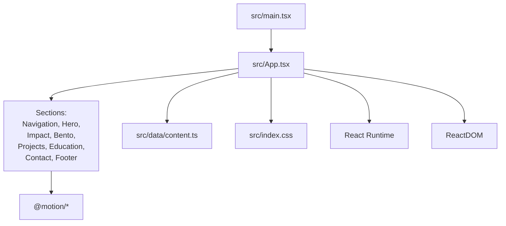

**Diagram sources**
- [src/main.tsx:1-11](file://src/main.tsx#L1-L11)
- [src/App.tsx:1-33](file://src/App.tsx#L1-L33)
- [src/data/content.ts:1-103](file://src/data/content.ts#L1-L103)
- [src/index.css:1-71](file://src/index.css#L1-L71)
- [package.json:13-24](file://package.json#L13-L24)

**Section sources**
- [src/main.tsx:1-11](file://src/main.tsx#L1-L11)
- [src/App.tsx:1-33](file://src/App.tsx#L1-L33)
- [package.json:13-24](file://package.json#L13-L24)

## Detailed Component Analysis

### Navigation and Active State Management
The Navigation component provides a fixed header with animated active indicators and a CV download action. It computes active sections based on scroll position and updates the active tab dynamically.

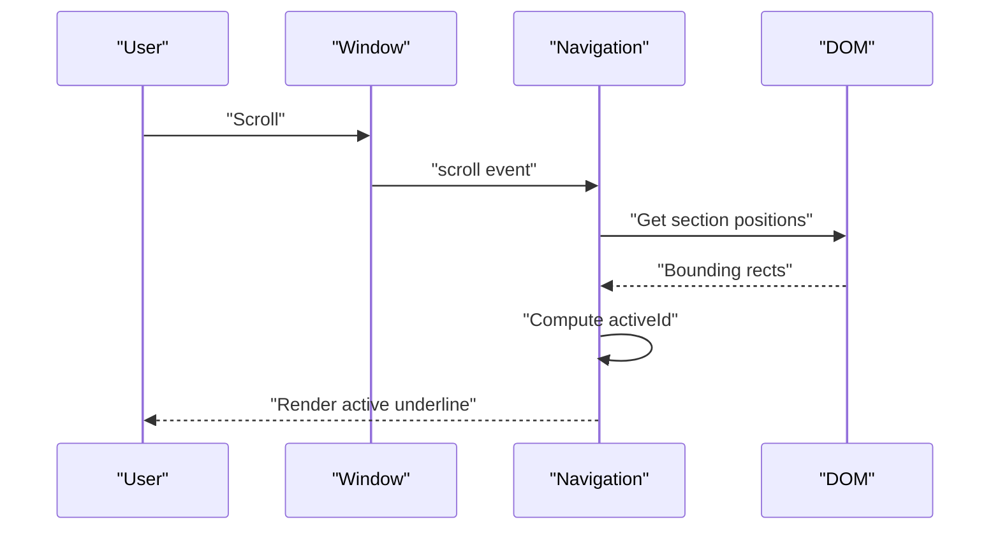

**Diagram sources**
- [src/components/Navigation.tsx:13-40](file://src/components/Navigation.tsx#L13-L40)

**Section sources**
- [src/components/Navigation.tsx:1-98](file://src/components/Navigation.tsx#L1-L98)

### Hero Section: Animated Personal Introduction
The Hero section presents a visually engaging introduction with staggered animations, social links, and a prominent “Open to Roles” badge. It uses motion primitives to animate entrance and hover effects.

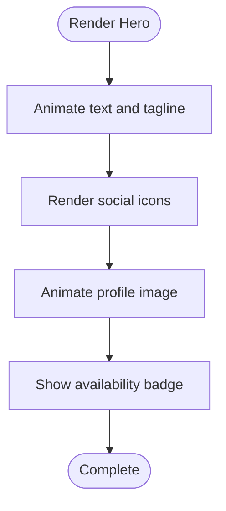

**Diagram sources**
- [src/components/Hero.tsx:11-99](file://src/components/Hero.tsx#L11-L99)

**Section sources**
- [src/components/Hero.tsx:1-99](file://src/components/Hero.tsx#L1-L99)

### ImpactSection: Quantified Outcomes with Custom Charts
ImpactSection displays quantified business outcomes with custom SVG charts and animated reveals. Each metric card includes a KPI label, value, headline, description, and a chart.

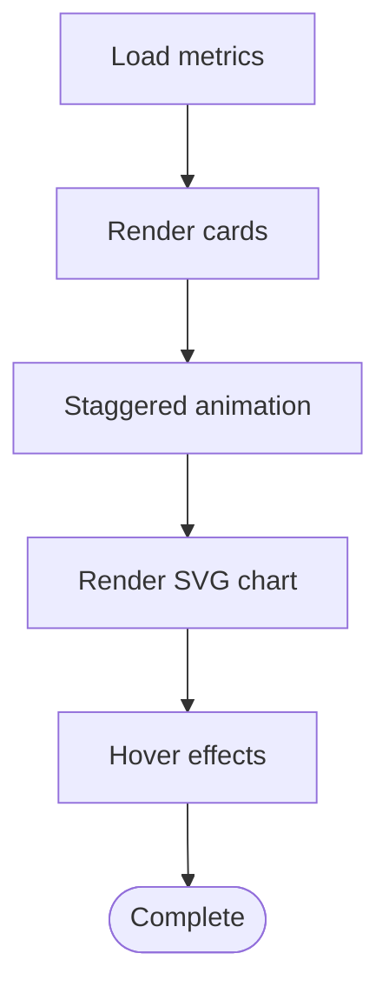

**Diagram sources**
- [src/components/ImpactSection.tsx:3-54](file://src/components/ImpactSection.tsx#L3-L54)

**Section sources**
- [src/components/ImpactSection.tsx:1-106](file://src/components/ImpactSection.tsx#L1-L106)

### BentoSection: Executive Summary and Skills Visualization
BentoSection combines an executive summary with a skills matrix. Skills are rendered with animated progress bars and icons sourced from Lucide.

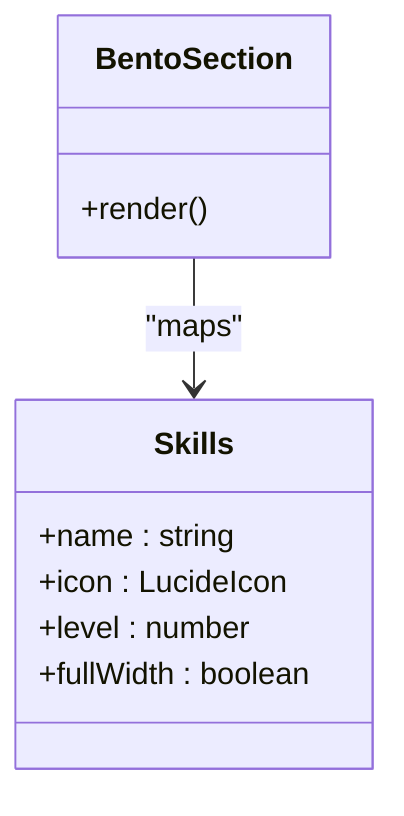

**Diagram sources**
- [src/components/BentoSection.tsx:4-87](file://src/components/BentoSection.tsx#L4-L87)
- [src/data/content.ts:20-36](file://src/data/content.ts#L20-L36)

**Section sources**
- [src/components/BentoSection.tsx:1-87](file://src/components/BentoSection.tsx#L1-L87)
- [src/data/content.ts:20-36](file://src/data/content.ts#L20-L36)

### ProjectsSection: Case Study Showcase
ProjectsSection renders a portfolio of analytics projects with stack badges and highlight bullets. Icons are mapped based on technology names.

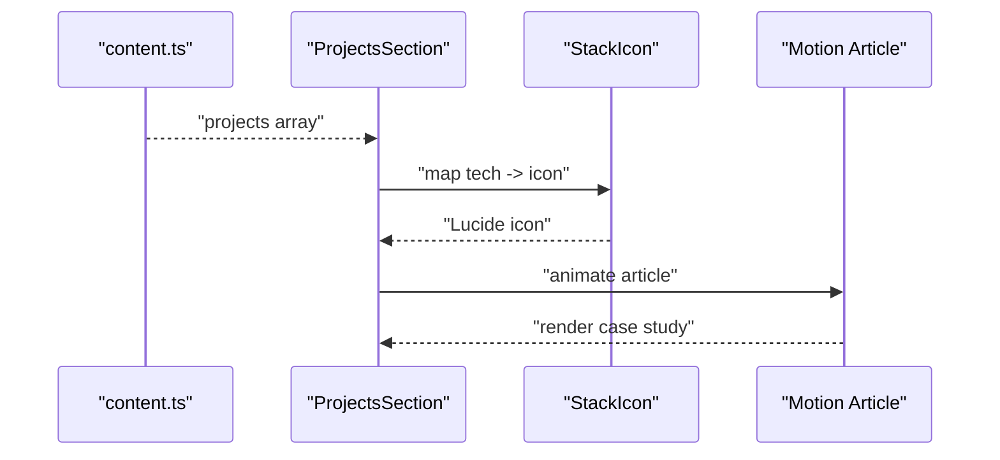

**Diagram sources**
- [src/components/ProjectsSection.tsx:21-99](file://src/components/ProjectsSection.tsx#L21-L99)
- [src/data/content.ts:83-103](file://src/data/content.ts#L83-L103)

**Section sources**
- [src/components/ProjectsSection.tsx:1-100](file://src/components/ProjectsSection.tsx#L1-L100)
- [src/data/content.ts:83-103](file://src/data/content.ts#L83-L103)

### EducationSection: Academic Background
EducationSection lists academic credentials and certifications with staggered animations and responsive layout.

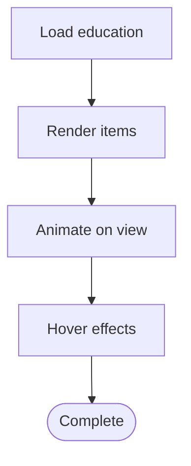

**Diagram sources**
- [src/components/EducationSection.tsx:4-58](file://src/components/EducationSection.tsx#L4-L58)
- [src/data/content.ts:38-60](file://src/data/content.ts#L38-L60)

**Section sources**
- [src/components/EducationSection.tsx:1-58](file://src/components/EducationSection.tsx#L1-L58)
- [src/data/content.ts:38-60](file://src/data/content.ts#L38-L60)

### ContactSection: Engagement CTA
ContactSection provides a strong call-to-action with email and LinkedIn links, styled for visibility and contrast.

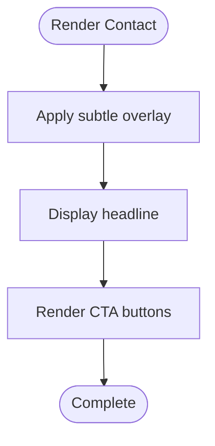

**Diagram sources**
- [src/components/ContactSection.tsx:3-39](file://src/components/ContactSection.tsx#L3-L39)
- [src/data/content.ts:62-81](file://src/data/content.ts#L62-L81)

**Section sources**
- [src/components/ContactSection.tsx:1-39](file://src/components/ContactSection.tsx#L1-L39)
- [src/data/content.ts:62-81](file://src/data/content.ts#L62-L81)

### Footer: Branding and Links
Footer maintains consistent branding and links across pages with underlined navigation and responsive layout.

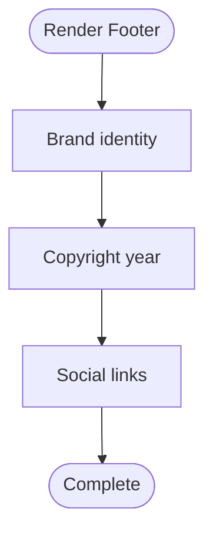

**Diagram sources**
- [src/components/Footer.tsx:3-36](file://src/components/Footer.tsx#L3-L36)
- [src/data/content.ts:67-75](file://src/data/content.ts#L67-L75)

**Section sources**
- [src/components/Footer.tsx:1-36](file://src/components/Footer.tsx#L1-L36)
- [src/data/content.ts:67-75](file://src/data/content.ts#L67-L75)

## Dependency Analysis
The project relies on a focused set of libraries and tools:
- React and ReactDOM for rendering
- Vite for development and build
- Tailwind CSS for styling and theming
- Motion for animations
- Lucide React for icons
- Express and dotenv for local server and environment configuration

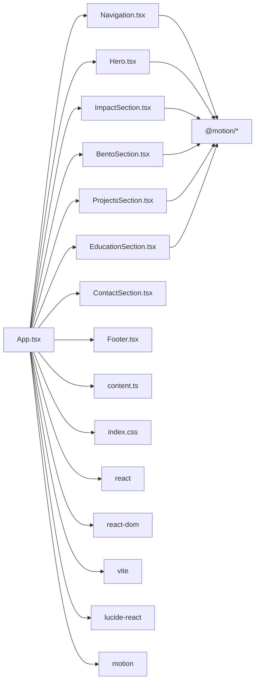

**Diagram sources**
- [src/App.tsx:6-13](file://src/App.tsx#L6-L13)
- [src/components/Navigation.tsx:1-4](file://src/components/Navigation.tsx#L1-L4)
- [src/index.css:1-1](file://src/index.css#L1-L1)
- [package.json:13-24](file://package.json#L13-L24)

**Section sources**
- [package.json:13-24](file://package.json#L13-L24)
- [src/App.tsx:6-13](file://src/App.tsx#L6-L13)

## Performance Considerations
- Lazy loading and viewport-triggered animations minimize initial load impact
- Minimal DOM depth and flat component hierarchy reduce reflow costs
- CSS-in-JS via Tailwind ensures efficient style application
- SVG charts avoid heavy chart libraries for lightweight visuals
- Static assets (images, PDF) served from public folder for fast delivery

## Troubleshooting Guide
Common issues and resolutions:
- Missing environment variables: Ensure required keys are configured for local runs
- Scroll-based navigation not updating: Verify section IDs match navigation hrefs and that scroll listeners are attached
- Motion animations not firing: Confirm viewport options and that elements are within the visible area
- Styling inconsistencies: Validate Tailwind theme tokens and ensure CSS imports are present

**Section sources**
- [README.md:16-20](file://README.md#L16-L20)
- [src/components/Navigation.tsx:13-40](file://src/components/Navigation.tsx#L13-L40)
- [src/index.css:1-71](file://src/index.css#L1-L71)

## Conclusion
This portfolio effectively communicates Subash Kannan’s expertise in business analytics, e-commerce logistics, and TikTok Commerce scalability. Its modern React architecture, thoughtful animations, and structured content make it a powerful tool for recruiters, hiring managers, and potential clients to quickly assess analytical capabilities and outcomes.

## Appendices
- Practical examples for professionals:
  - Use the ProjectsSection pattern to present case studies with stack badges and outcome highlights
  - Apply ImpactSection’s KPI visualization to quantify business improvements
  - Employ BentoSection’s skills matrix to showcase technical competencies with animated progress bars
  - Integrate ContactSection’s CTA buttons to streamline engagement via email and LinkedIn

[No sources needed since this section provides general guidance]