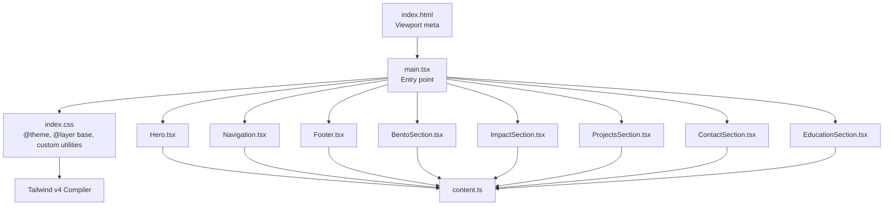
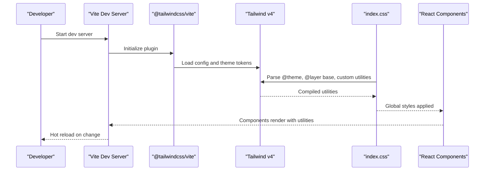
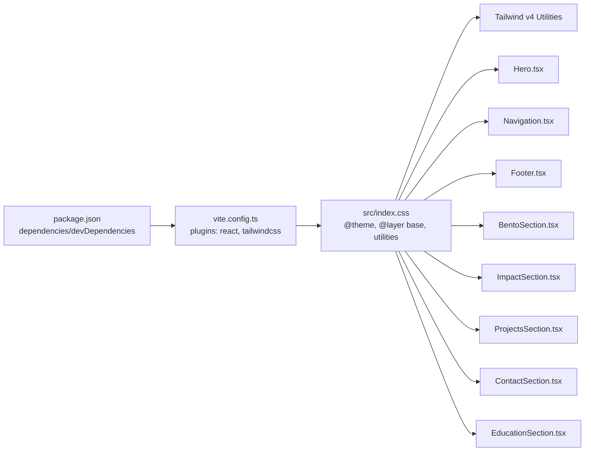

# Styling & Theming System

<cite>
**Referenced Files in This Document**
- [index.css](file://src/index.css)
- [package.json](file://package.json)
- [vite.config.ts](file://vite.config.ts)
- [main.tsx](file://src/main.tsx)
- [Hero.tsx](file://src/components/Hero.tsx)
- [Navigation.tsx](file://src/components/Navigation.tsx)
- [Footer.tsx](file://src/components/Footer.tsx)
- [BentoSection.tsx](file://src/components/BentoSection.tsx)
- [ImpactSection.tsx](file://src/components/ImpactSection.tsx)
- [ProjectsSection.tsx](file://src/components/ProjectsSection.tsx)
- [ContactSection.tsx](file://src/components/ContactSection.tsx)
- [EducationSection.tsx](file://src/components/EducationSection.tsx)
- [content.ts](file://src/data/content.ts)
- [index.html](file://index.html)
</cite>

## Table of Contents
1. [Introduction](#introduction)
2. [Project Structure](#project-structure)
3. [Core Components](#core-components)
4. [Architecture Overview](#architecture-overview)
5. [Detailed Component Analysis](#detailed-component-analysis)
6. [Dependency Analysis](#dependency-analysis)
7. [Performance Considerations](#performance-considerations)
8. [Troubleshooting Guide](#troubleshooting-guide)
9. [Conclusion](#conclusion)
10. [Appendices](#appendices)

## Introduction
This document describes the styling and theming system built with Tailwind CSS v4 in this React application. It explains the custom color palette inspired by Material Design principles, the responsive breakpoint system, utility class usage patterns, glass-morphism design elements, animation and transition configurations, typography hierarchy, and component-specific styling approaches. It also provides guidelines for maintaining design consistency, extending the color scheme, adding custom animations, optimizing for different screen sizes, performance considerations for CSS delivery, browser compatibility, and accessibility compliance.

## Project Structure
The styling pipeline is driven by Tailwind CSS v4 configured via Vite. The global stylesheet defines theme tokens and base styles, while individual components apply utility classes and motion-driven transitions. The build integrates Tailwind’s compiler through the official Vite plugin.

**Diagram sources**
- [index.html:1-14](file://index.html#L1-L14)
- [main.tsx:1-11](file://src/main.tsx#L1-L11)
- [index.css:1-71](file://src/index.css#L1-L71)
- [vite.config.ts:1-25](file://vite.config.ts#L1-L25)
- [Hero.tsx:1-99](file://src/components/Hero.tsx#L1-L99)
- [Navigation.tsx:1-98](file://src/components/Navigation.tsx#L1-L98)
- [Footer.tsx:1-36](file://src/components/Footer.tsx#L1-L36)
- [BentoSection.tsx:1-87](file://src/components/BentoSection.tsx#L1-L87)
- [ImpactSection.tsx:1-106](file://src/components/ImpactSection.tsx#L1-L106)
- [ProjectsSection.tsx:1-100](file://src/components/ProjectsSection.tsx#L1-L100)
- [ContactSection.tsx:1-39](file://src/components/ContactSection.tsx#L1-L39)
- [EducationSection.tsx:1-58](file://src/components/EducationSection.tsx#L1-L58)
- [content.ts:1-103](file://src/data/content.ts#L1-L103)

**Section sources**
- [index.html:1-14](file://index.html#L1-L14)
- [main.tsx:1-11](file://src/main.tsx#L1-L11)
- [index.css:1-71](file://src/index.css#L1-L71)
- [vite.config.ts:1-25](file://vite.config.ts#L1-L25)

## Core Components
- Theme tokens and base styles: The global stylesheet defines fonts, semantic colors, surface palettes, and radius tokens. It also sets base border and typography defaults and applies anti-aliasing.
- Glass-morphism utilities: A reusable class composes backdrop blur, translucency, and subtle borders for navigation surfaces.
- Component-specific utilities: Cards, skill bars, and hover states use consistent spacing, transitions, and shadows.

Key implementation references:
- Theme tokens and base layer: [index.css:3-50](file://src/index.css#L3-L50)
- Glass utility: [index.css:52-54](file://src/index.css#L52-L54)
- Impact card styles: [index.css:56-62](file://src/index.css#L56-L62)
- Skill bar backgrounds and fills: [index.css:64-70](file://src/index.css#L64-L70)

**Section sources**
- [index.css:1-71](file://src/index.css#L1-L71)

## Architecture Overview
Tailwind v4 compiles the theme tokens and utility classes into production CSS. The Vite plugin runs in development and build modes, resolving aliases and enabling HMR. Components import the global stylesheet and compose Tailwind utilities per design intent.

**Diagram sources**
- [vite.config.ts:1-25](file://vite.config.ts#L1-L25)
- [index.css:1-71](file://src/index.css#L1-L71)
- [main.tsx:1-11](file://src/main.tsx#L1-L11)

## Detailed Component Analysis

### Color Palette and Material Design Principles
The theme defines a cohesive palette with primary, secondary, tertiary, surface, background, and outline tokens. Surface variants and containers provide layered depth, while fixed tonal accents support interactive states. This aligns with Material Design’s emphasis on roles and tonal relationships.

- Semantic tokens: [index.css:8-31](file://src/index.css#L8-L31)
- Surface containers and radii: [index.css:23-39](file://src/index.css#L23-L39)

Usage examples across components:
- Primary text and accents: [Hero.tsx:25](file://src/components/Hero.tsx#L25), [Navigation.tsx:45](file://src/components/Navigation.tsx#L45)
- Secondary labels and borders: [Hero.tsx:22](file://src/components/Hero.tsx#L22), [Footer.tsx:10](file://src/components/Footer.tsx#L10)
- Tertiary fixed accents for icons and highlights: [BentoSection.tsx:65](file://src/components/BentoSection.tsx#L65), [ProjectsSection.tsx:17](file://src/components/ProjectsSection.tsx#L17)

Guidelines for extension:
- Add new semantic roles by introducing paired tokens (e.g., --color-new-role and --color-on-new-role).
- Define container variants for surfaces to maintain depth hierarchy.
- Keep contrast ratios sufficient for accessibility (WCAG AA at minimum).

**Section sources**
- [index.css:8-39](file://src/index.css#L8-L39)
- [Hero.tsx:22-29](file://src/components/Hero.tsx#L22-L29)
- [Navigation.tsx:45](file://src/components/Navigation.tsx#L45)
- [Footer.tsx:10](file://src/components/Footer.tsx#L10)
- [BentoSection.tsx:65](file://src/components/BentoSection.tsx#L65)
- [ProjectsSection.tsx:17](file://src/components/ProjectsSection.tsx#L17)

### Responsive Breakpoint System
The design leverages Tailwind’s default breakpoints with a consistent max-width container pattern and grid-based layouts. Typical breakpoints used:
- Mobile-first with md, lg grid spans and typography scaling.

Examples:
- Hero grid and padding: [Hero.tsx:13](file://src/components/Hero.tsx#L13)
- Bento content split: [BentoSection.tsx:7](file://src/components/BentoSection.tsx#L7)
- Impact cards grid: [ImpactSection.tsx:69](file://src/components/ImpactSection.tsx#L69)
- Projects layout: [ProjectsSection.tsx:28](file://src/components/ProjectsSection.tsx#L28)

Best practices:
- Prefer container-first layouts with max-w-7xl and responsive gutters.
- Use grid column spans to adapt content density across widths.
- Scale typography with mobile-first units and responsive modifiers.

**Section sources**
- [Hero.tsx:13](file://src/components/Hero.tsx#L13)
- [BentoSection.tsx:7](file://src/components/BentoSection.tsx#L7)
- [ImpactSection.tsx:69](file://src/components/ImpactSection.tsx#L69)
- [ProjectsSection.tsx:28](file://src/components/ProjectsSection.tsx#L28)

### Typography Hierarchy
Typography is defined via CSS variables for headline, body, and label fonts. Components consistently apply font families, weights, letter-spacing, and line-height tokens to maintain rhythm.

- Font tokens: [index.css:4-6](file://src/index.css#L4-L6)
- Body and headline usage: [Hero.tsx:25](file://src/components/Hero.tsx#L25), [BentoSection.tsx:18](file://src/components/BentoSection.tsx#L18)
- Label and small caps usage: [Hero.tsx:22](file://src/components/Hero.tsx#L22), [Navigation.tsx:56](file://src/components/Navigation.tsx#L56)

Accessibility tips:
- Maintain readable line lengths and adequate spacing between blocks.
- Prefer relative units for scalable text and avoid hardcoded pixel sizes.

**Section sources**
- [index.css:4-6](file://src/index.css#L4-L6)
- [Hero.tsx:22-25](file://src/components/Hero.tsx#L22-L25)
- [BentoSection.tsx:18](file://src/components/BentoSection.tsx#L18)
- [Navigation.tsx:56](file://src/components/Navigation.tsx#L56)

### Glass-Morphism and Backdrop Effects
Glass navigation uses a translucent background, backdrop blur, and thin border to achieve a frosted effect. This creates depth without sacrificing readability.

- Glass utility class: [index.css:52-54](file://src/index.css#L52-L54)
- Navigation composition: [Navigation.tsx:43](file://src/components/Navigation.tsx#L43)

Implementation notes:
- Combine background alpha with backdrop blur for modern transparency.
- Use low, consistent border opacity to maintain edge definition.
- Ensure sufficient contrast against blurred backgrounds for accessibility.

**Section sources**
- [index.css:52-54](file://src/index.css#L52-L54)
- [Navigation.tsx:43](file://src/components/Navigation.tsx#L43)

### Animations and Transitions
Motion is integrated via a motion library to animate component entry and interactive states. Transitions are applied to hover states and layout changes for smooth feedback.

- Hero entrance: [Hero.tsx:15-75](file://src/components/Hero.tsx#L15-L75)
- Navigation underline spring: [Navigation.tsx:66-80](file://src/components/Navigation.tsx#L66-L80)
- Impact card hover: [index.css:60-62](file://src/index.css#L60-L62)
- Skill bar fill: [BentoSection.tsx:71-78](file://src/components/BentoSection.tsx#L71-L78)
- Project cards hover: [ProjectsSection.tsx:52](file://src/components/ProjectsSection.tsx#L52)

Transition patterns:
- Duration and easing tuned for perceived snappiness and clarity.
- Layout animations use spring physics for natural movement.

**Section sources**
- [Hero.tsx:15-75](file://src/components/Hero.tsx#L15-L75)
- [Navigation.tsx:66-80](file://src/components/Navigation.tsx#L66-L80)
- [index.css:60-62](file://src/index.css#L60-L62)
- [BentoSection.tsx:71-78](file://src/components/BentoSection.tsx#L71-L78)
- [ProjectsSection.tsx:52](file://src/components/ProjectsSection.tsx#L52)

### Dark/Light Mode Considerations
The current theme defines light-mode tokens and base styles. To add dark mode:
- Duplicate tokens with dark suffixes and invert semantic roles.
- Provide a media-query-based switch to toggle a root attribute (e.g., data-theme="dark").
- Update base layer to flip text and border colors accordingly.
- Ensure custom utilities remain consistent across modes.

[No sources needed since this section provides general guidance]

### Custom CSS Variables and Base Layer
The base layer establishes global border defaults, background, and typography. It also overrides border radius to zero for a flat design aesthetic.

- Base layer and radius override: [index.css:42-50](file://src/index.css#L42-L50)

Recommendations:
- Centralize radius tokens for uniform corner treatment.
- Keep border defaults minimal to reduce specificity conflicts.

**Section sources**
- [index.css:42-50](file://src/index.css#L42-L50)

### Component-Specific Styling Approaches
- Hero: Uses grid columns, aspect-ratio containers, and layered badges to emphasize profile presence and status.
  - Grid and image container: [Hero.tsx:14](file://src/components/Hero.tsx#L14), [Hero.tsx:77-87](file://src/components/Hero.tsx#L77-L87)
- Navigation: Fixed top bar with glass effect, animated active underline, and CTA button.
  - Glass class usage: [Navigation.tsx:43](file://src/components/Navigation.tsx#L43)
  - Animated underline: [Navigation.tsx:66-80](file://src/components/Navigation.tsx#L66-L80)
- Footer: Subtle borders, consistent typography, and link underlines.
  - Border and underline: [Footer.tsx:5](file://src/components/Footer.tsx#L5), [Footer.tsx:25](file://src/components/Footer.tsx#L25)
- BentoSection: Surface containers, skill bars with motion-driven fills, and iconography.
  - Surface containers: [BentoSection.tsx:12](file://src/components/BentoSection.tsx#L12), [BentoSection.tsx:48](file://src/components/BentoSection.tsx#L48)
  - Skill bars: [BentoSection.tsx:70-78](file://src/components/BentoSection.tsx#L70-L78)
- ImpactSection: Card grid with bar indicators, SVG charts, and hover elevation.
  - Card utility: [index.css:56-62](file://src/index.css#L56-L62)
  - Chart paths: [ImpactSection.tsx:13-26](file://src/components/ImpactSection.tsx#L13-L26)
- ProjectsSection: Hoverable cards with tag chips and highlight lists.
  - Card hover: [ProjectsSection.tsx:52](file://src/components/ProjectsSection.tsx#L52)
  - Tag chips: [ProjectsSection.tsx:70-76](file://src/components/ProjectsSection.tsx#L70-L76)
- ContactSection: Full-bleed hero with radial gradient overlay and prominent CTAs.
  - Gradient overlay: [ContactSection.tsx:9-11](file://src/components/ContactSection.tsx#L9-L11)
  - Buttons: [ContactSection.tsx:20-34](file://src/components/ContactSection.tsx#L20-L34)
- EducationSection: Hoverable rows with directional layout and period labels.
  - Row hover: [EducationSection.tsx:29](file://src/components/EducationSection.tsx#L29)

**Section sources**
- [Hero.tsx:14](file://src/components/Hero.tsx#L14)
- [Hero.tsx:77-87](file://src/components/Hero.tsx#L77-L87)
- [Navigation.tsx:43](file://src/components/Navigation.tsx#L43)
- [Navigation.tsx:66-80](file://src/components/Navigation.tsx#L66-L80)
- [Footer.tsx:5](file://src/components/Footer.tsx#L5)
- [Footer.tsx:25](file://src/components/Footer.tsx#L25)
- [BentoSection.tsx:12](file://src/components/BentoSection.tsx#L12)
- [BentoSection.tsx:48](file://src/components/BentoSection.tsx#L48)
- [BentoSection.tsx:70-78](file://src/components/BentoSection.tsx#L70-L78)
- [index.css:56-62](file://src/index.css#L56-L62)
- [ImpactSection.tsx:13-26](file://src/components/ImpactSection.tsx#L13-L26)
- [ProjectsSection.tsx:52](file://src/components/ProjectsSection.tsx#L52)
- [ProjectsSection.tsx:70-76](file://src/components/ProjectsSection.tsx#L70-L76)
- [ContactSection.tsx:9-11](file://src/components/ContactSection.tsx#L9-L11)
- [ContactSection.tsx:20-34](file://src/components/ContactSection.tsx#L20-L34)
- [EducationSection.tsx:29](file://src/components/EducationSection.tsx#L29)

### Practical Examples of Common Patterns
- Surface containers: Use surface container utilities for elevated content areas with consistent borders and spacing.
  - Example: [BentoSection.tsx:12](file://src/components/BentoSection.tsx#L12), [ProjectsSection.tsx:25](file://src/components/ProjectsSection.tsx#L25)
- Hover elevation and translation: Apply transitions and shadows for interactive feedback.
  - Example: [index.css:60-62](file://src/index.css#L60-L62), [ProjectsSection.tsx:52](file://src/components/ProjectsSection.tsx#L52)
- Animated progress bars: Animate width on view to indicate proficiency or completion.
  - Example: [BentoSection.tsx:71-78](file://src/components/BentoSection.tsx#L71-L78)
- Label and badge typography: Use label font family and uppercase tracking for metadata.
  - Example: [Hero.tsx:22](file://src/components/Hero.tsx#L22), [ProjectsSection.tsx:70-76](file://src/components/ProjectsSection.tsx#L70-L76)

**Section sources**
- [BentoSection.tsx:12](file://src/components/BentoSection.tsx#L12)
- [ProjectsSection.tsx:25](file://src/components/ProjectsSection.tsx#L25)
- [index.css:60-62](file://src/index.css#L60-L62)
- [ProjectsSection.tsx:52](file://src/components/ProjectsSection.tsx#L52)
- [BentoSection.tsx:71-78](file://src/components/BentoSection.tsx#L71-L78)
- [Hero.tsx:22](file://src/components/Hero.tsx#L22)
- [ProjectsSection.tsx:70-76](file://src/components/ProjectsSection.tsx#L70-L76)

## Dependency Analysis
Tailwind v4 is integrated via the Vite plugin, which scans the project for CSS and TypeScript files. The global stylesheet depends on Tailwind’s utilities and theme tokens. Components depend on the global stylesheet and motion libraries for animations.

**Diagram sources**
- [package.json:13-33](file://package.json#L13-L33)
- [vite.config.ts:1-25](file://vite.config.ts#L1-L25)
- [index.css:1-71](file://src/index.css#L1-L71)
- [Hero.tsx:1-99](file://src/components/Hero.tsx#L1-L99)
- [Navigation.tsx:1-98](file://src/components/Navigation.tsx#L1-L98)
- [Footer.tsx:1-36](file://src/components/Footer.tsx#L1-L36)
- [BentoSection.tsx:1-87](file://src/components/BentoSection.tsx#L1-L87)
- [ImpactSection.tsx:1-106](file://src/components/ImpactSection.tsx#L1-L106)
- [ProjectsSection.tsx:1-100](file://src/components/ProjectsSection.tsx#L1-L100)
- [ContactSection.tsx:1-39](file://src/components/ContactSection.tsx#L1-L39)
- [EducationSection.tsx:1-58](file://src/components/EducationSection.tsx#L1-L58)

**Section sources**
- [package.json:13-33](file://package.json#L13-L33)
- [vite.config.ts:1-25](file://vite.config.ts#L1-L25)
- [index.css:1-71](file://src/index.css#L1-L71)

## Performance Considerations
- CSS delivery: Tailwind v4 produces a compact utility set; keep unused utilities out of the codebase to minimize CSS size.
- Browser compatibility: Tailwind v4 compiles modern CSS; ensure target browsers support essential features (backdrop-filter for glass effects, transforms for animations).
- Accessibility: Maintain sufficient contrast and readable line lengths; test with assistive technologies.
- Motion preferences: Respect reduced motion settings by simplifying transitions where appropriate.

[No sources needed since this section provides general guidance]

## Troubleshooting Guide
- Theme tokens not applying: Verify @theme block order and that utilities reference defined tokens.
  - Reference: [index.css:3-40](file://src/index.css#L3-L40)
- Utilities not generated: Confirm Tailwind plugin is enabled in Vite and that files import the stylesheet.
  - Reference: [vite.config.ts:9](file://vite.config.ts#L9), [main.tsx:4](file://src/main.tsx#L4)
- Motion animations not rendering: Ensure the motion library is installed and imported in components.
  - Reference: [Hero.tsx:1](file://src/components/Hero.tsx#L1), [Navigation.tsx:2](file://src/components/Navigation.tsx#L2)
- Build errors: Check Tailwind and Vite versions for compatibility and reinstall dependencies if needed.
  - Reference: [package.json:25-33](file://package.json#L25-L33)

**Section sources**
- [index.css:3-40](file://src/index.css#L3-L40)
- [vite.config.ts:9](file://vite.config.ts#L9)
- [main.tsx:4](file://src/main.tsx#L4)
- [Hero.tsx:1](file://src/components/Hero.tsx#L1)
- [Navigation.tsx:2](file://src/components/Navigation.tsx#L2)
- [package.json:25-33](file://package.json#L25-L33)

## Conclusion
This styling and theming system combines Tailwind CSS v4 with a custom tokenized palette, glass-morphism effects, and motion-driven interactions. By centralizing theme tokens, leveraging responsive grids, and applying consistent transitions, the design remains coherent across components. Extending the palette, adding dark mode, and optimizing for performance and accessibility can be achieved incrementally while preserving the established patterns.

[No sources needed since this section summarizes without analyzing specific files]

## Appendices
- Maintaining design consistency:
  - Use surface containers for content areas; reserve primary/secondary/tertiary for roles and states.
  - Keep typography scales consistent across breakpoints.
- Extending the color scheme:
  - Add semantic tokens and on-color pairs; derive container variants for depth.
- Adding custom animations:
  - Introduce motion-driven transitions for interactive states; tune durations and easing for clarity.
- Optimizing for screen sizes:
  - Favor grid column spans and container-based layouts; test on mobile and tablet breakpoints.
- Accessibility and compatibility:
  - Validate contrast ratios; test with reduced-motion settings; confirm browser support for backdrop-filter and transforms.

[No sources needed since this section provides general guidance]