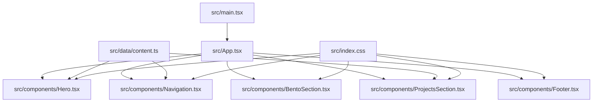
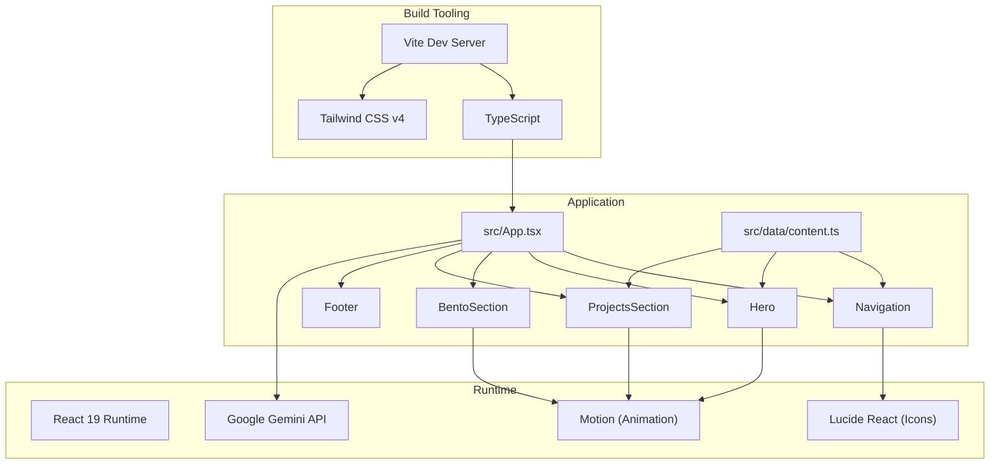
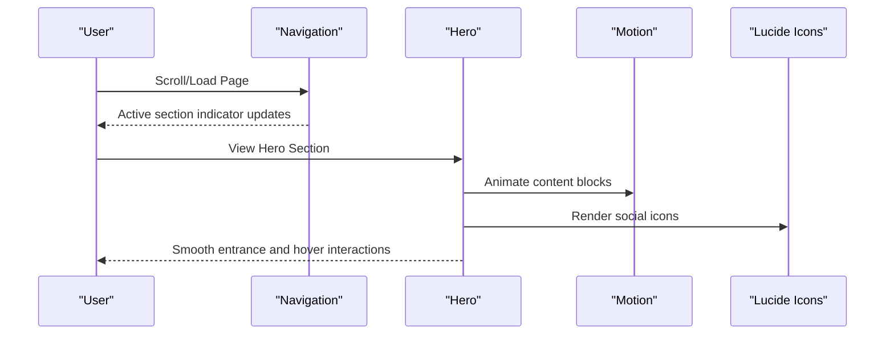
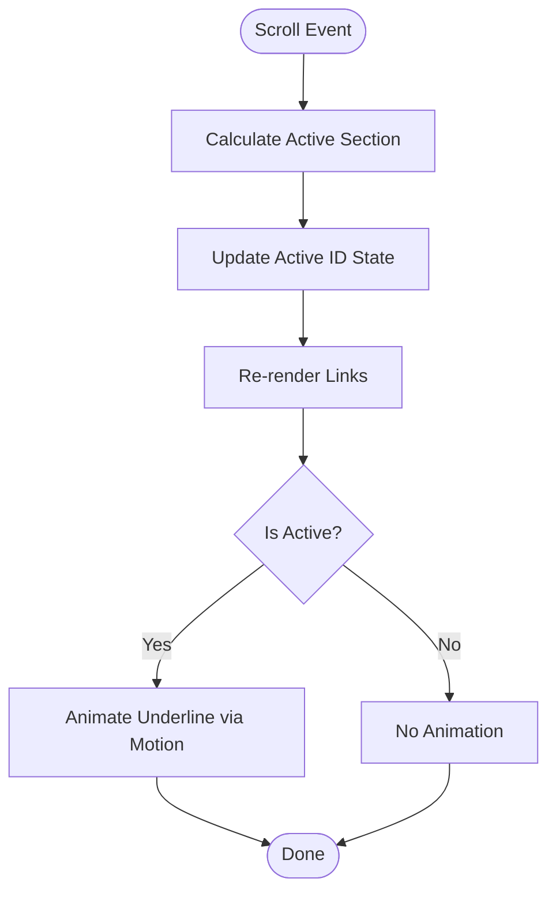
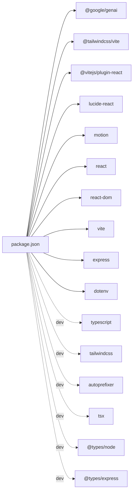
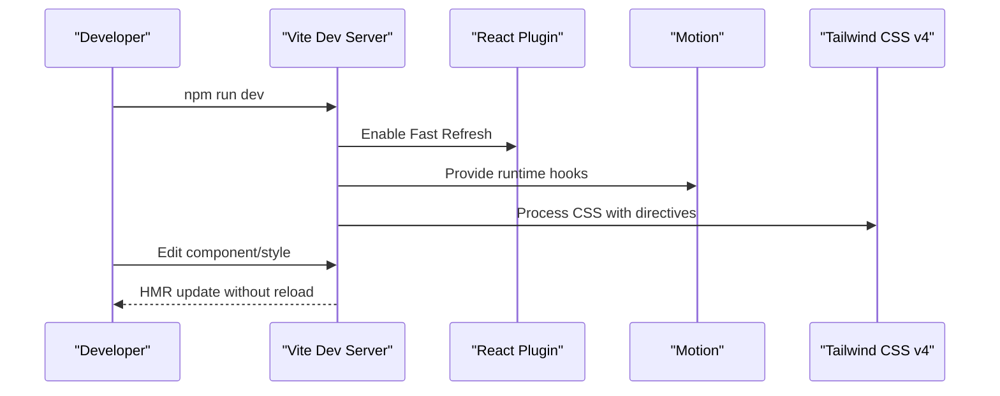

# Technology Stack & Dependencies

<cite>
**Referenced Files in This Document**
- [package.json](file://package.json)
- [vite.config.ts](file://vite.config.ts)
- [tsconfig.json](file://tsconfig.json)
- [src/main.tsx](file://src/main.tsx)
- [src/App.tsx](file://src/App.tsx)
- [src/index.css](file://src/index.css)
- [src/data/content.ts](file://src/data/content.ts)
- [src/components/Hero.tsx](file://src/components/Hero.tsx)
- [src/components/Navigation.tsx](file://src/components/Navigation.tsx)
- [src/components/ProjectsSection.tsx](file://src/components/ProjectsSection.tsx)
- [src/components/BentoSection.tsx](file://src/components/BentoSection.tsx)
- [src/components/Footer.tsx](file://src/components/Footer.tsx)
- [src/vite-env.d.ts](file://src/vite-env.d.ts)
- [README.md](file://README.md)
- [metadata.json](file://metadata.json)
</cite>

## Table of Contents
1. [Introduction](#introduction)
2. [Project Structure](#project-structure)
3. [Core Technologies](#core-technologies)
4. [Architecture Overview](#architecture-overview)
5. [Detailed Component Analysis](#detailed-component-analysis)
6. [Dependency Management](#dependency-management)
7. [Development Workflow](#development-workflow)
8. [Performance Considerations](#performance-considerations)
9. [Upgrade Paths and Compatibility](#upgrade-paths-and-compatibility)
10. [Troubleshooting Guide](#troubleshooting-guide)
11. [Conclusion](#conclusion)

## Introduction
This document provides comprehensive technology stack documentation for a React-based portfolio website. It covers the core technologies (React 19, TypeScript, Tailwind CSS v4, Vite), animation and icon libraries (Motion, Lucide React), and AI integration (Google Gemini API). It explains the development workflow, dependency management, performance characteristics, and upgrade paths tailored for portfolio presentation.

## Project Structure
The project follows a conventional React + Vite setup with a clear separation of concerns:
- Application entry point initializes React StrictMode and mounts the root component.
- Components are organized by semantic sections (Hero, Navigation, BentoSection, ProjectsSection, EducationSection, ContactSection, Footer).
- Shared content and typed constants live under a dedicated data module.
- Styling leverages Tailwind CSS v4 with a custom theme and layered utilities.

**Diagram sources**
- [src/main.tsx:1-11](file://src/main.tsx#L1-L11)
- [src/App.tsx:1-33](file://src/App.tsx#L1-L33)
- [src/components/Hero.tsx:1-99](file://src/components/Hero.tsx#L1-L99)
- [src/components/Navigation.tsx:1-98](file://src/components/Navigation.tsx#L1-L98)
- [src/components/BentoSection.tsx:1-87](file://src/components/BentoSection.tsx#L1-L87)
- [src/components/ProjectsSection.tsx:1-100](file://src/components/ProjectsSection.tsx#L1-L100)
- [src/components/Footer.tsx:1-36](file://src/components/Footer.tsx#L1-L36)
- [src/data/content.ts:1-103](file://src/data/content.ts#L1-L103)
- [src/index.css:1-71](file://src/index.css#L1-L71)

**Section sources**
- [src/main.tsx:1-11](file://src/main.tsx#L1-L11)
- [src/App.tsx:1-33](file://src/App.tsx#L1-L33)
- [src/index.css:1-71](file://src/index.css#L1-L71)
- [src/data/content.ts:1-103](file://src/data/content.ts#L1-L103)

## Core Technologies
- React 19: Provides concurrent rendering and modern hooks. The app uses StrictMode for enhanced error detection during development.
- TypeScript: Enforces type safety across components, data modules, and configuration. Compiler options enable ESNext modules, JSX transform, and bundler-aware resolution.
- Tailwind CSS v4: Utility-first CSS framework with a custom theme and layered styles for typography, colors, and spacing.
- Vite: Fast build tool and dev server with optimized HMR and production builds.

Key implementation evidence:
- React 19 usage in the root render and component composition.
- TypeScript configuration enabling JSX transform and module resolution.
- Tailwind v4 directives and custom theme tokens.
- Vite configuration integrating React plugin, Tailwind CSS plugin, environment variable exposure, and path aliases.

**Section sources**
- [src/main.tsx:1-11](file://src/main.tsx#L1-L11)
- [tsconfig.json:1-27](file://tsconfig.json#L1-L27)
- [src/index.css:1-71](file://src/index.css#L1-L71)
- [vite.config.ts:1-25](file://vite.config.ts#L1-L25)

## Architecture Overview
The application architecture emphasizes:
- Component-driven UI with reusable sections.
- Centralized content management via a typed data module.
- Animation orchestration using Motion for micro-interactions and page transitions.
- Consistent iconography through Lucide React.
- AI-assisted content via Google Gemini API integrated at runtime.

**Diagram sources**
- [src/App.tsx:1-33](file://src/App.tsx#L1-L33)
- [src/components/Navigation.tsx:1-98](file://src/components/Navigation.tsx#L1-L98)
- [src/components/Hero.tsx:1-99](file://src/components/Hero.tsx#L1-L99)
- [src/components/ProjectsSection.tsx:1-100](file://src/components/ProjectsSection.tsx#L1-L100)
- [src/components/BentoSection.tsx:1-87](file://src/components/BentoSection.tsx#L1-L87)
- [src/components/Footer.tsx:1-36](file://src/components/Footer.tsx#L1-L36)
- [src/data/content.ts:1-103](file://src/data/content.ts#L1-L103)
- [vite.config.ts:1-25](file://vite.config.ts#L1-L25)
- [src/index.css:1-71](file://src/index.css#L1-L71)

## Detailed Component Analysis

### Hero Section
- Uses Motion for staggered entrance animations and image scaling.
- Integrates Lucide icons for social links with hover effects.
- Leverages Tailwind utilities for responsive grid, typography, and visual hierarchy.

**Diagram sources**
- [src/components/Hero.tsx:1-99](file://src/components/Hero.tsx#L1-L99)
- [src/components/Navigation.tsx:1-98](file://src/components/Navigation.tsx#L1-L98)

**Section sources**
- [src/components/Hero.tsx:1-99](file://src/components/Hero.tsx#L1-L99)

### Navigation
- Implements scroll-based active section tracking with passive listeners.
- Uses Motion’s layoutId for animated underline transitions.
- Integrates Lucide icons and styled buttons.

**Diagram sources**
- [src/components/Navigation.tsx:1-98](file://src/components/Navigation.tsx#L1-L98)

**Section sources**
- [src/components/Navigation.tsx:1-98](file://src/components/Navigation.tsx#L1-L98)

### BentoSection
- Combines content and skill visualization with Motion-triggered progress bars.
- Uses Tailwind color tokens and custom utilities for consistent styling.

**Section sources**
- [src/components/BentoSection.tsx:1-87](file://src/components/BentoSection.tsx#L1-L87)

### ProjectsSection
- Iterates over typed project data to render cards with stack-specific icons.
- Applies Motion for viewport-triggered fade-in with staggered delays.

**Section sources**
- [src/components/ProjectsSection.tsx:1-100](file://src/components/ProjectsSection.tsx#L1-L100)
- [src/data/content.ts:83-103](file://src/data/content.ts#L83-L103)

### Footer
- Renders social links with safe external link handling and Tailwind-based styling.

**Section sources**
- [src/components/Footer.tsx:1-36](file://src/components/Footer.tsx#L1-L36)
- [src/data/content.ts:67-81](file://src/data/content.ts#L67-L81)

## Dependency Management
- Production dependencies include React 19, React DOM, Vite, Tailwind CSS v4 plugin, Lucide React, Motion, and Google Gemini SDK.
- Development dependencies include TypeScript, Tailwind CSS v4, autoprefixer, tsx, and related type definitions.
- Scripts support local development, production build, preview, linting, and cleanup.

**Diagram sources**
- [package.json:1-35](file://package.json#L1-L35)

**Section sources**
- [package.json:1-35](file://package.json#L1-L35)

## Development Workflow
- Hot Module Replacement (HMR): Enabled conditionally via environment variable; disabled in specific contexts to avoid flickering during agent edits.
- Fast Refresh: Integrated through the React plugin for Vite, providing instant feedback on component changes.
- Build and Preview: Vite scripts handle development, production builds, and local preview serving.
- Environment Variables: The Gemini API key is exposed to client code via Vite’s define mechanism using environment variables loaded by Vite.

**Diagram sources**
- [vite.config.ts:1-25](file://vite.config.ts#L1-L25)
- [package.json:6-12](file://package.json#L6-L12)

**Section sources**
- [vite.config.ts:1-25](file://vite.config.ts#L1-L25)
- [package.json:6-12](file://package.json#L6-L12)

## Performance Considerations
- Lazy loading and viewport triggers: Motion’s viewport-based triggers minimize unnecessary animations until elements are visible.
- Minimal re-renders: React 19’s concurrent features and memoization patterns reduce layout thrashing.
- CSS isolation: Tailwind utilities keep styles scoped and efficient; custom theme tokens centralize design tokens.
- Asset delivery: Static assets are served from the public directory and referenced via root URLs for optimal caching.
- Scroll performance: Navigation uses passive event listeners and lightweight calculations to maintain smooth scrolling.

**Section sources**
- [src/components/Navigation.tsx:13-40](file://src/components/Navigation.tsx#L13-L40)
- [src/components/Hero.tsx:71-94](file://src/components/Hero.tsx#L71-L94)
- [src/components/ProjectsSection.tsx:46-52](file://src/components/ProjectsSection.tsx#L46-L52)
- [src/data/content.ts:77-81](file://src/data/content.ts#L77-L81)

## Upgrade Paths and Compatibility
- React 19: Align TypeScript module resolution with bundler-aware settings and ensure JSX transform remains compatible.
- TypeScript: Keep compiler options aligned with ESNext and JSX transform; validate with Vite’s isolated modules mode.
- Tailwind CSS v4: Continue using the Tailwind v4 plugin and directives; monitor breaking changes in future minor releases.
- Vite: Upgrade following official release notes; maintain plugin compatibility (React and Tailwind).
- Motion: Verify API compatibility after major version bumps; prefer stable versions for production.
- Lucide React: Keep aligned with the latest minor versions to benefit from new icons and bug fixes.
- Google Gemini API: Pin SDK version and review changelogs for breaking changes; ensure environment variable handling remains secure.

**Section sources**
- [tsconfig.json:12-25](file://tsconfig.json#L12-L25)
- [vite.config.ts:1-25](file://vite.config.ts#L1-L25)
- [package.json:13-34](file://package.json#L13-L34)

## Troubleshooting Guide
- Missing Gemini API key: Ensure the environment variable is set in the appropriate environment file and loaded by Vite; verify the define configuration in the Vite config.
- HMR flickering: If using specialized environments, disable HMR via the designated environment variable to stabilize editing sessions.
- Path aliases: Confirm the alias configuration resolves correctly and matches the project root.
- Type errors: Run the TypeScript linter script to catch type-related issues early.
- Build failures: Clean the distribution directory and rebuild using the provided scripts.

**Section sources**
- [vite.config.ts:6-22](file://vite.config.ts#L6-L22)
- [package.json:6-12](file://package.json#L6-L12)
- [README.md:16-20](file://README.md#L16-L20)

## Conclusion
This portfolio website leverages a modern, performant stack centered on React 19, TypeScript, Tailwind CSS v4, and Vite. Motion and Lucide React enhance interactivity and visual consistency, while the Google Gemini API enables AI-assisted content. The documented workflow, dependency strategy, and upgrade paths ensure maintainability and scalability for professional portfolio presentation.